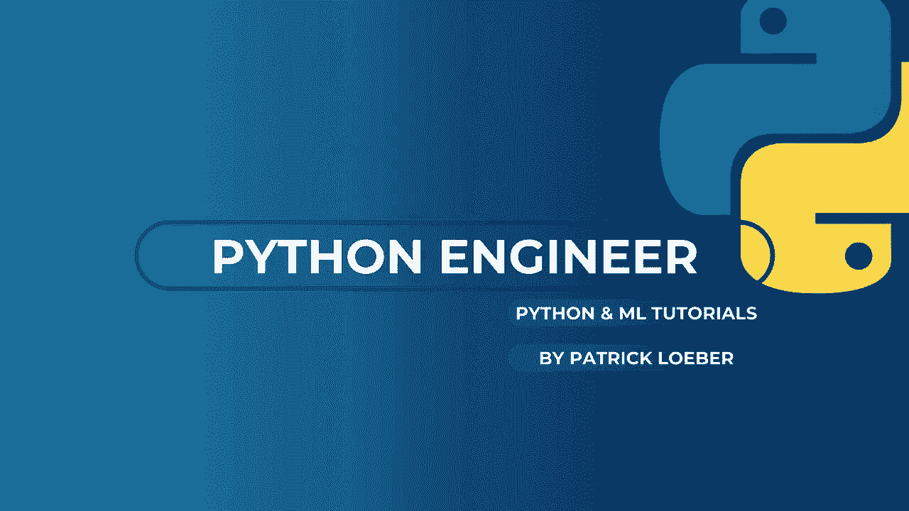
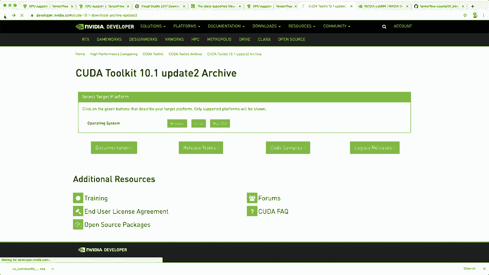
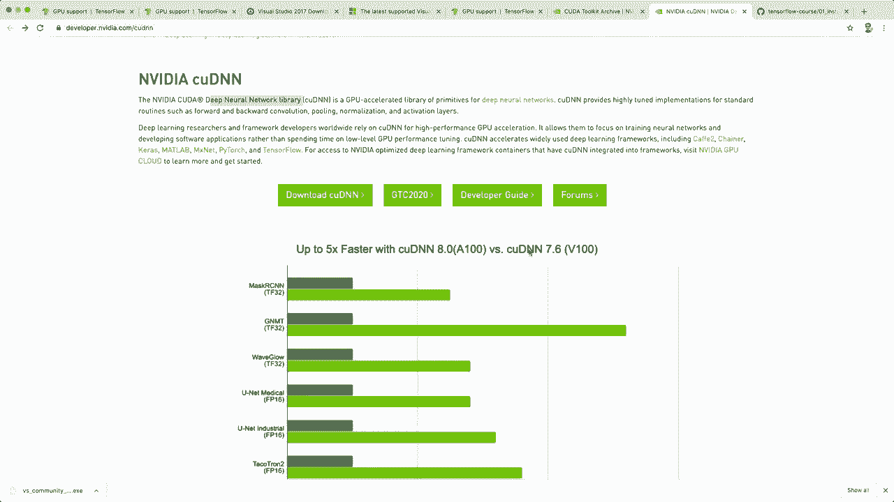
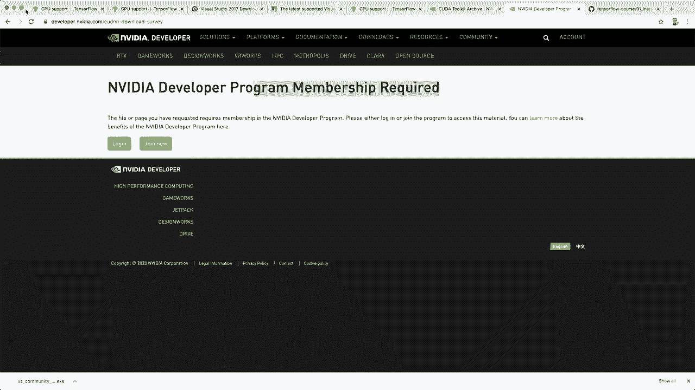
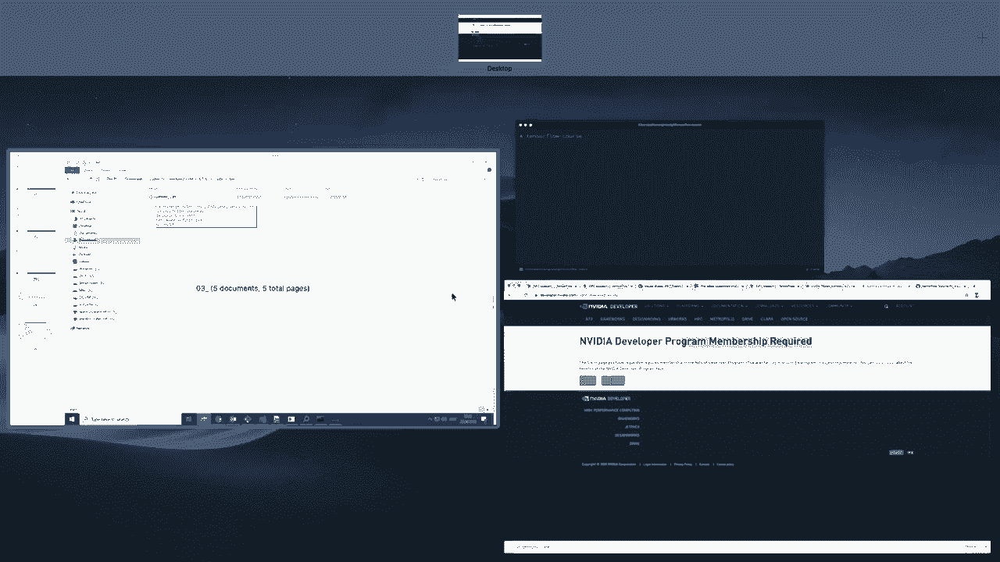
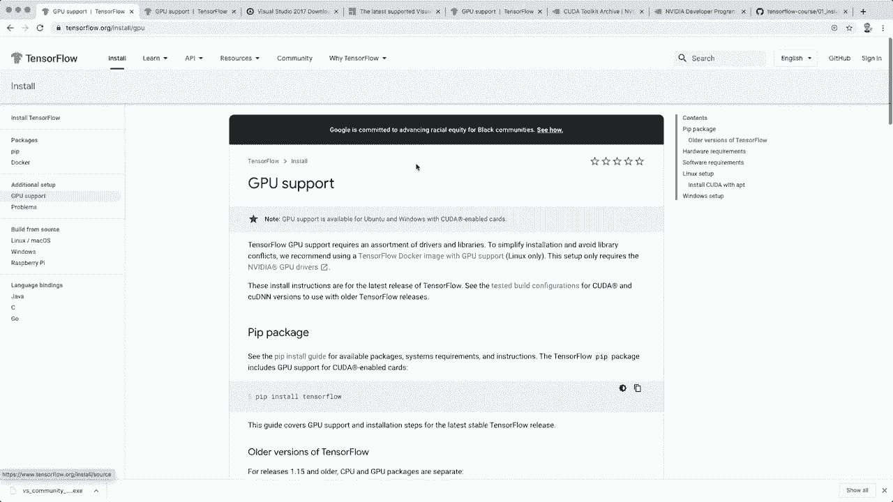
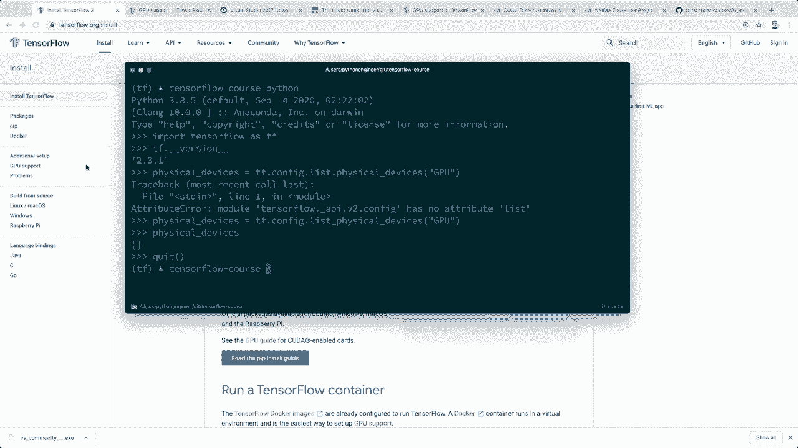

# 面向初学者的TensorFlow教程，理论知识、代码思路和应用案例，真正从零开始讲明白！＜快速入门系列＞ - P1：L1- 安装与环境配置 

🎼，嘿，大家，欢迎来到我的Tensorflow初学者课程。在这门课程中，我会教你入门这个框架所需的所有知识，我们会一路上构建一些不错的示例项目。所以Tensorflow是一个端到端的开源机器学习和深度学习平台。

它由谷歌开发，是最受欢迎的深度学习框架之一。在这一集里，我会展示如何在你的机器上安装Tensorflow。顺便提一下，所有课程材料都将在Github上提供。我创建了一个新的Tensorflow课程，并且已经上传了第一个安装指南。

所以如果你想，可以查看并阅读这里的指南。😊现在让我告诉你安装Tensorflow需要做什么。你去官方网站Tensofflow.org，然后点击安装。在这里你可以看到要求。你需要Python 3.5或更新版本。我假设你已经在你的机器上安装了这个。

然后它支持Mac、Uuntu和Windows。安装命令非常简单。你需要的Pip版本大于19。然后你只需输入“Pip install Tensorflow”。我会在几分钟内演示这个。但首先，让我告诉你在Windows上安装它以及获得GPU支持需要做什么。

所以在Windows上，你还需要安装Visual Studio 2017。你可以免费获取这个，只需安装免费社区版。你还需要C++可再发行组件。你可以点击这个链接，这将带你到这个页面，然后下载并安装相应的版本。

然后你也可以在Windows上直接输入“Pip install Tensorflow”，这样就可以了。如果你有GPU支持，我会告诉你需要做什么。如果你的机器上没有Nvidia GPU，可以跳过这部分。让我们点击这个链接，安装命令稍后会是一样的。

但首先，我们需要一些其他东西。当然，你的机器上需要有Nvidia GPU和必要的驱动程序。如果你有这些，就必须安装Kuda工具包和Couddi及N工具SDK。而且获取正确版本是很重要的。Kuda工具包需要10.1版本。

所以我们点击这个链接。这将带你到这个网站。在这里你可以找到所有的归档版本。然后选择最新的10.1工具包并下载适合你操作系统的版本。所以对于Windows，安装这个。

一旦安装完成，你还需要 CoudD 和 N SDK。这是 Kuda 深度神经网络库。在这一侧，你点击下载。同样，这里非常重要的是获取正确的版本。因此，你需要版本 7，因为现在我认为最新版本是版本 8。

然后你点击下载。为此，你需要一个账户，你可以免费创建这个账户然后下载它。

一旦你下载了这个，我会告诉你必须做什么。在这里，我从我另一台有 Windows 的机器上做了一些截图。因此，首先，在安装 Kuda 工具包后，你可能会在 C 程序文件和 Vdia GPU 计算工具包 Kuda 中找到它，然后是版本 10.1，这就是你的安装目录。当你下载了 codi 和 N SDK 后。

然后你可以进入这个下载的文件夹，在那里你会有一个 bin 目录、一个 include 目录和一个 lip 目录。例如，在 bin 目录中我们有一个 DL。因此，现在你需要将所有这些文件抓取出来，然后返回到你的 Kuda 工具包安装目录，在那里你也会有 bin 和 include。

lip 目录。因此，你必须将所有这些文件复制到 Kuda 工具包目录中的相应文件中。在完成这些之后，你还需要修改环境变量。所以你需要创建一个变量 kuda path，然后放入安装路径。然后你还需要修改实际的路径变量。所以在这里。

你需要添加这些额外的路径。这是包含 bin 文件夹和 lip、VvP 文件夹的安装文件夹。因此，你需要将这些添加到 Windows 的路径变量中。现在这就是你所需的一切。这些是在 Windows 上所需的所有步骤。现在我们可以继续安装我们的 TensorFlow。所以现在我们首先要做的是，我建议使用虚拟环境。为此，我使用 Conda。

我用 `Conda create` 创建了一个新的环境。然后是 minus n 和名称。我说 T F 代表 TensorFlow。我说 Python 等于 3.8。

如果你不知道如何使用 Conda，那么我有一个完整的教程来解释这个。所以我会把链接放在描述中。顺便说一下，你并不需要 Conda。你也可以仅仅使用 Python 的虚拟环境。这也是可以的。好的。所以现在我们创建了这个，现在我用 `Conda activate T F` 来激活它。接下来是安装。

我们使用 Pip 安装 Tensorflow。因此也有一个 Conda 安装命令可用，但我实际上不推荐使用 Conda 安装命令，因为这不是官方支持的，可能会有一些性能问题。所以我们就用 Pip 安装 Tensorflow，然后按回车。这可能需要几秒钟。好的，所以这成功了。让我们测试一下，看看安装是否真的成功。

所以让我们开始我们的 Python shell。让我们导入 Tensorflow S T F。如果一切正常，那么这应该可以正常工作而没有错误。是的，这成功了。我们没有看到任何错误。所以现在我们有 Tensorflow，例如，我们可以打印版本 Tensorflow underscore。Underre 版本，我们看到我有最新版本 2。

3.1 然后如果你安装了 GPU 支持，你也可以通过输入 physicalical devices equals Tf.config do list dot physicalical underscore devices 来测试，然后是 GP U 字符串，这里出现了一个错误，抱歉。T F.dot config.dot list，underscore physical devices。这里在我这边。

这只是一个空列表。但是如果你有便宜的支持，那么它应该放在你的 Kuda 设备中，这样你就可以用这个命令进行测试。是的，暂时你知道如何安装 Tensorflow。我希望你喜欢这个。如果你喜欢，请点击喜欢按钮并订阅频道。

然后我希望在下一个视频中见到你，再见！
