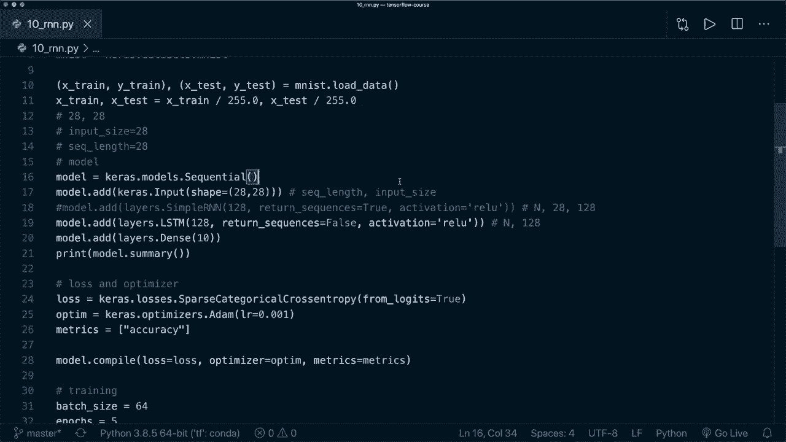

# 面向初学者的TensorFlow教程，理论知识、代码思路和应用案例，真正从零开始讲明白！＜快速入门系列＞ - P9：L10- 循环神经网络(RNN & LSTM & GRU) - ShowMeAI - BV1TT4y1m7Xg

嗨，大家好，欢迎来到另一个TensorFlow教程。今天我们将学习循环神经网络，简称RNN。RNN是一类神经网络，允许将以前的输出用作输入，同时具有隐藏状态。这意味着我们在这里处理的是一个序列。这是非常强大的。借此。

我们可以将RNN用于许多不同的应用，比如文本生成、文本翻译、情感分类等等。我已经有一个深入的RNN教程，在那里我更详细地解释了这些幻灯片。如果你想多了解一点理论，那就看看这个视频的前五分钟。

因为我现在想专注于TensorFlow的实现，所以让我们直接进入代码。😊，🎼。

这里我已经有一些代码，这与教程第3部分中的代码完全相同，使用了Ms数据集，然后我们定义了一个简单的神经网络，接着定义了一个损失函数和一个优化器，编译了模型，然后训练和评估它。

我们使用这个数据集进行了数字分类，现在我们唯一想要改变的是模型，改用RNN模型。这不是RNN的典型应用。很多时候它用于文本分类或文本生成，但这个例子应该演示RNN确实可以用于图像分类任务。

你将看到我们如何使用Keras API轻松创建我们的RNN模型。正如我所说，当我们处理RNN时，我们在这里处理的是一个序列。在我们的案例中，我们有图像，但我们不需要更改数据集。我们只需将图像视为一个序列。

现在我们的图像必须是28乘28，所以是28乘28个像素。现在我们将其视为一个序列。这意味着我们说一个时间步是图像中的一行。然后我们还有28列。这意味着我们的输入大小是28，序列长度也是28。因此，这意味着我们的序列中有28个时间步，在每个时间步中。

我们有28个特征。现在当我们这样处理时，我们可以简单地使用一个RNN。所以现在让我们继续定义我们的模型。首先，我们定义一个空的序列模型。我要做的第一件事是添加一个输入。因此我说model.add，然后是keras，然后是input。

然后在这里指定形状，即28乘28。所以这里的第一个数字是序列长度，第二个数字是输入大小。现在我们可以添加RNN模型。有不同的可用模型，我们从简单的RNN层开始。稍后我还会展示另外两个著名的模型。所以现在。

假设model.at。然后我们可以在keras.layers中获取这个。所以我们已经在这里导入了这个，然后我们可以说layers.。现在我们想要一个简单的R和N模型。我们唯一需要指定的是单位的数量。也就是输出单元的数量。这也是隐藏单元的大小。所以当然有很多。

更多的参数。因此我建议你自己查看文档。有一点你应该注意，默认情况下，R和N中的激活函数是tanh函数。那么在我们的例子中，试试relu函数。这就是我们所需的全部内容，用于R和N模型。

所以现在我们有这个。现在，既然我们要进行分类，我们在这个数据集中有10个不同的类别。那么像在其他教程中一样，我们在最后添加一个全连接层。因此我们说layers.Dense，然后我们想要10个输出。这就是我们所需的全部。所以在最后我们不使用激活函数。

但我们必须小心，必须在我们的损失函数中指定从logit等于true。而现在这就是我们目前所需的全部。这是我们需要的简单R和N的整个顺序模型。所以首先，让我们导入cis，并说cis.exit，这样它只会运行到这里。让我们运行到这里的代码并打印摘要。

所以我们说Python，然后是这个文件的名称。所以这个。哦，这里我漏掉了等号，当然了。所以shape等于28乘28。那么我们再写一次。然后在这里我们看到我们的简单R和N有这个输出形状。我稍后会解释这个。然后我们有一个具有10个输出的全连接层。让我们再看看R和N。

所以输出的形状是n。这是我们拥有的样本数量。然后是128，就像我们在这里指定的那样。它包含的是每个样本的一个单一向量。我们得到的输出是最后一个单元，最后一个时间步的输出。但这包括了关于前一个时间步的所有信息。所以这就是我们所需要的全部。

所以我们只需要这里的最后一个单元。这就是为什么我们的输出是这个形状。但你也可以得到一个形状为批次数量乘以序列数量、时间步数量或序列长度的输出。然后是单位数量。当我们指定一个额外的参数时，我们可以得到这个，称为return。

return sequences等于true。如果我们使用这个，默认情况下是false。如果我们使用这个，那么我们的输出就是这个形状。例如，当我们想将多个R和N堆叠在一起时，这很有用。因此，我们可以使用第一个，它将返回所有时间步。然后我们使用第二个，我们说这是false。

然后我们得到了这个输出形状。所以让我们再次检查一下这是否正确。清除这个并再次运行。没错，我告诉你的确是正确的。第一个 R 和 N 有这个输出形状，因为我们设置了返回序列为真。另一个则只有这个输出形状。然后，我们又有了我们的全连接层。

这可能会提高你的模型性能。所以再次，你可以尝试堆叠多个 R 和 N。目前，我们就使用一个，然后去掉这个，训练它，看看它在这个分类任务中的表现如何。再次清除并运行。好的，我们看到最后的准确率是 97%。

因此我们的 RnN 确实在这个图像分类任务中表现良好。现在你知道如何使用这个简单的 RnN 层来设置你的 R 和 N，并且你应该知道如何将输入视为序列。我还想给你展示另外两个著名的 RnN。这只是一个简单的 RnN 层，但还有，比如 LSTM 或 GRU。这两个也是很受欢迎的 RnN。

它们的表现通常比简单的 RnN 略好，我认为你不需要更改其他任何内容。所以参数大多数是相同的，输出的结构也是相同的。所以是的，也可以尝试 GRU 或 LSTM。好的，我想现在就到这里。在下一个教程中再见。

我们学习如何将其应用于文本分类任务。所以我希望在下一个视频中见到你。如果你喜欢这个教程，请点击喜欢按钮并考虑订阅频道，我们下次再见，拜拜。😊。
