# P1：L1.1- 正则表达式 - ShowMeAI - BV1YA411w7ym

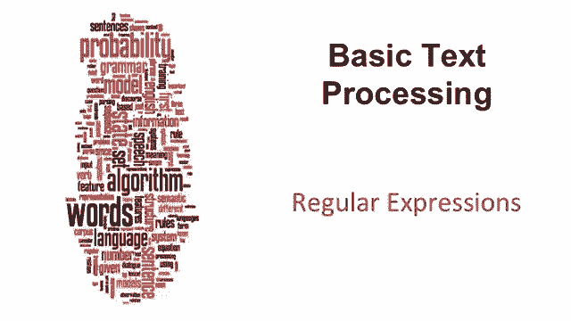

Now we're going to talk about text processing。 The most basic and fundamental tool we have for text processing is the regular expression。

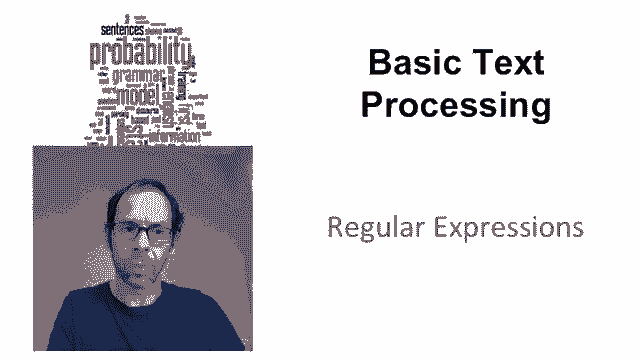

A regularg expression is a formal language for specifying text strings。

 So let's suppose that we're looking for woodchucks in a text document。

 woodchucks can be expressed in a number of ways。 we could have a singular woodchuck。

 We could have the plural S at the end。 we could have a capital letter at the beginning or a lowercase in any combination of these。

 So we're going to need tools to deal with this problem。

So the simplest fundamental tool in a regular expression is the disjunction。

 The square brackets in a regular expression pattern mean any letter inside these square brackets。

 so lowercase W capital W square bracket means either a lowercase W or capital W so we can combine that with Uchuck to match lowercase or uppercase woodchuck and similarly with digits 12。

3，4 and so on，5，6，7890 matches any digit Now that was kind of annoying to write So what we'd like to do instead is have little ranges the range0 dash 9 so square bracket 09 means any character inside that range and the range a dash Z means any character between a capital letter between a and Z So let's see if we can see how that works。

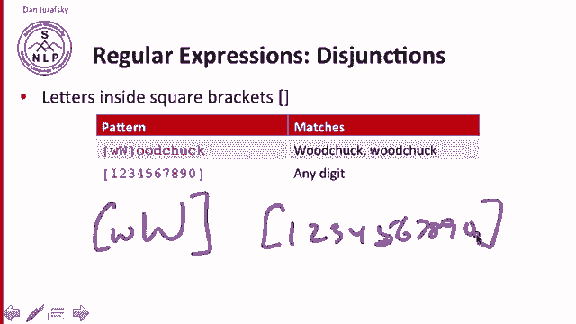

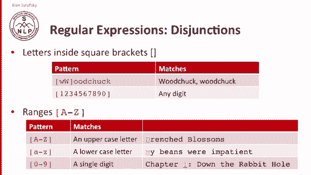

So here's an example of a Reg XP， a little tool we're going to use for regular expression and searching。

 and we have a little text here from Dr。 Seus， we looked， and we saw him step in on the mat。

 we looked and we saw him the cat in the hat。And let's try our disjunctions so we can have the capital W and a lowercase W and excuse me。

 a capital W and a lowercase W， and that's going to match as you can see the capital Ws and the lowercase W is just fine。

Or we could have all the E's and all the Ms。And that's going to match all the E's and the M's。

Or in our ranges， we could have all the capital letters。

There's all the capital letters being matched， we can have all the lowercase letters。

There's a lot of lowercase letters there， or we could match all of the alpha numeric characters。

 think for a second how to match all of the alpha numeric characters。

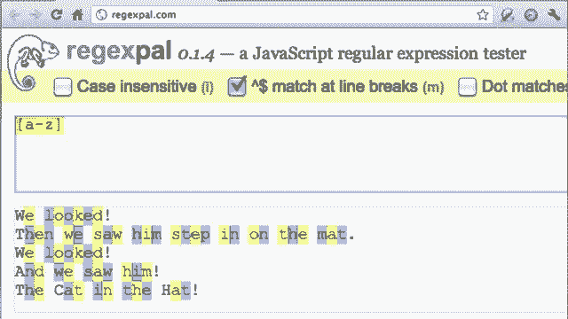

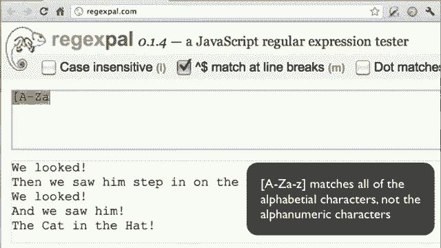

Or we could simply match some of the non alpha numer characters。

 We could have space and exclamation point in our square brackets， and that's going to match。

 as you can see some of the non alphaphabetic characters。 Okay。

 so let's go on Another kind of thing we might want to do in our regular expressions is negation in our justs。

 We might want to say we don't want some kind of set of letters。 So， for example。

 we might want to say not a capital letter。 and we can do that by saying carrot A through Z in our square brackets。

 carrot， when it occurs right to the square brackets means not carrot A through Z。

 not a capital letter。

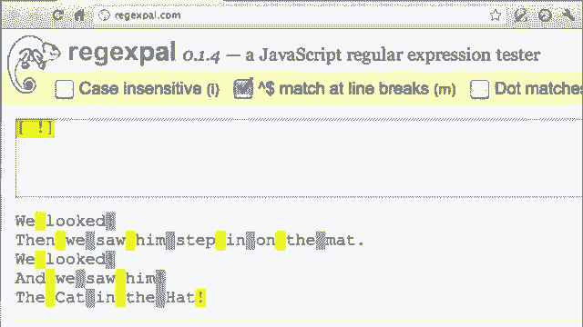

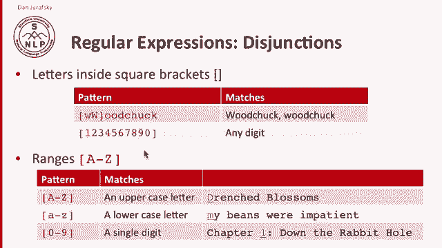

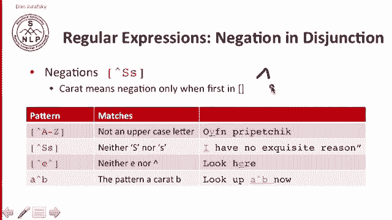

Carrot a little a。Means neither a capital A nor a little A。

And carrot E carrot means not an E and not a carrot。

 So you can see that the carrot when it occurs right after the square bracket means not。

 but later on means simply just a carrot。 So let's take a look at that。So we can try。

Finding all of the non capital letters。Here's all the non capital letters。

 how about all the non exclamation points。Most things。 and the non alpha numerics。Sorry。

 non alphabetics。There's just the spaces and exchalation points， as you can see。

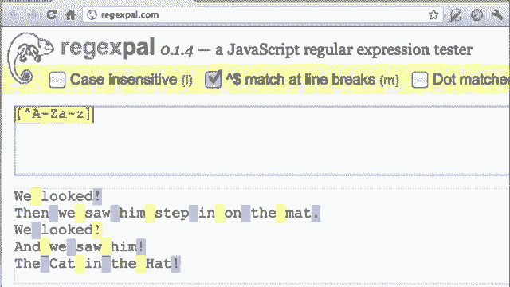

How about looking for a carrot， any carrots in here there are none。

 so there are no carroats and so nothing matches。

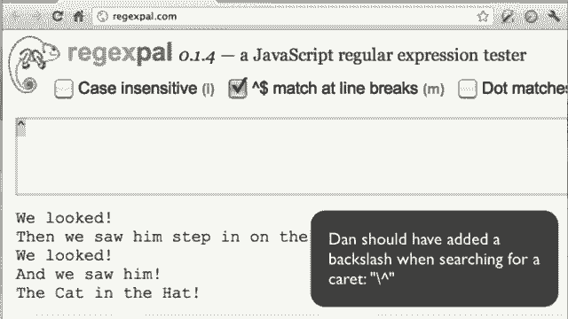

Another kind of disjunction， which can be used for longer strings is the pipe symbol。

Sometimes called ore or pipe or just disjunction， so groundhog or woodchuck can be can will mean either the string groundhog or the string woodchuck。

So we can use the pipe symbol sometimes for the same thing as the square bracket， so A pipe B。

 pipe C。Is the same as square bracket， ABC。And we can combine these things。

 we can combine the square brackets in the pipe so we can have groundhog or woodchuck。

 but use our square brackets for expressing capitalization at the beginning。

And we can see that in our， in our little example。 we can have looked or step。And sure enough there。

 the words looked in step are both highlighted or we can have。Deisenstion of just random things。

 They don't have to be words。 We can have all of the ats。Excuse me。

 All of the ats and all of the hooks。And any brandon string is fine。

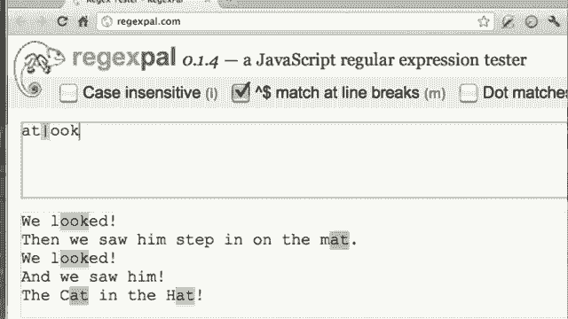

Finally， there's sets of special characters that are very important to regular expressions。

 the question mark means that the previous character is optional。

 so the question mark after this u here means will match the word color with or without the you without the you with the you。

Then there are the two Cly operators named for Stephen Clley。

Cleay star matches0 or more of the previous character。 So here's the star。 It matches 0 or more O's。

 So we have one O followed by0 or more other O's。 So there's the initial O and0 other O's。

 and then our H exclamation point。 Here's our initial O followed by1 O。 and then the H and so on。2，3。

 and so on。Sometimes more simple， we can have the cleaningy plus。

 so that means one or more of the previous character， so there's our O followed by the plus。

 meaning one or more O。So there's 10， there's two O's， three O's， and so on。

And the dot is a special character， meaning any character， so BEG dot n can match， begin， be。

 BEG3N matches anything。And finally two special characters。

The carrot matches the beginning of the line， so carrot capital A through Z matches a capital letter at the beginning of the line。

 The dollar sign matches the end of a line， So a through Z dollar matches the end of a line。

 a capital letter at the end of the line。 And then if we want to talk about a period。

 since periods are a special character， we have to escape them， backslash period means a period。

 So a period by itself means any character， backslash period means a real period。

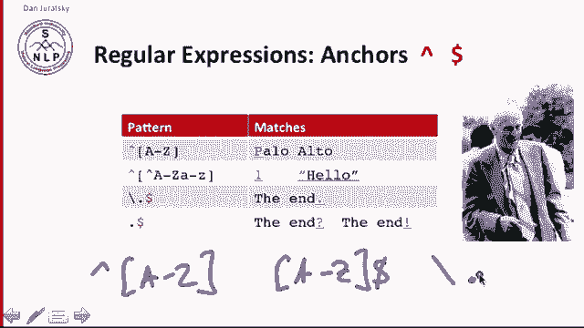

Let's go look at some of these。So here's the letter O， here's0。

 or let's like make let's make it one or more O first， Here's one or more O。So there's one over here。

And 2 O's over here。诶。And now let's look at beginnings and ends of lines here is。

Capital letters at the beginning of the line。Here's。Capital letters at the end of the line。Oh。

 there aren't any。Here' is punctuation at the end of a line。

There's all the exclamation point at the end of the line。Here's all the periods。

 Remember we have to backslash our periods and if we didn't backslash the period， we would get。

All the characters because period matches everything。Allright， let's do one more example。

 Let's look at this little sentence here， the other one there， the blithe one。

And let's walk through how to search for words。 Let's find the word all the word the in this little passage。

 So think for yourself how you would do this。 Well。

 the simplest thing you might do is just type the T H E。

And that does a good job of finding this the here。That finds this the and that the。

 But it misses these two those。 and also finds some other things。 Let's fix the first problem。

 How do we not only get the those in the middle， but those capitalized those at the beginning， Well。

 we're going to use our。Our disjunction。And sure enough。

 that correctly now matches the two beginning of line the。 But you notice that our pattern。

 although it now captures something had missed before。

 it's still captures things that shouldn't be capturing other there andlithe。

 So we need to augment our pattern。 So how are we going augment our pattern。

 we really want the when it's there's not an alphabetic character around it。

 We mean a space or a punctuation or something non alphabetic。 So let's just say non alphabetic。

Afterwards， great that gets rid of other and there doesn't solve Blilythe because Blithe has an alphabetic character before it。

 so let's go fix Blithe。By saying non alphabetic before it， either。There we go。

 now we found all of our Ds。

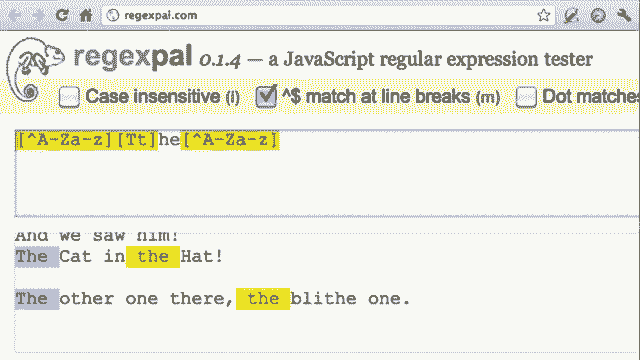

So。We looked for the we noticed it mis capitalized examples。

 so we added some we made our pattern more more expansive， we increased the yield of our pattern。

 but incorrectly returns more things so then we we didn't make the pattern more precise by specifying more things。

 this process that we went through is based on fixing two kinds of errors。

 one is matching strings we shouldn't have matched， we matched there。

 we matched other and so that's trying that's solving the problem of false positives or they're called type1 errors。

 we were matching things we shouldn't match。And the other thing we went through is to solve the problem of not matching things we should have match。

 so we missed those capital vs and that's dealing with the problem of false negatives or type 2 errors and it turns out in natural language processing。

 we're constantly dealing with these two classes of errors so reducing the error rate in any application and we're going to see this again and again in this course involves two antagonistic efforts where increasing the accuracy or precision which helps us minimize those false positives。

 or we're increasing our coverage or technically called recall， minimizing our false negatives。

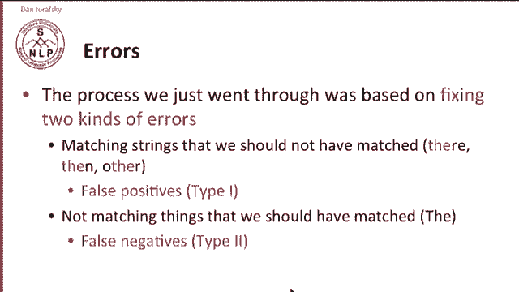

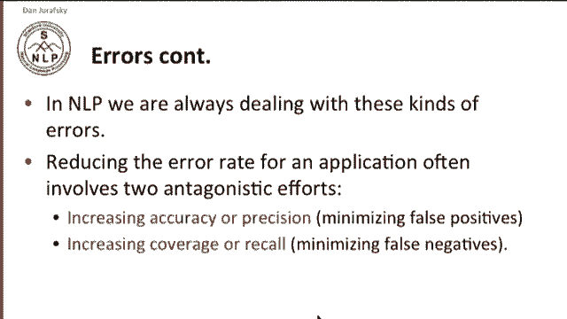

So in summary， regular expressions play a surprisingly large role in text processing and the sophisticated sequences of regular expressions that we've seen very simple versions of are often the first model for almost any text processing tasks for harder tasks we're often going to be using and will introduce these these machine learning classifiers that are much more powerful。

 but it turns out even then regular expressions are used as features in the classifiers and are very useful at capturing generalizations。

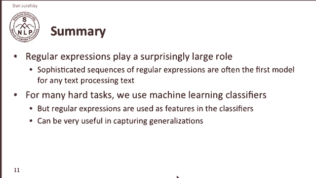

So you're going to be returning again and again to regular expressions。

