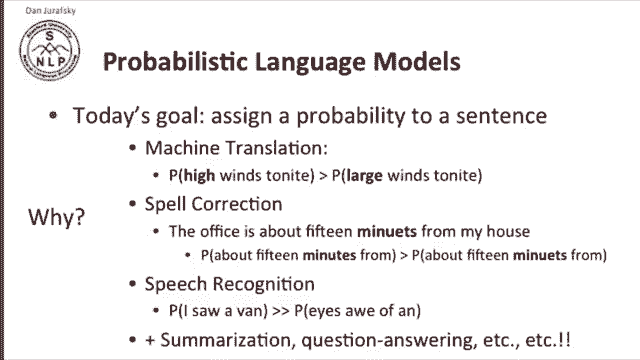
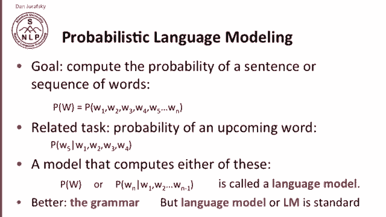
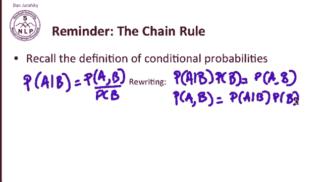
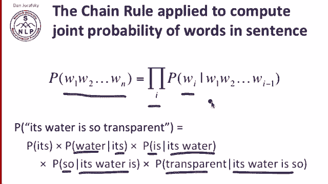
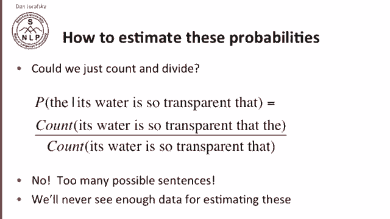
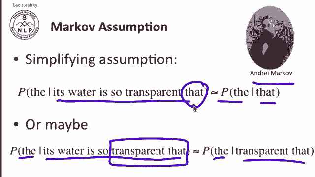
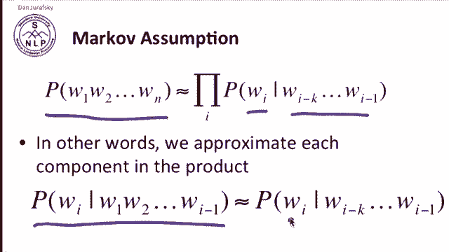
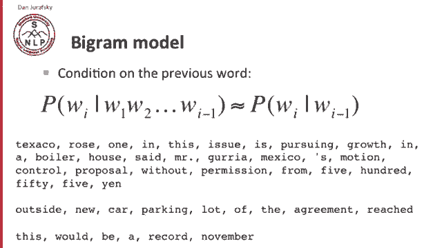
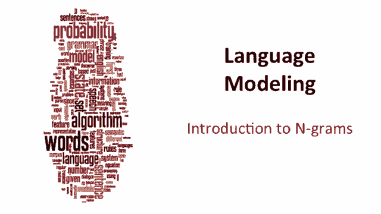

# P12：L3.1- N.gram介绍 - ShowMeAI - BV1YA411w7ym

Today we're going to introduce the topic of language modeling。

 one of the most important topics in natural language processing。

The goal of language modeling is to assign a probability to a sentence。

 Why would we want to assign a probability to a sentence？This comes up in all sorts of applications。

 In machine translation， for example， we'd like to be able to distinguish between good and bad translations by their probabilities。

 So high winds to night might be a better translation than large wins to night because high end winds go together well in spelling correction。

 we see a phrase like 15 minues from my house。 That's more likely to be a mistake from minutes。

 And one piece of information that lets us decide that is that 15 minutes from is a much more likely phrase than 15 minues from。

 And in speech recognition， a phrase like I saw a van is much more likely than a phrase that sounds phonetically similar eyes。

 awe of an。 but is's much less likely to have that sequence of words。

 And it turns out language modelings play a role in summarization and question answering really everywhere。

😊。

So the goal of a language model is to compute the probability of a sentence or a sequence of words。

So given some sequence of words W1 through WN， we're going to compute their probability P of W。

 and we'll use capital W to mean a sequence from W1 to WN。

Now this is related to the task of computing the probability of an upcoming word。

 so P of W5 given W1 through W4 is very related to the task of computing P of W1， W2W3， W4， W5。

A model that computes either of these things， either P of w， capital W， meaning a string。

 the joint probability of the whole string， or the condition probability of the last word given the previous words。

 either of those we call that a language model。Now it might have been better to call this the grammar。

 I mean technically what this is is telling us something about how good these words fit together and we normally use the word grammar for that。

 but it turns out that the word language model and often we'll see the acronym LM is standard。

 so we're going to go with that。

So how are we going to compute this joint probability， we want to compute。

 let's say the probability of the phrase itss water is so transparent that this little part of a sentence。

 and the intuition for how language modeling works is that we were going to rely on the chain rule of probability and just to remind you about the chain rule of probability。

 Let's think about the definition of conditional probability。 So P of a given B。

Equals P of a comma B。Over P of B。And we can rewrite that。 So P of a given B。Times P of B。

Equals P of a comma B。Or。Ting it around P of A comma B。Equals P of A given B。

Make sure it's a given times P of B。And then we could generalize this to more variables。

 so the joint probability of a whole sequence， ABCD。

Is the probability of a times B given A times C condition on A and B times D condition of E BC。

 so this is the chain rule in a more general form of the chain rule we have here。

 the probability of any joint probability of any sequence variables is the first times the conditional of the second and the first times the third condition of the first two up until the last condition on the first and minus1。

Alright， the chain rule。 So now the chain rule can be applied to compute the joint probability of words in a sentence。

 So let's suppose we have our phrase， its water is so transparent。

By the chain rule， the probability of that sequence is the probability of it。

 times the probability of water given it， times the probability of is given its water。

 times the probability of so given its water is， and finally times the probability of transparent given its water is so。

 or more formally the probability of a joint probability of a sequence of words is the product overall I of the probability of each word times the prefix up until that word。

How are we going to estimate these probabilities， Could we just count and divide。

 We often compute probabilities by counting and dividing， So the probability of the。

 given its water is so transparent that we could just count how many times its water is so transparent that the occurs and divide by the number of times its water is so transparent occurs so we could divide this by this。

And and get a probability。We can't do that， and the reason we can't do that is there's just far too many possible sentences for us to ever estimate these。

 There's no way we could get enough data to see the counts of all possible sentences of English。

So what we do instead is we apply a simplifying assumption called the Markov assumption named for Andre Markov。

And the Markov assumption suggests that we estimate the probability of the given its water is so transparent that just by computing instead。

 the probability of the given the word that。Or the very last that meaning the last word in the sequence。

 or maybe we compute the probability of the given its water is so transparent that given just the last two words。

 so the given transparent that so that's the markov assumption。

 let's just look at the previous or maybe the couple previous words rather than the entire context。

More formally， the mark of assumption says the probability of a sequence of words is the product for each word of the conditional probability of that word。

 given some prefix of the last few words。So in other words。

 in the chain rule product of all the probabilities we're multiplying together。

 we estimate the probability of WI given the entire prefix from 1 to I minus1 by a simpler to compute probability。

 WI， given just the last few words。

The simplest case of a Markov model is called the unigram model In the unigram model。

 we simply estimate the probability of a whole sequence of words by the product probabilities of individual words。

 unigrams。 and if we generated sentences by randomly picking words。

 you can see that it would look like word salad so heres some automatically generated sentences generated by Dan Klein and you can see that with the word fifth。

 the word an the word of this doesn't look a sentence at all， it's just a random sequence of words。

 thrift did 80 said。U to the properties of a unigram model， words are independent in this model。

Slightly more intelligent is a bygram model where we condition on the single previous word。 So again。

 we estimate the probability of a word given the entire prefix from the beginning to the previous word just by the previous word。

 So now if we use that and generate random sentences from a bygram model。

 the sentences look a little bit more like English still something's wrong with them clearly outside new car。

 well new car looks pretty good。 car parking is pretty good parking lot。

 but together outside new car parking lot of the agreement reached that's not English。

 So even the bygram model by giving up this conditioning that English has。

 we're simplifying the ability of the model to model what's going on in a language。

Now we can extend the engram model further to tri grams that's  three grams or four grams or five grams。

But in general， it's clear that Ngram modeling is an insufficient model of language。

 and the reason is that language has long distance dependencies。 So if I want to say predict。

The computer which I had just put into the machine room on the fifth floor。

 and I hadn't seen this next word， and I want to say what's my likelihood of the next word。

 and I conditioned it just in the previous wordf， I'd be very unlucky to guess crashed。But， really。

The crashash is the main verb of a sentence， and computer is the subject。

 the head of the subject noun phrase。 So if if we knew computer was the subject。

 we're much more likely to guess crashed。 So these kind of long distance dependencies mean that in the limit。

 a really good model of predicting English words will have to take into account lots of long distance information。

 But it turns out that in practice， we can often get away with these ngram models。

 because the local information， especially as we get up to trigrams and four gras。

 will turn out to be just constraining enough that in most cases， it'll solve our problems for us。

