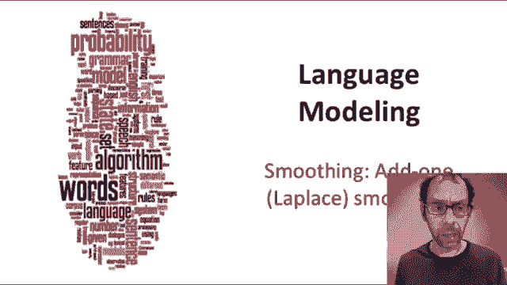
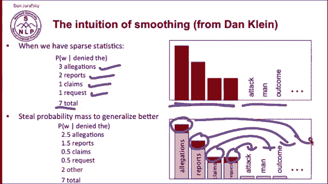
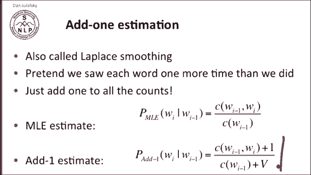
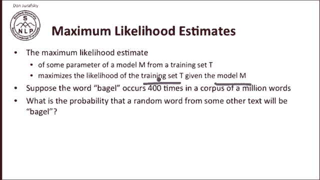
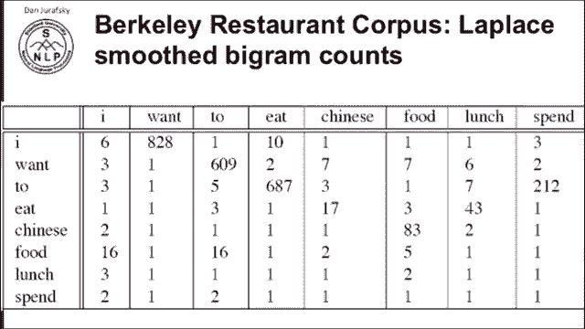
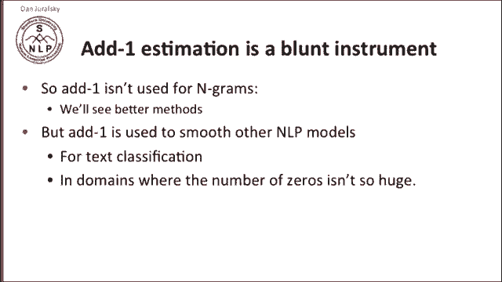
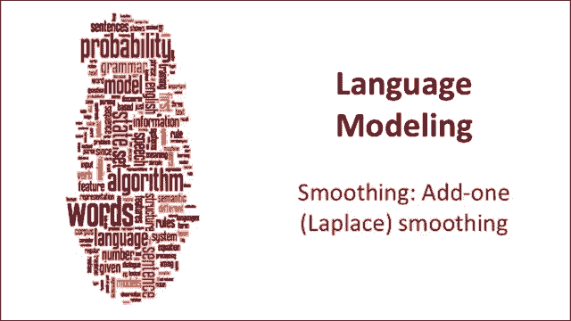

# P16：L3.5- 加一平滑 - ShowMeAI - BV1YA411w7ym

How do we deal with bigs with zero probability。The simplest idea is called add one smoothing。

Let's look at a picture that gives us the intuition of smoothing in general from Dan Klein。

So suppose in our training data， we saw denied the allegations， denied the reports， denied the claim。

 denied the request， and so we' computed probabilities。

 there were seven total things following denied the and we can get our probabilities of everything of each of these things。

But we would like to say， well， maybe denied the report might occur， sorry。

 denied the report was in the training data， denied the effort might occur。

 denied the outcome might occur。 so we'd like to steal some probability mass and save it for things we might not see later。

 So this is our training data。And these are the maximum likelihood counts。

 so these things occurred after tonight that and these never occurred。

 we'd like to steal a little probability mass from each of these words and put that probability mass onto all other possible words or some set of words so that the zeros go away。

And the simplest way of doing this is called add one estimation or Laplace smoothing。

And the idea is very simple， we pretend we saw each word one more time than we actually did。

We just add one to all the count。So if our maximum likelihood estimate。

Is the count of the of the bigram divided by the count of the unigram， our add one estimate is。

The count of the bigram plus 1 over the count of the unigram plus V。

We have to add V here in the dominator because we're adding one to every word that follows word I minus1。

 so our denominator is increased not just by the total count of times that something happened to word I minus1 wasn't just all the previous things that followed it。

 but each one of those got incrementalement by one and there were V of them so we have to add V to the denominator this is the add one estimator probability estimator。

I keep using the term maximum likelihood estimate， and let's just remind you what that means。

 the maximum likelihood estimate of some parameter of some model from a training set is the one that maximizes the likelihood of the training set given the model so we have some training set and we're gonna a maximum likelihood estimator that lets us learn a model from a training set is the one that makes that training set most likely。

 what do we mean by this。Supppoose the word baggel occurs 400 times in a corpus of a million words。

And I ask， what's the probability that a random word from some other text will be bagel？

Well， the maximum likelihood estimator from our corpus is 400 over a million or。004。

Now this could be a bad estimate for that other corpus。

 who knows whether the other corpus bagel occurs 400 times per million or some other probability。

 but this estimate is the one that makes it most likely that bagel will occur 400 times in a million word corpus。

 which is what it did occur in our training corpus。

 so we're maximizing the likelihood of our training data。

So an add one smoothing and any kind of smoothing is a non maximum likelihood estimator because we're changing the counts from what they occurred in our training data to hope to generalize better。

So if we go back to our Berkeley Restrant project。And we add one to all of our accounts。

 here's our Laplace smooth bigram count， and now all those zeros that we had have become ones and everything else gets one added to it。

So now we can compute the bigram probabilities from those counts and just using the Laplace Laplace add one smoothing equation that we saw earlier。

 and now we've got all of our Laplaces our add 1 smooth bigrams， so we have again。

 the probability of two given w is 0。26， and now all of those zeros have turned into other things 0。

00042， 0。0026 and so on。Now we can also take those probabilities and reconstitute the counts as if we had seen things。

 the number of times that we would have to see to get those add one probabilities naturally so we take our probabilities and we reestimate the original counts as if they were the numbers that would have given us these probabilities and we ask what are those reconstituted counts looked like how much has our add one smoothing changed our probabilities。

So here's reconstituted accounts， so we have。I is followed by want 527 times。

 or Chinese is followed by food 8。2 times， these are reconstituted accounts。

 and let's compare them to the original counts。So up here on the top。

 we have the original accounts and here we have our reconstituted accounts and I want you to notice that there is a huge change so an original account two followed one 608 times。

In our smooth counts， two follows one only 238 times， so it's almost a third smaller。

 three times smaller， or Chinese food occurs 82 times in our original counts and only 8。

2 in our reconstituted accountss so that the add one smoothing has made massive changes to our counts and sometimes changing a factor of 10。

 the original counts in order to steal that probability mass to give to all those massive numbers of zeros that had to be assigned probabilities。

In other words， add one estimation is a very blunt instrument。

Its it makes very big changes in the counts in order to get these probability masss to assign to this massive number of zeros。

 and so in practice we don't actually use add one smoothing for Ngrams， we'll have better methods。

We do use add one smoothing for other kinds of natural language processing models。

 so add one smoothing， for example， is used in text classification or in similar kinds of domains where the number of zeros isn't so enormous。

