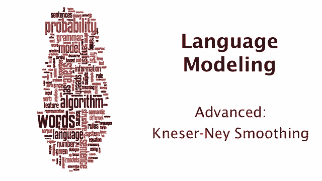
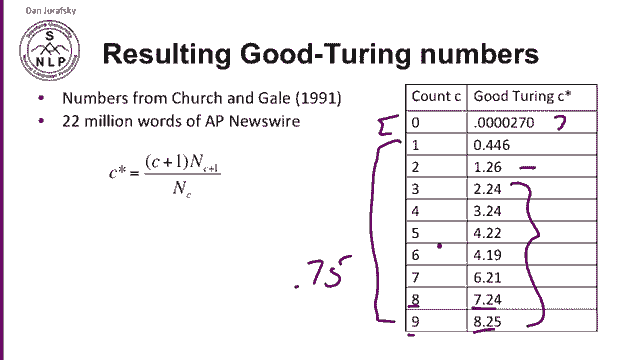
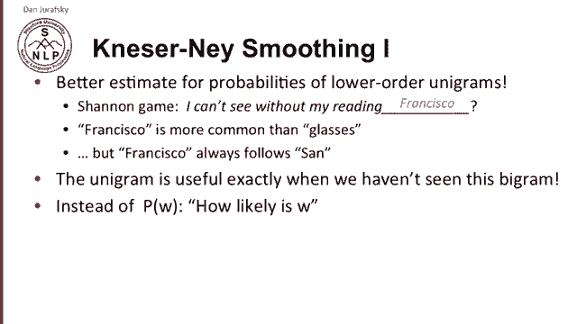
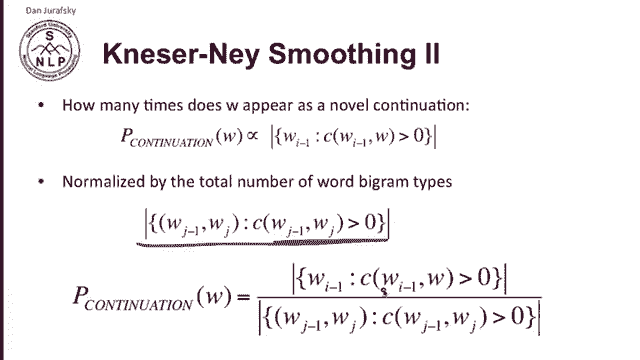
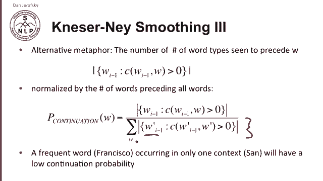
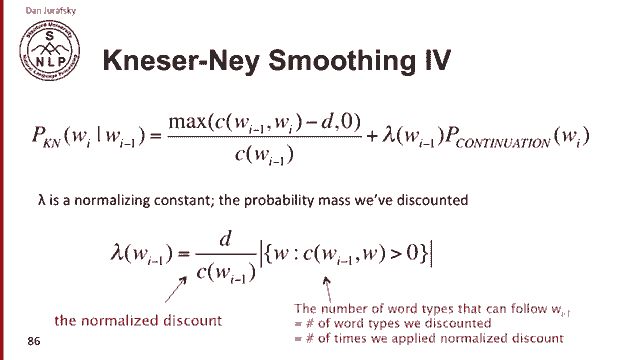

# P18：L3.7- Kneser Ney平滑 - ShowMeAI - BV1YA411w7ym

Let's talk about caniser eyeigh smoothing， one of the most sophisticated forms of smoothing。

 but also one with a beautiful and elegant intuition。Remember that from good touring。

We talked about the C stars， the discounted counts you end up from good touring， and we discounted。

Each of the counts， so count of  one was discounted to 0。4 and count of 2 discounted to 1。

26 and so on in order to save mass to replace the zero counts with some low number。

 And if you look at the actual values of these counts， 8。25 for9 and 7。24 for8。

 you'll notice that in a very large number of cases。

The discounted count has a very close relationship with the original count。

 It's really the original count minus 075。Or somewhere close to that。In practice。

 what Guturing often does is produce a fixed， small discount from the counts。

 And that intuition that of a fixed， small discount can be applied directly when we do this。

 we call this absolute discounting。 and absolute discounting is a popular kind of smoothing。

 And here we're showing you absolute discounting interpolation。 And again。

 the intuition is just will save some time。 and have to compute all those complicated gooduring numbers and we'll just subtract 0。

75， or maybe it'll be a different discount value for different corpora。

And here's the equation for absolute discounting， so we're doing biograms again。

 so the probability absolute discounted of a word， given the previous word will be some discounted bigram interpolated with some interpolation weight with the unigram probability so we have a unigram probability P of w and then the bigram probability and we just subtract a fixed amount let's say it's 0。

75 from the count and otherwise compute the bigram probability in the normal way so we have a discounted bigram probability mixed with some weight which I'll talk later about how to set this weight with a unigram and maybe we might keep a couple extra values of D for count 1 and 2 counts 1 and 2 we saw on the previous slide weren't quite subtracting 0。

75 so we can model this more carefully by having separate counts for those。

But the problem with absolute discounting is the unigram probability itself。

 and I want to talk about changing the unigram probability and that's the fundamental intuition of cannyran I。

 So in kisar I smoothing The idea is keep that same interpolation that we saw in absolute discounting。

 but use a better estimate of the probabilities of the lower unigrams and the intuition for that we can go back and look at the classic Shannon games。

 remember in the Shannon game we're predicting a word from previous words。

 So we see a sentence I can't see without my reading。What's the most likely next word。

 Well glasses seems pretty likely， Well， how about instead the word Francis Francisco， Well。

 that seems very unlikely in the situation。 And yet。

 Francisco as just a unigram is more common than glasses。

But the reason why Francisco seems like a bad thing after reading。

 one intuition we might be able to get is that Francisco always follows San or very often follows San。

 So while Francisco is very frequent， it's frequent in the context of the wordsan。Now。

 unigrams in an interpolation model where we're mixing a unigram in a bigram are specifically useful。

 they're very helpful just in case where we haven't seen the bigram。

 so it's unfortunate that just in the case where we haven't seen the bigram reading Francisco。

 we're trusting Francisco's unigram weight， which is just where we shouldn't trust it。

So instead of using the probability of W， how likely is a word。

 our intuition is going to be when we're backing off to something。

 we should instead use the continuation probability。 We're going to call it p continuation of a word。

 How likely is the word to appear as a novel continuation Well how do we measure novel continuation for each word will just count the number of bygram types it completes how many different bis does it create by appearing after another word。

 In other words， each bigram type is a novel continuation the first time we see this new bigram In other words。

 the continuation probability is going to be proportional to the cardinality of this set。

 The number of words of preceding words I minus1 that occur with our word。

 So how many words occur before this word in a bygram。

 how many preceding words are there the cardinality of that set。

 that's the number we would like our continuation probability to be proportional to。

So how many times does W appear as a novelble continuation， we need to turn that into a probability。

 so we just divide by the total number of word biogram types， so of all word biograms。

That occur more than zero times， what's the cardinality that said。

 how many different word bygram types are there， and we're just going to divide the two。

To get a probability of continuation of all the number of word biogram types。

 how many of those have W as a novel continuation？

Now it turns out that there's an alternative metaphor for Kaseer I with the same equations。

 so again we can see the numerator as the number， the total number of word types that precede W。

 how many word types can W follow， and we're going to normalize it by the number of words that could precede all words。

 so the sum over all words of the number of word types that can precede the word。

And these two are the same， the number of this denominator。

And the denominator we saw in the previous slide are the same because the number of possible bigram types is the same as the number of word types that can precede all words summed over all words if you think about that for a second you'll realize that's true。

So in other words， with this kind of canacester eye model。

 a frequent word like Francisco that occurs only in one context like SanN will have a low continuation probability。

So if we put together the intuition of absolute discounting with the canaseer N probability for the lower order ngram。

 we have the canasear Nigh smoothing algorithm。For the bigram itself。

 we just have absolute discounting， we take the bigram count， we subtract some D discount。

 and I've just shown here that we take the max of that in zero because obviously if the discount happens to be higher than the probability。

 we don't want a negative probability and we're just going to interpolate that with this same continuation probability that we just saw P continuation of W subme。

And the Lambda， now let's talk about how to compute that Lambda。

 the Lambda is going to take all that probability mass from all those normalized discounts that we took out of these higher order probabilities and use those to weight how much probability we should assign to the unigram。

 we're going to combine those。So that lambmbda is the amount of the discount weight divided by the denominator there。

 so it's the normalized discount and then we're going to multiply that by the total number of word types that can follow this context WI minus-1。

 in other words how many different word types。Did we discount or how many times did we apply this normalized discount。

 and we multiply those together， And we get， we know how much probability mass total we can now assign to the continuation of the word。

 Now， this is the bigram formulation for canaseer I。

Now in this slide， we're showing you the general recursive formulation for n grams in general。

 and here we have to make a slight change to to。To deal with all the higher order ngrams。

 So here we're just showing the canasester I probability of a word given the prefix of the word and just like canasester I we saw before。

 we're just interpolating a higher order ngram， which is discounted with a lambda weight and a lower order probability。

 but now we need to distinguish between the very first top level time that we use account and these lower order count。

 So we're going to use the actual count for the very highest order bigram and we're going to use the continuation value that we just defined earlier for all the lower order probabilities。

So we'll define this new thing， count Kaseser and I of dot。

 which will mean the actual count that we this will be actual count。

 let's say we're doing trigrams for the trigram and then when we recurse and have the ksar I probability for the lower order things is when we get down to the bigrams and unigrams we'll be using the continuation count。

 that's again， the single word context that we defined earlier。

So ks are nice smoothing， a very excellent algorithm。

 it's very commonly used in speech recognition and machine translation。

 and yet it has a very beautiful and elegant intuition and I hope you appreciate it。

