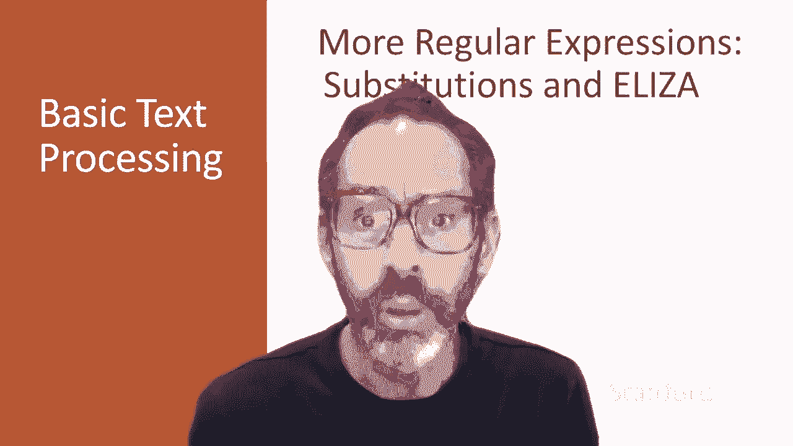
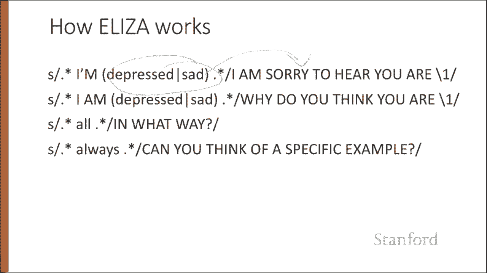
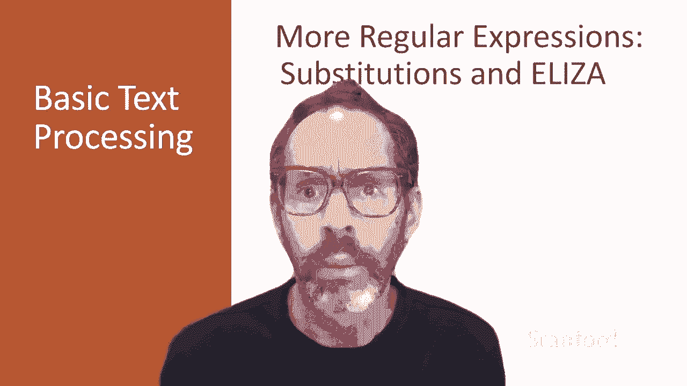

# P2：L1.2- 正则进阶(替换等操作) - ShowMeAI - BV1YA411w7ym

Regular expressions play a very powerful role when they're used to modify strings。

 And this kind of string substitution is a key part of one of the most important early NLP systems the chatbo Eliza from 1966。

 The syntax for substitutestitution is simple。 For example。

 the Python S command can be used to change a string matched by a rex to the substitute。

 another string。

It's often useful to be able to refer to a particular subset of the string matching the first pattern。

For that， we can use capture groups， a way of storing part of the pattern into a register so we can refer to it later in the substitution string。

Let's say we want to put angle brackets around all the numbers like 35 here。

 so we'd like to replace that with 35 with angle brackets。

We can use parentheses to capture a pattern into a register and the registers will have numbers。

And we can refer to them by their number， so slash one will be whatever's in register one。

 so in our substitute command in the first string here。

These parentheses mean take the regular expression in this case for a digit sequence and put it in register one。

 register one because it's the first set of parentheses in our substitute。

And then when we specify what to substitute it into。

 we can slash one means whatever we matched in the first set of parentheses。

 and then we can add the two angle brackets to transfer our 35 to an angle 35。

In very complex patterns， we'll want to use more than one register。

 so here's an example where we might capture two strings and then maybe refer to them both in order first string。

 second string and then we'll refer to them in order。So we can match the faster they ran。

 the faster we ran， but not the faster they ran， the faster we ate because eight doesn't match back slash two。

 which in this case will be the string ran。But here's a problem。

 parentrenheses are used to specify capture groups， but they're also how we group terms， for example。

 for disjunctions， like an expression for a string matching people or cats。

 How do we specify that we're using the capture groups just for grouping and not for capturing。Well。

 we simply add a question mark colon after the open parent， so this question mark colon here。Means。

Consider these per ends just for grouping not for capturing so this regular expression will not capture whatever matches some or a few。

 but it will capture whatever matches people or cats and put that in the first register slash one so this will match some cats like some cats but not some cats like some some。

Because slash one doesn't match some it matches cats so that first parentheses are just ignored in terms of register numbering and storage。

Finally， there'll be times when we need to predict the future look ahead in the text to see if some pattern matches。

 but we're not going to advance the match cursor so we can then deal with the pattern if it occurs These look ahead assertions make use of the Aran question mark syntax we just introduced for non capture groups so the operator question mark equals。

Is true if the pattern occurs， but it's zero with， meaning the match pointer doesn't advance and the negative look ahead question mark Bang。

Only returns true if a pattern doesn't match， but again， zero width。

 So this negative look ahead is commonly used when we're parsing some complex pattern。

 but we want to rule out a special case。 For example。

 this last pattern here matches at the beginning of a line。Any single word。That doesn't start。

With volcano。Now， substitutions and capture groups are very useful in implementing simple chatbots like Eliza。

 Eliza is one of the most important historical NLP systems it was created by pioneering AI researcher Joseph Weiseenbaum in 1966。

 and it simulates a Rogerarian psychologist， a kind of therapist who emphasizes mirroring back what they hear。

 Eliza as a surprisingly simple program that just uses pattern matching to recognize phrases like I need X。

And translates them into suitable outputs like what would it mean to you if you got X？

This simple technique succeeds in this domain because Eliza doesn't actually need to know anything for this mimicking of a rogerarian psychotherapist。

 this is one of the few dialogue genres where listeners can act as if they know nothing of the world。

Well here are some fragments from a sample conversation with Eliza in 1966。

Eliza's mimicry of human conversation was remarkably successful。

Many people who interacted with Eliza came to believe that it really understood them in their problems。

And in very prescient early work， Weiseizenbaum pointed out the ethical issues in this attribution of human qualities to an artificial agent will return to this issue in the dialogue lectures。

Eliza consists mainly of a series of substitution patterns with some control for deciding what patterns to select and some higher level dialogue structure that we'll come back to。

 But here we can see examples of capture groups for generating the strings we saw on the previous slide。

So perhaps we might capture the adjectives that the writer uses to describe themselves and then just say something relevant to those particular kind of adjectives。

Or simple patterns for asking more details when the user uses generic statements containing words like all or always。

Regular expression substitutions and other powerful tools like Look ahead will be useful in all sorts of ways。

And later， we'll return to Eliza when we talk about how to build agents that can interact conversationally。

