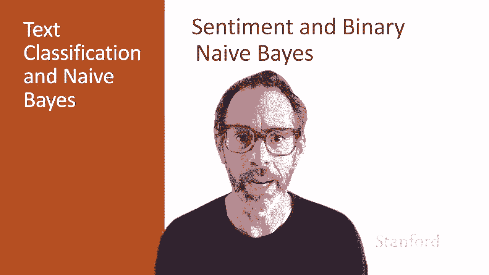
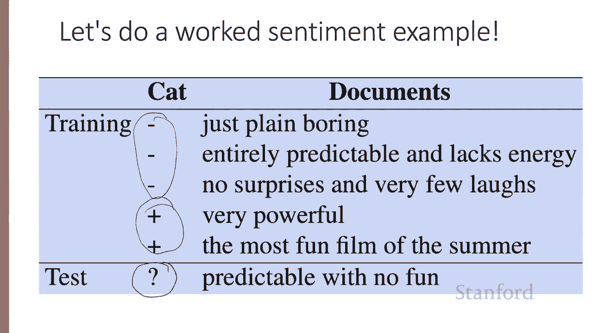
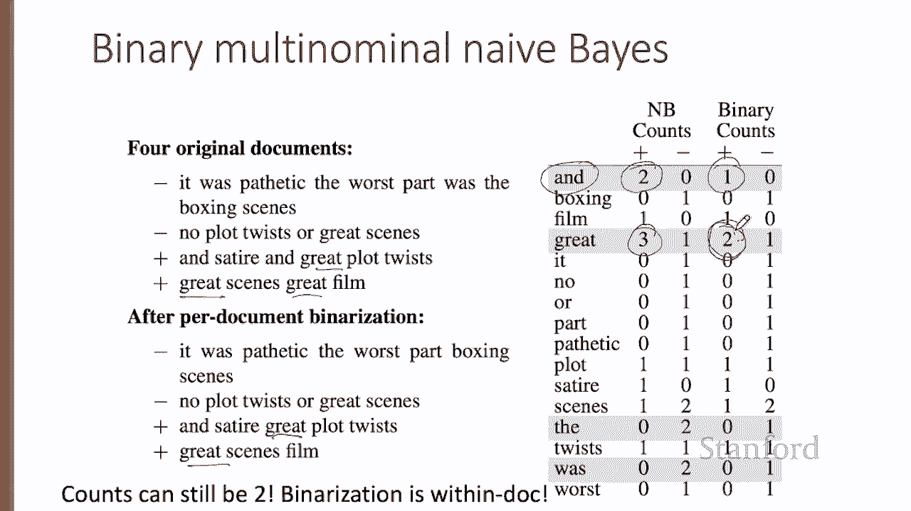

# P22：L4.4- 情感分析与朴素贝叶斯 - ShowMeAI - BV1YA411w7ym

In this lecture， we'll do a worked example of the naive Bay approach to sentiment analysis。

 and we'll also introduce the binary naive Bays algorithm。

Let's look at this simple pedagogical example。Here we've got three negative。

Documents and two positive documents。 And we're going to see how to compute the probabilities from our training set。

 And then we'll see how do we assign a sentiment value to our test sentence。

 So five training sentences， one test sentence。 So the first thing we're going to do is compute the prior probability of the two classes。

 negative and positive。 and recall from the previous lecture that we compute the probability of a class by taking the number of documents in that class over the total number of documents。

 So there are three negative documents and two positive documents。

So our probability of negative is  three out of the total  five documents。

 and our prior probability of the positive class is the two out of 5。 Next。

 we drop any word in the test set that's not in our vocabulary。

 The word with never occurred in our training set。 So we're going to drop it here from the test set as if it never occurred。

 Now， let's look at computing the likelihoods。 And we're going to use the add one smoothing equation that we saw in the prior lecture。

So we're going to take the count of for any word in the in the class how often the word occurs in documents in that class。

 we're going to add one to it and for the denominator we're going to sum for all words in the vocabulary their count in this class and we're going to add the size of the vocabulary thats that's the sum of the add one smoothing that we saw in the previous lecture so we need to know for a given word what its count is in the class and we're going to need to know the sum of all the words in that class or we're going to know the vocabulary size。

So how many words are in the negative class 1，2，3，4，5，6，7，8，9，10，11，12，1314。 So there are 14 words。

 That's word tokens in the negative class。 So 14 tokens。And there are 9 tokens in the positive class。

 And how about the vocabulary size。 What turns out the vocabulary size is 20。

 If we sum up all of these tokens， there's actually two copies of the and two of vary and two of and。

 And we're left with V equals 20。 Again， That's just from the training set。

 We're in the training phase right now。 We don't look at the test set yet。😊，Al right。

 let's see how to compute the likelihood of three words， the words predictable， no and fun。

 I'm picking those three because those are the three that are going to occur in our test set so we can see very clearly how the math works。

All right， so how about the word predictable， How many times does predictable occur。

 let's say in the negative class Well， it occurs once。 So count of W comeacy is going to be one。

 So the numerator is going to be one plus1。 and how about the denominator denominator is going to be 14 plus 20。

 So sure enough here we have it printed out The probability of predictable given the negative class the likelihood here is one plus1 over 14 plus 20。

 and similar， the probability of no the likelihood of no is one plus one over 14 plus 20 and the probability of fun。

 fun never occurs here in the training set in the negative class So it's count in the negative class is 0。

 And again， we divide it by 14 plus 20。 And I've done the similar computation here for the same three words in the positive class Pre doesn't occur in the positive class in training no doesn't occur in the positive class in training。

But fun does， and now we're dividing by a different denominator。So now we're ready。

 we have we've computed our six relevant probabilities， of course， in real My Bay。

 you would have computed them for all the words because you don't know what's going to be in the test set we're just cheating here a little。

 So let's look at the test set。We're going to compute the probability of the negative class and the probability of the positive class and take whichever is higher。

 and to compute each probability we'll multiply the prior by the likelihood。

 So the prior for the negative class is 3 over 5。 We got that from up here。

 The prior for the negative class is 2 out of 5。 We got that from up here。 And then we multiply by。

 in this case， the three likelihoods multiply together。

2 out of 34 times 2 out of 34 times 1 out of 34。And for the negative class。

 we get a total estimate of 6。1 times 10 to the minus5。And our score。

 we compute the score for the positive class in a similar way， But we get a lower probability。

 meaning that we choose the negative class as our prediction for this particular sentence。

 predictable with no fun。 Now， it turns out that for tasks like sentiment。

 the occurrence of a word seems to be more important than its frequency。 In other words。

 if we see the word fantastic， that tells us a lot about how the user feels about the movie。

 But the fact that it occurs five times may not tell us that much more than its original occurrence。

😊。

And we take advantage of this intuition with an algorithm called binary multinomial naive bays。

 and we'll just call it binary naive bays for short， and the algorithm is very simple。

Inside each document， we clip our word counts at one。 So if a word occurs twice in the document。

 we just pretend it occurred once。 and I want to point out this is different than a similar algorithm called Bnoulli naive Bayes。

 which is not generally used for text classification。

 It's used when naive bays is applied to other other situations。

 and you can see more about that in the textbook at the end of the chapter。

The algorithm for binary multinial naive bays is very similar to our non binary naive bay algorithm。

 So in training， we compute the priors in the exact same way。

 And there's just a slight difference in how we compute the likelihoods before we do our likelihood computation。

We just remove all the duplicates in each document， in other words。

 for each word type W in a particular document J， if there's more than one copy of W。

 we just keep one of them。And then we concatenate the text together and compute our likelihoods just as we did before。

On a test document D。We similarly remove all the duplicate words from D。

 and then we compute N Bays using our standard equations before。Let's walk through another example。

With binary naive bays。 So imagine we have these four documents， two positive and too negative。

So if we look at our counts， the word and occurs twice。In positive documents。

 zero times in the negative documents。 And so we'll have a positive count up for and of2 in a negative count of 0。

 The word great appears three times。Only in positive documents it never， Oh no， there it is。

 It appears once in the negative document， so we'll have a count of three。

And then in the positive documents and account of one in the negative documents and so on。

 we do this for all the words。 And now let's look at what the documents look like after we've done our per document binization。

 there used to be two ands here and now we're down to one and and there were two greats here and we're down to one great and some other words have changed as well。

 So if we look at the counts， we notice that it used to be that the word and occurred twice in positive documents Now it only occurs once because that document has button binized。

And， for example， the word great used to have a count of three in positive documents。

 And now it has a count of two。 Notice that the counts can still be greater than one。 The word great。

 although we binized it in this document。😊，It still occurs in two documents in the positive class。

 so the binary Niveasease can still have counts greater than one by summing binaryized documents。

We've now seen in detail the naive Bay's approach to sentiment analysis and the binary version of Naive Bays that works well with sentiment tasks。

