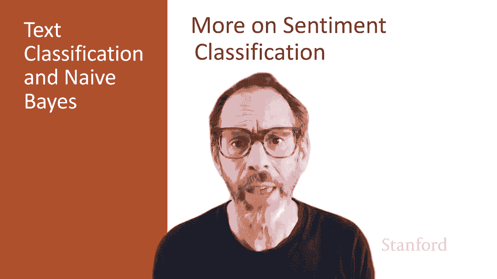
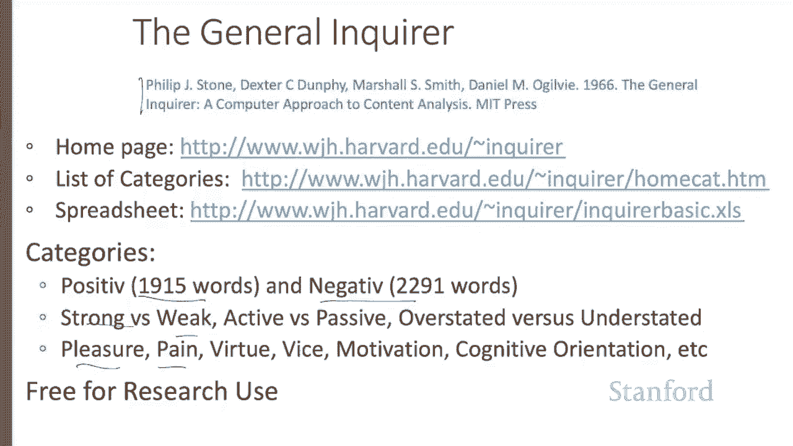
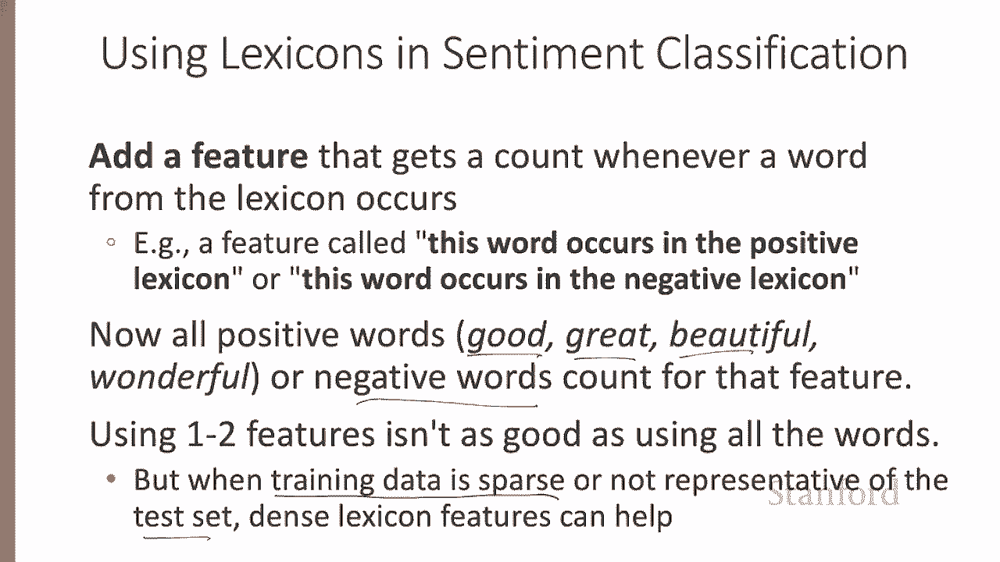
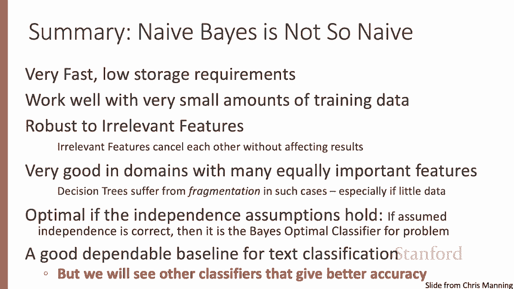
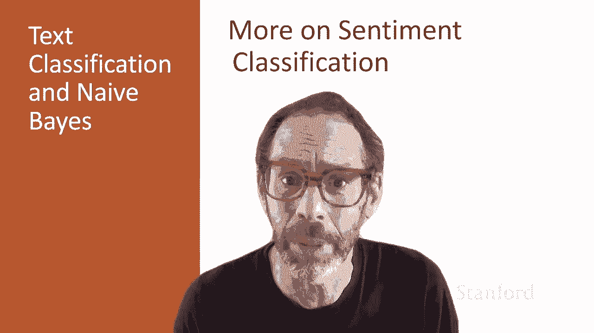

# P23：L4.5- 情感分析延展内容 - ShowMeAI - BV1YA411w7ym

Let's look at some other aspects of sentiment analysis。

 like linguistic negation and the use of lexicons。 One important issue that comes up in sentiment classification is linguistic negation。

So the sentence I really like this movie is very different than the sentence I really don't like this movie。

So here negation changes the meaning of like to a negative。

 and it can also change the meaning of a negative to somewhat more positive。

 a negative sentence like dismiss this film can be softened by don't， negative to positive。

 not quite as strong as positive to negative， but a very important word to deal with。

A simple baseline method dating back to the really the beginning of sentiment classification is to just add the string N。

 O T under bar to every word between a negation， a linguistic negation。

 a not or a never or no or a don't。 And the following punctuation。

 So we might take a string like didn't like this movie comma， but I。

 And because didn't has a negation in it。 we add not underbar to like this and movie and stop when we get to the comma。

And what we've basically done is we've doubled our vocabulary size。

 we've added a not like and a not this and a not movie token to our vocabulary。

 and now the not like token is going to be a great cue for a negative movie review。

Sometimes we don't have enough label training data or the training data and the test data are drawn from different distributions。

 and in such cases， it can be useful to make use of a pre builtilt word list called a lexicon。

 And there's lots of publicly available lexiconons that are used for sentiment。

 So just to give a couple of examples， the MP QA subjectivity cues。

 lexicon labels about 7000 words for whether theyre positive or negative。 So admirable。

 beautiful and confident or positive words and awful， bad catastrophe or negative words。

Or the general inquirer， another early lexicon dating from the 60s has list of positive and negative words and。

 and lots of other list of words active versus passive or pleasure or pain or strong， weak words。😊。

The way we use lexiconons and sentiment classification is to add a new feature that gets a count whenever a word from lexicon occurs。

 So you might think of this feature as this word occurs in the positive lexicon。

 So when we see a positive word like good or great or beautiful any one of them。

 we add one to that count。 So before we are adding one to good and one to the count for great and to the count for beautiful with lexiconons。

 we simply add one for any of these occurring。 So that kind of sums over all the possible positive words or negative words for the negative word feature。

 And so now we've only got two features， a positive word feature。

 a negative word feature where before we had lots and lots of lexical features。Nonetheless。

 this can be helpful when the training data sparse。

 we don't have really good counts to make use of or perhaps the training data is not representative of the test set。

 So we can't rely on the same words appearing in training and test。 So in those kind of cases。

 these dense lexicon features can help。😊。

Of course， naivebease is useful for other kinds of tasks with text than sentiment。

 So spam filtering is one famous example。 So some features from a naivebe spam classifier。

 if the text mentions millions of dollars or if the from starts with numbers or if the subject line is in all caps or if you see the phrase 100% guaranteed or some claim that you can be removed from the list。

 these are all features that suggest that you're looking at spam and we can build a naivebe classifier with features like this。

Niveb can also be used for language identification。

 So that's the task of determining what language a piece of text is written in。

 And it's a very important preprocessing step。 And it turns out that features based on character Ngrams do very well for this task。

 So certain kinds of character engrams are very distinctive for certain languages。

 It is important to train on different varieties of each language。 So， for example。

 for English you want to make sure you train on American English varieties like Africanam Americanican English or English varieties around the world like Indian English。

In summary， naive Bayase really isn't that naive。 It's very fast。 It has low storage requirements。

 It works well with very small amounts of training data。

 which is not true for many of the more powerful algorithms。

 We'll see it tends to be robust to irrelevant features。

 It's good in domains with many equally important features。

 which is not true for some other machine learning algorithms like decision trees。And in fact。

 knifeive Base is optimal in the rare case in the world where the independence assumptions actually hold。

 So it's a good dependable baseline for text classification。However， we'll see other classifiers。

 logistic agression， neural networks of various kinds that give better accuracy when there's enough training data。

We've now seen further aspects of sentiment classification and other tasks that naive bays can be applied to。

 like spam detection or language identification。

