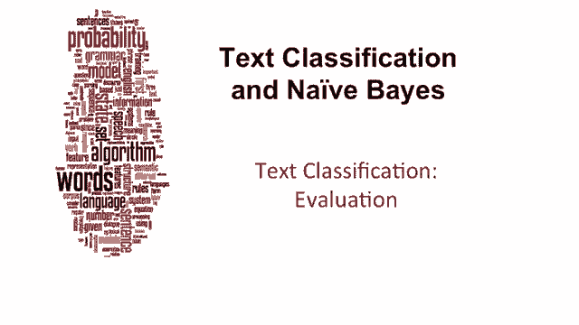
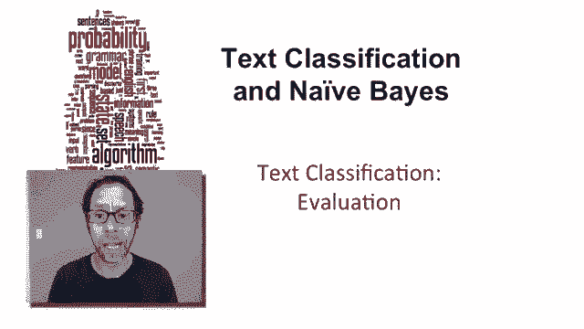
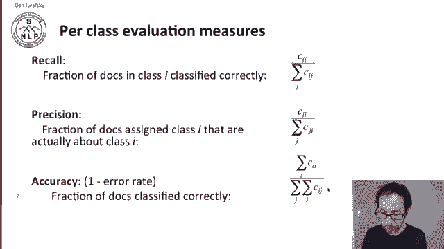
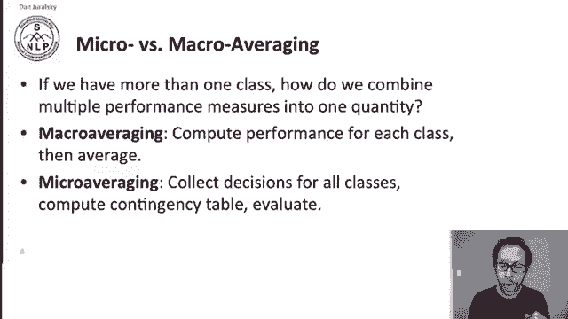
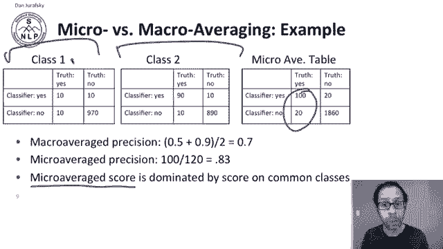
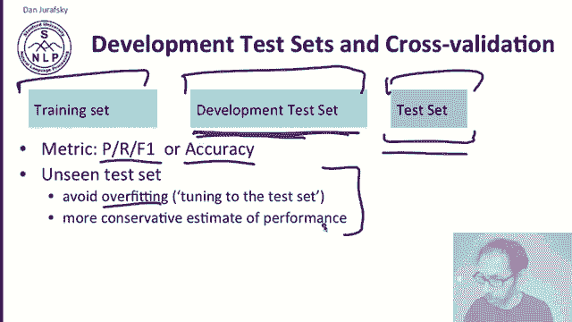
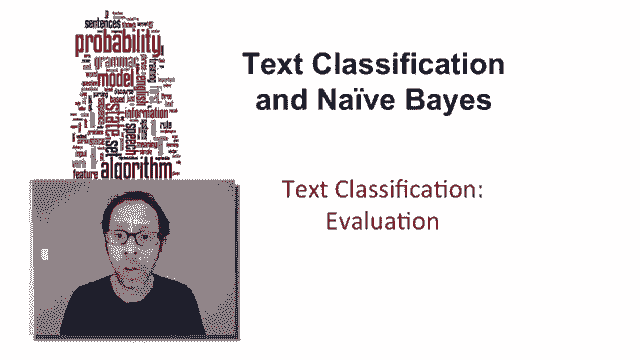

# P26：L4.8- 文本分类的评估 - ShowMeAI - BV1YA411w7ym

We've introduced precision and recall， now let's turn to the remaining issues in the evaluation of text classification。

A commonly used dataset set for text classification is the Reuters data。It's got 21000 documents。

 There are standard training and test splits。 The set has 118 categories and this is a class of multivalue classification because an article can be in more than one categories so that means we're going to be learning 118 separate classifiers each one making a binary distinction and the average document has about just over one class and here's some common categories with some numbers of training and test documents so there's 433 training documents about grain and 149 test documents about grain and we have classes like wheat and corn and interest and so on。

Here's a sample Reuter's document， you can see it's about livestock and about hog。

 so it has two topics， and then here's the text， so our task is given this text to classify this document is about livestock and about hogs。

The confusion matrix is very important for multiclass classification。

 A confusion matrix tells us for any pair of classes， C1 and C2。

 how many documents from C1 were incorrectly assigned to C 2。 Here's a little example。

 We have some documents about poultry or wheated or coffee。 and here's their true classes。

 numbersumb of documents in these true classes。 And here's what our classifier are assigned。

 So C sub 3，2， This 90 is documents that were。About wheat。

 but our classifier thought they were about poultry。

 so this is a classifier that just loves chickens。Each cell of the classifier tells us how many documents of each class were classified in the other class。

 and that means that the diagonals of this confusion matrix give us the correct classifications here。

 95 documents that we said were about the UK are in fact about the UK and no documents that we said were about wheat are actually about wheat。

We can use the confusion matrix to compute the same measures we've talked about。

 precisionciion and recall。 Let's start with recall。

 recall the fraction of documents in class I that are classified correctly。

 How many of these class I documents did we find。 So true positives。

 C sub I I divided by the sum of the entire row。 let's go back and look at our table。

Here's an entire row of documents that are actually about wheat。

 and let's say our true positives here are0， so we're very， very bad classifier about wheat。

 We divide  zero by the sum of all these numbers 10 plus 90 plus 1。

 that's going to give us our precision or recall， excuse me。For precision。

 we're going to ask of the documents that we returned， so that's an entire column of that column。

 how many are the documents that we were correct about？

Of the documents that we said were about wheat。How many of them were truly about wheat。

 so the documents about wheat divided by all the documents that we said。

 the sum of all of these documents that we said were about wheat？

And then accuracy is just a fraction of documents classified correctly。

 so it's the sum of these diagonal entries divided by the sum of all of the entries in the confusion matrix。

Now， since we have more than one class， we're going to need a way to combine the values。

 the precision and recall values we get from each class into one measure because it's often useful to have a single measure and there's two standard ways to do this in macro averaging。

 we compute the performance， the precision or recaller F score for each class。

 and then we average them to get an average value。 So if we have 113 classes。

 we're going to compute 113 precisions and we're going to average them all to get a macro average precision in micro averaging。

 we instead collect all the decisions for all the classes into one single contingency table and then we evaluate our precision on that。

Let's look at an example here we have two classes， class1 and class 2。

 and here's all the things that are truly yeses and true nos for class1。

 and here's things that are really about really in class two and really not。

And here's what our classifier returns so our macro average precision we're going to compute precision separately for the two classes。

 so for class1 10 over 10 plus 10， so that's 0。5。For class2， 90 over 90 plus 10。Or 0。9。

 so our macro average precision is the average of 0。5 and 。9 or we get 0。7。For micro averaging。

 on the other hand， we're going to take the two contingency tables and just add them all together to get a single micro average contingency table。

And now we're going to compute precision directly from that， so we'll get 100 over 100 plus 20。Or 0。

83。So you can see that the micro average score is dominated by the score in the common class。

 Class2 is much more common than class 1。 these numbers are much bigger in micro averaging。

 that class will dominate these summed numbers in this summed contingency table in macro averaging。

 each class is going to participate equally。

For text classification evaluation， we need more than just precision or recall。

 as in many machine learning based algorithms for natural language processing。

 we'll need a training set， a test set for measuring performance and something called a development test set or devb set。

On the training set， we'll compute our parameters。And what we'll do with the dev set is test our performance while we're developing our system。

 And so whether we're looking at precision recall F1 or whether we're looking at accuracy。

 we'll look at our scores on the development test to find bugs in our algorithm and develop new features。

 And once we're done developing the algorithm， we can then test on a clean unseen test set。

 And the reason why it's important to have this clean unseen test set is that otherwise。

 if we report numbers on our development test set that we've been using all along。

 We're going to end up overfitting， we're going to report much higher acuracies。

 probably than are reasonable because we've tuned our algorithm to this development test set。

 a clean unseen test set， give us a more conservative estimate of performance。

Now we can get sampling errors due to small dataset sets。

 maybe our test set is small or our training sets unrepresentative。

 so it's common we talked about earlier about crossvalidation。

 so we're going to take multiple splits of our data and crossval， for example。

 let's say we set aside some portion of our data for a dev set。

 we'll take the rest of it and we'll train on this training set and then look at our performance on the dev set and then we'll take a different split train on this part of the training set and report on the Dev set。

 take this part of the training set and get our performance than Dev set and we're going pool our results from each split and then compute a total pooled devet performance。

 This lets us avoid having very small test sets or very unrepresentative test sets。

 a lot of the data gets used for both training and test in different splits。Still at the end。

 we need to have our clean unseen test set so that we don't overfit to these dev sets。

Weve now given you a number of ways to evaluate text classification。

 We've introduced precision and recall and F score and talked about what to do in the multi class problem。

 where we have more than two classes。 We'll see the use of these ideas and also of micro averaging and macro averaging throughout natural language processing。

