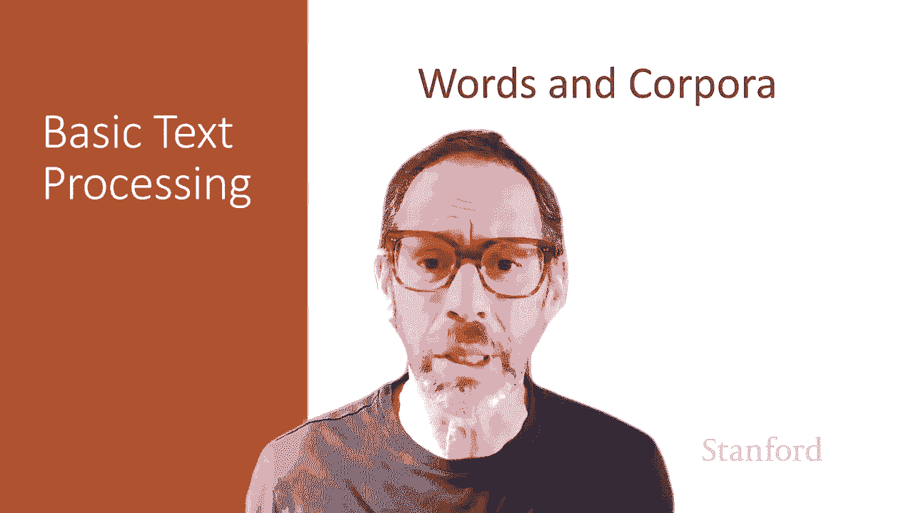
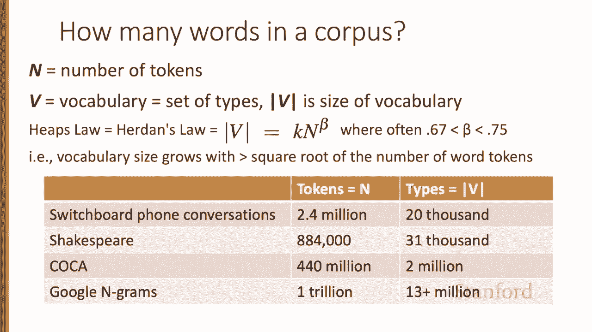
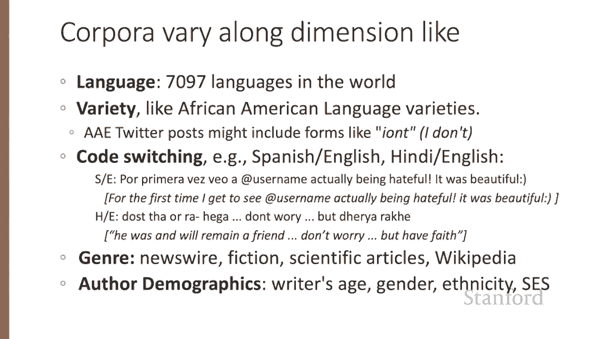
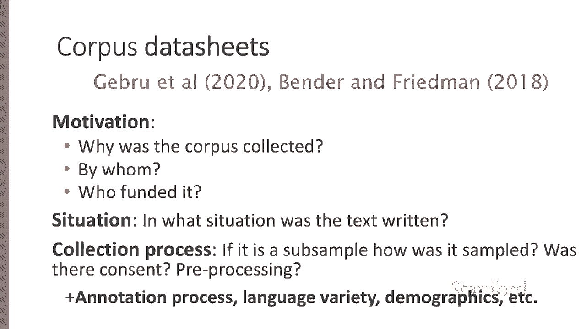
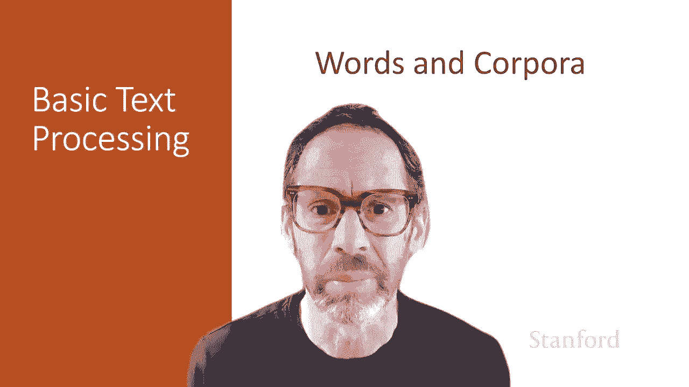

# P3：L1.3- 词汇与语料集 - ShowMeAI - BV1YA411w7ym

Let's continue our study of basic text processing techniques in this lecture we'll talk about basic properties of words like how many words are there。

 and we'll talk about corpora that's the plural of corpus meaning body of text and the properties of different corpora we can use in our research。

Let's start by asking how many words are in just one sentence。 Here's a sentence。 I do main。

 mainly business data processing。Well， how many words are in that sentence。

 It's a complicated question。Is a word？And what about that cut off Ma。

 the first time I started to say mainly， We call things like main here a fragment。

 and we call anum filled pauses。 So for certain applications like speech applications。

 we might want to be counting these。 Or how about cat and cats in this Doctor Seus's sentence。

 It'll help to introduce the distinction between lemma and word form。Two words are the same lemma。

 If they have the same stem， same part of speech， the same sense。

 whereasas word form is the exact surface form of the word with all of its inflections and endings。

 So if we're counting lemmas， cat and cats count as the same lemma。 If we're counting word forms。

 cat and cats are different。Let's look at a part of another sentence。

 How many words are in this sentence。 Go ahead and pause the video and count for yourself。 Again。

 It depends how you count。 We could count word types。

 the number of unique words that occur in the sentence。 And by that count， we only count the once。

 even though it appears twice， or we could count word tokens。

 where we count every instance of the word on the page。 So now the two does would count twice。

 And what about San Francisco， one word or two。 And， and how about they and there。

Different word forms， same lemma。 Again， it depends on our goals。

 and it's important to make that clear whenever you report word counts。In general。

 we'll refer in a corpus to the number of tokens with capital N and we'll use capital V to mean the vocabulary。

 the set of all words。 So the cardinality of v is the size of the vocabulary。

 the number of word types， although occasionally for simplification。

 you'll see we'll just use capital V to mean the vocabulary size， when it's not ambiguous。

Now there's a relationship between these two in running text called Heap's Law or Herdon's Law。

 which is that the size of the vocabulary grows with something over the square root of the number of word tokens。

So in a large corpus of n word tokens， you can expect to see about n to the 0。

7 word types as the number of tokens grow， the number of types grows accordingly。

 Here's some numbers for some standard corpora that are often used in research。

 So the switchboard corpus of telephone conversations has about two and a half million tokens and a vocabulary size of about 20000 and we'll see switchboard used for all sorts of things because it's been labeled for all sorts of linguistic phenomena。

 parse trees and dialogue acts and information structure and even phonetic structure。Shakespeare。

 just under a million tokens， about 30000 words。 So quite small corpus。

 That's every word he wrote in his lifetime。 And in that less than a million words。

 he actually used 3000031000 distinct words。 So you a very broad vocabulary famously。

And if you look at a very large corpus like the Google Ngrams corpus， a trillion different tokens。

 very large number of words， there's 13 million words。 So how many words are there in English。Well。

 if you look at conversation about 20000， if you look at Shakespeare， about 30000。

And if you combine the two， maybe not quite the sum， but some other larger number。

 But if you look at the Google engrams， we have 13 million。 And， of course。

 some of those are probably URLs and email addresses。 But even if you eliminate all of those。

 the number of words in a language is very large。 Maybe there's a million words of English。

Now， words don't appear in a corpus out of nowhere。

 A text is produced by a specific writer at a specific time in a specific variety of the language of that specific language。

 and for a specific function。 So when we think about corpora。

 we want to think about these properties。 So a corpus might vary along different dimensions。 So。

 for example， there's about 7000 languages in the world。

 What it means to be a word is different from one language to another。 And inside these languages。

 we have different varieties。 So just， for example， in American English。

 there's a variety of Africanam Americanican language varieties。

 So Africanam Americanican English Twitter posts might use words like I O N T a short form for I don't。

 Or the majority of people in the world speak more than one language。

 And sometimes they speak them in the same sentence。 That's called code switching。

 So here's some examples of someone code switching between Spanish and English or someone else。

 code switching between H and English on social media。 and we'll have to。

Account for this phenomenon when we're looking at our data。And of course。

 because these cor were created for different purposes， they're going to be in different genre。

 we might have newswi or fiction or nonfiction or particular scientific articles or encyclopedic texts like Wikipedia。

 and then of course the author demographics matter， the age of the author， their gender。

 their ethnicity， their socioeconomic status， these are all things that might influence how a corpus looks。

Because of all this variation， it's important when you're producing a corpus and when you're looking at a corpus to look at the data sheet for that corpus。

 So a data sheet might say talk about all the variables we just talked about and other things like the motivation for the corpus。

 Why was it collected， by whom who paid for it， situations in which the text was written。

 What were the authors doing were they talking to somebody else If so， Who。

 and the collection process。 If this a sub sampleample of the corpus， If so， how did we sample it。

 did the authors of the corpus give consent， how is it pre processcessed and all sorts of other things。

 How is it annotated， you'll need to make sure you consider all these properties of a text and when you build a corpus you should be documenting these kind of decisions in a data sheet。

In summary， when you study text in corpora， it's important to be explicit about what you mean by word。

 type or token， Lemma or word form， and about the properties of the corpora you're studying。

 the genre， the language variety， who wrote them and how they were collected。

