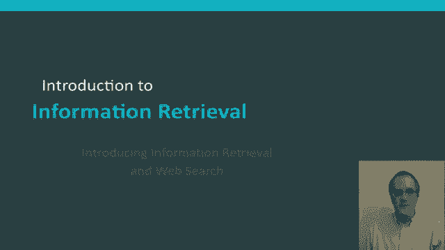
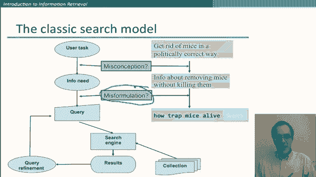
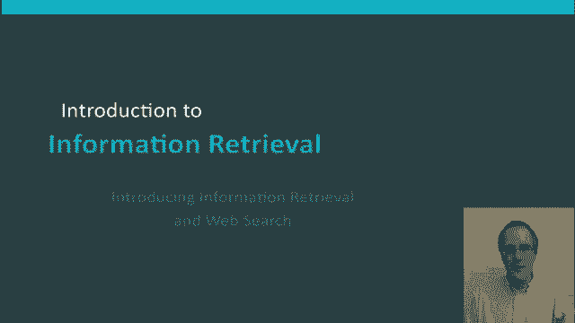

# P33：L6.1- 网络爬虫与信息检索初步 - ShowMeAI - BV1YA411w7ym

Hello， in this segment， I'm going to introduce the task of information retrieval。

 including in particular， what's now the dominant form web search。😊。

The task of information retrieval can be maybe defined as follows that our goal is finding material which is usually documents of an unstructured nature usually text that satisfies an information need that's what the person is looking for information on from within large collections usually stored on computers so there's lots of mentions there are prototypical cases and other kinds of information retrieval do exist so there are things like music information retrieval where there are sounds not text documents but effectively what we're going to talk about here is the case where all of those usually clauses hold there are many scenarios for information retrieval the one that people think of first these days is almost invariably web search。

 but there are many others so searching your email searching the contents of your laptop computer finding stuff in some company's knowledge base doing legal information retrieval。

Define relevant cases for a legal context or something like that。

It's always been the case that a large percentage of human knowledge and information is stored in the form of human language documents and yet there's also for a long time been something of a paradox there so this is just a kind of a。

😊，Not quite real graph to give a flavor of things。 Don't really believe the numbers on the lefthand side or exactly what they mean。

 But what we're showing is that in the mid-1990s， it was already the case that if you looked at the volume of data that there was some data that was in structured forms by that。

 I mean， things like relationlational databases and spreadsheets。

 But there was already vastly more data in companies organizations and around people's homes。

 there was in unstructured form， the form of human language text。 However。

 despite that in the mid-1990s， structured data management retrieval。 there was a developed field。

 and there were already large database companies where in the field of unstructured data management。

 there was very little， there were few teeny little companies that did various kinds of corporate document retrieval and things like that。

 That situation just completely changed around the term of the millennium。 So if we look today。

Situation is like this so the data volumes have gotten larger on both sides。

 but in particular they've gotten larger on the unstructured side， the massive outpouring of blogs。

 tweets， forums and all those other places that now store massive amounts of information but there's also then been a turnaround on the corporate side so now we have huge companies that are addressing the problems of unstructured information retrieval such as the major web search giants。

😊，So let's start and just say a little bit about what is the basic framework of doing information retrieval so we start off by assuming that we've got a collection of documents over which we're going to do retrieval and at the moment we're going to assume there's just a static collection later on we'll deal with when documents get added to and deleted from that collection and how we can go out and find them in something like a website search scenario。

😊，Then our goal is to retrieve documents that are relevant to the user's information need and helps the user complete a task。

😊，Let me go through that once more a little bit more slowly with this picture。😊，So at the start。

 what we have is the user has some task that they want to perform， let's take a concrete example。

Suppose what I want to do is get rid of the mice that are in my garage and I'm the kind of person that doesn't really want to kill them with poison so that's my user task that I want to achieve and so to achieve that task。

I feel that I need more information and so this is the information need I want to know about getting rid of mice without killing them this information need is the thing with respect to which we assess an information retrieval system but we can't just take someone's information need and stick it straight into a computer so what we have to do to be able to stick it into a computer is to translate the information need into something that goes into the search box and so that's what's happened here we now have a query and so here's my attempt at a query how trap mice alive so that's taken this information need and I've made an attempt to realize it as a particular query。

😊，And so then it's that query that goes into the search engine leads which then interrogates our document collection and leads to some results coming back and that may be the end of the day that sometimes if I'm not satisfied with how my information retrieval session is working。

 I might take the evidence I got from there and go back and come up with a better query so I might decide that alive is a bad word and put in something like without killing。

And see if that works any better。Okay， what can go wrong here？

Well there are a couple of stages of interpretation here so first of all there was my initial task and I made some decisions as to what kind of information need I had it could be that I got something wrong there so I could have misconception so maybe in getting rid of mice the most important issue as not whether or not I kill them but whether I do it humanely but we're not going to deal with that issue so much what we're more interested in here is the translation between the information need and the query and there are lots of ways in which that can go wrong in misformulation of the query so I might choose the wrong words to express the query I might make use of query search operators like Inverted commas which might have a good or a bad effect on how the query actually works and so those the choices in my query formulation which aren't altering my information need whatsoever。

😊，That's important when we talk about how to evaluate information retrieval systems that's a topic we'll say more about later but let me just give you the first rough sense of this because we'll need it for everything that we do so whenever we make a query to an information retrieval system we're going to get some documents back and we want to know whether the results are good and the very basic way in which we're going to see whether they are good is as follows we're going to think of two measures which are complementary one of which is precision so precision is the fraction of the retrieved documents of the system that are relevant to the user's information needs so that's whether when you look at the results it seems like one document in 10 is relevant to the information need you have or whether the seven documents in 10 R that's assessing whether the mix of stuff you're getting back has a lot of bad results in it the complementary mixture measure is。

😊，The one of recall recall is measuring how much of the good information that's in the document collection is the system is succeeding and finding volume and the fraction of relevant docs in the collection that are retrieved well give more precise definitions and measurements for information retrieval later and the one thing I want to express right now is that for these measures to make sense they have to be evaluated with respect to the user's information need。

😊，For certain kinds of queries such as the ones we'll look at in the following segments。

 the documents that get returned are deterministic in terms of what query is submitted so if we were just going to evaluate what gets returned with respect to the user's query then we necessarily say that the precision is 100% but that's not what we do。

 what we do is think about the user's information need and the precision of the results is assessed relative to that so in particular if we just look back for a moment。

 if there's been a misformulation of the query by the user or just they didn't come up with a very good query that will be seen as lowering the precision of the return results。

😊。

Okay， this is only the very beginning of our looking at information retrieval。

 but I hope you've already got a sense of how we think of the task of information retrieval and roughly how we can see whether a search engine is doing a good or a bad job on it。

😊。

