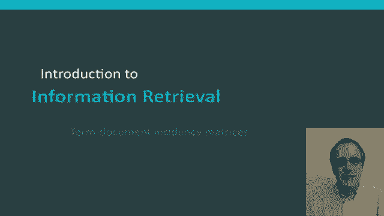
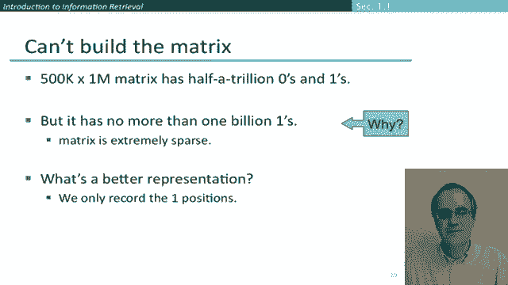
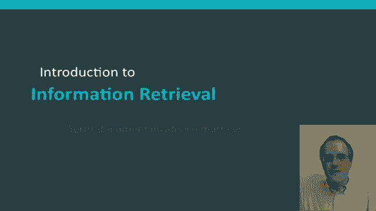

# P34：L6.2- term.文档矩阵构建 - ShowMeAI - BV1YA411w7ym

Hello in this section I'm going to introduce the important idea of a term document matrix。

 but also I'm going to explain why it isn't actually a practical data structure for an information retrieval system。

We take us our example doing information retrieval over the works of William Shakespeare。

 So let's suppose we have this concrete question， which place of Shakespeare contain the words Brutus and Caesar。

 but not Calpernia。😊，Well， if you're starting from a very basic level of text searching commands。

 the first way that you'd think about to solve this problem is by using searching through the text of the documents exhaustively what's known in the Unix world as Grping。

And so we could kind of first of all， gr for plays that contain Brutus and Caesar。

 and then if you know your Gr command well， you can give a flag for files that do not match and you could get out the ones that don't contain Calpernia。

Now， these days for works of the size of William Shakespeare for this kind of query。

 Grapping as a perfectly satisfactory solution。 Our disk strives and computers are sufficiently fast that you could use this method。

 and it takes no time at all to find the answer。 But nevertheless。

 that isn't a good answer for the full information retrieval problem。

 It falls flat in a number of ways。 Once your corpus becomes large。

 And so that means something like everything on your hard disk or even more so the world wide web。

 we can't afford to do a linear scan through all our documents every time we have a query。😊。

Then some parts of it like the not part become less trivial to implement than just finding things。

 but even more so than the not part we'll have more complex queries like finding uses of the word Romans near countrymen。

 and we can't do that with a Gr command。But even more than that。

 the big thing that's happened in information retrieval is the idea of ranking。

 finding the best documents to return for a query。 And that's something that we just can't get out of the linear scan model of finding things that match。

 And we'll talk about all of these issues in the way they're handled in modern information retrieval systems in later lectures。

But let's first go to this idea of a term document matrix。

 so what we do in a term document matrix is that we have the rows of the matrix are our words or often they're also called in information and retrieval。

 the terms， and then the columns of the matrix are our documents。😊。

And what we hit doing here is a very simple thing where're simply saying。

 let's fill in every cell in this Boolean matrix by whether the word appears in the play or do。

 So An appears in Anton and Cleopatra， but Calperia does not appear in Anton and Cleopatra。😊。

So this matrix represents the appearance of words and documents， and if we have this matrix。

 it's straightforward to then answer Boolean queries such as our example before。

 queries for documents that contain Bruus and Caesar but not Calpernia。😊。

Let's just go through concretely how we do that。 So what we're going to do is we're going to take the vectors for the terms in the query。

 and then we're going to put them together with Boolean operations。 So first of all。

 we can take out the row that is referring to Brutus。😊，Which goes up here。Then。

We can take the row for Caesar and end it there。And then finally， we can take the row for Calpernia。

 complement it， and then stick it down here。 So Calpernia only appears in Julius Caesar。

 And so we've complemented it to a vector where everything is one apart from Julius Caesar。

 And at that point， we can just add those three vectors together。 And our answer is。😊，This one of 1。

0，0，1，0，0。 And so we've been able to do information retrieval all successfully and can tell that these。

 this query is satisfied by the documents。 Anthony and Cleopatra and Hamlet。 And indeed。

 we can then go off to the document collection and confirm that that is the case。 So here we are。

 So in An and Cleopatra。 when Anthony found Julius Caesar dead。

 he cried almost a roaring and he wept when at Philippi， he found Bru Slain and similarly。

 we find both words occurring in Hamlet。😊，Okay， so that suggests that we could do information retrieval simply by working with this term document matrix。

 So an important thing to realize is that that doesn't really work once we go to sensible size collections and so let's just go through that for a minute let's go through a sensible size but still small collection So suppose that we have1 million documents and we'll often use n to refer to the number of documents。

 each of which is on average 1 thousand words long。😊，Okay。

 so what does that mean in terms of the size of our？😊，Document collection。

 and in terms of the size of our matrix。So if we have an average of six bytes per word。

 including spaces and punctuation， the amount of data we're talking about here is 6 gigte。

 so that's a teeny fraction of one modern hard disk in your laptop。😊。

But let us then suppose we try and work out how many distinct terms there are in our document collection。

 and we need to know the number of distinct terms because that corresponds to the number of columns now matrix。

 And let's suppose they're about half a million。 That'll be a typical number for a million documents。

 And soll often refer to this number of different terms as M。 Well， what does that mean， Well。

 what it means is that even with that size document collection。

 we can't build this term document matrix。 because it'll have 500000 rows and a million columns。

 And that's half a trillion zeros and ones， it's already huge and probably bigger than we have space to store。

 And as the document collection gets bigger than a million documents。

 things are just going to get worse。But there's this really important observation， which is。

 although the matrix here had half a trillion zeros and ones in it that actually。

Almost all of the entries are 0 that the document has at most 1 billion。

 and it'll be good for you guys to stop and think for a fraction of a second。

 Why is it that they're at most 1 billions。And the answer to that is， well。

 if we have 1 million documents and the average document is 1000 words long， as we said last time。

 then the actual number of word tokens is only 1 billion。

 So even if we assume that every word and every document were different。

 we could only have at most 1 billion one entries。 And most likely we have far less than that because we'll have common words like that of and two occurring many。

 many times in each document。 And so therefore， the key observation is the matrix we're dealing with is very。

 very， very sparse。 And so the central question in the design of information retrieval data structures is taking advantage of that sparsity and coming up with a better data representation。

And the secret of doing that and having an efficient storage mechanism is we want to only record the positions that hold a one and not the positions that hold a0。

Okay so I hope that's given you us an understanding of the term document matrix。

 it's an important conceptual data structure that we keep on coming back to again and again when we talk about various kinds of algorithms we think about them in terms of that matrix as you'll see。

 but when we actually come to doing storage and computer systems。

 we can also see that we never actually want to store documents and their information retrieval representation in that form。

😊。

