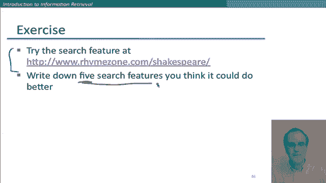
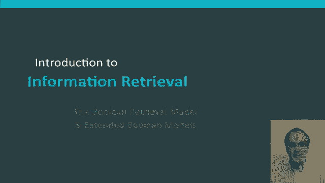

# P37：L6.5- 二值检索模型及拓展 - ShowMeAI - BV1YA411w7ym

In this segment， I want to formally introduce the Bullolean retrieval model and then also mention the kind of extended bullolean models that are conventionally used in commercial bullolean information retrieval systems。

😊。

So bullolean queries are a system for specifying information needs where you're able to get an exact match in terms of satisfying the actual bullolean expression。

 though again， as I commented earlier， that may or may not be actually a good bullolean expression for satisfying the user's information need。

 So when an information retrieval always talk about an information retrieval model。

 that means an underlying mathematical formalism for the information retrieval operation。

 So one example of an information retrieval model is the bullolean retrieval model。 and in it。

 what we say is the underlying mathematical model is the conventional space of bullolean expressions And so youre allowed to ask for a term and then more complex expressions that are then bullolean combinations of term So you can ask for term and term term or term not term term and not term and progressively more complex expressions So in this。

😊，each document is viewed as a set of words， and a document precisely either matches the Boolean expression or doesn't match the Boolean expression。

 Just as we saw in the earlier example with the term document matrix。

 This is perhaps the simplest model to build an I R system on。 and。In some sense。

 is not normally the model that's used in the modern world。

 but it's a perfectly good place to start because the same data structures are used and the extra stuff that we normally now use for things like ranking。

 can be overlain on the same basic foundation。 So let's spend a bit of time just looking at the details of the Boolean retrieval model first。

 And also， I do want to mention that even though these days were used to the ranked retrieval of search engines。

 this is actually in a very important model， both for historical uses and even some current users。

 So Boolean retrieval was the primary commercial retrieval tool for three decades from the early。😊。

Beginnings of information retrieval in the 60s through the 90s。

 although academic research on information retrieval started advocating ranked retrieval models in the 70s and 80s。

 really that hadn't penetrated the the commercial information retrieval world until the web broke loose in the 1990s。

But there are still also many current search systems that are still bullolean retrieval systems。

 So most likely the search system in your email in your school's library catalogue or perhaps in your desktop computer。

 such as the Macs X spotlight， that those are all still bullolean retrieval systems。😊。

Let me show one example of an extended bullolean retrieval model。

 And that' this example is drawn from Westlaw。 So Westl is the largest commercial search service in terms of paying subscribers and is used in the legal profession for looking up case documents and related laws and related things。

 Now， Westlaw has gradually evolved over the years。 It started in 1975。 Raking was added in 1992。

 and they've got a new federated search model from 2010， and it's grown in size。

Is nowve got tens of terabytes of data and large numbers of users。

 But it started off as a Boolean system。 And an interesting thing is that a large percentage of the users still use Boolean queries。

 And I think there's something in that in the law profession that lawyers like the precision of specifying their own。

Bolean queries。 And there's been also then a long tradition Law schools of teaching people the language of the Boolean queries of the West law system。

 So there's a lot of built up user familiarity。 But let's look an example of the kind of  query you get。

 And this is a little bit interesting， because this shows the kind of expert search scenario of something like legal search that you tend to get much longer and more precise queries than you're probably used to from。

Web search。Okay， let's look at an example。 So here we're imagining an information need for Westl。

 what is the statute of limitations and cases involving the Federal Tort Claims Act。

 And this is how it might be translated into a Westl query。 Now。

 the West law extended Boolean query language has some different conventions to what you're probably used to from web search in particular。

 when you have two words next to each other like this with just a space in between them。

 that that means orwe in the West law language， not and。

 But then for the other things that are being joined together。

 what we're seeing is some of the operators in the West law language。

 So as well as having awe and ands， it has a wide range of relational operators。

 which specify that words cooccur within a certain distance。

 So here we have the slash3 within three words， or you can also use structural units such as saying within the same sentence。

😊，AndThen finally， what we have here with this exclamation mark is how it specifies a wild card at the end of the word。

 So this will match limit limited limitations or anything like that。

 And so then the person is specifying that you have to have either statute or action occurring near to limit which is in the same sentence as federal。

 which is occurring close to tot， which is occurring close to claim。

 So it's a detailed precise query trying to match all of the elements of this information need。😊。

Here's one more example， so this time the information need as requirements for disabled people to be able to access a workplace。

😊，And so we see some of the same things， the wild card。 This is within the same paragraph。

Within the same sentence。 And then here again， we're getting this disjunction appearing。

 which is also then being disjoined here。Okay so that should give you a flavour of the rather different kinds of queries that are seen as typical Westlaw queries and as I already remarked。

 many professional searchers really still like this kind of extended Boolean search because they're very precisely able to specify things like how the wild carding works or exactly how close together words have to be and these are facilities that you can't control for yourself in the same way in most typical web search engine query languages On the other hand。

 that doesn't actually mean that searches get better results when using these kind of precise query languages they're actually some interesting user studies done by Westlaws。

😊，Own scientists showing that in many cases， the people's ability to formulate good bulloleing queries is worse than the quality of results that you get by more automated means of ranking results with more web star ranked retrieval engines。

Okay， so now let's get back to the Boin retrieval model in its just pure Boin form。

 And we'll consider how we can do some other kinds of queries， as well as the An query。

 or at any rate， I'll encourage you to think about it。

 So suppose we don't want to ask Brutus and Caesar。

 but maybe we want to ask Brutus and not Caesar or Brutus or not Caesar。

 So in something that would be great for you guys to think about is can we do these kind of queries with a merge algorithm。

😊，Can we merge in time proportional to sum of the length of the postings lists of the two terms。

 or if not， what kind of complexity can we do these operations in。

And if you've gone through those cases， well， then you might consider。

 what if we have an arbitrary bullolean formula like this in those cases。

 can we merge in linear time or not， And again， if so。

 linear and what could we imagine doing better than the merge algorithm to solve these problems that those are be kind of good things for you guys to think through on your own time。

 But let me move now to query optimization， And this is。

 if you have a complex query with various words in it， think again of those West law queries。

 we can try and work out what's the best way of algorithmically going about satisfying that query。

 So consider a query that is an and of end terms。😊。

So what we want to do is somehow or other get each terms postings and then and them together。

 So here we have the postings list for the three terms， and we want to be sticking them together。

 Well， what heuristics should we use to minimize the amount of work that we do， well。

I hope it's fairly straightforward to see that what we should do is start with the term that has the lowest document frequency that occurs in the fewest documents here。

 Calpernia。 because for a pure an query， we know this postings list is the maximal set of results that we could possibly need to return。

 And so what we then have to do is go through the postings list for the other words。

 and then filter out ones that don't also occur in their postings lists。

 So we would next look at the postings list for Brutus。

 and we could chug through it and see that 13 is't on it。 and we've gone rid of this possibility。

 and so 16 is our remaining postings list。 And so then we would move on to the postings list for Caesar and chug through it and find 16。

 And so we're going to return as our answer just 16。😊，嗯。

And so this operation was clearly made more efficient。

 both in terms of time and in terms of the storage space of a postings list in memory by starting with the smallest postings list。

And I hope that also then made clear why it's a really good idea to keep the document frequency of each word together with the word in the dictionary。

 because that lets us do a very quick in memory lookup to work out what's the best query optimization strategy。

😊，Well， suppose now that we have a more general sort of query。 So suppose， for example。

 we're looking at this query， matting or crowd and ignoble or strife。 Well。

 we can certainly now easily get the document frequency for each term。

 But we have to do something a little bit more complex to optimize this query。 Well。

 what we can see is that for each of these pairs of disjoint terms。

 We'll then be unioning to postings list。 So thatll be able to make a list that is list potentially bigger than the postings lists of either of the individual terms。

 So we could estimate the size of these subter by taking the sum of the document frequencies of each disjunct。

 And that will give us a conservative upper bound on how long the resulting postings list could be。

 And then if we then have an and operation occurring between these disjunctions。 we can then。😊。

Use the same heuristic as before。 we can process an increasing order of all sizes。

Here's an exercise you can do just while you're listening to these slides。

 so here's our query where we have a conjunction of three disjuncts and here's just the relevant subset of the dictionary of the terms in their frequency and what you should do is work out which two terms should we processed first。

😊，In general， working through the details of these merge operations is a really good thing for you to think about。

 and so here are a few more examples。😊，So if the query is friends and Romans and not countrymen。

 well， then how do we use the frequency of countrymen in our query optimization method。Well。

 what if we go to even more general things like an arbitrary bullolean query。

 Can we always guarantee execution and time linear in the total posting size。

You might want to think about that and think about in particular this case where a query term appears only once in the query and see if you can work out what kind of bounds you can put on the total time to do emerge。

😊，At a more practical level， you could also just start thinking about。

How search interfaces work and what's useful not to people。

 So here is actually a teeny little search engine that lets you search the works of Shakespeare。

 So a useful exercise would be to just take a look at it。

 Do a few searches things in Shakespeare plays and see if you can think of some things that would be useful if this search engine could do better。

😊。

Okay， so we've introduced the Bull in retrieval model， which is。

The historically most important retrieval model， but also very important basis for understanding how modern retrieval systems work。

