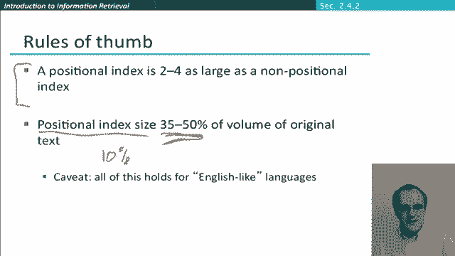

# P38：L6.6- 短语query和位置索引 - ShowMeAI - BV1YA411w7ym

In this segment I'm going to introduce phrase queries。

 which in practice have been the most important kind of extended Boolean query and then examine how you need to extend our inverted index data structure to be able to handle phrase queries。

So very often we'd like to query not only for individual words， but also for multiword units。

 many useful things that we want to query on are multiword units。

 So information retrieval as a multiword unit or many。

 many other things like organization names Stanford University So what we want to do is have a mechanism where we can see say let's match these pair of words as a unit and the syntax that's standardly used in modern web search engines is to put it in inverted quotes like that。

 And so if we have that kind of phrase as a query， then what we're going to say is a document that says I went to university at Stanford doesn't match that phrase query。

 So this notion of putting things in inverted commas has proven to be very easily understood by users。

 something that information and retrieval system designers generally lament is that。😊。

WhenPeople design advanced search functionality for their systems that almost nobody uses it。

 just a few people like me and other academics and people like that。

 but regular users just don't use it。 And really this notion of phrase query is sort of the nearest thing to an exception that it is fairly widely understood than used。

 But I'll point out that as well as overt phrase queries like this。

 There's actually another interesting phenomenon is that many other queries are implicit phrase queries。

 So someone will give us their query， San Francisco or something like that。And well。

 really what they want to do is have it interpreted as a phrase。

 but they just didn't bother or know to put the inverted quotes around it。

 So in modern web search engines and active area of research has been how to identify these implicit phrases and take advantage of knowing it's an implicit phrase to alter what documents get returned。

 But we're going to leave that aside for the moment。

 and we're just going to deal with these explicit phrases and work out how we can do a good job at matching them with our information retrieval system。

Okay， well， first what should be clear is it no longer suffices to store just a term and a postings list of documents for each term。

 because if we have only that we can easily find documents that contain two terms。

 but we have no idea whether the terms are adjacent to each other as a phrase in that document。

 The only way we could do it is by exhaustive postproces of candidate documents to see if they actually did contain the phrase and that would be extremely slow because we'd be back to linear scanning of documents。

One way to solve this problem is the idea of a byword index。 So for a byword index。

 what we do is we index every consecutive pair of terms as a phrase， So for example。

 if we have this text here， friendsend Romans countrymen。

 we generate the byword of adjacent words of friends and Romans。

 and then we generate the byword of Romans countrymen。

 and for each of these byword is now a dictionary term。😊，And so what does that mean。

 well that means that for each of these， we'd say that Fri Romans occurs in。

 let's say this is Do 17 and maybe it also occurs in documents 33 and Romans Countrymen occurs in Do 17 and it might occur in some other document。

Well， if we build that， two word phrase querying is now immediate because if we want to find documents that contain friends Romans in them。

 we can just look up this dictionary entry and then grab the postings list that was returned for it。

😊，If we consider more complex cases。We can even basically handle those。

 so we can handle longer phrase queries by breaking them down。

 So if our phrase query is Stanford University， Palo Alto。

 we can break it up into an an query of Stanford University and。😊，University Pao and Palo Alto。

 And so we can use our byword index to find documents that contain all three of these bigrams。 Now。

 that's not going to be perfect。 without doing a linear scan through the docks。

 We can't be sure that the documents that we're returning actually have this continuous phrase Stanford University Palo Alto。

 but it seems highly likely that they will because we have checked for each of these biograms occurring。

But so there's a small chance of false positives， but it seems like we're in a pretty good state。

So one of the issues with using a byword index。 Well， as we noted before。

 there can be false positives in what's return， but maybe that's not such a big problem。

 The big problem is that there's this enormous blowup of the index because our dictionary has got a much more massive。

 So that means that you know it's not practical to have tri word and quadword indices to actually exactly matchlong queries。

 but even for byword， we've then going to have the sort of potentially have the space of words squared possible dictionary entries。

 So because of that， byword indices are not the standard solution for handling free searching。

 but as I'll show it wasn't useless that I explain them to you because I'll show at the end。

 they can be an important component of a solution。So what is the standard solution The standard solution is to move to having a positional index so the idea of the positional index is that in the postings we install not only the documents that contain a term but also the position in each document where the term appears So the organization of what we have now is in the dictionary we have a term and the document frequency of the term and then when we point off to the postings lists then instead of just having a list of document Is we then have a list of document IDs where for each document we then have a list of positions where the term occurs。

😊，Let's look at that concretely with an example。😊，So here we have the word B which occurs in almost a million documents and then we have where。

 so in document 1， it occurs at word 7， 18，33， etc， document 2 it occurs in these two word positions。

 it doesn't occur in document 3， document 4， it occurs in a bunch of places and so on。

And so with these， we can then be able to check whether phrases occur by then seeing whether words occur adjacent to each other to get the idea of that。

 you could consider this little question here so。😊。

Which of these four documents could contain to be or not to be based on those document positions Now obviously we haven't seen the postings list for the other words。

 but just looking at where B occurs， which document is a candidate。

So with this kind of data structure we can handle phrase queries using a merge algorithm much as we showed before。

 it's just a little bit heavierier because rather than just doing an intersection of the document IDs。

 we have to do this sort of twolel algorithm where we both intersect the document IDs and then also check that there are compatible positions for the words occurring in a phrase and so that means that we need to deal with a bit more than just equality so for example。

 if we're wanting to find instances of the phrase information retrieval。😊。

What we want is that if the word information occurs at position 37 in a certain document。

 you want arieval retrieval appearing at position 38 in the document。

So going through them slightly more detail to process a phrase query， what we do is。

So let's assume our phrase is to be or not to be that we want to find in inverted commas。

So we find we get the postings lists of each of the individual terms and then what we're going to do is we're going to progressively intersect them so if we start off with the2B we're going to start at the beginning doing postings merge and we're saying well document one can't be a candidate because it doesn't appear on the other postings list document 2 can't be a candidate because it doesn't appear on the other postings list and then at this point we've got to document 4 and the Doc IDs match。

 but then at this point with a positional query we have to recur and then do another merge algorithm for the positions within the postings list so we start here and here but this time rather than a quality check what we're wanting to see is can we find a place where B occurs with a token number。

One larger than two。 So we'll again step along and we'll say， well。

 here's one candidate 190 and 191 and here's a second candidate429 and 430 So those will be two candidate matches inside document4 and so we'll be returning both of those candidate matches separately because we're actually finding the positions in documents where our phrase query is matching and that we'll need to refine with the other query words coming up ahead At that point we then revert back oh wait。

 no sorry I'm wrong。 There's one more candidate sorry there are three candidates here right。

But once we've exhausted those the positions in one document。

 we then revert up to the higher level of our postings merge and then we say five is less than seven。

 so this gets crossed off and then we advance that pointer and proceed along。😊。

And I hope you can see that actually this method works not only for freeze queries where the words are offset by one。

 but you can actually use exactly the same method for the proximity queries that we saw earlier with the Westl service where you could ask for one word being within three words of another word or something like that。

😊，Right so that was the examples like this。 So here we had limit within three words of statute。

 which is within three words of federal within two words of taughtt。

 so we could use the same kind of techniques of optimizing the query。

 but if we started with this one， were then having a condition on how close together the token position indices have to be to count as a match within a document。

 and so clearly positional indices can be used for these kind of proximity queries where byword indices do nothing for you。

So I've sort of said the algorithm here， but it's something that you might want to work through very concretely is how you can change the linear postings merge algorithms to handle proximity queries in particular you can think about how to get it to work for any value of K It's actually a little bit tricky to do this correctly and efficiently because you can have the Win thin Kword matching on either side of the word and you have to keep track of things for the right number of words on each side if it would be good to try and work out by yourself but you can also see one example of an answer in the figure 212 of our introduction to information retrieval book which you can find free on the web to look at。

😊，So a positional index is great because it allows us to answer phrase queries and proximity queries。

 but there's a cost to a positional index， which is that our postings list just got a lot larger because rather than only storing document IDs。

 they're storing document IDs and the offsets of tokens within the document and that's a major factor even though indices can be compressed。

😊，Nevertheless， it's now completely standard to use a positional index because of the power and flexibility you can get from handling phrase and proximity queries。

 whether they're being used explicitly in terms of having these kind of phrase queries or within three queries。

 or whether they're just being exploited to improve the ranking of a system when it's looking for implicit phrases。

😊，But as I said， the positional index gets much larger。 And so when we're estimating。

The size of a positional index。 We note that there has to be an entry for each occurrence of a word。

 not just once a document。 So what that means is that the size of the index depends on the average length of the documents now。

 So if we have fairly short documents， it's not such a big deal because actually most of the words that occur in a document occur only once or twice。

 But if we have very long documents， then that blows out the size of positional index rather more。

 So， for example， you can consider a word with a common word with frequency 0。1%。

 So this word occurs one word in 1000 on average。 And so while if you have a document size of average length 1000。

 then we're going again no blowout really from going to a positional index because there'll only be one position being recorded。

 But if we have a document。The documents that are really long。

 then we might gigging 10 times blowout in the size of the positional index。

So everything that depends， but you know just to give you some very rough rules of thumb for you know what is in some sense。

 typical documents like web pages that you might expect a positional index to be somewhere around two to four times as large as a non positional index and in particular the size of a positional index remains smaller than but starts to approach the volume of the size of the original text so heading to sort of a third or half the original size of the text that's being indexed。

 which is much larger than in the case of a non positional index where it might be down to something like just 10% so having an IR system doesn't actually take a lot more space than storing the text in the first place。

😊。

I mentioned when I mentioned byword indices that they aren't a useless idea。

 even though they're not normally the solution by themselves。 And so let me just come back to that。

 These two approaches can be very profitably combined。

 So if you look at the query stream of high query volume services like web search engines。

 they tend to be some queries that keep on turning up again and again and again。

 So things like person names of popular people。 Well， if we just treat those as， you know。

 just regular postings list intersection or the positional phrase query， posting list intersection。

 what we'd have to do is keep on doing this intersection over and over again every time that someone sends that question。

 And it's bad for cases like Michael Jackson， it's less bad。

When you've got rare names like Britney Spears because presumably their posting lists are much shorter and the intersection is roughly the same as each individual postings list in doing this intersection every time is especially bad when you have common words like if you're searching for the band the who that what's going to happen is you're going to retrieve two enormous postings lists do the intersection of them and end up with a very short postings list for this phrase query。

So in a paper from a group in Melbourne that's a well-known information retrieval group in 2004。

 they investigated a more sophisticated mixed indexing system so in this what happened was that for common phrases you know like these examples they did build by words and index the by words where for rarer phrases they were done by a positional index and so what they were able to show was with a typical web query mixture you could executed in one quarter of the time the positional index alone by making use of also having index some byword。

 but at the cost of only taking 26% more space than having the positional index alone so that makes that it look a fairly appealing tradeoff to augment a positional index with common bygrams and well one model of doing。

😊，I to do it as here where you work out in advance the common byograms and then index those in your standard inverted index in practice what happens a lot in modern systems is that people try to do this a bit more dynamically so that they keep achehe of commonly being queried freeze queries and what the result of the postings list intersection is for each of those and so that's like having added those bywords to the inverted index but done a bit more dynamically。

Okay， so that's introduced what's the most useful extension to the classic Bull in retrieval model。

 which is having support for freeze queries and we introduced a method for handling lows or two methods in particular we looked at position indices which can handle freeze queries but also the proximity queries that we saw earlier。

😊。

