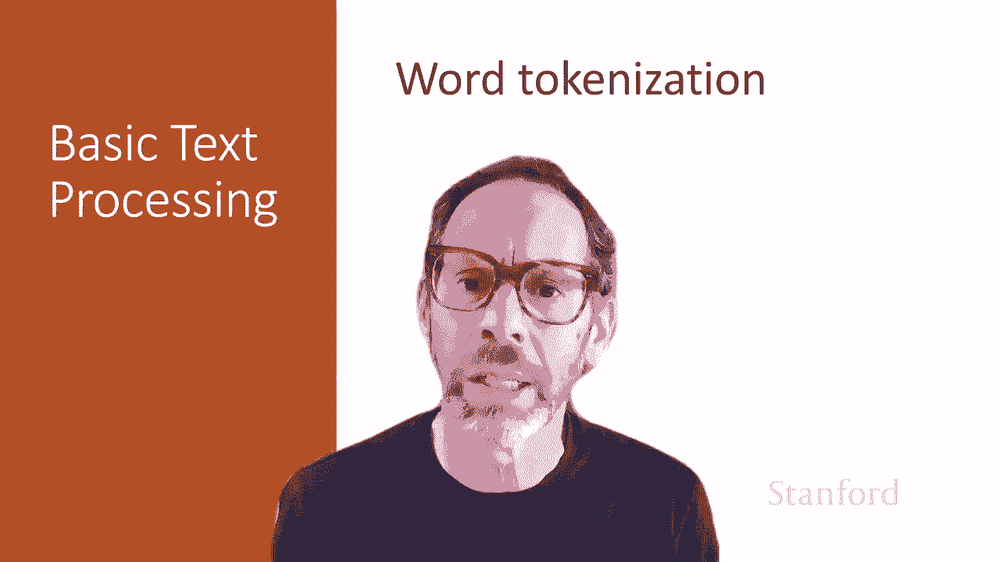
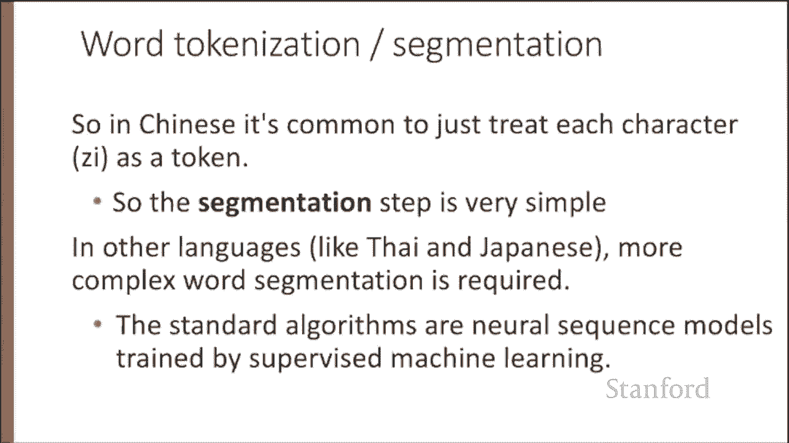
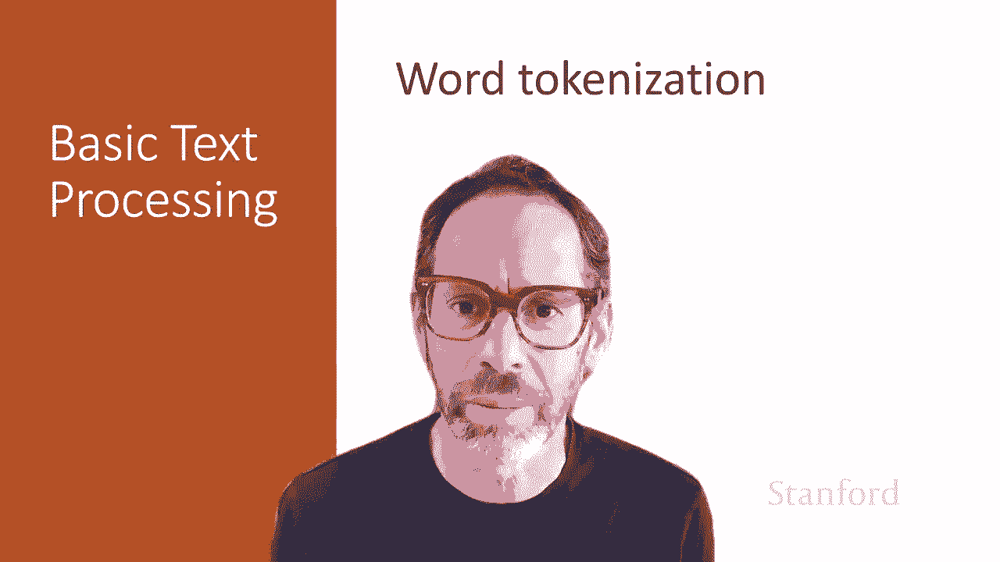

# P4：L1.4- 分词与预处理 - ShowMeAI - BV1YA411w7ym

In the next few lectures， we'll introduce text normalization。

 the process of turning a text into a standard formatting of words or sentences。

 And we'll start by thinking about word tokenization。

 breaking up a text into tokens that represent individual words or parts of words。

 Every anlopyask requires text normalization。 And we normally think about at least three processes involved in normalization。

 One is tokenizing or segmenting out the words。 And then once we've tokenize these words。

 we want to normalize them into a format。 So we have a standard format for our text。

 And we're also going to have to segment larger chunks， sentences or sometimes even paragraphs。 Now。

 the simplest way to tokenize is just to use the space between characters。

 and that works well for languages that have space characters。

 So languages that use the Latin writing system or Arabic or Cyyrilllic or Greek。

 This is a very useful way to break off a word a word as a thing in between spaces。

 So let's introduce some simple euchx tools。

For text processing and starting with the Unix TR command。

 which is useful for space based word tokenization。

 And our goal here is to take a text file and output word tokens and their frequencies。

We're going to introduce some standard Uni tools that are used for text processing。

So I have here a corpus of Shakespeare。Shakespeare's complete works。

You can see here's the sonnets and it goes on through all the plays。

 so let's start by extracting all the words in the corpus。

So we're going to do this using the TR program。Alright， so the TR program takes。Character。

 and it maps every instance of that character into another character。 And we specify T R dash C。

 which means compliment。 So it means take every character that's not one of these characters and turn it into this character。

 So in this case， it's take every non alphaphabettic character and turn it into a carriage return。

 So we're going to replace all the periods and commas and spaces in Shakespeare with new line。

 So we're going create one line， one word per line in this way。 So let's look at that。😊。

So there's we've now turned this onnet to one word per line。And now。We're going to sort those。Words。

So let us look at the unique word types。So let's do that。And you can see here's all the A's。

 there's a lot of them， A occurs a lot in Shakespeare。

And thats this is a very boring way to look through all of Shakespeare。

 We don't want to do this So let's。Instead。Use the program unique。And the program unique will。

Take that sorted file and tell us for each unique type， the count of times that it occurs。

 So let's try that。 So here we have all the words in Shakespeare with a count along the left。

 This is the product of the unique program。And we can walk through。So we know that in Shakespeare。

 the word achievement with a capital A occurs once， the word Achilles appears 79 times。

 the word a quaint six times and so on。So that's interesting， but。

It would be nice if we didn't have to just look at these words in alphabetical order。

 but if we could look at them in frequency order， so let's take this same list of words and now re it by frequency。

So now we have。The most frequent word in Shakespeare is the word the followed by the word I followed by the word and and we have the actual accounts in Shakespeare so that here is our lexicon of Shakespeare sorted in frequency order。

 Here' are some problems。 One is that the word and occurs twice because we didn't map our uppercase words to lowercase words。

 So let's let's fix the mapping of case first let's try that again we're going to map all of the。

Uppercase letters。To lowercase letters。In Shakespeare。And we're going to pipe that。

To another instance of the TR program。Wwhich replaces all of the non alphabetics with new lines and now we're going to do our sorting as we did before。

 we're going to use unique to find all the individual types。

 unique dash she tells us the actual count， and then we're going to sort again。

 means numerically and our means start from the highest one。And then we'll look at those。

 So let's do that。All right， so now we've solved the problem of the and。

 so now we only have lowercase and we don't have our uppercase and appearing。

 but we have another problem。We have this D here， Y is the word D or the word S？

Why are they so frequent in Shakespeare？

Of course， tokenization in most real situations isn't as simple as I've suggested with the simple Unix tools。

 So one problem is you can't just blindly remove punctuation because you have words in which the punctuation is part of the word Ph D or A and T。

 There are lots of classes of these punctuation tokenization interactions。

 So prices have dollar signs or periods or eurosybols and dates might have slashes or dashes and。

 of course， Us in hashtags and email addresses all have punctuations who have to deal with that in a special way。

 Another problem is critics。 a cl is a word that doesn't stand on its own。

 So the word R in in the English word weir is shortened and of attached to the word we or in French the words or the word tend to attach to their neighboring words。

 And these clinics， we have to decide whether those are separate words we want to pull them off or not。

 And this question about what counts as a word applies for multiword expressions， words。

Like New York， should that be one word or two words， rock and roll， one word or three？

So most standard tokenization programs for English or languages with similar writing systems deal with each of these issues。

 So here's， for example， a simple Python tokenizer in the natural language toolkit that has little regular expressions for dealing with hyphens and abbreviations and currency and what not。

 But what about all the languages that don't have spaces between words。 Many languages， Chinese。

 Japanese tie or among them， don't use spaces to separate words。

 How do we decide where token boundaries should be in these languages。So let's， for example。

 look at word tokenization in Chinese。 Chinese words are composed of characters called Hanza。

 or sometimes just。And each of these characters represents a meaning unit called a morphine。

 We'll talk about morphemmes later。 Every word has about two and a half characters on average。

 but deciding what counts as a word is complex in Chinese and not agreed upon。

 So imagine the following Chinese sentence， meaning that Yao Ming reaches the finals。

Yao Ming Jin Ru Dong Jsai。 Now， is that three words。 Yao Ming reaches the finals。

 Maybe that should be five words。 Maybe we separate Yaom Ming's first and last names。

 and maybe will finals really has got two parts。 the overall part and the rest of finals。

 Or we could just separate it into characters altogether。 And now the two parts of the word reach。

 which are both verbs themselves become separate words。 So we just， everything becomes a character。

 So， in fact， this last solution is very common。 It's very common in Chinese to just treat characters as tokens。

 And then segmentation becomes very simple。But in other languages like Thai and Japanese。

 more complex word segmentation is required。 And here。

 the standard algorithms are neural sequence models trained by supervised machine learning。

 things that we'll talk about later on in the course。

 Word tokenization is an important step in text normalization。 Here we introduce two baseline method。

 space based tokenization and character based tokenization。

 and we'll turn to more advanced methods and future lectures。

