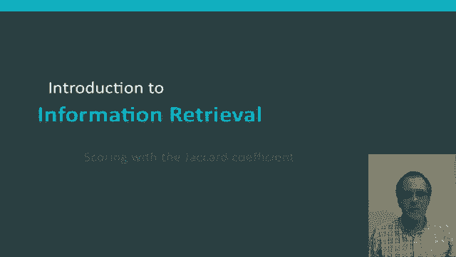
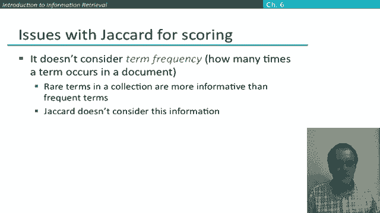

# P40：L7.2- 基于Jaccard相关系数的打分 - ShowMeAI - BV1YA411w7ym

As a first simple example of the ranked retrieval model。

 let's consider scoring with the Jaard coefficient。😊。

So the Jacard coefficient is a commonly used measure for the overlap between two sets A and B。

 and what it is is simply you take the number of items in the intersection of A and B and you divide it by the number of items in the union of A and B。

😊，And so if we take the Jaard coefficient of a set with itself。

 then the set has some size and then that size will be also the size of the intersection in the union and so the ratio be1 and the Jaard coefficient is one。

😊，If two sets are disjoint and have no members in common。

 then the numerator of the Jaard coefficient will be zero and so the Jaard coefficient is zero。

Now the two sets don't have to be the same size， but you should be able to see that the Jaard coefficient will always assign a number between zero and1 because at most the intersection can be as large as the union。

So suppose we decided to make the query document match score the Jaard coefficient computed for the sets of words that the two documents contain so the idea is that let's suppose our query is Is of March which has these three words and then we have these two documents so what we can do is say so there are three different words here。

And then for document 1， Caesar doesn't occur in it。 die doesn't occur in it。 in doesn't occur in it。

 March does occur in it。 So the size of the intersection。Is just one word。

 and the total number of words is 6。If we then do the second document， well。

 that doesn't occur in the query， long doesn't occur in the query。

 but again March does occur in the query。 so this time the ja card coefficient of D1。Comedy 2。

Is going to be one divided by the number of words， which。Is this time5。 Okay。

 and so this document is going to win as having the higher Jaard score。 Now， of course， that。

Difference may not seem very significant。Essentially。

 this document is winning here just because it's shorter。 but if we imagined。

A different example where we maybe had the wordIs in the second document then we'd get that the Jaard coefficient fored is now two overlapping words over six。

 and that maybe makes more sense to you that you're getting more overlap so the Jaard score is higher。

 but this idea that all else being equal a shorter document should be preferred is a common one that we'll see again in IR models。

Okay， so is Jaard scoring a good idea for retrieval model in general it's not felt to be it has a couple of issues。

 one is that it doesn't consider term frequency， it just uses the set of words in a document。

 ignores how many times the words occur in a document。

But that's typically not all the information we want。🤢。

And we'll look at models in a minute that do deal with term frequency。

 There's also a second finer point which is that rare terms in a collection are more informative and frequent terms when evaluating a query。

 and that's something that we'll also want to factor into our models。😊。

There's one other aspect in which the Jaard coefficient turns out not to work very well。

 And that is the way in which it does normalization by dividing through by the union isn't necessarily quite right。

 I mean， in particular， later on in these segments， we'll introduce the idea。

Of using cosine similarity。And we'll go through the math of that for the more general case。

 But if after you've seen that， you want to kind of come back to this and work out what the cosine similarity score is。

 if you just have a 1，0。Bag of words and work out a cosine score， it'll turn out that it this。

 which is like the Jaard coefficient except that we've got this slight difference in the denominator that we're now taking the square root of the union。

 and that actually turns out to be a better form of length normalization。😊，Okay，😊。

I introduced the Jaard coefficient just as a very simple example of a ranked retrieval model。

 but I hope it was also a way to show some of the issues that we need to deal with in a good retrieval model。

 how to factor in the frequency of terms， the rareness of words。

 and how to normalize the score for different document lengths。😊。

