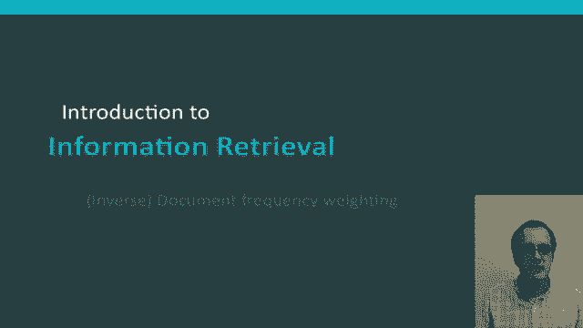
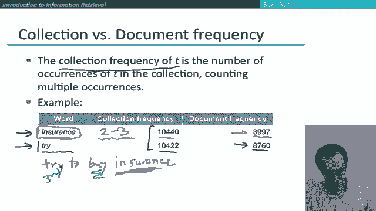
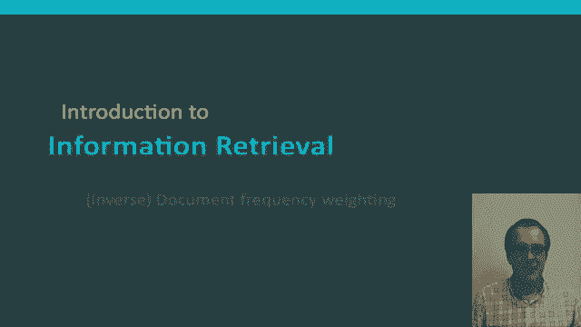

# P42：L7.4- 逆文本频率权重 - ShowMeAI - BV1YA411w7ym

In this segment I'm going to introduce another score that's used for ranking the matches of documents to a query and that is to make use of this notion of document frequency in particular we always use in reverse so it's normally referred to as inverse document frequency weighting。

The idea behind making use of document frequency is that rare terms are more informative than frequent terms So if you remember earlier on we talked about stop words which was you know words like the and to and of。

😊，And so the idea that was that these words were so common。

 so semantically empty that we didn't have to include them in our information retrieval system at all。

 they had no effect on how good a match a document was to a query Well， that's maybe not quite true。

 but there's some truth in it in particular it seems like in general。

 very common words aren't very determinative of the matching of a document and a query。

 whereas rare words are more important。😊，So consider a term in the query that is very rare in the collection。

 perhaps something like a rechnocentric Well if someone had type that word into their query and we can find a document that contains the word aracchnocentric。

 it's very likely to be a document that the user would be interested in seeing so we want to give a high weight in our match score for rare terms like aracchnocentric。

😊，On the other hand， frequent terms are less informative than rare terms。

 So consider a term that is frequent in the collection like high increased line。

 which might occur in lots of documents。 Well， a document containing such a term is more likely to be relevant than a document that doesn't if the query contained one of those terms。

 that is not such a sure indicator of relevance。 So if frequent terms。

 we want to give positive weights for a document matching a term in the query。

 but lower weights than for rare terms。😊，And so the way we're going to go about doing that is by making use of this notion of document frequency scores。

So what exactly is that？Well。The document frequency of a term is the number of documents that contain the term so what this means is that we're looking at the entire collection。

 so maybe the collection is a million documents and if10 documents have this word we're saying that the document frequency is 10 so that's just counting the number of documents that occurs regardless of the number of times that occurs that's something I'll come back to。

So document frequency is an inverse measure of informativeness of the term and we also note that the document frequency has to be of a term has to be smaller than the number of documents in the collection So putting that together this gives us the measure of inverse document frequency where we start with the document frequency and use it as the denominator and the numerator N here is the number of documents。

 so for a word that appears in just one document this part will be n and for a word that appears in every document its value will be1。

😊，So it's some value between one and n。 and so then what we do after that is we take the log of it。

And the log is used to dampen the effective inverse document frequency。

 the idea again is that if you just use the absolute score， that would be too strong a factor。😊。

Now in this computation， as you can see I've used log to the basease 10 and that's very commonly used。

 but actually it turns out that what we use as the base of the log isn't really important。😊，Okay。

 let's go through a concrete example where again we're going to suppose that the size of our document collection is 1 million documents。

😊，So if we take an extremely rare word like Caluria， which let's say occurs in just one document。

 well then what we're going to be doing is we're going to be taking one million the number of documents。

Divided by one and then taking the log of that which means with log to the base 10 that there'll be six if we take a somewhat more common document word that occurs in maybe 100 documents then we're going to get the the inverse document frequency of that is four and so then we can work on down for progressively more common words and the inverse document frequency or countdown and in particular for the final case we assume the word that occurred in every one of our documents well then we've got。

A million。Divided by a million。Which is one。 and if we take the log of that。

 which we get the answer zero。So the result we actually get is that a word that occurs in every document does have a weight of zero according to an IDF score and has no effect on the ordering of words and retrieval and that makes sense because if it occurs in every document。

 it has no discriminatory value between documents and gets a weight of zero and so what you can see with these numbers overall though。

 is that this inverse document frequency weighting will give a small multiplier that pay more attention to words that are rarer words rather than very common words。

😊，Another thing to note here is that IDF values aren't things that change for each query。

 that there's precisely one IDF value for each term in the collection。

 and that's going to be the same regardless of what query you're issuing of the collection。😊，Okay。

 here's a。Now yes， no question for you guys。 Does the IDF have an effect on ranking for one term queries like this one？

The answer is， no， it doesn't。 IF has no effect on one term queries。 So for a one term query。

 you're going to have one of these terms of in over the document frequency。

 and it will be worked out， but it's going to be just a scaling factor。

Which since there's only one IF value for each。Term will be applied to every document and therefore it won't affect the ranking in any way。

You only get an effect from IDF when you have multiple terms in a query， so for example。

 if we have the query capricious person， well now we're in a situation where capricious is a much rarer word and so IDF will sayPa much more attention to documents that contain the word capricious than to documents that contain just the word person in ranking your retrieval results。

There's another measure that reflects the frequency of a term and indeed you might have been wondering why we're not using it and that other measure is what information retrieval people refer to as the collection frequency of a term so the collection frequency of a term it's just the total number of times that appears in the collection counting multiple occurrences so that's the measure that we've been using in other places it's the measure we' are using to build ungram language models or when we're working out spam classifiers or something like that but it's not what's usually used in information retrieval ranking systems and this next example can maybe help explain why。

😊，So here we have two words insurance and try and I pick those two words because they have virtually identical collection frequency overall they both occur somewhat more than 10。

000 times in the collection but let's then look at their document frequency so the wordtry occurs in 8。

700 odd documents and that stands in contrast to insurance which occurs in slightly under 4000 documents and so what does that mean what that means is that when try occurs in a document it tends to occur only once but the try is widely distributed across documents on the other hand。

 when insurance occurs in a document it tends to occur several times it tends to occur two to three times and so what does that reflect it reflects the fact that they tend to be documents about insurance which Sha mentioned insurance several times。

😊，Where there don't really tend to be documents about trying。😊。

And so what does that mean in terms of coming up with a score for retrieval systems with words matching。

 What it seems to suggest is that what we should be doing is giving higher weighting to instances of the word insurance appearing。

 So if we had some kind of imagine some kind of query， like try to buy。Insurance。

The most important word to make sure we're finding in。

Our documents to match the query is insurance and probably the second most important word it is by and try should be becoming in third place。

Before then near stop word of2。And so that's an idea that is being correctly captured by looking at the document frequency。

 but as you can see it's not captured by the collection frequency， which would score。

 try and insurance equally。😊，Okay， so I hope now you know what document frequency weighting is and why people usually use that as a retrieval ranking score rather than collection frequency。

😊。

