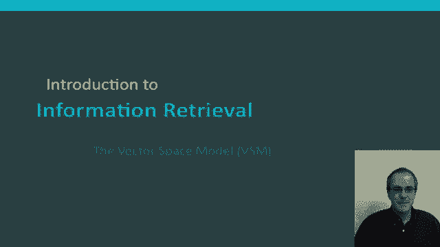
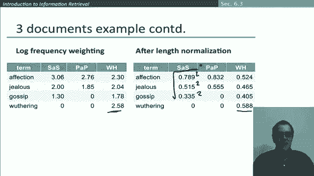

# P44：L7.6- 向量空间模型 - ShowMeAI - BV1YA411w7ym

Hi again， okay， we've already laid some of the groundwork with notions like term frequency and inverse document frequency。

 and in this segment， what I want to introduce is probably the retrieval model of the vector space model which is one of the most commonly used models of information retrieval and real systems。

😊。

So we saw in the previous segment how we turned documents into real valued vectors。

 and so we now have a v dimensional vector space where V is the number of words in our vocabulary。😊。

The terms， the words are the axes of the space and documents you can think of as either just points in this space or vectors from the origin pointing out to those points。

 so we now have a very high dimensional space， tens of millions of dimensions in a real system when you apply this such as in a web search engine。

😊，A crucial property of these vectors is that they're very sparse vectors。

 most of the entries are zero because each individual document only typically has a few hundred or thousand words in it。

😊，So then if we have this vector space of documents。

 how do we handle querying it when a query comes in and the key idea there is that we treat queries in exactly the same way。

 there are also going to be vectors in the same space and then if we do that we can rank documents according to their proximity to the query in this space。

😊，So proximity corresponds the similarity of vectors and therefore it's roughly the reverse of distance。

😊，And we're doing this because we want to get away from the you either in or out Boolean model and have a relative score as to how well a document matches a query。

 we go to rank more relevant documents higher than less relevant documents。😊。

Let's try and make that all a bit more precise。So how can we formalise proximity in a vector space。

 The first attempt is just to take the distance between two points that is the distance between the endpoints of their vectors and the standard way to do that in a vector space would be Euclidean distance between the points。

 but it turns out Euclidean distance by itself isn't actually a good idea。

 and that's because Euclidean distance is large for vectors of different lengths。

 Let me explain what I mean by that。Let's suppose。😊，Here is our vector space。 Well。

 what we're finding is。The distance between here and here is large。 in particular。

 it's larger than either the distance here or the distance there。

But if we actually think of this in terms of an information retrieval problem and look at what's in our space that seems wrong。

 So in this teeny example， the two word axes shown here for gossip and here for jealous and what our query is this is the query that had come out precisely if your query is gossip and jealous。

 So it has both of those words occurring with equal weight Well。

 if we then look at our documents what we find is document1 seems to have a lot to do with gossiping and nothing to do with jealousy and document 3 has a lot to do with jealousy and nothing to do with gossiping whereas document 2 seems just the kind of document we want to get one that has a lot to do with both gossiping and jealousy。

 So the terms in the document D2 are very similar to the ones in Q。😊。

So we want to be saying that that is actually the most similar document。

And so this suggests a way to solve this problem and move forward and that is rather than just talking about distance。

 what we want to start looking at is the angle in the vector space。😊。

So the idea is we can use angle instead of distance so let's in particular motivate that once more by considering this thought experiment。

 suppose that we take a document and append it to itself giving us a document D prime so clearly semantically D and D prime have the same content they cover the same information but if we're just working in a regular vector space with Euclidean distance the distance between the two documents will be quite large and that's because if we had a vector and we had this was the vector for D。

😊，And the vector for D prime would be twice as long pointing out here。

 and so that we have a quite large distance between these two vectors。 So we don't want to do that。

 Instead， what we want to notice is that these two vectors are in a line。

 So the angle between the two vectors is zero corresponding to maximal similarity。

 And so the idea is we're going to rank documents according to that angle between the document and the query。

so the following two notions are equivalent ranking documents in decreasing order of the angle between the query in the document and ranking documents in increasing order of the cosine of the angle between the query and the document and so I'll go through then in a little bit more detail but you'll often hear the phrase cosine similarity and this is what we're introducing here and the secret here is just to notice that cosine is a monotonically decreasing function for angles between the interval0 and 180 degrees so here's the cosine which you should remember sort of the angle is0 the cosine of it as one if it's perpendicular 90 degrees the cosine is0 and it can keep on going right up to 180 degrees and the cosine is to descend to minus1 so essentially all we need to observe here is。

😊，cosine is a monotonically decreasing function in the range of 0 to 180 and so therefore cosine score serves as a kind of inverse of angle and well that might still make it seem a reason rather strange thing to use I mean we could have just taken the reciprocal of the angle or the negative of the angle and that would have also turned things around so we' got a measure of closeness between documents as a similarity measure but it turns out that the cosine。

😊，Measure is actually standard because there's actually a very efficient way to evaluate the cosine of the angle between documents using vector arithmetic where we don't actually use any transcendental functions like cosine that would take a long time to compute。

😊，So the starting point of going through this is getting an idea of the length of a vector and how to normalize the length of a vector so for any vector so if we have a vector x。

😊，We can work out the length of the vector by summing up each of its components squared and then taking the square root around the outside so that if we have something like a vector that's 3。

4 what we're going to do is take 3 squared9，4 squared 16 and then take the。😊，Add those， gives 25。

 take the square root， gives five， and that's the length of the vector just like in the standard Pythagularian triangle。

😊，Okay， so if we then take any vector and divide it by its length， we then get a unit length vector。

 which you can think of as a vector that touches the surface of a unit hypersphere around the origin。

😊，Now if we go back to the example that we had earlier of two documents。

 D and D appended it to itself to give D prime， you can see that these documents。

 if they're both length normalized， will go back to exactly the same position and because of that。

 once you length normal vectors， long and short documents have comparable weights。

So the secret of our cosine measure is that we do this length normalization。

 so here's the cosine similarity between two documents。

 which is the cosine of the angle between the two documents and the way we do that is in the numerator we calculate here a dot product so we're taking the individual component of the vector here component by component and multiplying them and taking their sum and then。

😊，The way we do that is that we've then got this denominator。

 which is considering the lengths of the vectors。 and you can write it like this。

 But actually what it's equivalent to is。Taking each vector and length normalizing it。

And then taking the dot product of the whole thing because it's these sort of two parts you can factor apart as you wish and sos written out in full。

 it's over here that we have the length normalizations on the bottom and then this summed up dot product on the top。

Okay， where each of these elements， QI is a TFIDF weight of term I in the query and DI is the TFIDF weight of the term in the document。

😊，In particular what we might want to do is actually length normalize our document vectors in advance and length normalize our cosine length normalize our query vector once the query comes in and if we do that this cosine similarity measure is simply the dot product of length normalized vectors and so we're simply just。

😊，Taking this sum here in the vector space where as we discussed before， in reality。

 we won't do it over all elements of the vector， we'll just do it over terms the terms in the vocabulary are the intersection of ones that appear in Q and the document。

So going back to the kind of picture we had before， we now again have our vector space， which again。

 we're showing with just two axes here to keep it viewable。

 which are now poor and rich and we can take any。😊。

Document vector and we can map it down to unit length。

By doing this length normalization and when we do that we get all document vectors being vectors that touch the surface of this unit hypersphere。

 which is just a circle in two dimensions。 and so then when we want to order documents by similarity to a query。

 we take this query here and we're working out the angle or the cosine of the angle to other，😊。

To other documents so in particular the cosine will be highest for small angles。

 so be if we order these documents in terms of the cosine of the angle。

 the document they will rank first will be D2， then itll be D1 and then it'll be D3。

Okay let's now go through this concretely with an example so in this example what we have is three novels of Jane Austen's and we're going to represent them in the vector space length and normalized and then we're going to work out the cosine similarity between the different novels So in other words in this example there isn't actually a query vector we're just working out the similarity between the different novels that are our documents So the starting off point is starting with these term frequency count vectors for the different novels and so what we can see is affection is one of Jane Austen's favorite words that appears frequently every novel the wordwaing only occurs in weathering heights and then other words like jealous and gossip occur occasionally and so this is going to be our vocabulary for this example that I give and what we're going to want to do is take these term frequency vectors。

😊，And turn them into length normalized vectors on the unit hesphere Now for this example。

 I'm just going to use term frequency weighting and we're going to leave out IDF waitinging to keep it a bit simpler。

😊，Let's see what happens on the next slide。Okay so here we've done log frequency weighting of the kind we saw before so what were the zeros say zero and then we are having mapping down so getting a weighting of three for the number of times that affection appeared in sense and sensibility but these vectors aren't yet of the same length this is clearly the longest of the vectors So the next step is to length normalizedize them so now here are the length normalized vectors for the three documents and you can see how this vector has gone much shorter than it was here by scaling it down and the property that we have for each of these vectors for they're being length normalized is that if you took this quantity squared plus this quantity squared plus this quantity squared you would get one and therefore the square root of that sum would also be one so their length one vectors So given that that length one。

😊，VWe can then calculate cosine similarities as simply the dot product between the vectors。

 and let's see what happens when we do that。

Okay， so then we have the cosine similarity between sense and sensibility and pride and prejudice is taking these pairwise products and summing them together。

And it gives us a cosine similarity of 0。94 so they're very similar and then we can do it for the other cases and what we see that the sense and sensibility and watering heights it's 0。

79 and for the final pair is too at 0。69 and the thing that we might wonder is why do we have that the cosine similarity。

Of sense and sensibility and pride and prejudice is higher than that for sense and sensibility and watering heights。

 And so we can try and look at that。 So we're going to be comparing this one with the other two。

 And what we can see is that。This part of the weathering heights vector doesn't help at all in producing similarity with sense and sensibility the biggest component in the sense and sensibility vector is this one and so that generates a lot of similarity with pride and prejudice which also has that word very promptly represented where that word is less represented in weathering heights and so therefore this dot product here that this term in the dot product is much larger and so we get greater similarity and so you can see there that it's sort of the ratio of a occurrence of different words than the document has a big effect on measuring overall similarity。

😊，Okay， I hope that example helped to make it more specific and that you now have a good idea of what the vector space model and information retrieval is。

 it's the idea that we can rank documents for retrieval based on their similarity of angles in a high dimensional vector space。

😊。

