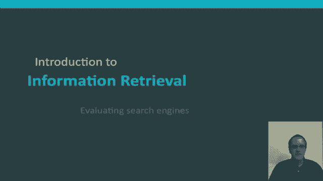
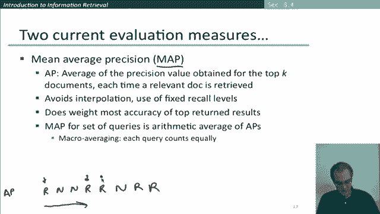
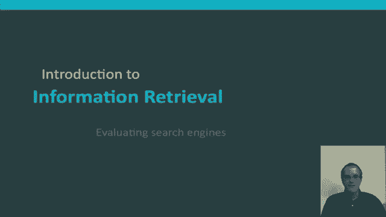

# P46：L7.8- 搜索引擎评估 - ShowMeAI - BV1YA411w7ym

In this section， I'll tell you a little bit more about evaluating the quality of a search engine。😊。

There are many measures for the quality of a search engine。

 there are technical ones such as how fast does it index and how fast does it search。

 we can look at things like the expressiveness of the query language whether they're able to express complex informational needs with things like phrase queries nes。

 disjunctions。😊，People have other desires like having an uncluttered UI and a system that doesn't cost a lot to use。

 All of these are measures that are measurable， that we can quantify them and we can get some kind of score of what is their goodness。

 but in practice。All of those measures while important。

 tend to be dominated by another measure of user happiness that is the user happy in using this search engine and speed of response and size of the index is certainly factors but by themselves blindingly fast useless answers won't make a user happy。

 so a huge part of user happiness is are the results return results that they want and so that's the metric of relevance of results to a user's information need。

😊，I mentioned this right at the beginning， but just to reiterate once more when evaluating the IR system that we evaluate with respect to an information need。

 so an information need is translated into a query and that's what the IR system actually runs。

 but relevance is assessed relative to the information need not the query so for example if the information need is the person is looking for information on whether drinking red wine is more effective than white wine。

😊，For reducing your risk of heart attacks， they'll come up with some query， for example。

 it might be wide red， white heart attack effective and that'll be submitted to a search engine and in evaluating the effectiveness of the search engine and returning relevant results。

 we're not asking are the results that the search engine returns。

 documents that simply have those words on the page。

 rather we're saying do these documents address the user' information need。😊，Okay， well。

 how can we go about doing that？ Well， if the search engine returns a set of results， Well。

 then what we can do for evaluation is if we start off with three things， if we have some。

Benchmark collection of documents that we can use for evaluation and we have some benchmark set of queries which are in some sense representative of information needs of interest and then we've gathered this third thing which is assessor judgments of whether particular documents are relevant to particular queries commonly in practice this can't be assembled exhaustively。

 certainly not if the document collection is large。

 but at least for a particular set of documents that are returned by particular search engines we can get the assessor to judge whether those documents are relevant to the queries Well。

 if we have a results set with just these three things were're in business because we can use exactly the same。

😊，Measures that we looked at previously precision recall and the F measure that combines them。

 and these are suitable good measures for exactly the same reason that there are good measures for when we're talking about things like named entity recognition that normally only a few documents will be relevant to a particular query and so we can measure that much better by looking at these measures of precision and recall。

😊，But what if we've now moved on to a search engine that returns ranked results。

 we can't just totally straightforwardly use these measures of precision recall and F measure because the system can return any number of results。

 in fact the number it returns， normally depends on how often we keep on clicking asking for more。

 but if we sort of look at any initial subset of the results。

 we can then work out the precision and recall for that subset and then by putting them together we can come up with a precision recall curve。

 let's look at how that works。😊，So here are the first 10 results for a search engine where we've labeled each result is either relevant or not relevant according to an assessor's judgment and so then we can take any initial sub sequenceequence of these documents and work out a recall and precision so for the first document the system got it right it's a relevant document and let's assume that overall there are 10 relevant documents in the collection so it's gotten one out of the 10 relevant documents and so it' recall is 0。

1。And well， since that document was relevant， the system was right on the first answer。

 its precision is one at this point。 Well， the next document was not relevant。

 so the recall of the first two documents we're down to here now is 0。1 and the precision is now 0。5。

Another not relevant document， so the precision is sorry the recall is still 0。

1 and the precision is now dropped to 0。3，3。And if we look at the set of the top four documents。

 we've now found two of the 10 relevant ones， so recall is 0。2。

 and our precision has gone back up again to 0。5。The fifth one is also relevant。

 So now our recall is up to 0。3 and our recall is up to。3 out of 50。6。 and we can keep on going down。

 Maybe you guys could work out what some of these entries are down here。

The other measure I want to mention one of the most most used recent measures is mean average precision If we look at the ranked retrieval results ordered this way to give me a bit more room and so the first document return is relevant the second one is not relevant。

 say the third one is not relevant then a relevant one and another relevant one。

 not relevant relevant relevant let's say those are our top8 results what you're doing for mean average precision for first of all you're working on average precision for one query and so the way you do that。

😊，Is by saying let's work out the precision at each point that a relevant document is returned because that's。

Um， when you're increasing recall， so here the precision is one。

Here there are now four documents so the precision is a half。🤢。

Here there are five documents so the precision is 0。6。 here。

 there are 7 documents of which four of them are relevant， so that's。This is around 0。

58 you guys can correct my arithmetic here we now have eight documents of which five are relevant and that's 0。

625 and then what we're doing to work out the mean average precision is we're kind of keeping on calculating those numbers in practice normally they aren't calculated exhaustively but they're calculated up to some point let's say100 and then you're calculating an average function of all those numbers and that's then the average precision for one query you then calculate the same average precision for all the other queries in your benchmark query collection and you again take the average of that and that then gives you mean average precision so in particular this is what's referred to as macroavveraging it's each query that counts equally in the calculation of mean average precision。

😊，So this is a good measure that。😊，Evaluates to some extent precision at different recall levels while still being weighted most to what the precision is like for the top few return documents。

 and then at the level of across different queries it's giving equal weight to different queries which tends to be a useful thing to do because you're always interested in how systems return work on queries of rare terms as well as queries of common terms so this is a pretty good measure to think about using for evaluating information retrieval systems。

😊，Okay， there's even more methods that I could talk about。

 but that's probably a good sense of how about how to go about evaluating the performance of a ranked retrieval system。

😊。

