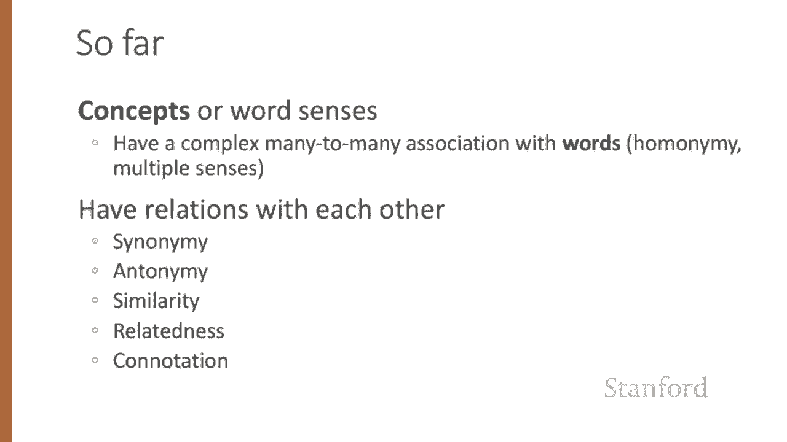

# P47：L8.1- 词义学习 - ShowMeAI - BV1YA411w7ym

Let's begin with some linguistic background on word meaning。

How do we represent the meaning of words in NLP systems In classical NLP applications。

 our only representation of a word is as a string of letters or an index in a vocabulary list。

This representation is not that different from another tradition in philosophy。

 perhaps you've seen it in introductory logic classes。

 in which the meaning of words is represented by just spelling the word with small capital letters。

 representing the meaning of dog as DO OG and cat as CA AT。

Representing the meaning of a word by capitalizing it is also a pretty unsatisfactory model。

 You might have seen a joke due originally the Sammanith Barbara Partee。What's the meaning of life？

LF。Surely we can do better than this。What should a theory of word meaning do for us。

 Let's look at some deiterta drawn from lexical semantics， the linguistic study of word meaning。

Let's first consider the idea of lemmas and senses。

 Here's a definition for the word mouse with two senses drawn from the online theysaurus word net。

 You'll notice that we have a lemma mouse。 recall that lemmas represent the core stem of a word。

 Whereas word forms like mice represent different individual inflected or derived forms。

Notice also that mouse has two senses， sense one， any of numerous small rodents。 and sense2。

 a hand operated device that controls a cursor that you're all familiar with。So we say that a sense。

 or sometimes we call this a concept。Is the meaning component of a word。

 and that lemmas can be polyssimous， meaning they can have multiple senses。 So in this case。

 the word mouse has two senses。Now that we've defined senses。

 we can see that there are relationships between these senses。

 So one possible relation between senses is the relation of synonyomy。

 synonyms have the same meaning in some or all contexts。

 So the nut we often call a hazelnut can also be called a filbert。

 or couches and sofas seem like synonyms or big and large or automobile and car。It turns out。

 however， that there are probably no examples of perfect synonyomy。

 even though many aspects of their meaning might be identical。

 pairs of words may still differ based on things like politeness level or slang or register or a genre。

So consider water versus H T O。 The word H T O is used in scientific context and would be inappropriate in a surfing guide or a hiking manual。

 Water would be more appropriate there。 And this genre difference is just part of the meaning of the word。

Or take the words big and large。 while their meanings overlap， each has senses。

 the other doesn't have。 So consider the fact that we can say my big sister to mean my older sister。

 but my large sister doesn't have that same sense。 In practice， therefore。

 the word synonym is used to describe a relationship of approximate or rough synonyomy。

One of the fundamental tenets of linguistics called the Pri of contrast states that a difference in form is always associated with a difference in meaning。

This principle dates back to the 18th century when the Abe Girraard first pointed out that languages don't seem to have perfect synonyms。

While words don't have many synonyms， most words do have lots of similar words。 For example。

 cat is not a synonym of dog， but cats and dogs are certainly similar words。

 Cars are similar to bicycles and Cs are similar to horses。 But， of course。

 none of those are synonyms。The notion of word similarity is very useful in many semantic tasks。

 knowing how similar two words are can help in computing how similar the meaning of two phrases or sentences are。

 a very important component of natural language understanding tasks， like question answering。

 paraphrasing and summarization。One way of getting values for word similarity is to ask humans to judge how similar one word is to another。

And a number of data sets had resulted from such experiments。 For example， the Simx 9，9。

9 data set gives values on a scale from 0 to 10， from near synonyms like vanishish disappear。

 which are extremely similar to pairs like whole and agreement that scarcely seem to have anything in common。

The meaning of two words can be related in ways other than similarity。

 One such class of connections is called word relatedness。

 also traditionally called word association in psychology。 So coffee is similar to tea。

 but coffee is not similar to cup。 They share practically no features。 Coffee is a plant or beverage。

 A cup is a manufactured object with a particular shape and function。

But coffee and cup are clearly related。 They're associated by Co participating in an everyday event。

 The event of drinking coffee out of a cup。Similarly， scalpel and surgeon， not similar。

But related eventively， a surgeon tends to make use of a scalpel。

One common kind of relatedness between words is if they belong to the same semantic field。

A semantic field is a set of words which cover a particular semantic domain and bear structured relationships with each other。

 For example， words might be related by being in the semantic field of hospitals。

 So words like surgeon or scalpel or nurse or restaurants， waiter and menu and plate or houses。

 door and kitchen and bed。Another relationship between senses is that of antonomy。

 These are senses that are opposites， but opposites with respect to only one feature of meaning。

 antonyms are otherwise extremely similar， Consider antonyms like dark light or hot， cold or up down。

 Hot and cold are very similar。 They're both terms that describe temperature。

 a point on a temperature scale and all the implications that temperature has in the real world。

 They differ only in which point on the scale they describe more formally。

 antonyms can define a binary opposition or be at opposite ends of a scale。

 So we can have a scale like hot， like temperature scale and may be hot as at this end and cold as at this end。

Or they can be revverives， so you can have words like up or down or fall or rise。

 where it's the action that the words's taken is in the opposite direction。Finally。

 words have affective meanings or connotations。The word connotation has different meaning in different fields。

 but here we use it to mean the aspects of a words meaning that are related to a writer or a reader's emotions。

 sentiments， opinions or evaluations。For example， some words have positive connotations， happy。

 while others have negative connotations like sad。Even words whose meanings are similar in other ways can vary in connotation。

 consider the difference in connotation between copy， replica， reproduction， on the one hand。

 and fake knock off and forgery。 On the other hand， they share much of their meaning。

 which is that there's a copy， but differ strongly in their connotation。

Some words describe positive evaluation， like great and love and others negative evaluation。

 like terrible and hate。 Po or negative evaluation language is called sentiment， as we saw already。

 and word sentiment plays a role in important tasks like sentiment analysis。

 stance detection and applications of N LP to the language of politics and consumer reviews。

Early work on affective meaning by Osgod and collaborators。

Found that words varied along three important dimensions of affective meaning called valence。

 arousal and dominance， valence， the pleasantness of the stimulus， arousal。

 the intensity of the emotion that it provokes and dominance。 the degree of controlled exerts。

 So a word like love， very high in valence。 Its very pleasant， a positive。

 sentimentally positive idea， happy， Also positive。 While toxic or nightmare are very low in valence。

 very unpleasant。 These values are from the NRC valence arousal dominance lexicon from Save Mohammad。

Arousal is the intensity of the emotion provoked by the stimulus。

 not whether it's positive or negative， but how intense it is。

 So mellow might be very low in arousal， while elated or frenzy might be very high in arousal。

 and dominance， the degree of control。 So words like powerful or leadership imply very high degrees of controls while weak or empty。

 low degrees of control。So we've seen that concepts or word senses have a complex many to many association with words。

 and that these senses have relations with each other like synonyomy， annomy。

 similarity relatedness and connotation。

We've now introduced some basic aspects of word meaning。

 which give us some deiterta for building a computational model。

