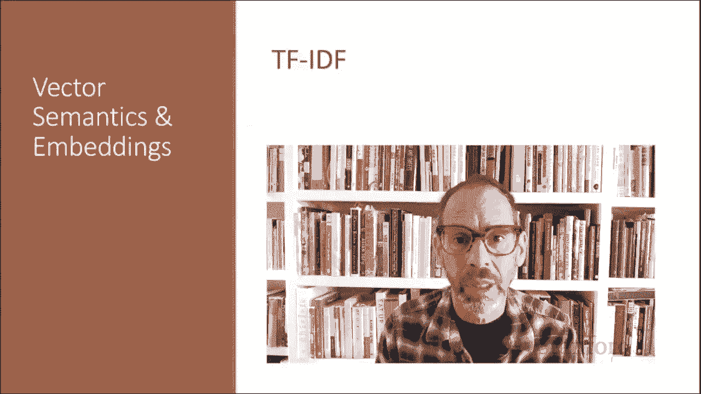
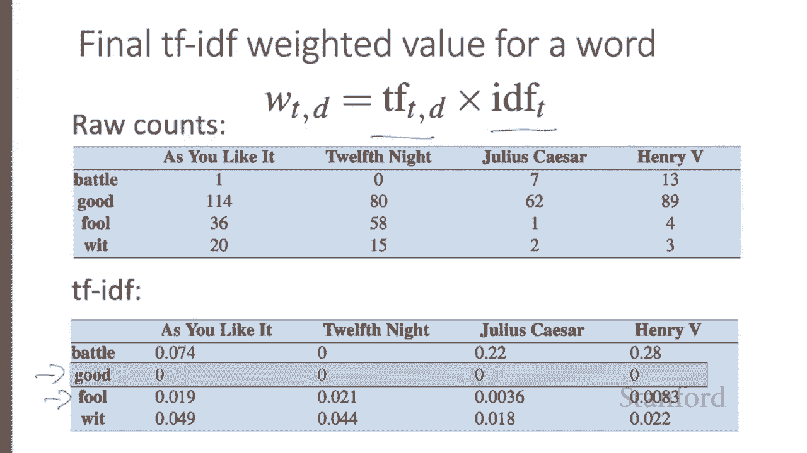
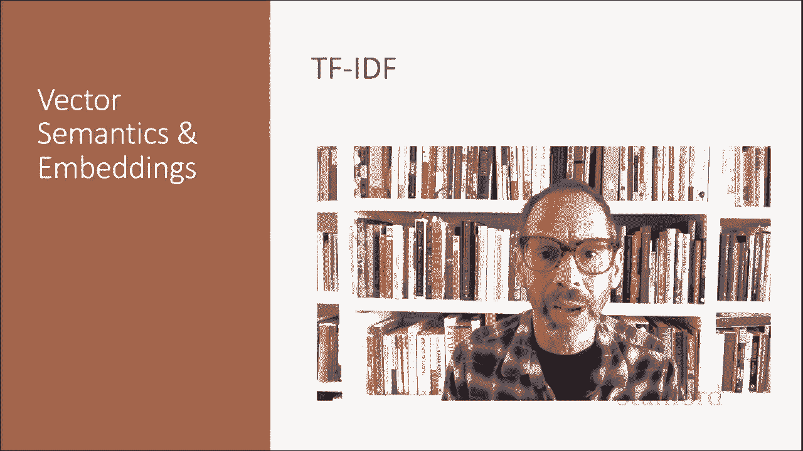

# P51：L8.5- TF-IDF - ShowMeAI - BV1YA411w7ym

Here we introduce TF IDF waitinging， a common way to reweight counts in term document matrices。

The coocrence matrices we've been using represent each cell by frequencies of words with other words or documents。

 But it turns out that raw frequency is a very skewed metric and not very discriminative。

So if sugar appears a lot in their apricot， that's useful information。 But words like the or it。

 which are very frequent and occur with all sorts of words。

 they're not very informative about any particular word。It's a bit of a paradox。

 How can we balance these two conflicting constraints。There are two common solutions to this problem。

The TF IDF algorithm usually used when the dimensions are documents。

And algorithms based on point wise mutual information usually use when the dimensions are words。

TF IDF makes use of a special weight called the inverse document frequency to down weight words like the or it。

While PMI is a statistical measure that compares the probabilities we see with what we would have expected by chance。

The TF IDF algorithm is the product of two terms， each term capturing one of these two intuitions。

The first is the term frequency， just the frequency of the word T in the document D。

We could just use the raw count as the term frequency， but more commonly。

 we squash the raw frequency a bit by using the log 10 of the frequency instead。

The intuition is that a word appearing100 times in a document doesn't make the word 100 times more likely to be relevant to the meaning of the document。

And because we can't take the log of zero， we normally add one to the count。

The second factor in TF IDF is used to give a higher weight to words that occur only in a few documents。

Terms that are limited to a few documents are useful for discriminating those documents from the rest of the collection。

Terms that occur frequently across the entire collection aren't as helpful。

And the document frequency of a term is the number of documents it occurs in。Document frequency。

 by the way， is not the same as the collection frequency of a term。

 which is the total number of times the word appears in the whole collection in any document。

Consider in the collection of Shakespeare 37 plays， the two words Romeo and action。

The two words have identical collection frequency。 They both occur 113 times in all the plays。

 but very different document frequencies， since Romeo only occurs in a single play。

So if our goal is to find documents about the romantic tribulations of Romeo。

 the word Romeo should be highly weighted， but not the worda。

We emphasize discriminative words like Romeo via the inverse document frequency or IDF term weight。

The IDF is defined using the fraction n over DF， where n is the total number of documents in the collection。

And Df subt is the number of documents in which term T occurs。

The fewer documents in which the term occurs， the higher the weight。

The lowest weight of one is assigned to terms that occur in all the documents。

Because of the large number of documents in many collections。

 this measure too is usually squashed with a log function。

The resulting definition for inverse document frequency or IDF is thus the log of n over DF subt。

Here on the right are some IF values for some words in the Shakespeare corpus。

 ranging from extremely informative words which occur only in one play like Romeo to those that occur in a few like salad or falsestaff to those which are very common。

 like fool or so common as to be completely non discsriminative since they occur in all 37 plays like good or sweet。

It's usually clear what counts as a document and Shakespeare would use a play when processing a collection of encyclopedia articles like Wikipedia。

 the document is a Wikipedia page， and processing newspaper articles。

 the document is a single article， but very frequently。

 you might need to break up the corpus in the documents yourself for the purposes of computing IDF。

 because documents can be anything。 they don't have to be the original document， For example。

 we often treat each paragraph as a document， which lets us compute TF IDF values。

 even when we're dealing with a single document like a book。

So the TF IDF weighted value for a word T in document D thus combines the term frequency of the term T in document D with the inverse document frequency of the term T。

 Here's the raw counts in the Shakespeare term document matrix。

And now the TF IDF weighted version of the same matrix。

Note that the TF IDF values for the dimension corresponding to the word good have now all become zero。

 since this word appears in every document， the TF IDF algorithm leads it to be ignored。Similarly。

 the word fool， which appears in 36 out of the 37 plays， has a much lower weight than other words。

We've now seen how to use TF IDF weights to compute weighted vectors representing words。

