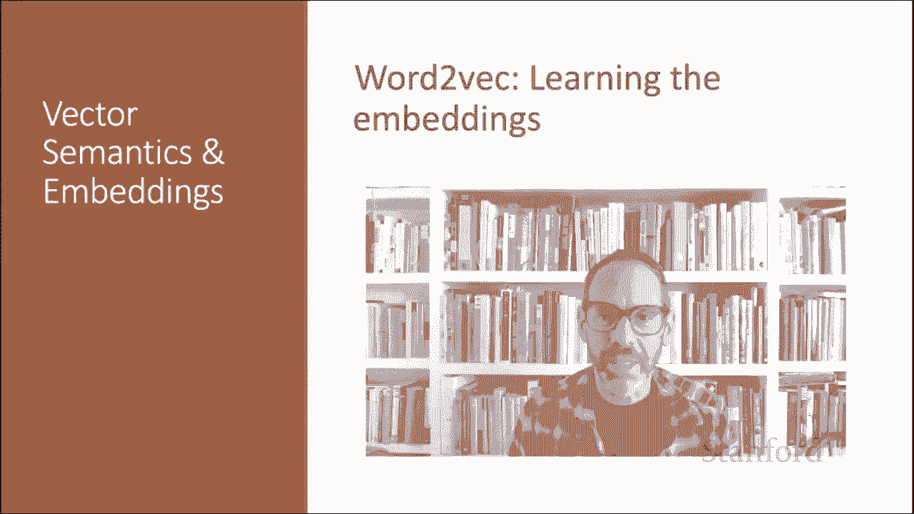

# P53：L8.7- 通过Word2Vec学习词嵌入 - ShowMeAI - BV1YA411w7ym

Let's see how Word Tvec uses sigmoids and gradient descent to learn embeddings。

Skipgramham learns embeddings by starting with random embedding vectors and then iteratively shifting the embedding of each word W to be more like the embeddings of words that occur nearby in texts and less like the embeddings of words that don't occur nearby。

Let's start by considering a single piece of training data。This example has a target word W。

 that's apricut， and four context words in the L equals plus or minus2 window。

 resulting in four positive training instances。Apricot is the target word tablespoon is the context。

 apricot and of， apricot in jam and apricot and u。For training a binary classifier we also need negative examples。

 and in fact， Sktgramram with negative sampling at SGNS uses more negative examples than positive examples with the ratio between them set by a parameter K。

So for each of these， four training instances we'll create K negative examples。

 each consisting of a target W plus a noise word， a noise words a random word from the lexicon constrained not to be the target word W。

Here's the setting where k equals2， so we'll have two negative examples for each positive example。

And these noise words likeardvarc or my or where are chosen according to a weighted unigram frequency。

We're ready for training now， we have four positive examples and eight negative examples。

So given this set of positive and negative training instances and some initial set of embeddings。

 the goal of the learning algorithm is to adjust these embeddings。

To maximize the similarity of the target word context word pairs that are drawn from the positive examples and minimize the similarity of the pairs drawn from the negative examples。

Now， if we consider one word context pair with its K noise words。

 our goal is to maximize the similarity of the target with the actual context words and minimize the similarity of the target with the K negative sampled nonneighb words。

 and we can express these two goals as the following loss function L to be minimized so I'm going to have a negative there。

And the first term expresses that we want the classifier to assign the real context word C positive。

 a high probability of being a neighbor， and this second term expresses that we want to assign each of the noise words C egg sub I。

 a high probability of being a non neighborighbor， and then all multiplied because we're assuming independence here。

So we can do a little arithmetic， and now we have a sum of logs instead of a product of probabilities。

If we want， we can， instead of talking about p of minus， we can talk about one minus p of plus。

And then if we substitute in for P of plus。Our sigmoid of the dot product。

 which is our estimate of P。 You can see here that what we're doing is maximizing the dot product of the word with the actual content words。

And minimizing the dot product of the word with the K negative sampled non neighbor words。Again。

 because worth。We have a loss here。And we minimize this loss function using stochastic gradient descent。

 we're going to adjust the words weights to make the positive pairs more likely。

 the negative pairs less likely and do this over the whole training set。

Let's look at the intuition of one step of gradient descent。

The skip gram model tries to shift the embeddings。 So the target embeddings here。

 here's the target word apricot。 We want to shift it to be closer with。

 meaning have a higher dot product with the context embeddings for neighboring words。

 And let's say here。 that's the word jamm。 Jam is a neighboring word。

 We want to look closer to apricot。And we want the embedding for Apricot to move to be further away from our context embeddings for our noise words。

 so our matrix and Tolstoy， so Apricot's going to move closer to jam and further from matrix and Tolstoy。

Now remember gradient descent at each step。We move our weights in the reverse direction from the gradient of the loss function。

 and the amount we move the weights is the value of this gradient that's the gradient of our loss function weighted by a learning rate eta where the higher learning rate means we're going to move faster。

 so the weights at step T plus1 are the weights at step T minus eta times the derivative of the loss function。

Now here's the loss function again。To get the gradient。

 we need to take the derivative of this equation with respect to the different embeddings。

We'll need a derivative for the C embeddings， the context embeddings。

 and we'll need a derivative for the W embeddings。 and note that we'll want a different derivative for the positive context examples and the negative context examples。

 since we'll want to move them in opposite directions。

 And it turns out that the derivatives are the following very elegant functions。

So the update equations going from time step T to T plus1 in stochastic gradient descent for positive context word at time T。

 take the weight eta multiplied by the derivative of the loss function。

And subtract that from our current value of T to get our new value。 Excuse me。

 our current value of C positive， to get our new value of C positive。

 And we do the same thing for the negative context words， the noise words。

 and we do the same thing for our target word W。 In each case。

 the derivatives of the loss are different。 and we're going to be moving each of these weights。

 different amounts。So just as in logistic regression then。

 the learning equation starts with randomly initialized W and C matrices and then walks through the training corpus using gradient descent to move W andC so as to maximize the objective we saw earlier by making these updates。

So as we've just seen， the SGra model learns two separate embeddings for each word。

The target embedding W and the context embedding C stored in these two matrices， W and C。

 but we only need one vector to represent a word in our various NLP applications。

 so which one should we use。It's most common to just add them together。

 so we're going to represent word I by summing the vector w sub I and C sub I to get a representation for the word。

So in summary， to learn the embeddings for word to Vc using skipgramm with negative sampling。

 we start with the random vectors， each of dimension D， whatever our chosen dimension is。

 Now we're going to train a classifier based on embedding similarity。 We take a corpus。

 take pairs of words that cooccur， those are our positive examples， pairs of words that don't occur。

 that's our negative examples， and then we train the classifier to distinguish the positive and negative examples by slowly adjusting all the embeddings to improve the classifier performance。

 and then we just throw away the classifier and keep the embeddings。

We've seen how to learn word to Vc embeddings， one of the most popular static embedding methods。

