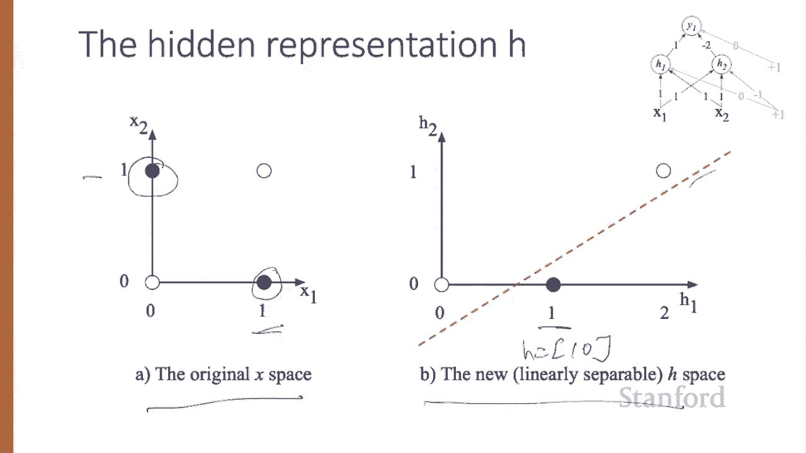
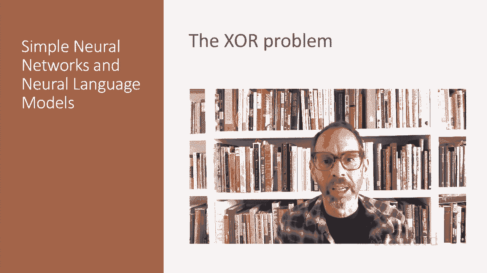

# P58：L10.2 - 异或问题 - ShowMeAI - BV1YA411w7ym

The power of neural networks comes from combining these units into larger networks。

 One of the most clever demonstrations of the need for multi layer networks came from the proof by Minsky and Papper in 1969 that single computing units couldn't compute some very simple functions of their input。

Consider the task of computing elementary logical functions of two inputs like and or or X or as a reminder。

 here are the truth tables for those functions， so zero and0 is0，0 and1 is0，1 and1 is1 and so on。

This example was first shown for the perceptron， which is a very simple neural unit that has a binary output and does not have a nonlinear activation function。

 The output Y of a perceptron is 0 or  one， and is computed as follows。

So using the same W X and Bs that we've just seen， if w dot x plus b is less than or equal to 0。

 a perceptron will output of 0， and if w dot x plus b is greater than 0， it'll output a 1。

It's very easy to build a perceptron that can compute the logical and or functions of its binary inputs。

So here on the left， we have an example of logical and。So we have weights， W1 is 1， W2 is1。

 and we have a bias of minus1。And logical or has slightly different weights。

 This set of weights and biases are just one from an infinite number of possible sets and weights and biases that would implement these functions。

Let's see what happens， for example， with the value1 and 0。 So if x1 is 1 and x2 is 0。

 then we have one times 1 here，0 times1 here。 So we have one。Plus。Zero， that's w dot x。

And then plus B， that's minus1， and that equals0。So sure enough。

 we get the correct answer zero for and。Now what about with1 and1。 So we have x1 of 1。 X2 is 1。

 So here we have 1 times 1， and here we have1 times1。 And so we have1 times 1 plus1 times 1 minus1。

 that's del dot x plus B。 And so that's going to be1。1 plus one minus1 sure enough。How about or。

 let's C zero and1， we have a zero， we have a1， so we have0 times 1 plus1 times 1 plus0。

 and that's correctly going to give us one。However。

 it's not possible to compute X or with perceptrons。

 you should pause the lecture and try for yourself。Why isn't it possible？Crucially。

 the perceptron is a linear classifier for a two dimensional input X1 and x2。

 the perceptron equation， W1 x1 plus w2 x2 plus b equals 0。

Is the equation of a line and we can see this by putting it in the standard linear format x2 equals minus w1 over b2 x1 plus minus b over w2。

 so here we have a slope。This line acts as a decision boundary in two dimensional space。

 the output zeros assigned to all inputs lying on one side of the line and the output one to all input points lying on the other side of the line。

If we had more than two inputs， the decisionension boundary becomes a hyperplane instead of a line。

 but the idea is the same， separating the space into two categories。Let's see a picture。

 These figures show the possible logical inputs 0，0，0，1，1，0，1，1。

 and the line drawn by one possible set of parameters for an and and an orer classifier。

Notice for Xor that there's simply no way to draw a line that separates the positive cases of Xor。

Zero1 and10。From the negative cases， 0，0 and 11。We say that Xor is not a linearly separable function。

 Of course， we could draw a boundary with a curve or some other function， but not a single line。

Let's see an example of how to compute Xor using two layers of re based units。The middle layer。

Called H has two units， and the output layer called Y has one unit。

This set of weights and biases will compute XO。Consider the input x equals 00。

If we multiply each input value by the appropriate weight， sum and then add the bias。

We get H1 will be re。Of0 dot ones， our inputs are 0 plus 0 dot 1。 That's this one plus the bias。

 which is 0。So that will be zero。H2。We'll have value of 0。1。Plus 0 dot1。For these two。

But now minus the bias is a minus1， so we'll get R of minus1， which is 0。So we've got H as0，0。

 and then y is0 times 1。Here plus zero times minus 2 plus zero equals zero。

I recommend you pause the video and work through the computation of the remaining possible input pairs to see that the resulting y values are one for the inputs 01 and 10。

 but remain 0 for 00 and 11。It's also instructive to look at those intermediate results。

 the output of the two hidden nodes H1 and H2。 Here's the original x space。

Where x or of0 comma 1 or 1 comma0 should return1， and now let's look at the values of the H layer for the same four inputs。

Notice now that the hidden representation of the two input points， x equals 01。And x equals 1，0。

 Those two cases where X R output is1 have been merged to a single point。

 The hidden value is going to be 1，0 for both of those。

 This merger makes it easy to linearly separate the positive and negative cases of X or Here's a sample line that does that。

 In other words， we can view the hidden layer of the network as forming a useful representation of the input。

In this example， we just stipulated the weights， but for real examples。

 the weights for neural networks are learned automatically using the back propagation algorithm will turn to。

 And that means the hidden layers will learn to form useful representations。

 This intuition that neural networks can automatically learn useful representations of the input is one of their key advantages。

We've shown why single units cannot compute X or and how multi layer networks with non linearities are able to learn representations that make it possible to solve this problem。

