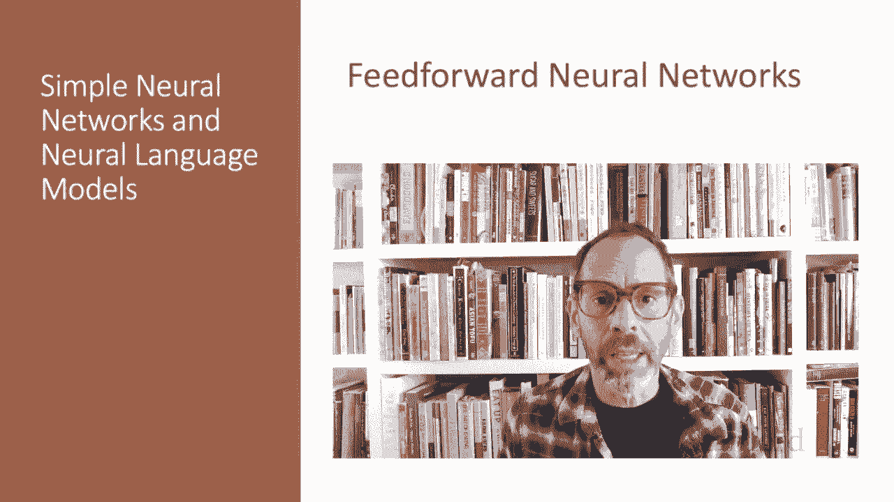
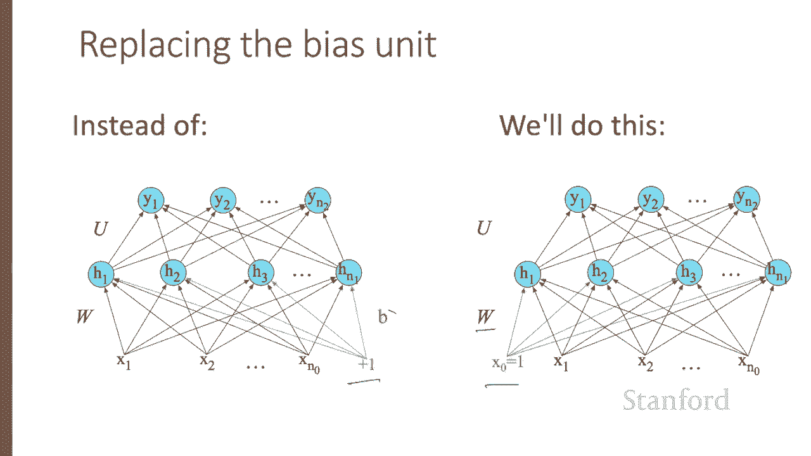

# P59：L10.3 - 前馈神经网络 - ShowMeAI - BV1YA411w7ym

Here we introduce the simple feed forward network。While NLP makes use of many more complex architectures。

 RNNs， transformers， attention。The feed forward network is still an important tool and underlies these more complex architectures。

 A feed forward network is a multi layer network in which the units are connected with no cycles。

 The outputs from units in each layer are passed to units in the next highest layer。

 and no outputs are passed back to lower layers。

For historical reasons， feed forward networks can also be called multi layerer perceptrons or MLPs。

 although they aren't technically composed to perceptrons anymore。

Simple feed forward networks have three kinds of nodes。Input units， hidden units， and output units。

Let's go back to logistic regression we can think of binary logistic regression as a one layer network。

We don't count input layers when we're counting layers， so we'll call this input layer layer 0。

 and so this is a one layer network。 so we have an input layer we could call layer 0 consisting of a vector X。

 We multiply x by a weight matrix， W add a scal or B， and then the first layer。

 the output layer computes a scale or y by applying a sigmoid to W X plus B。

So simple logistic regression viewed as a network。And remember， multinoial logistic regression。

 where instead of a single sigmoid at the output， we had a soft max that turns the output values into probabilities。

So we'll at probabilities over discrete outcomes。Where before W is a simple vector。

 now W is a matrix and where B had been a scalar， now B is a vector。

 so now we're multiplying the weight matrix W by the input X adding a vector B to produce a vector over possible outcomes。

Remember that the soft max is a generalization of the sigmoid。

 so the soft max of a vector Z replaces each element with an X over a sum of X。So for example。

 if we have an input vector Z， that's just a set of scores， some positive， some negative values。

 running it through a softftmax will produce a set of probabilities that will sum to one。

 so softmax very convenient output function。Logistic regression is a one layer network。

 but the power of neural networks come when we have a hidden layer。 So minimally two layer networks。

 So here's a two layer network。 the input layer layer 0。

 a hidden layer layer 1 and an output layer 2。 And here。

 the equations for a feed forward network with this single hidden layer takes an input X multiplies it by the weight matrix W and adds a bias。

 So each element W sub J I of the weight matrix W represents the weight of the connection from the I hidden unit X sub I to the J hidden unit。

 H sub J。We're showing the activation function here as sigma。

 so we have the hidden unit is sigma of Wx plus B， but the activation function could be a value or a tanAN H as we've talked about earlier。

And notice that we're applying that H is a vector and we're applying sigma to a vector。

 Wx is a vector。So we can apply a function like Sigma to a single value or to a vector element wise。

Now， as we saw in the lecture on XO， the resulting H value。

 hidden value forms a representation of the input。Now。

 then the role of the output layer is to take this new representation H and compute a final output。

 This output could be a real valued number。But in many cases。

 the goal of the network is to make some sort of classification decision。

 and so we'll focus on this case of classification。

If we're doing a binary task like sentiment classification， we might have a single output node。

And the value Y is the probability of say， positive versus negative sentiment。

So the output layer has another weight matrix U， and many models don't include a bias vector B in the output layer。

 so we'll just simplify by eliminating the biasness example。

So the weight matrix U is multiplied by its input vector。

 which is the vector H to produce the intermediate output Z。

And then we use the sigmoid to turn this into a probability。

What if you have more than two output classes？For we' doing multinomial classification like assigning a part a speech tag。

 we just add more output units， one for each class。

So we might have one output unit for each potential part of speech and the output value is going to be the probability of that part of speech。

 so the output layer gives a probability distribution across the output nodes。

 and we use the softmax to compute this distribution just as for multinoial logistic regression。

That means we can think of a neural network classifier with one hidden layer as building a vector H。

 which is a hidden layer representation of the input and then running a standard logistic regression on the features that the network develops in age。

By contrast， when we presented logistic regression。

 the features were mainly designed by hand via feature templates。

So a neural network is like logistic regression， but with many layers。

 since a deep neural network is like a layer after layer of logistic regression classifiers。

 and rather than forming the features by handwritten feature templates。

 the prior layers of the network induce the feature representations themselves。

Let's now set up some notation to make it easier to talk about deeper networks of depth more than two。

We'll use superscripts in square brackets to mean layer numbers， starting at 0 for the input layers。

 So W super 1 will mean the weight matrix for the first hidden layer and B super 1 will mean the bias vector for the first hidden layer。

 and we' use G to stand for the activation function。

 which will tend to be value for intermediate layers and softm for output layers。

We'll use a super I to mean the output from layer I。

And Z super I deme mean the combination of weights and biases。

The inputs will refer to more generally as a super zero。Thus。

 we can rere our two layer network with these equations on the right。

Here they are written out together。Notice with this notation。

That the equations done for the computation at each layer。Layer1 and layer two are the same。

So the algorithm for computing the forward step in an n layer feed forward network。

 given the input vector a super0 is thus simply to go through the layers。

 computing our z's as our W dot A's plus B's， where As are the inputs from the previous layer。

 and then our output to the current layer is our nonlinearity of the Z's， and then at the very end。

 our estimate Y hat is the output of the last layer。In describing networks。

 we'll often use a slightly simplified notation that represents exactly the same function。

 but without referring to an explicit bias node B。We'll do this instead by adding a dummy node a sub0 to each layer whose value will always be one。

 thus layer 0， the input layer will have a dummy node a sub0， super0， value 1。

 layer 1 will have a sub0， super 1 value of1 and so on。

And the weight associated with this dummy node represents the bias value B。

So instead of our input being x1 through x n sub 0， or n sub0 was the number of units at layer  zero。

We'll add an extra unit x sub zero。And instead of talking about sigma of Wx plus B。

 we'll talk about sigma of Wx， but if we break down this computation。

 instead of Wx being the sum from one to n sub zero of the weight times the input value。

 it'll be the sum starting at zero because of this extra bias value。

So instead of having an extra bias term B， we'll simply add our value x sub0 and subsum B into the weight matrix W We'll continue showing the biases B for the learning example in the next few lectures。

 but afterwards we'll switch to the simplified notation without explicit bias terms。

We've now introduced feed forward neural networks， the most basic neural network architecture。

