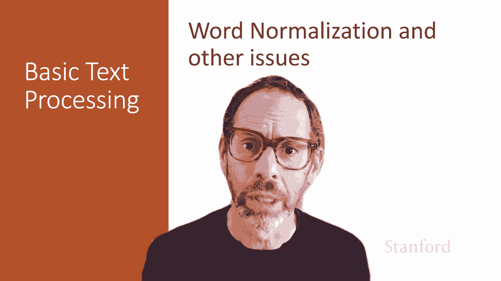
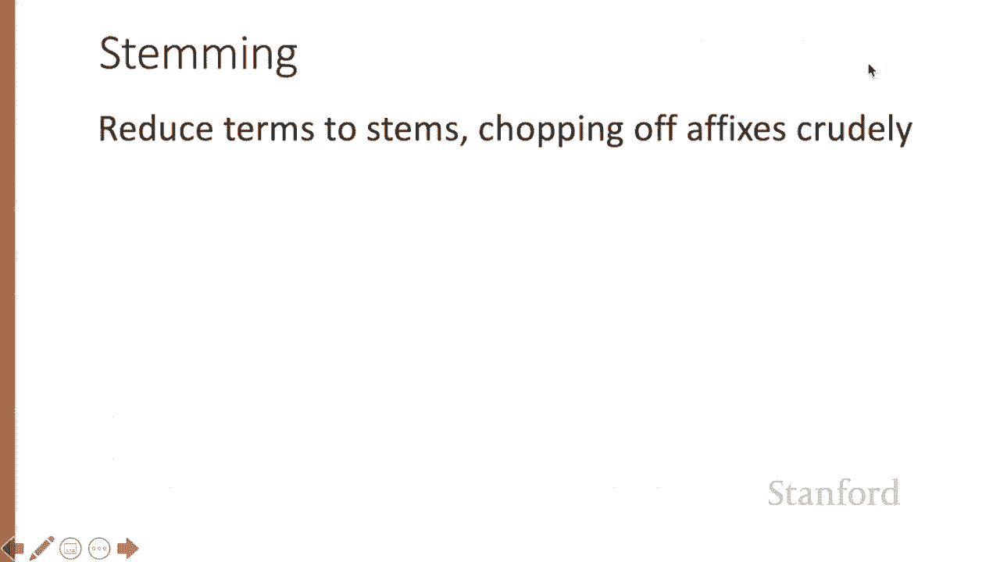
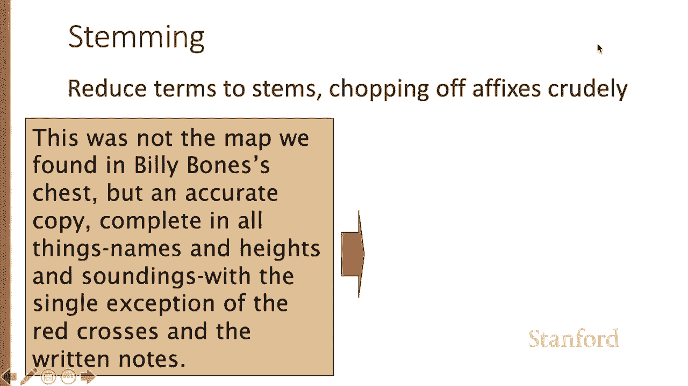
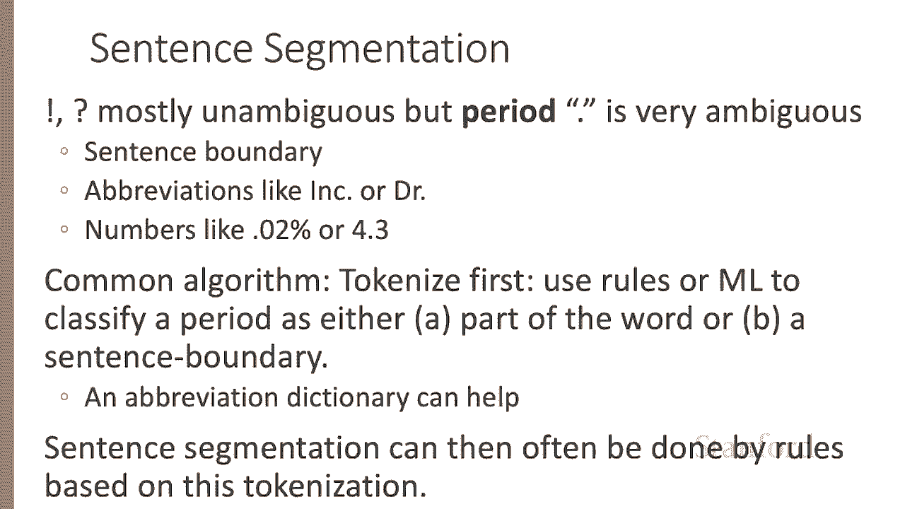
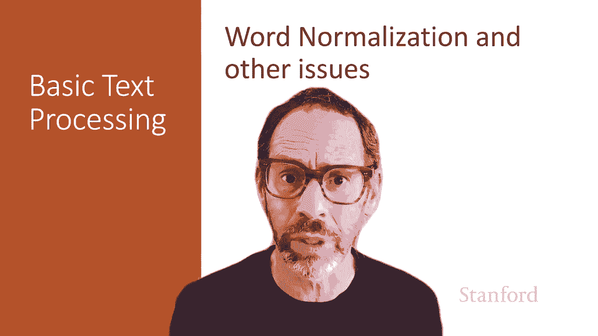

# P6：L1.6- 词归一化与其他相关议题 - ShowMeAI - BV1YA411w7ym

Now let's discuss how to put all words in a standard format， a process called word normalization。

 we'll also talk about sentence segmentation， the process of breaking up your text corpora into larger discourse units like sentences or even paragraphs。

Normalizing words， putting them in a standard format requires making decisions。

 So should we represent USA as U dot S dot a dot or the letters USA。 We pick a standard format。

 And then whichever of the two we see， We would map it into the the one we decide is standard。

 Lots of similar decisions。 If we're transcribing speech and someone says， a。

 Is that spelled with a dash or not。 What about lemmas。

 we talked about word forms like M is an R and the lemma B。

 When do we want to keep words as word forms and when might be one to lemmatize them。

We also have to make decisions about case folding， so， for example， in information retrieval。

 it's very common to reduce all the letters to lowercase Use typing in a search engine will use lowercase。

 So if we're going to match what the user's type to some corpus that they're searching for。

 it's safe to map to lowercase， one possible exception。

 perhaps if the user types an uppercase in the middle of a sentence。

 then we might want to use that information to help us decide how to search for the text that they're looking for。

 but for most NLP applications for sentiment analysis for information extraction for machine translation case really matters。

 So the string US is very different if it's uppercase than if it's lowercase in English。

Another normalization decision we have to make is whether telelemitize。

And remember that alemma is the shared root of a word。

 It corresponds also to what you see in a dictionary head word。

 So we might be mapping M R is to the head word B or car Car。

 Carpostropphy S to the word car or in languages like Spanish。

 which have a lot more inflection than English So forms like kedto， I want or kd S， you want。

 we'd move map to the infinitive form Kre。 That's the lemma。

 So lemmatizing a sentence like he is reading detective stories。

 we would get he B read detective story。 So we've removed the plurals and we' moved the Jaand on reading and so on。

Leitization is done by morphological parsing。 So recall that a morphme is the smallest。

 meaningful unit that makes up a word， and we often distinguish two kinds of morphs。 stems。

 Those are the core meaning bearing units and affixes。

 these parts that adhere to the stems often with some kind of grammatical function。

 And the job of a morphological parser is to break up a word into morphs。

 So cats has the stem cat and the affix。And so parser's job is to break up cats into cats。

 or more complicated cases， Spanish Ahmain， if in the future they would love。

 we're going to break that up into a morphem ahd and the morphological features that this is the third plural form and the future subjunctive form。

Stemming is like a simplified form of liitization in stemming。

 rather than mapping to a true morphological lemma， we simply chop off the affixes rather crudely。

 has the advantage of simplicity。 So， for example， if we had this sentence as input。

 this was not the map we found in Billy Boone's chest， but an accurate copy。

We can run a stemmer on that。 We get very rough output。 So it's done some useful things。 So。

 for example， it's taken the word heights。And remove the S to get height。

 So that's that's a nice leitizing thing。It's taken the word soundings and turned it into sounds。

 So it's removed all the ins。 But it's also removed S's on was。 And this， that's not so useful。

 And it's changed all the final ys to eyes。 And it's removed all the8s A T E endings。

 So accurate becomes accurate。 So we have a much simpler exception becomes except。

 So we've simplified。 And the result is an increase in recall at the expense of precision。

 We'll probably find more words that we're looking for。

 but we'll also find some words we're probably not looking for。

One of the standard algorithms for stemming is called the Porter stemmer and the porter Ste are very simple based on a series of rewrite rules that are just run in series。

 So for example， it'll have rules like turnational into8 or remove in but only if there's a vowel beforehand。

 So the input is motoring if we see a vowel here like that O， now we can remove the in or。Turn S S E。

 S into S。 So we have a word like grasses。 It's okay to remove the E S。 Now， for many languages。

 these simple approaches don't work。 Many languages have very complex morphology。

 So Turkish is a language with a glutnative morphology。

 So very long words formed with lots of morphmes。 So the famous example of the Turkish word。

 meaning behaving as if you're among those whom we could not civilized。

 So it has morphmes like civilized and cause and not able and past plural and so on。

 So dealing with languages with complex morphology is going to require richer morphological parsing algorithms。

Finally， we're often going to want to break off larger discourse chunks like sentences In English sentence segmentation。

 you can often do a lot just with the final punctuation。

 If you see an exclamation point or a question mark， probably worth the end of a sentence period。

 on the other hand， is somewhat more ambiguous。 A period can mean a sentence boundary。

 but can also be an abbreviation like ink or doctor or there can be periods in numbers。

So a common algorithm is first to tokenize， so we'll use rules or we'll build a machine learning classifier that classifies a period either as part of the word as in doctor or ink or the numbers or a sentence boundary so our classifier makes that decision and for that maybe having an abbreviation dictionary can help if we have a list of the words like ink and doctor in the language that's going to be useful for that classification decision。

And then we do sentence segmentation based on very simple rules based on this more complex tokenization task that we've done。

Normalizing words and segmenting off sentences or other larger discourse units like paragraphs are important first steps in text processing。

