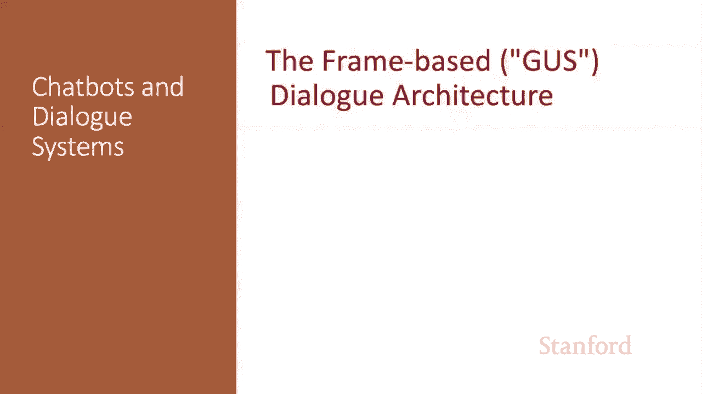
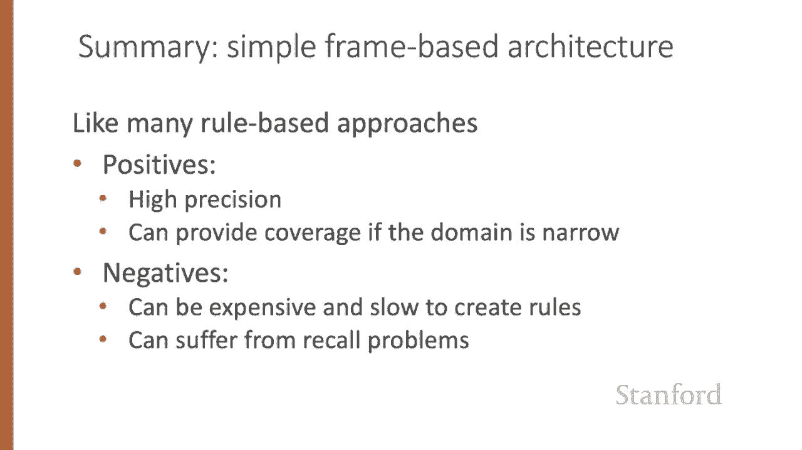
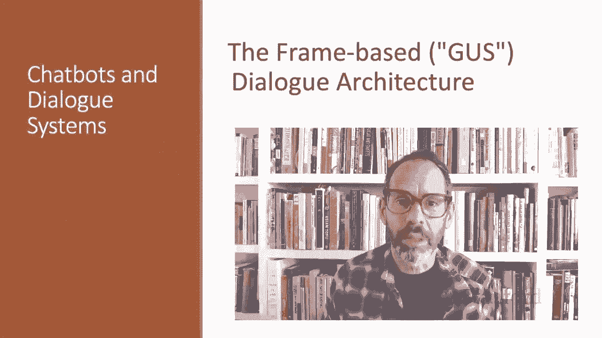

# P67：L11.5 - 基于帧的对话系统架构 - ShowMeAI - BV1YA411w7ym

In this lecture， we introduce the frame based or Gus architecture for task based dialogue。

In task based dialogue， a dialogue system has the goal of helping a user solve some task like making an airplane reservation or buying a product。

The core of such systems， first proposed in 1977 in the influential gus system is a knowledge structure called the frame。

A frame represents part of the information about the user's intention that the system can extract from user sentences。

 It consists of a collection of slots， each of which can take a set of possible values。

This set of frames is sometimes called a domain ontology。

The set of slots for a frame specifies what the system needs to know for the part of the task the frame represents。

 So in booking airline travel， we need to know the origin or destination of the flight or the times or maybe the airline。

The filler of each slot is constrained of values of a particular semantic type in the travel domain。

 for example， a slot might be of typepe City， hence take on values like San Francisco or Hong Kong or of type。

 date， airline or time。It's common to distinguish two basic architectures for the frame based task。

The simplest classic one we'll call the Guss architecture after the paper that introduced it focuses on a set of hand built production rules for filling frames and taking actions。

 It's more than 40 years old， but still used in most industrial task based dialogue agents。

An extension of the Gus architecture， sometimes called the dialogue state architecture。

 is more common in research systems， and some aspects are making their way into industrial systems。

Here is a transcript of an actual dialogue with a gus system from 1977。

PSA and Air California are airlines of that period。

Guss had a lot of complex abilities that aren't true in every frame based system。 For example。

 it dealt with co reference。 That's expressions like the first one referring to flight 102。

 Or it knows that Friday in the evening means the next Friday， I。e。 presumably May 30。

And in this example， it even handles a complex， implicit constraint。

I must be in San Diego before 10 AM。The control architecture for Guss used in some form in all modern frame based dialogue systems like Apple Siri or Amazon's Alexa or the Google assistantant is designed around the frame。

The system's goal is to fill the slots in the frame with the fillers the user intends。

 and then to perform the relevant action for the user， answering a question or booking a flight。

 And to do this， the system asks questions of the user will have pre specified question templates associated with every slot of each frame。

 and then filling the slot the user specifies。So a question to fill the departure city slot might be。

 where would you like to fly from， And the user might answer。

 I want a flight from San Francisco to Denver one way， leaving after 5 PM。Well we can。

 from that information fill all sorts of slots。And if there's any slots left unfilled。

 we can continue asking the user questions。Once the frame is filled， we can do our database query。

 looking for flights or whatever that fulfills the user constraints。

The Gus architecture also has condition action rules attached to templates。For example。

 a rule attached to the destination slot for the plane booking frame once the user specified the destination might automatically enter that city as the default stay location for the hotel booking frame。

Or if the user specifies the destination day for a short trip。

 the system could automatically enter the arrival day。Many domains require multiple frames。

 besides frames for car or hotel reservations， we might need frames with general route information for questions like which airlines fly from Boston to San Francisco or information about airfare practices for questions like。

 do I have to stay a specific number of days。The system must be able to disambiguate which slot of which frame a given input is supposed to fill and then switch dialogueg control to that frame。

The goal of the natural language understanding component in the frame based architecture is to extract three things from the user's utterance。

The first task is domain classification。 Is this user， for example， talking about airlines。

 programming an alarm clock or dealing with their calendar。Of course。

 this one N classification task is unnecessary for single domain systems that are focus say just on calendar management。

 but multi domain dialogue systems are the modern standard。The second task is intent determination。

 What general task or goal is the user trying to accomplish in this domain。 For example。

 the task could be find a movie or show a flight or remove a calendar appointment。Finally。

 we need to do slot filling， extract the particular slots and fillers that the user intends the system to understand from their utterance with respect to their intent。

So from a user utterance like this， show me morning flights from Boston to SF on Tuesday。

A system might want to build a representation like this。

 we have the domain is air travel and the intent is show flights and here we have all of our other slots filled。

From an utterance like wakeake me tomorrow at six， we might decide the domain is alarm clock。

 the intent is to set an alarm， and the time gives us the actual slot filler。

Let's see how to do slot filling in the Gust architecture。

The slot filling used in the original system and still quite common industrial applications is to use handwritten rules。

 Often as part of the condition action rules attached to slots or concepts。 For example。

 we might just define by hand a regular expression for recognizing the set alarm intent with phrases like wake me up or set the alarm。

 Get me up。For generating responses， frame based systems tend to use template based generation in which all or most of the words in the sentence to be uttered to the user are prespecified by the dialogue designer。

Sentences created by these templates are sometimes called prompts。

Templates might be completely fixed， like， hello， how can I help you or can include some variables that are filled in by that generator。

 Like， what time do you want to leave City of origin。

 or will you return to city of origin from city of destination。

The rule based Gus approach is very common industrial applications。

 and as is true with the rule based approach to information extraction。

 it has the advantage of high precision。 And if the domain is narrow enough and experts are available。

 can provide sufficient coverage as well。 On the other hand。

 the handwritten rules or grammars can be both expensive and slow to train。

 and handwritten rules can suffer from recall problems。

 So modern systems tend to replace many of the components with machine learning。

 As we'll see in the next lecture。

The frame based or gus architecture lies at the heart of most modern task based dialogue systems。

