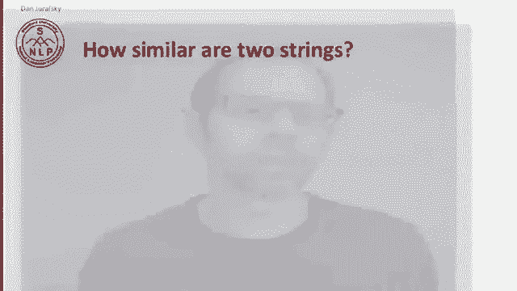
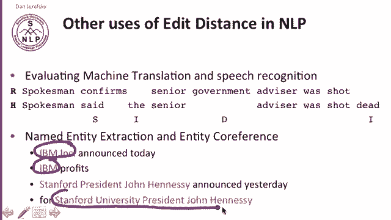

# P7：L2.1- 最小编辑距离定义 - ShowMeAI - BV1YA411w7ym

Let's begin our discussion of minimum at a distance by defining minimum at a distance。

Minimum meta distance is a way of solving the problem of string similarity。

How similar are two strings， so let's pick a particular examples， spell correction。

 the user typed GRA， FFE， what do they really mean and one way of operationalizing this question is asking which of the following words is closer to the letters that they typed。

 graph， graph， Gil or giraffe。The problem of string similarity comes up also in computational biology。

 where we have sequences of nucleotides， ACGT， we're trying to align and a good alignment should be able to tell us that two particular sequences perhaps from two samples line up in a certain way with some amount of error and this idea of string similarity or sequence similarity comes up for machine translation for information extraction for speech recognition comes up everywhere。

So let's define edit distance， the minimum edit distance between two strings is the minimum number of editing operations。

 insertion， deletion and substitution that are needed to transform one into the other。

 and we generally use these three editing operations， insertion deletion and substitution。

 you can imagine more complicated transpositions and long distance movements。

 but we tend to avoid those。So for example， we have the string intention and the string execution。

 here's an alignment showing that many of the letters line up with some substitutions and then there are some gaps where a gap here lines up with a letter C and execution and a gap in execution lines up with a letter I in intention and so on。

So we can think about this alignment as having a set of operations that generated the alignment。

 so here to turn intention into execution， we have to delete D for delete an I。

 we substitute an n for an E， substitute a T for an x， insert a C。

 substitute an n for U and the rest of the letters the E the T I ON are all the same so the edit distance。

 if each operation is1 is5 we have to do five things to turn intention into execution。

If substitutions cost two， this is called Levinstein distance and Levinstein distance insertions and deletions cost one。

 but substitutions cost two and now the distance between these two strings is eight。

In computational biology， we've seen sequences of bases and our job is to figure out that this A aligns to this A and this G to this G and maybe this T A and T and CA C and so on so this C to here so we can see that there's some kind of insertion there and we can represent again。

 that alignment between characters by showing this。A line string of symbols。

 So the task is given two sequences， align each letter to a letter in a gap。

 that's our task in biology。At a distance comes up all over the place in machine translation。

 for example， we'd like to measure how well a machine translation system does。

 so let's suppose that our machine translation system represented。

 some sentence may be translated from Chinese as the spokesman said the senior advisor was shot dead and some human expert translator said it should have been spokesman confirmed senior government advisor was shot。

So we can measure the difference between these two by saying how many words changed。

 confirms was substituted with said words that were inserted。

The and words and dead and words that were deleted government。

 so a way of measuring how good our machine translation is by comparing it to humans。

Similarly in tasks like named entity extraction， we're going to want to know if IBM。

 Inc and IBM are the same entity or if Stanford University President John Henessey is the same entity as Stanford President John Henessey and we can do that by using at a distance to notice that these are very similar with one word different and here one word different and so by measuring the number of words different。

 we can improve our accuracy at named entity extraction and other kinds of tasks。

Alright， so how are we going to find this minimum edit distance。

 Our intuition for the algorithm is to search for a path and by path we mean a sequence of edits from the start string to the final string so we'll start with an initial state so that will be the word we're transforming。

We'll have a set of operators insertion， deletion， substitution。

 and we'll have a goal state that's the word we're trying to get to。

And finally we'll have a cost for the path of getting there and that's the thing we're trying to minimize。

 so that's the number of edits， that's our path cost。 So for example， from of intention。

 here's a piece of a path from intention， we could delete a letter and end up with。

 we could insert a letter and end up with E intention or we could substitute a letter and end up with N so that' these are pieces along a path that would go from intention。

All the way off the screen here into all the possible ways you can transform intention into something。

So this space of all possible sequences is enormous。

 so we can't afford to navigate naively in the sequence and the intuition of solving this problem of lots of possible sequences is that lots of these paths wind up at the same state so we don't have to keep track of every way of transforming one string into another if the second pieces of the second string are identical。

 all we have to keep is the shortest path to every revisited state so let's look at an example of how this works。

We're going to define minimum at a distance， formally as。For two strings。

We have string X of length N and string Y of length M。We'll define a distance matrix capital D of IJ。

And that will be the at distance between the first i characters 1 through I of x。

And the first J characters one through J of string Y。So that' that's what's in。

That's what's defined by D of Ij， and so the distance between the entire two strings is going to be D of n coming n because the strings are length in M。

So that's our definition of minimum edit distance。