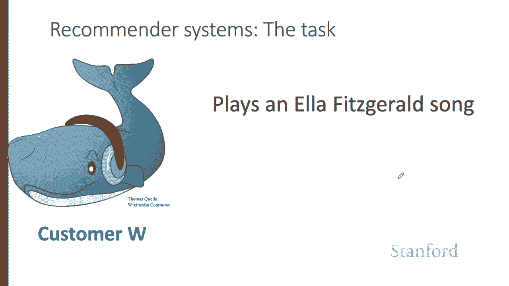
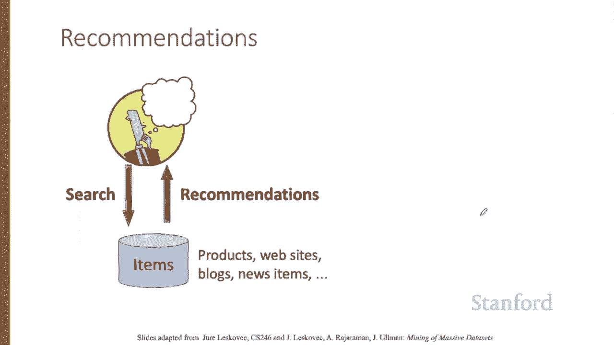
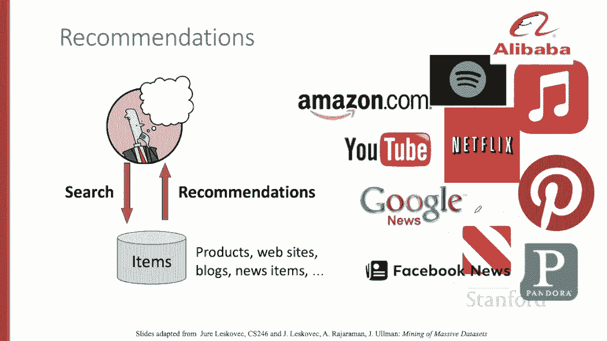
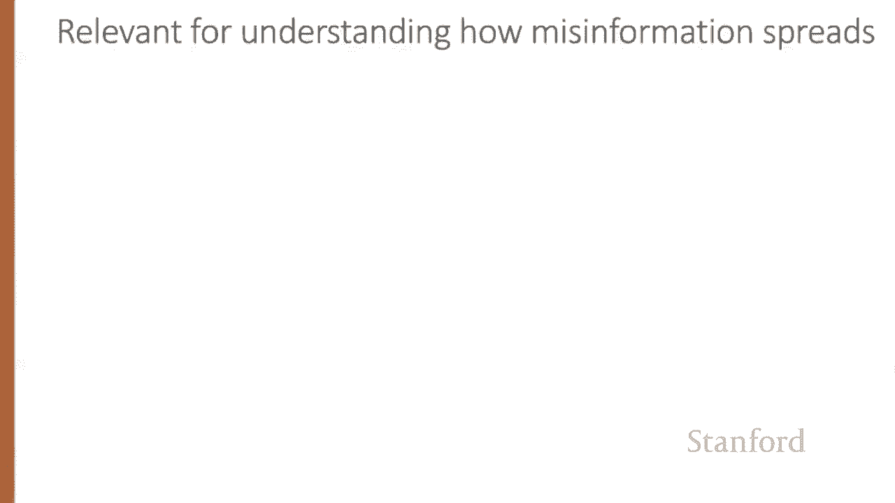
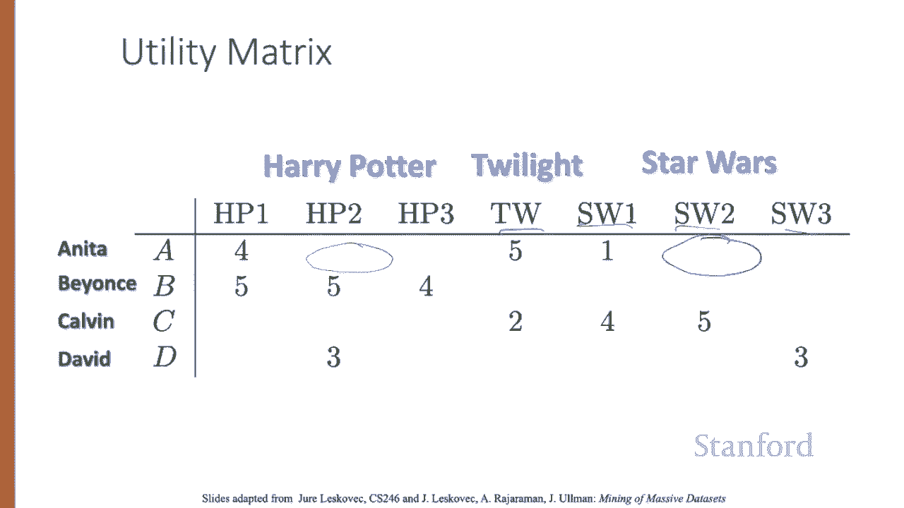
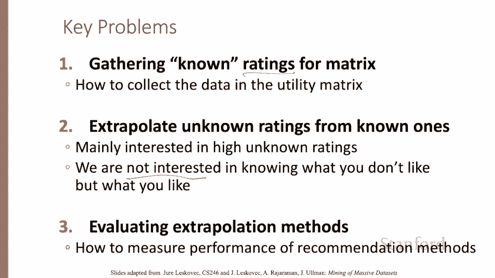
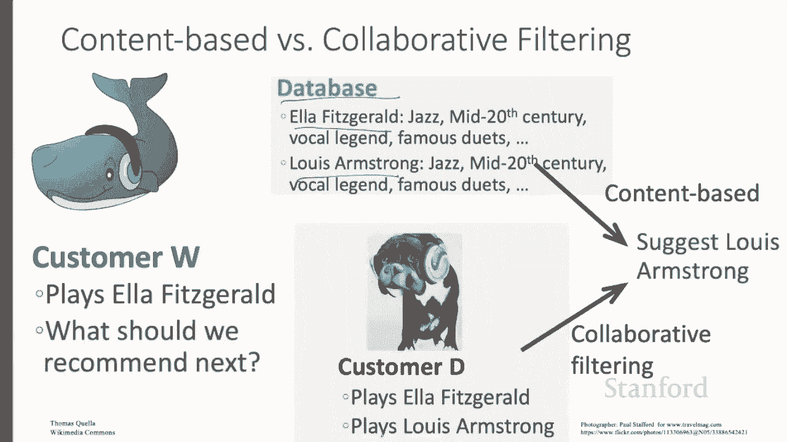

# P72：L12.1 - 推荐系统介绍 - ShowMeAI - BV1YA411w7ym

In this series of lectures， we introduce the task of recommender systems and the important collaborative filtering algorithm。

Here's an example of the recommender system task。  customer W here plays in El Fitzgerald's song。

What should we recommend to them next？A common setup of the recommender system task is the user is searching for something could be a product。

 a news item， a website。And the system returns recommendations。

That turns out to be a huge application space that billions of people deal with every day。

 sellers of products like Amazon or Alibaba， news aggregator sites like Apple， Facebook， Google。

 video sites like YouTube or Billy Billyly， providers of movies or music on demand like Netflix。

 Spotify， Apple Music。

Of course， there are many ways that recommendations happen。

 someone could curate a list of favorites or an outlet could publish some list of essential items。

 or we could rely on user data， but via simple aggregates like top 10 lists or most popular lists。

What we'll focus on today， however， is the third approach here。

 making recommendations tailored to individual users。

Knowing how these personalized recommendation systems work is relevant for building practical news or product recommenders。

But also， there are ethical dimensions of these systems。

 recommendation systems can spread misinformation and radicalization。

Developing solutions to this problem requires understanding how they work。

Let's see a formal model we'll have users and items。

Users have preferences for certain items represented as a utility matrix。

 giving a value representing for each user item pair what we know about the preference of that user for that item。

 Values come from an ordered set。 For example， integers from 1 to 5 representing the number of stars that the user gave as a rating for that item。

The matrix is sparse， meaning that most entries are unknown。

 We have no explicit information about the user's preference for that item。

Here's an example utility matrix representing ratings from users Anita， Beyonce。

 Calvin and David of movies on a one to five scale with five the highest rating blanks represent the situation where the user has not rated the movie。

The movie names are Harry Potter 123， Twilight and Star Wars 123。

The goal of a recommendation system is to predict the blanks in the utility matrix， for example。

 would Anita like Star Wars2。

In these lectures， we'll discuss three key problems in this space first， we need to get the ratings。

Second， the main problem for today predicting unknown ratings。

Note that we don't need to predict every blank entry in utility matrix。

 We just need to find some entries in each row that are likely to be high。 In other words。

 we don't care about unrecommding things the user might hate。And finally。

 we'll need some way to evaluate。

How do we get ratings？We could just explicitly ask people either to volunteer or we could pay them。

 and that can help in some tasks。But more often， we rely on implicit signals。

 learning the ratings from user actions。If someone buys a book or picks a song or finishes watching a YouTube video。

 that suggests it should have a high rating。This isn't a perfect solution。

 Maybe you looked at the video， but hated it， or maybe you bought the thing and hated it。Nonetheless。

 it's a reasonable heuristic。Note that this sort of rating system really only has one value。

One means the user like the item， and that's it。So often we'll see a utility matrix with this kind of data showing with zeros rather than blanks。

 but it's important to remember that zero is not a lower rating than one， it's no rating at all。

The utility matrix is really， really sparse， most people have not rated most items。

And we'll see what we call the cold start problem， new items have no ratings and new users have no history。

Sometimes if you register for a music site， they'll ask you questions like what genres you like to help mitigate the cold start problem。

That increases user retention at the risk of making users do extra stuff。

There are three main approaches to recommender systems。

We'll talk about content based and collaborative filtering systems。

We'll very briefly mention the more modern third architecture。

 latent systems based on neural embedding。Let's see an intuition of the difference between content based and collaborative filtering recommendation。

Heres customer W， who's playing that El Fitzgerald song。 What should we play them next？Well。

 here's one source of information， a database in which songs or musicians have content features。

 So we know that Ellen Fitzgerald is a mid 20th century jazz vocal legend who recorded many famous duets。

And hm， these content features tell us that Louis Armstrong is also a mid 20th century jazz vocal legend who recorded many famous duets。

Let's suggest Lou Armstrong。This is called content based recommendation。

An alternative source of information comes from customer D， who played an El Fitzgerald song， too。

 but also played Louis Armstrong。 So we might suggest Louis Armstrong for customer W， as well。

Systems that rely on using information from other users' choices are called collaborative filtering recommender systems。

We've introduced the idea of recommender systems， now let's see some details。

