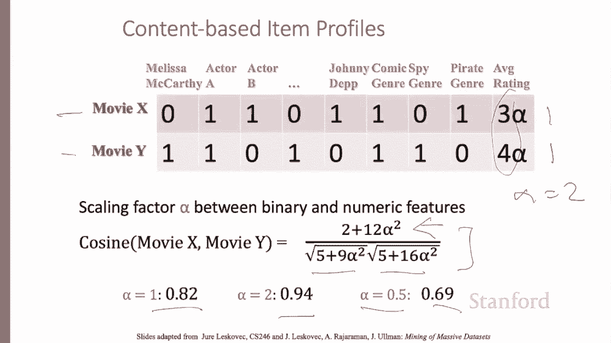
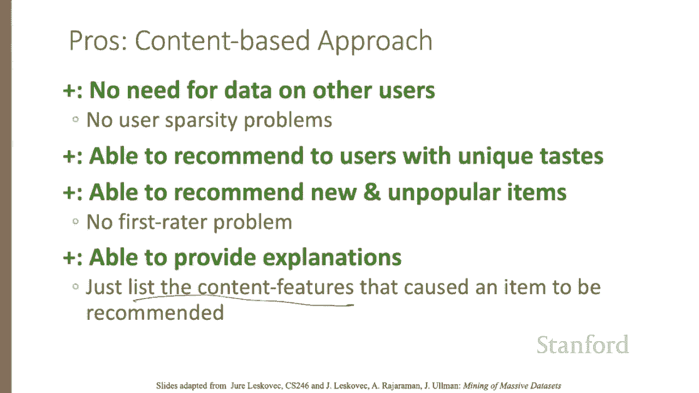

# P73：L12.2 - 基于内容的推荐系统 - ShowMeAI - BV1YA411w7ym

Let's turn to the first method。Recommenmdending based on features of the content itself。

The main idea of content based recommendation is to recommend items to customer X that are similar to things X already rated highly。

What do we mean by similar？Having similar content， so for movie recommendations。

 we could recommend movies with the same actors or the same director or genre。

Or for websites or blogs， we could recommend other sites with similar genre tags like cooking news or science news or similar words。

Here's our plan of action。 The user likes some items。

 and we have profiles for these items so we can build a user profile summarizing the items they like。

 This user seems to like red items and circles and triangles。

Now we can look in a database and match things that match our user profile。

So maybe this red object and this circle。And we can recommend them back to the user。

So we'll need to create a profile for each item， a vector of features。For example， for movies。

 a typical feature could be genre director actors for text we use sets of words。

How do we pick out these features？We set some by hand， for example。

 using our knowledge about movies to suggest that genre is important。

Others we can learn automatically， for words， we could use a subset， for example。

 by computing TF IDF features for words and including any word that had a height that had a high TF IDDF value in training。

Maybe we don't include the actual TF IDF value， but we just keep words that have a TF IDF value over some threshold and we create an element in our vector for each of those words。

 and we'll put a one in that dimension if a document has that word and a zero otherwise。

Here is a sample item profile for two items， Mo X， a Johnny Depp pirate movie， and Mo Y。

 a Melissa McCarthy comedy。Each item profile is a vector of binary values， ones or zeros。

But what if we want to have real or ordinal features too？For example。

 me and might want to add a feature for the average rating of a movie。This average is a real number。

That's fine， cosine still works with combinations of binary and real valued values in the cell。

We might， however， want to scale the non Boolean components with some alpha。

 so they neither dominate the calculation nor become irrelevant。

If we compute the cosine of the angle between the vectors for movies X and y。

 we can see that their dot product is 2 plus 12 alpha squared。

And the lengths of each of the vectors are 5 plus9 alpha squared square root and square root of 5 plus 16 alpha squared。

So there's the cosine of the angle between the vectors。If we choose alpha equals1。

That is we take the average ratings exactly as they are， then the value of that expression is 0。82。

If we use alpha equals 2。That is we double the value of the ratings， now the cosine is 0。94。

 so the similarity is higher。😡，Because we're emphasizing that these ratings are similar。

 three and four are pretty similar。By contrast， if alpha is only 0。5。

 then we'll get a lower similarity of 0。69。So the choice of alpha is very influential and that's something we'll need to set perhaps on a held outset to maximize our evaluation metric。

We not only need to create vectors describing items。

 we need to create vectors with the same components that describe the user preferences。

We can do this from the utility matrix representing the connection between users and items。

We could estimate the values for items the user likes as some aggregation of the profiles of those items like the average of the items with ratings。

For example， suppose items are movies represented by Boolean profiles with components corresponding to actors。

And the utility matrix has a one if the users seen the movie and is blank otherwise。

So if 20% of the movies have Melissa McCarthy in them。

Then the user profile for you will have 02 in the component for Melissa McCarthy。

Now that we have profile vectors for both users and items in the same dimensions。

 we can estimate the degree to which a user would prefer an item by finding the most similar item。

 which we can do just by computing the cosine distance between the user's profile and the items profile。

The content based approach has many advantages， it doesn't rely on sparse information about other users。

 we can recommend to users with unique taste if they just played an obscure song。

 we can play them another obscure song。And we can recommend new or rare items because they'll all have features that let us choose them。

 and the algorithm has transparency， we can explain to the user why we recommended the item just by listing the features。

On the other hand， the content based approach requires that we come up with the features。

 that's hard， and we do have a new user problem。We have to build a profile for a new user。

The content based approach also can give very non diverse suggestions。

 we never recommend items outside the user's content profile。And related to this problem。

 the content based approach is unable to exploit the quality judgments of other users。

 something that the collaborative filtering approach is designed for。

We've seen how to recommend items based on their content features。

