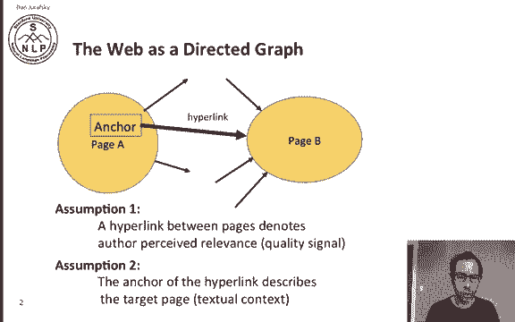
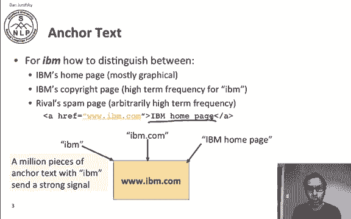
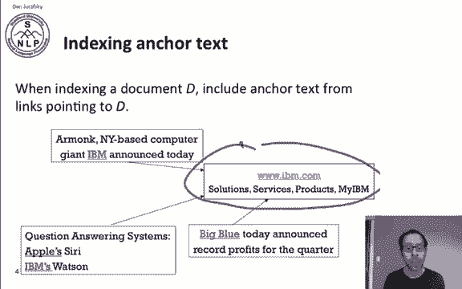
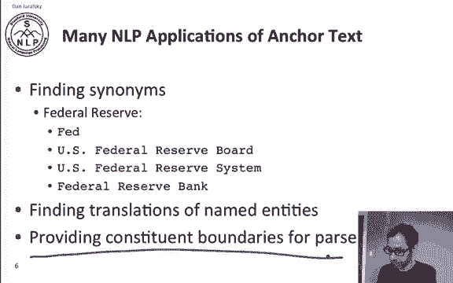
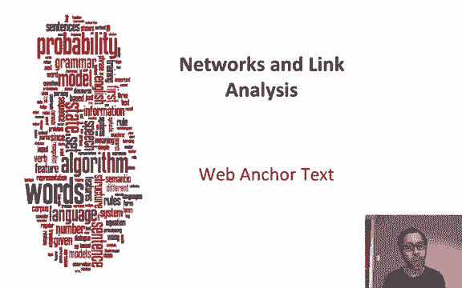

# P77：L13.1 - 网络锚点文本 - ShowMeAI - BV1YA411w7ym

Let's begin our discussion of networks and links by talking about anchor textext。

Now we can think of the web as a directed graph where any page has a link to another page and the link is via its anchor。

And we can make two assumptions about how Antex plays a role in deciding the page relevant in a search。

One is that a hyperlink between pages is an indication that the author perceive the second page as relevant to the first page。

 so hyperlink is kind of a vote from one page to another that the second page is relevant and the second assumption is that the anchor text to the actual text around this hyperlink is a description of the target page。

So let's look at an example。 Imagine that we're trying to find IBM's homepage and there's the homepage itself。

 which is mostly has logos and is very graphical and has very little text。

 There's maybe a copyright page full of the word IBM and maybe there's some arrival who has a spam page that has some arbitrarily high term frequency They have IBM repeated many times how are we going find what's the true IBM。

 Well the intuition is that a million pieces of anchor text from different pages pointing to IBM sends a strong signal so we have IBM the actual site we might have some string somewhere that says IBM or another one that says IBM co。

 another one that says IBM homeage。So the anchor text of this link， IBM homepage。

 is going to give us a queue that we're pointing at IBM。

 and if we add this up over all possible links， we're going to get a very strong cu about what's a good and relevant page。

So when indexing a document we'll just include the anchor text from all the links pointing it to that document in the index for that document。

 so we have our IBM page， www。ibm。com and we have some link that calls it IBM and another link that refers to the pages is IBM apostrop yes and another one that says big blue and we add all these into the index。

For this web page， this URL here， this document here。

 and that'll give us a lot of information about this page。

Now indexing An textex can have side effects， so there's the phenomenon of Google bombing where outside people create a lot of links pointing to a page and the links have anchor text that suggest that the page is about something else。

And we can solve some of these problems by scoring the anchor text with a weight that depends on the authority of the anchoror Page's website。

 so if we have a page point to another page in that and that pages say CNNnn。com or yahoo。

com and we decide it's authoritative， then we can trust the anchor text from them。

And there's many applications of anchor text besides just information retrieval。

 anchor text is a great way to find synonyms， so if we have a page referring to say the Federal Reserve Bank。

 we can look at the anchor text of all the pages that point to it and anchor textex might say Fed or US Federal Reserve Board or Federal Reserve Bank and that tells us that each of those is a synonym for Federal Reserve and we could do this not just in one language but many。

So we could see translations from another language pointing to say the Federal Reserve site。

 and that'll give us the foreign language translation of Federal Reserve， so that's very convenient。

And even inside a page， anchor text can help us by providing constituency boundaries for parsers。

 often in an anchor text describes a noun phrase， and so by looking at the boundaries of the anchor text that can help our parsers in doing a better job in parsing the sentence that the anchor textex is in。

So Web anchorer text is very useful both in indexing and in other language processing applications。

