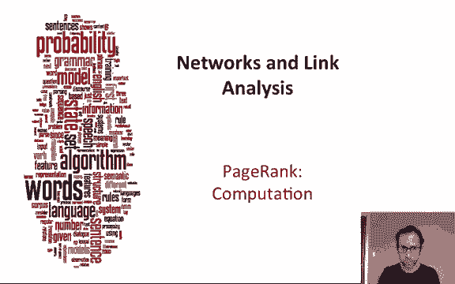
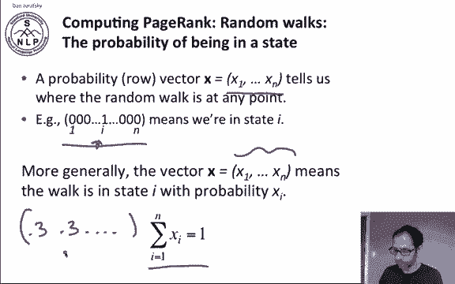
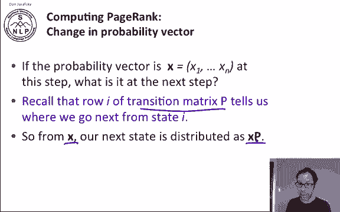
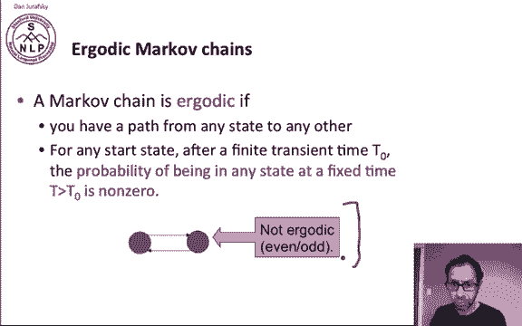
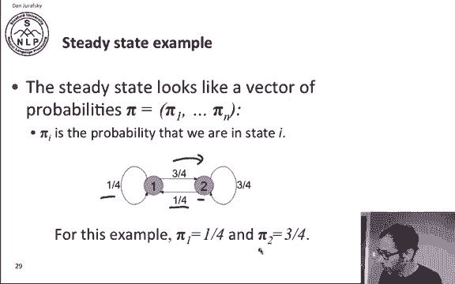
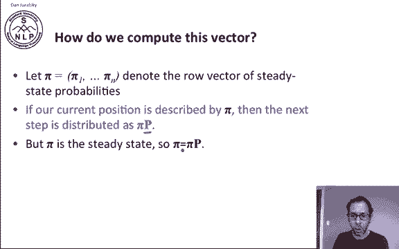
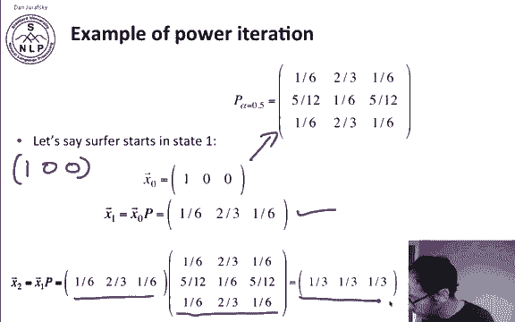
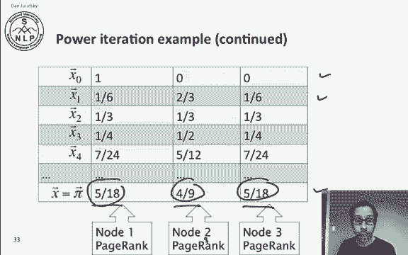
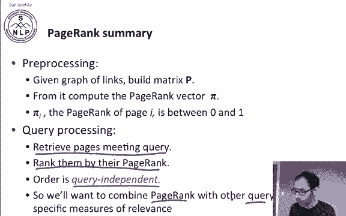
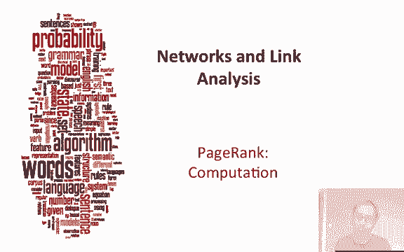

# P79：L13.3 - Pagerank计算方法 - ShowMeAI - BV1YA411w7ym

Okay， let's think about how to compute page rank itself。And to do that。

 we're going to have to think about what it means to be in a random walk。

So let's introduce a probability vector， row vector X and X will tell us where the random walk is at any point。

 so let's start with a simple version of x let's say that we're either in a state or we're not so with here's a let's say there's n possible nodes on the web。

Or states in our search in our walk and the vector is 0000 and then a1 at position I and then a lot of other zeros means that we're in state I。

 So if we the one means we're in state I and the zero means we're not in any of the other states。

 we're not in state 1 or state n or so on and we can generalize this to say that instead of using ones and zeros。

 we can have these x's be probabilities and so we can say that this vector probabilities tells us what the probability is of the walk being in state I at any point and of course these i have to sum to1 because there are pro。

 So instead of  zero is and ones， we can have 0。3 and 0。

3 and and so on as long as everything sums to 1 and that's going to be our row vector that tells us where we are in the walk。

So if our probability vector is a particular vector x and it has a certain set of values。

 the current state of the walk， where we are distributed over possible places we could be。

 what is it at the next step the next step of our walk。

 what is it and it turns out the transition matrix P is exactly designed to tell us that row I of that transition matrix tells us where we go from state I So if we're in state X right now that's the distribution over places we could be。

 then the next state is distributed by Xp， so we just multiply x by the transition probability matrix P and that will tell us what our next probability distribution over states is。

Now， a couple quick definitions。A Markov chain is ergootic if you have a path from any state to any other。

 and if for any start state after a finite transient time T0。

 the probability of being in any state at a fixed time T is non zero。

 so an even odd network where after a particular time T。We don't have a nonze probability of being。

 let's say at the even states if we're in an odd numbered time period。This is not an  Argoic network。

Now it turns out that for anergootic Markov chain， there is a unique long term visit rate for each state。

 so there's a steady state probability distribution pi so pi1 through pi N。

That's the probability for each state， probability of pi1 is the probability of long term ending up in state1。

 pi n is the probability of long term ending up in state N。

 and over a long term period we'll visit each state in proportion to this rate pi。

 so pi sub I is going to turn out to be the page rank of state I。

And it turns out it doesn't matter where we start。So let's look at an intuition。

 the steady state is of vector probabilities where pi sub I is the probability we' in state I so here's a little two two node graph and here pi sub1 is a quarter so you can sort of intuitively see that the probability from node two of going to node one is a quarter and probability if you're in node1 of staying in node one is a quarter So over the long run the probability that we're going to end up in node one is a quarter and where for node two we have both a loop back probability of being of three fourths and probably of going from state1 for three fourths So here the long-term visit rate is going to be three fourths。

Alright， so that's good for an intuition。But how do we compute this in a general case？So again。

 we have pi， the row vector of steady state probabilities。

And here's a fact if our current position is described by pi。

 then the next step is distributed as pi P because p is the transition probability matrix。

 so if we're at distribution over states now is described by pi， then by definition， the next state。

 the next step in our random walk is distributed as pi times the transition probability matrix okay。

But pi is the steady state， so by definition， pi is pi times P。

 we know that moving away the next step from the steady state brings us back to the steady state。

 and if we solve this equation， what we get is pi。

So pi is in fact the left eigenvector for the transition probability matrix P。

 and transition probability matrices always have largest eigenvalue 1。

 so this is going to be the principal eigenvector of P。

A simple way to compute pi is the power iteration method。 And let's see how that goes。

 recall that the definition of the steady state is that wherever we start we're going to end up in this steady state so we can start anywhere。

 Let's start with the distribution of with probability1 being in state 1 and probability 0 being in every other state。

And then we multiply by our transition probability matrix P。

 So after one step we're at X P after two steps we're at X P squared。And then an X P cubed and so on。

 So eventually means for some large K。X P to the K， we're at pi。

And so what we're going to do to estimate pi is just multiply x by increasing powers of P until the product looks stable。

 and we'll call that pi。So let's look at an example of power iteration。

We'll use the transition probability matrix we saw earlier with a 0。5 teleportation probability。

And let's say the surf starts in state one。That means that the state of the random walk is the vector x with a1 being in state 1 and a0 being in state 2 and a0 being in state 3。

 because there's only three states in this little example Okay， so there's x sub 0，10。

0 Now how do we compute x sub 1。So we're going to multiply x of0 times p。

We multiultply this vector by this matrix。And that's going to give us one，6， two3，1，6。

So in that this is our current state after one iteration。And after two iterations。

 we're going to multiply again by x1 by the transition probability matrix P。

 so we have the current state times the transition probability matrix。

 and that's going to give us a new distribution over possible states。

And if we continue this process from 10，0 through 16 to 316。

 all the way until we reach a steady state， we're going to get a steady state of 518s，4/9s， 518。

 so that's going to be the long term visit rate for node1， node 2 and node 3。

And that's going to be the page rank of node1， the page rank of node2 and the page rank of node 3。

So in summary， for page rank in preprocessing， we take the adjacency matrix of the web。

 the graph of links and we build our probability matrix P with whatever teleportation probability we like from that we compute the page rank vector maybe by power iteration and then pi subi the page rank of page I is going to give us a number between zero and1 So now with query time we're going to retrieve all the pages that match our query。

 we're going to rank them by their page rank and notice that this ranking is query independent。

 so page rank doesn't even look at the query it's a static fact about the structure of the web so when we use page rank in any kind of information retrieval algorithm。

 we're going want to combine it with all the other query specific measures of relevance all of our TFIDF and cosines and so on that take the query into account。

So PageDnk an important way to compute the relevance of a page。

 which is an important factor in finding a relevant result for a query。

