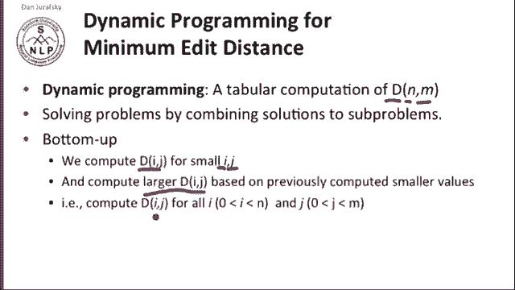
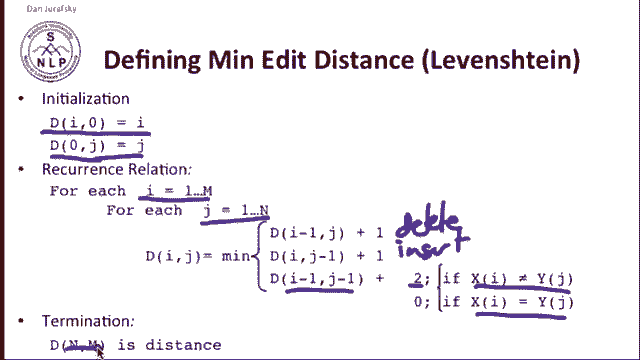
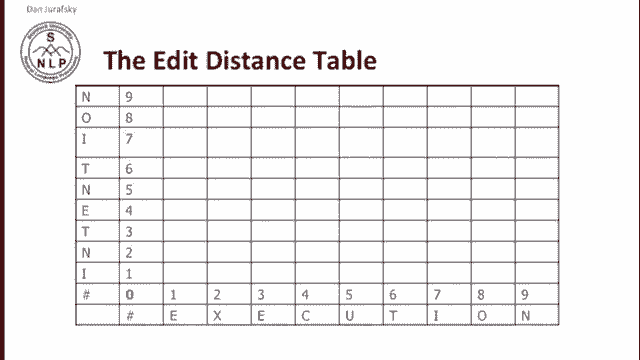
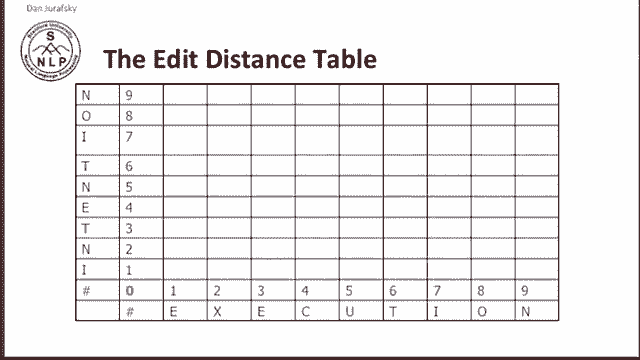
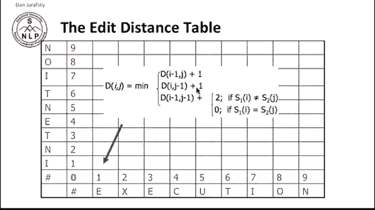
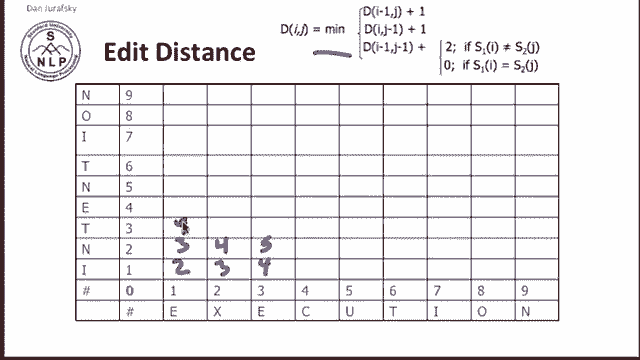

# P8：L2.2- 最小编辑距离计算 - ShowMeAI - BV1YA411w7ym

How are we going to compute minimum at a distance？The standard algorithm is with dynamic programming dynamic programming is a tabular method of computation and what we're going to do is we're going to compute D。

 the distance between two strings X and y X of length n Y of length M by combining solutions to subproble and combining solutions to subproble is the intuition of all dynamic programming algorithms。

 The intuition is very simple。 we're going to for small prefixes of length I of string X and J of string Y we'll compute the distance between those strings and we'll compute our larger distances for larger strings based on those previously computed smaller values。

 In other words， we're going to compute the distance Ij。

Between prefixes of string x of length I and prefixes of string y of length J for all I and J will end up in the end with the distance。

So let's look at the actual equation， here's the equation for defining minimum at a distance。

 and I've given you Leevennstein distance， which is the distance when there is a cost of one for insertions。

 one for deletions， one and two for substitutions， excuse me。

So let's look at the initialization condition。 so the we first say that。Any characters in X。

 So this is the。X string for for the I characters and X string。

 the distance between those and the null string and y is the cost of deleting each of those characters。

 So the cost of those is the length of the string we're deleting each character and similarly for inserting all the characters into Y to create the string Y。

 the distance between the null string of X and the string of y is just the length of y。

 the insertion cost of y。 and then we'll do the recurrence relation。

 So walking through string X and walking through string Y。

We'll have that the distance in any particular cell of our matrix is going to be the minimum way of getting to that cell from three previous cells。

 If we go from the string eye， that's one shorter， so we're deleting。One more thing in eye。

To make it J， or we're inserting one thing into J to make it longer。

 or we're substituting between the previous string。I of length， I'm x of length。

 I -1 and y of length J -1。 We're adding in a new character。 If it's the same in both strings。

 we have a cost of 0， If it's different， we have the substitution cost of2。

 and then at the end the distance between the two strings is simply the。Is simply the the D of N M。

 the upper right corner of the matrix。 So here's our table。

And we can fill in each element of the table from using this equation that tells us the deletion cost。

 the insertion cost， and the substitution cost。

So let's do that。I put the equation up here up here in the corner。

 so we want to know what's the distance between the null string of intention and the null string of execution。

 obviously zero。 the null string， the string I to the string， nothing is the cost of deleting an eye。

 that's one。So now let's try to compute what's the cost of converting IN to E。

 while intuitively we expect it's going to be a deletion and a substitution。

So let's see if that works out。Alright， so the。Element in this cell is the minimum of three values。

 It's this distance plus1， this distance plus 1， or this distance plus either2。

 if I and 0 are different or 0， if they're the same。 Well， they're different。

 So it's the minimum of I plus 1， which is 2。1 plus one， which is2 or 0 plus 2， which is2。

 so we have two， so we're going to write two in this cell。Similarly。

 if we want to know the distance between IN and E， it's the minimum distance of IN to nothing plus1。

 so 2 plus1 or3。Wuer。The different distance between I and E plus the cost of adding in that n or 3。

Or the cost of having just an eye。And adding in that n to E substitution， which is2 or three。

 So again， we have three here。 so we have a two。And we have a three。

 and if we continue along this manner， again in each case。

 looking at the three previous cells and using this equation over here。We'll slowly end up with。

And so on。if we continue along this in this manner。

 we're going to end up with the following complete table。

Every cell in this table， let's take this cell tells you the cost of the edit distance of editing the string INTE and turning it into the string EXE。

 and that means that this value here in the upper right corner is the cost。

 the edit distance between intention and execution。

 the cost of turning intention into execution and we see the value8。

 which we earlier said was the Leevenstein distance， so we have Leevenstein distance equals。

That's our algorithm for computing minimum at a distance。

