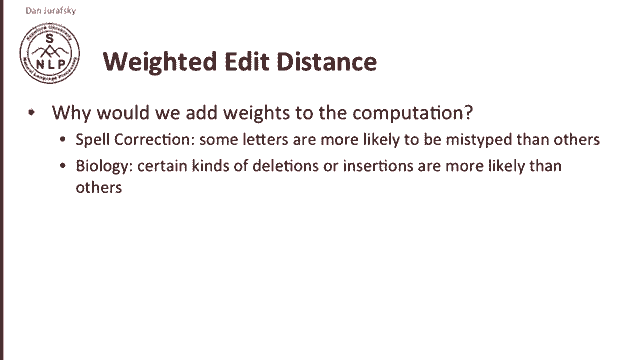
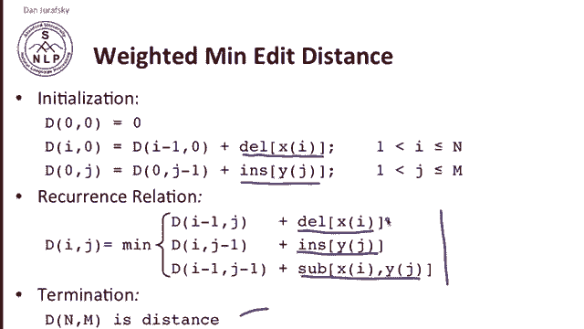
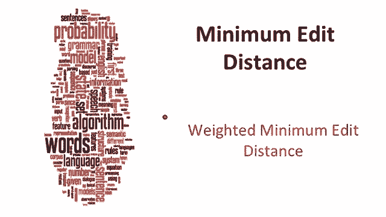

# P10：L2.4- 加权的最小编辑距离 - ShowMeAI - BV1YA411w7ym

At a distance can also be weighted。Why would we add weights to the computation of at a distance？

Think about particular applications in spell correction。

 it's obvious that some letters are more likely to be mistyped than others while in biology。

 because of the constraints of the subject matter， some kinds of deletions or insertions are more likely than others。

 so for example， in spelling。

Here's a confusion matrix for spelling errors。So if you look at this confusion matrix。

 you can see that E is very likely to be confused with A。Or O and E。 So vowels tend to be confused。

But it's very unlikely to confuse。A and B。 So A's are confused with E's and I's and O's and U's and so on。

 So they theyre the kind of spelling errors people make。Have systematicity to them。

 so not just confusing vowels with vowels。But also the fact of the keyboard means that you're likely to make errors either using the homologous finger on the other hand or using nearby keystrokes。

 so the constraints of the domain in this case we're talking about spelling or maybe we're talking about biology are going to make some edits more likely than others。

So we're going to represent this by modifying the algorithms slightly to add weights。

 So in Lestein distance， we have the cost of one for insertion。

 one for deletion and two for substitution in weighted minimum meta distance。

 we simply add a special cost that we look up each time。 So initialization。

 instead of just adding one for each dele， we have the actual cost of each deletion and we add up the deleions of each of the symbols that we delete。

 And instead of having just one for insertion， we have a cost for each insertion and we add them all up。

 and similarly， in the recurrence relation， we're going to add a special deletion insertion and substitution cost。

 how much does it to delete that particular character insert that particular character。

 and then we'll end up with the same termination condition。

 So we'll just add separate little lookup tables that will tell us what the deletion insertion and substitution costs are for each symbol。

By the way， where did the name dynamic programming come from？

Here's some quotes from Richard Bellman's autobiography Bellman was the one who invented diamondmon programming。

 and amusingly he tells us that he came up with the name for diamond programming really as a public relations move to make an algorithm sound exciting。

So this is one maybe be one of the first algorithms that was named in a branding way to make an algorithm sound exciting。

So there's our in some our algorithm for weighted minimum at a distance。

