# 【双语字幕+资料下载】斯坦福CS124 ｜ 从语言到信息(2021最新·全14讲) - P11：L2.5- 计算生物学中的最小编辑距离 - ShowMeAI - BV1YA411w7ym

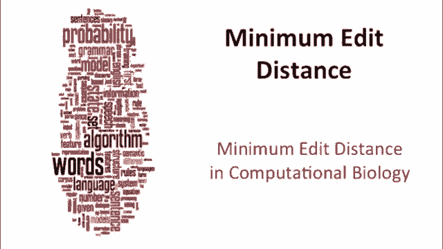

There are a number of advanced variants of minimum at a distance that play a special role in computational biology。

 so recall that in computational biology， what we're aligning is sequences of nucleotides or sometimes proteins。

And our job is to take two strings like this and produce an alignment like this。

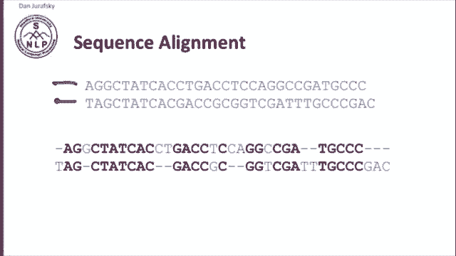

So。In biology， this is important for a number of。Reasons we can be finding regions in the genome。

 we could be discovering functions of genes， we could be looking for evolutionary things by comparing different species。

 This is also important for assembling fragments so DNA sequencing。

 we're going to be trying to assemble fragments and we want to look for overlapping pieces we'll talk about overlapping pieces and find some matches between them find that these two pieces match and we're comparing individuals and looking for mutations。

 finding places where there are similarities and differences。

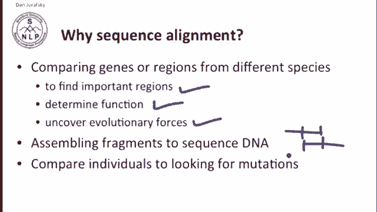

In general， in natural language processing we talk about distance。

 ciing at a distance and minimum at a distance， so we're minimizing distance and we're computing weights for things in computational biology。

 we're talking about similarity so we're maximizing similarity so we're asking how similar two things are so we're trying to maximize something and we generally talk about scores rather than weights。

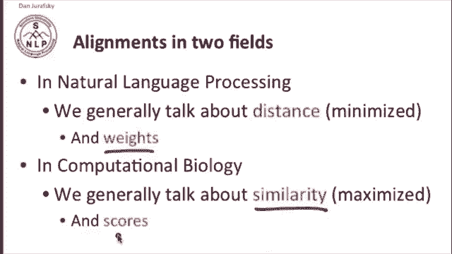

So in computational biology， the standard minimum meta distance algorithm that we've just looked at is called Neman Wech。

And I've shown you the algorithm here， but it's the same thing that we saw before。

 although in general we're just going to keep we'll use D to mean the cost of insertions and deletions and we'll have a little S value for the substitution。

 the positive or negative value of substituting things and in general in biology we'll talk about a positive cost for things that match a positive。

Value for things that match and a cost for things for deletions and insertions。

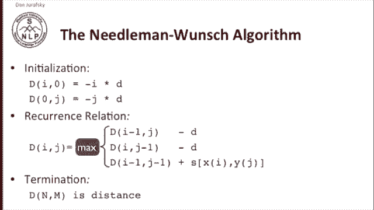

So here's the needleman wech matrix and notice that as opposed to what we did in natural language processing in general and computational biology。

 we put the origin at the upper left。So let let's first look at some variants that are important in computational biology。

 So one is cases where it's possible to have unlimited gaps at the beginning and end of a string and this happens exactly when we have two little sNPps of DNA and we know that the endpoints of one might overlap with the ends of another。

 but there might be something else going on in other places so here's one long sequence and here's another long sequence。

 but it's just this piece of this sequence and this piece of this that might overlap so we don't want to penalize the fact that there's other things going on before here or after here so we'd like to modify the algorithm so it doesn't penalize gaps at the end。

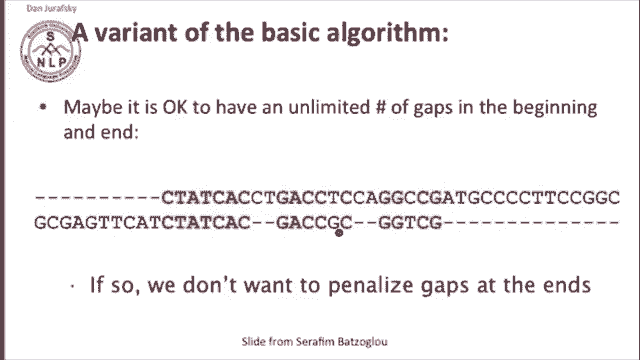

And in fact there can be various different kinds of overlapping of this sort。

 this might happen when we're doing sequencing and we have overlapping reads。

 or it might be that we're looking for a piece of a gene inside another piece。

 and so we have a subset piece inside a larger piece。

So the variant of the dynamic programming algorithm that we use for overlap detection。

 the overlap detection variant， we'll just make a few small changes。

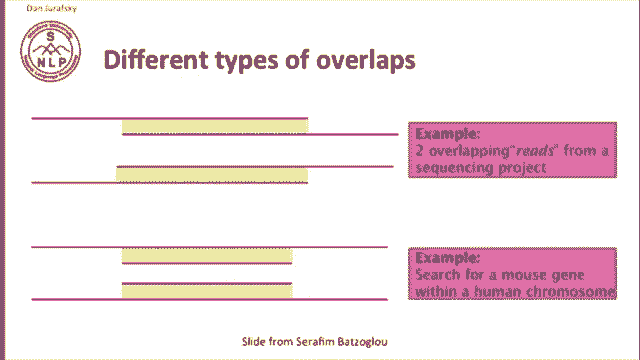

In the algorithm。So first， we just change the initialization so that。

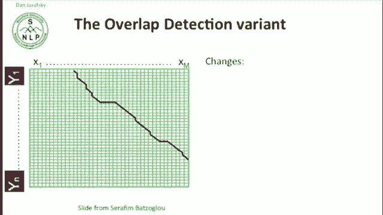

It doesn't cost us anything to start from a long string and delete everything or insert everything。

 So it used to be that we had we had minus I minus I star D here。 and we had minus J， star D here。

 and we've gotten rid of those because its we're allowing ourselves to start at a path at a random point way out here in the intersection。

 So we're we're。Allowing ourselves to start at zero cost here and not be penalized for not matching all these things up till here。

 so we're looking for again， edge overlaps。And now for our termination condition。

 we're going to look for the start from not from the upper right corner because we're allowing a match not to go all the way to the edge。

 but we'll find the place along the final column or the final row where we have the maximum value and we'll trace back from there。

So in this case， our maximum value is here in this last column and we'll trace back from there。

A similar extension of the needleman lunch or the standard dynamic programming algorithm for string at a distance is the local alignment problem so here's the local alignment problem we have two strings。

X of length M and y of length n。 And we want to find two substrs whose similarity is maximum。

 So imagine that here's x and here's y。 we'd like to out of this these two strings。

 we'd like to find these two these substrs， CC， G， G G， that's the largest similar substring。嗯。

So it's， it's very similar to the overlap detection variant we saw。

 except not only do we allow ourselves not to to ignore previously on。

aligned sequences at the beginning and end， but also anywhere。

 so we can basically have our maximum alignment be somewhere in the middle as it is here。

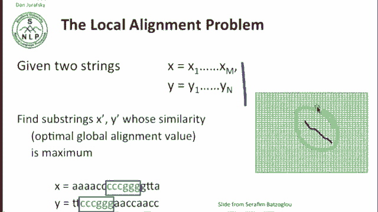

So in order to modify the Needman Wech algorithm to allow any kind of local alignments。

 the new version is now called the Smith Waterman algorithm。And we're first going to allow。

 as we did for the overlap detection variant。Allow the initialization conditions to be zero both for x and Y。

 so we don't penalize ourselves for initial strings。

 and now we're going to make one more modification。

 which is that in each cell when we're looking at the possible places we could come from to choose the alignment we're going to not only pick the maximum of the three previous cells。

 but we're also going to add a maximum of zero， so we're going to let ourselves since in in biology we're talking about maximizing similarity when things get very different and we have a very negative score we're just going to start over again from zero。

Allowing ourselves to just throw away regions that don't align at all。

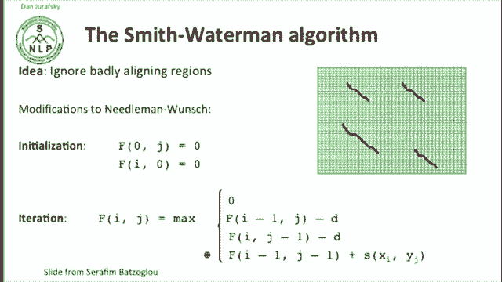

The termination condition of the Smith Waterman algorithm depends on what we're looking for if we just want the best local alignment。

 we'll pick the place that's maximum in the entire array and we'll trace back from there。

If we want all the local alignments that score greater than some threshold T。

 then maybe we'll find some place that's greater than T。

 find all those places and trace back all of them。 Now this gets complicated by the fact that there can be overlapping local alignments so we might have two alignments like this and it might be that they actually overlap tracing back so there can be some complications here but if you want the best local alignment that's actually much easier。

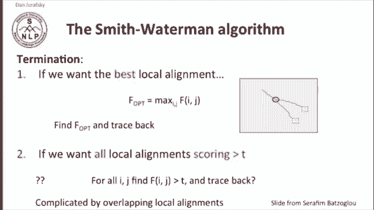

So here's an example of local alignment， so let's imagine that we're getting one positive point every time two symbols match and a negative point for any deletion insertion and substitution。

 and then let's look for all the local alignments between these two strings， ATC A and A ATC。

And if we fill in the matrix， again we start with zeros everywhere because we're doing local alignment。

We see two。If we then look for regions cells that have a maximum distance to trace back from。

 we see two of these cells。So one of them。Corresponds to the alignment A T C A T to A T T A T。

 So we have four strings that match one mismatch。 So that's going to be a distance of3。

And the other one of them over here corresponds to the alignment between ATC and ATC where we have three matching symbols。

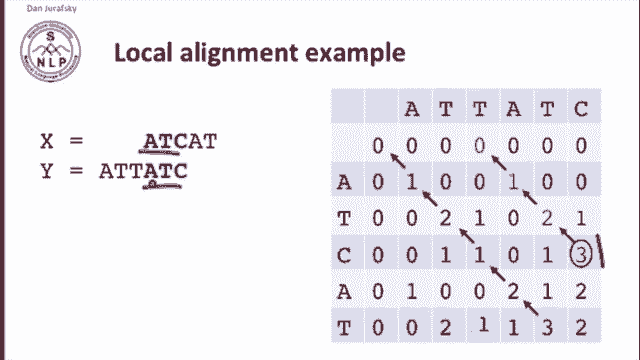

So those are some of the more advanced variants of at a distance that we see in computational biology。

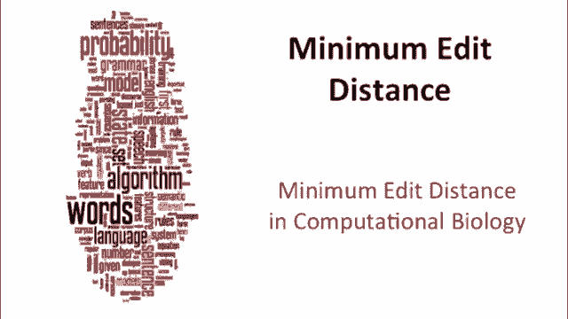