# P13：L3.2- 计算N.gram的概率 - ShowMeAI - BV1YA411w7ym

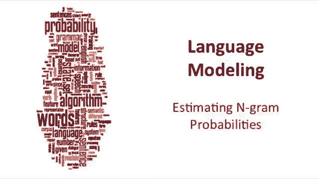

How do we estimate these NGM probabilities？Let's look at bygram probabilities。

 the maximum likelihood estimate for a bygram probability。The probability of a word I。

 given the previous word I -1， we just estimate by counting。

 we count how many times did word I -1 and I occur together。

 and it divide it by how many times word I -1 occurs。

 So it's like saying of all the times that we saw word I -1。

 How many times was it followed by word I。And we'll use the notation count sometimes and sometimes for simplification。

 we'll just refer to a C， we'll use C for count。So the joint count of word I minus1 and I divided by the count of word I minus1。

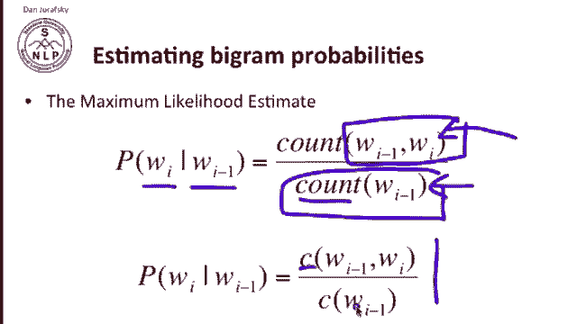

So let's walk through an example。 So we have， again our equation the probability of word I。

 given the word I -1 is the maximum likely estimate is just mean right I right ML estimated by the maximum likelihood estimator as this this count over this count。

 And let's look at let's make up a corpus。 So here's our simple corpus borrowed from Dr Seus。

 So we have three sentences。 Each one starts with a special token start of sentence and ends with a special token end of sentence and the very short sentence is I am Sam。

 Sam I am。 I do not like green eggs and ham。 and let's compute some language model probabilities from this small corpus。

So first， probability of I， given the start symbol。 So that's computed as count of。Start symbol。

Coma I。With that big eye。Over count of start symbol。So。I is the follows of start symbol twice， one，2。

And the start symbol occurs three times  one， two，3， so that probability is two third。Or 。67。

 so that's the probability of I given start。And you can see examples of lots of different probabilities here。

 so for example， let's just pick another one at random， the probability of SA， given the word am。

 how many times does am comma Sam occur？It occurs。Once。So that's one。

And the denominator is how many times does M occur？And that occurs twice。

So that's going to be one over two， so there's our probability of say'm given here and so on。

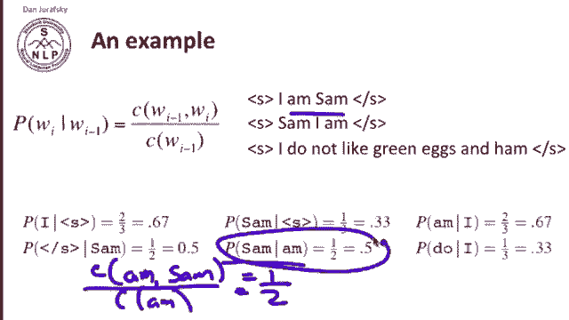

So let's look at a larger corpus in order to get some more realistic count and the corpus we're using here was collected from a dialogue system that answered questions about restaurants in the city of Berkeley。

 California and here's the kind of sentences that were in this corpus Can you tell me about any good Cantonese restaurants close by or mid-ped Thai food is what I'm looking for tell me about Chapenese now here's some sentences and let's compute some emgramms based on these sentences。

So first， let's start with the raw bigram counts from this small corpus of just under 10。

000 sentences。So what I'm showing you here is a bygram count table。

 So here's the word I is followed by the word I five times the word I is followed by the word want 827 times the word want is followed by the word2 680 times The word2 is followed by the word eat 686 times and we've just put some sample words up here。

 I picked I want to eat Chinese food lunch spend just to show you some words that might occur together in a sentence and some other words and you can see a lot of these words a lot of these probabilities are zeros。

 a lot of these counts I'm sorry are zeros because it just happened in this small data set that want was never followed by want So that's this zero here or Chinese was never followed by the word2 here。

OK。So in order to turn these counts into probabilities。

 all we have to do is normalize by a unigram count because remember the probability of a word I given the word I minus1。

Is the count of word I minus1 word I over the count of word， I minus1。

 So we need to divide these joint counts of the two words by the count of the previous word。

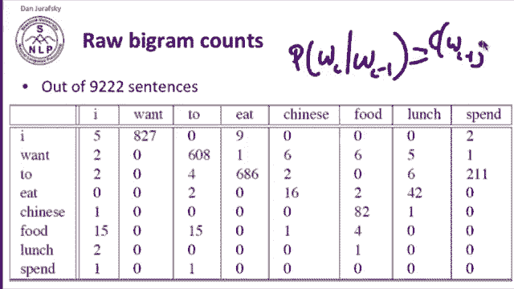

Here's the unigram counts we're going to need to compute those probabilities。

 so here's the count of I， it's 2533， here's the count of E， it's 746。

 and using the equation we can now compute the bygram probability， the probability for example。

 of2 given want， how likely given that the previous word was want that the next word is2 and it's pretty likely。

 for example， 0。66。But notice that things with counts of zero still have probabilities of zero。

 lots of things have zeros here。So now that we've computed all of our bygram probabilities。

 we can now estimate the probability of a sentence， that's our goal for language modeling。

 simply by multiplying together all the component probabilities。

 so the probability of start of sentence， I want English food end of sentence is the probability of I given start。

 times the probability of want given I times the probability of English given want。

 food given English， start given food and so on。

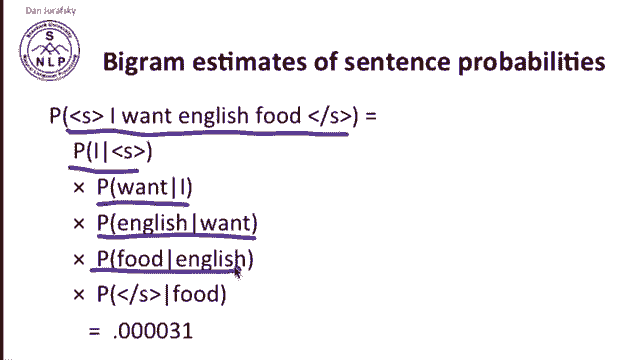

What kinds of knowledge are expressed by these bygram probabilities？Why， for example。

 is the probability of English given want lower than the probability of Chinese given want？Well。

 probably that's because Chinese food is more popular and more people are going to ask about it and so wanting Chinese is more likely than wanting English so that's a fact about the world。

 it's a fact about cuisines， not so much effect about English。

What about the probability of two given want being so high？Now that's a fact about grammar。

 that's the fact that the verb want in English requires an infinitive after it's a want。

Has infinitives。And that's a grammatical fact。That's grammar， grammar。

And what about the probability that want， given that the previous word is spend is zero？

So that zero seems to be caused by a grammatical fact。 Spend want is two verbs in a row。

 that kind of verb doesn't seem to be grammatically possible in English。

 So that zero is caused by a grammatical。

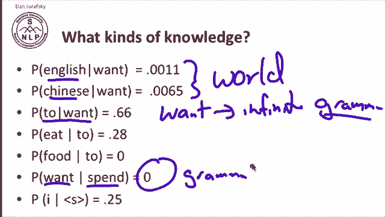

Disallowing， how about this zero？What's why is the probability of。Food。Following 2， zero。

Now here this zero is a contingent zero， this， you could imagine a sentence that has two food in it。

 I'd like you to stop and think about a sentence like that yourself。Good。

 it just happens that such a sentence never occurred in the training data。

 so this is a contingent zero where this is a structural zero。Alright， let's move on。In practice。

 we don't keep these probabilities in the form of probabilities。 In fact。

 we keep them in the form of log probabilities。 and there are two reasons for this。

 One is we can avoid underflow if you think about it。

 if you have a very long sentence and you're multiplying together 20 or 30 or 40 little tiny probabilities。

 each of which is a very small number less than zero when you multiply so many small numbers。

 you get a very small number that often ends up with arithmetic underflow in the computation。

 and so we want to avoid this kind of underflow and it turns out that adding is faster than multiplying anyway。

 So again， instead of multiplying four probabilities。

 we'll in general just add for log probabilities and we're going to store our language models in logs。

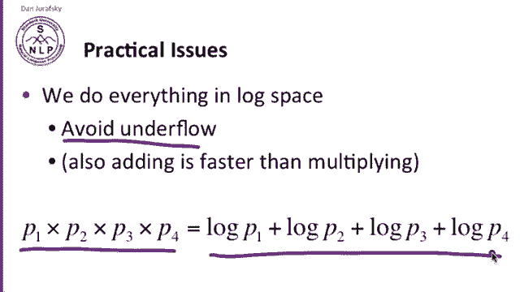

There are a number of publicly available language modeling toolkits one of them。

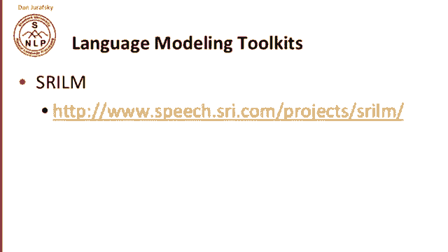

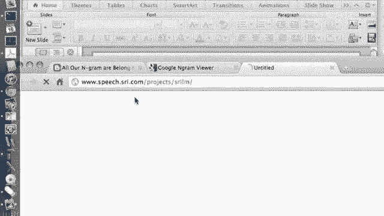

SRI Lm。And so you can download SRILM。Another publicly available resource is the Google Engrams release。

 so this has been out for over five years now， we released a trillion word corpus。

 over a trillion5 grams and 13 million unique words。

 so a huge data set which you can download and use for your any kind of Ngram applications you'd like to use。

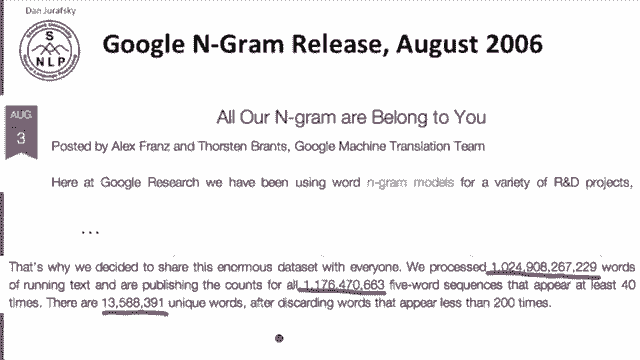

So here's an example， some of the data from the Google Engram release。

 some for gra counts for for gras beginning with serve as the in words beginning with IEN。

 so this is a very big corpus and you can see that serve as the indication occurred 72 times on this web corpus and have more information on the Google web corpus there。

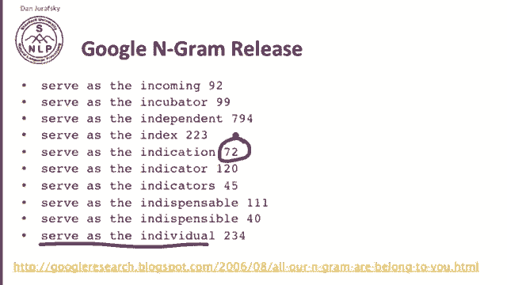

Another publicly available corpus is the Google Book En Graham corpus， let's look at that。

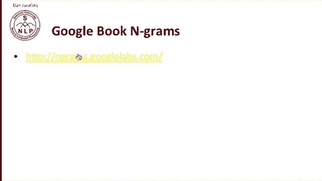

So， this corpus。Lets you plot counts of words in Google Books。

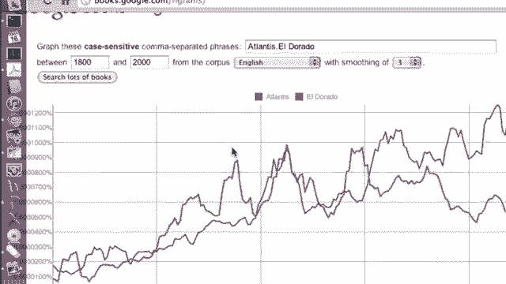

And a number of corpora are available for American English， British English， Chinese。

 French and German， and various kinds of corpora， which can all be downloaded。

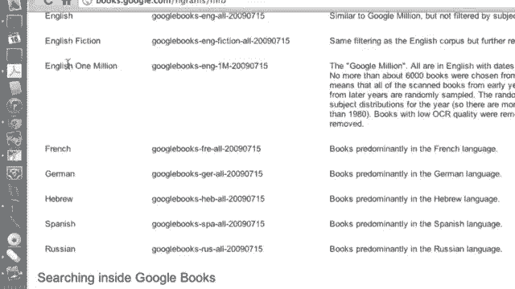