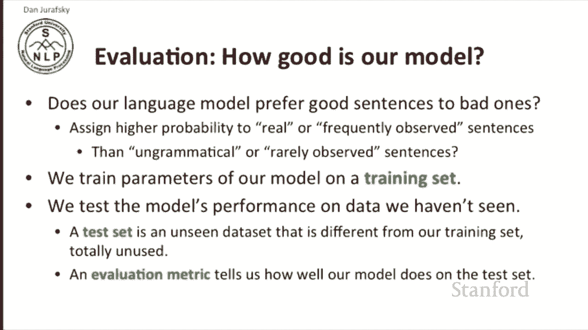
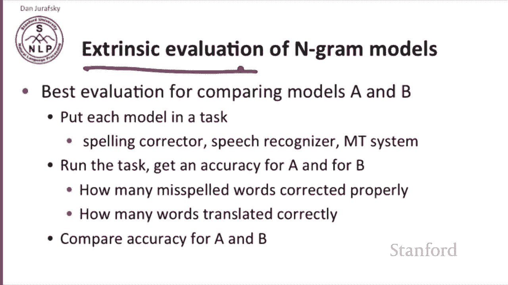
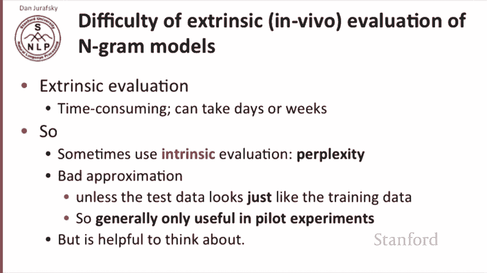
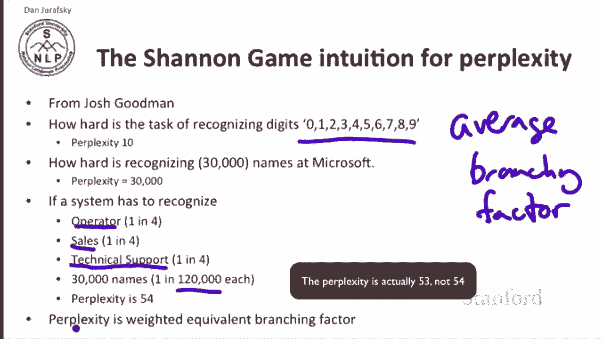
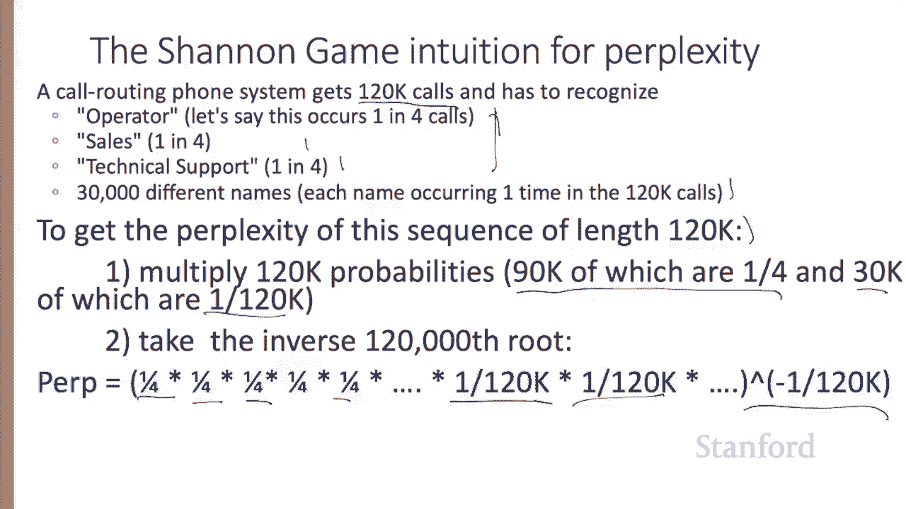
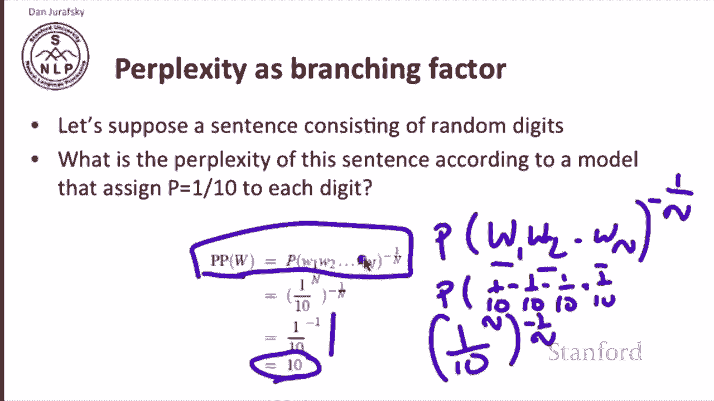
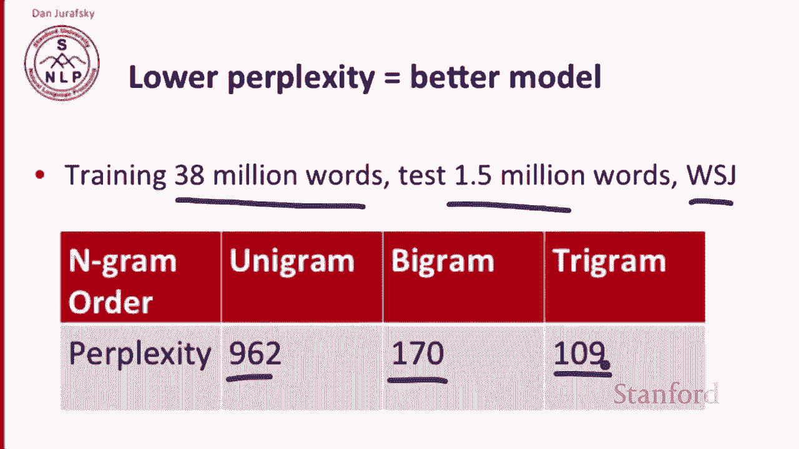
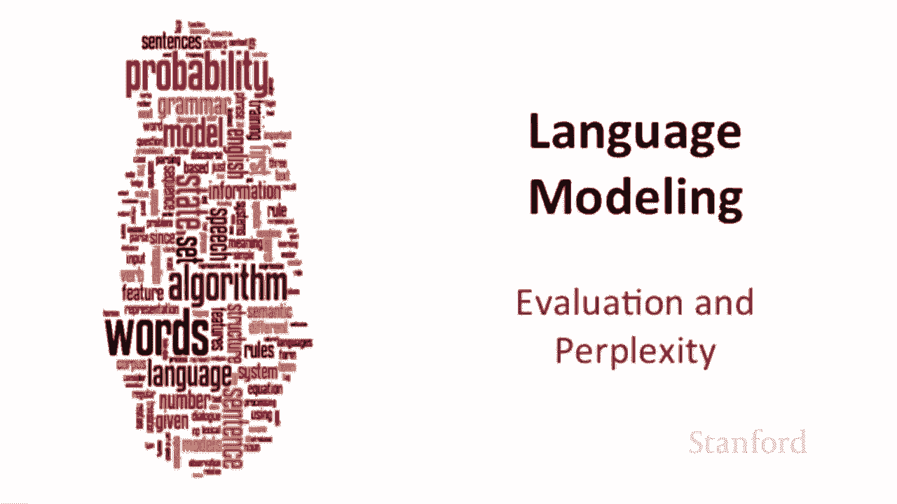

# 【双语字幕+资料下载】斯坦福CS124 ｜ 从语言到信息(2021最新·全14讲) - P14：L3.3- 评估准则(perplexity／困惑度等) - ShowMeAI - BV1YA411w7ym

嗯。Every natural language processing tool has to be evaluated and language models have to be evaluated as well。

What does it mean to a language model to be a good language model in general we say a good language model is one that is better at finding the good sentences and predict and liking them more than the bad sentences or more specifically。

We want to assign a higher probability to real or perhaps frequently observed sentences than ungrammatical or impossible or at least rarely observed sentences。

 so that's the goal of our evaluating a language model Now we train the parameters of a language model on a training set。

嗯。And we test the model's performance on data that we haven't seen。

 so we have some training data and some unseen data。

 this unseen data is called a test set and we want it to be something that's not the same as our training set totally unused。

 we've never looked at it before and that will be a fair evaluation of our model and then we'll need an evaluation metric that tells you how well does your model do on this unseen test set。

So what are these evaluation models， the best evaluation。

 best way of comparing any two models to language models A and B。

 is to put each model in a task so we're going to build our spelling corrector or speech recognizer or empty system。

 whatever our application is that uses language models we'll put our language model in there and now we'll run our task and we'll get some accuracy for the system running with model A。

 the system running with model B， perhaps that's how many misspelled words are corrected properly if we're doing spelling correction or how many words are translated correctly if we're doing translation。

 and now we just compare the accuracy of the two models。

 whichever model has a higher accuracy is the better language model。

 so this is called extrinsic evaluation we're using something external to the Ngram model itself and looking at our performance on that external task。

The problem with this kind of extrinsic evaluation is also called in vivo evaluation。

I that it's time consuming in many cases this can take days or weeks for a modern machine translation system or a modern speech recognition system。

 running evaluations can often be extremely slow。So instead。

 what we sometimes use is an intrinsic evaluation， something that's about intrinsically about language models themselves and not about any particular application。

 and the most common intrinsic evaluation is called perplexity。

Now perplexity happens to be a bad approximation to an extrinsic evaluation unless it turns out that the test data looks a lot like the training data。

 so generally perplexity is useful only in pilot experiments。

 but it does help to think about the problem and it's a useful tool as long as we also use extrinsic evaluation as well。

So let's think about the intuition of perplexity and like many ideas in language modeling。

 this dates back to Claude Shannon。So so Shannon proposed among many other things。

 a game about word prediction， how well can we predict the next word so for example we've seen sentences likeI always order pizza with cheese and and our job is to predict the next word。

So from this first sentence， we might say， well， a good language model might guess that we are likely to have mushrooms and likely to have pepperoni and maybe less likely to have an chvies because anchoves are somewhat less popular than mushrooms and very unlikely to put fried rice on our pizza and extremely unlikely let's say to have and and although people I guess do say and and after the word and。

And so how well the model predicts the actual words that occur is is how good the model is So a model on a sentence like the 33rd president of the US we know the next word is very likely to be JFK or John or Kennedy or some word like that。

 So this is a pretty predictable case here we have I saw anything could come next So in some cases we're going to be much better predicting the next word in some cases very much worse。

 but a good language model on average should do better than a bad language model Now it turns out that ungrams are very bad at this game。

 And if you think for a second， you'll realize why。So in summary， a better model of text。

 a better language model is one that assigns a higher probability。

 assigns a higher probability to whatever word actually occurs if you can guess right the next word。

 you are a good language model。So the best language model is one that best predicts an unseen test set or assigns on average the highest probability of a sentence to all the sentences that it sees。

 if I see this test set and I assign， you give me a new test set and I assign a probability to each of those sentences。

The better language model is the one that says， oh。

 I knew that sentence was coming and assigns it a very high probability。Now the perplexity。

 this new metric that we're going to be using。Is the probability of the test set normalized by the number of words。

 so we'll take let's say our test set is a long sentence and n words long。

 so we'll take this nword sentence， we'll take its probability and we'll take the one over we'll take the the n root so and we'll take the inverse of it so it's a way of normalizing for the length of the probability so take this long sentence。

 take the probability the whole sentence and normalize by the number of words because obviously long sentences。

 the longer the sentence the less probable it's going to be so we want some normalizing factor so we can compare test sets of different length。

 so that's the nro of one over the perplexity of a string of words W is the n through of one over the probability of the string of words so this parenthees should be here。

So by the chain rule。That's the probability of this string of words1 through n is the probability over I。

 sorry I'm sorry， the product over I of the probability of each word given the entire prefix beforehand。

And so we've just by the chain rule replaced the probability of a long sequence with the product of the probabilities of each word given its prefix and then for bygrams by our mark of approximation to the chain rule。

 we can say that the probability we've replaced the probability of a sequence of words with the product of a bunch of bygrams。

 so the perplexity of a string of words is the n through of the product bigram probabilities multipied together and inverted。

 so it's just a function of the probability of the sentence。So because of this inversion。

 minimizing perplexity。Is the same as maximizing probability。

There's another intuition for perplexity also based on Shannon。

 and this example comes from Josh Goodman， and this second intuition for perplexity relies on the idea that perplexity is the average related to the average branching factor。

Perplexity at any point in a sentence is on average how many things could occur next and we'll see later this is related to the probability of the upcoming things as related to the entropy of the upcoming things。

 but roughly speaking if I had10 possible words that could come next and they were all equal probability my perplexity would be 10 so for example if I'm recognizing the 10 digits。

Then the perplexity of the task is 10， there's 10 possible things that could come next and I can't decide between them。

If I have to to recognize if I'm building a speech recognizer for a switchboard phone service。

 and I have to recognize 30，000 names， then the perplexity of the names is 30。

000 if they're all equally likely。But suppose a system has to represent， has to recognize。

 let's say again a phone， a switchboard phone operator。

 automatic phone operator has to recognize the word operator and that occurs a quarter of the time。

 the word sales that occurs a quarter of the time or the word technical support that occurs a quarter of the time and then with one over 120。

000 times each another 30，000 names occur， so now we have to take the weighted average of all these possibilities of what could occur to compute on average how likely is any one word to occur and now the perplexity is 54。

So the perplexity again is the weighted equivalent branching factor。

 Let's see the intuition for that last number。 Let's suppose a call routing system gets 120。

000 calls。 So with a sequence of 120000 calls。 And again， we're assuming that operator occurs 1。

 four times sales1 four times technical support 1 in four times and the other 30。

000 times we're getting 30000 different names。 What's the perplexity of this sequence of length 120 k。

 So to get the perplexity， we're going to multiply 120000 probabilities。

90000 of these are one out of four That's all of these and 30，000 of these are one out of 120000。

 and then we're going to take the inverse 120000s route。

 just like any other sequence of text of length，120000。

So the perplexity is a quarter， times a quarter， times a quarter， times a quarter， 90。

000 times times one over 120，000， one over 120，000， 30，000 times， and then we take the one over 120。

000 root of that。

And we can simplify this arithmetically to just a n equals4 case where we have operator with probability 104 sales  one4 tech support one4 and 30。

000 names each with a one over 120，00th probability， so that's。A quarter of the time we get this。

 quarter of time we get this， quarter time we get this， quarter of time we get this。

 and then we take the negative one over four root， and that's your 52。6 perplexity。

So let's examine this new kind of perplexity， the weighted equivalent branching factor and show that it's the same as this inverted。

Normalized probability metric。So let's take a sentence consisting of random digits。

What's the perplexity of this sentence according to a model that assigns？

Equal probability to each digit。So we'll see the perplexity of the sentence， this string of digits。

 let's make it。Sent doesn't matter how long it is， so we have a bunch of digits and the probability of this bunch of digits。

 we'll call them digit1 digit2 through digit N。The perplexated by our first metric is negative one is the probability of this sequence to the negative one over in。

And since we've said that each of these words has probability 110， 110。

 and we're assuming a unigram probability， so that's the probability of 1/10 times 1/10th。

Times1/10th， times  one10th and so on。 So that's the problem， that's one/10th。To the end。

Because there were n words to the negative one over n。And as we can see over here。

 that's equal to the ends cancel we get1/10th of the minus1 or we get 10。

 so by thinking about perplexity as the normalized probability of a long string。

 we can sort of see the intuition that the average branching factor by normalizing for the length。

 we're sort of asking how many things can occur at each time weighted by their probability。

All right， so now perplexity in general， the lower the perplexity the better of the model so for example here's where a training set trained on 38 million words tested on on 1。

5 million words from the newspaper of the Wall Street Journal and a unigram model has a perplexity of 962。

 a bigram model has a much lower， much more accurate perplexity of 170 and a trigram model has even a lower perplexity。

 so perplexity since it's modeling something like average branching factor or average predictability。

 the lower you get the better you are predicting the actual data that occurs。

