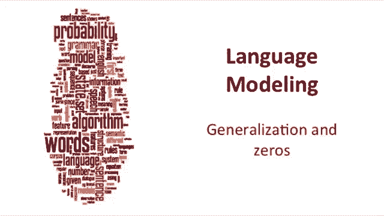
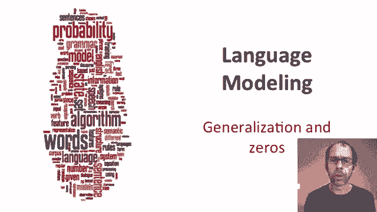
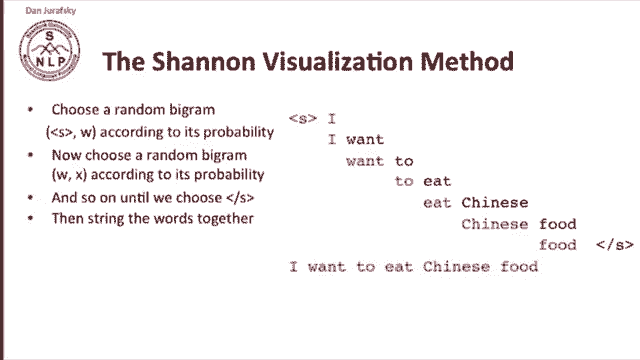
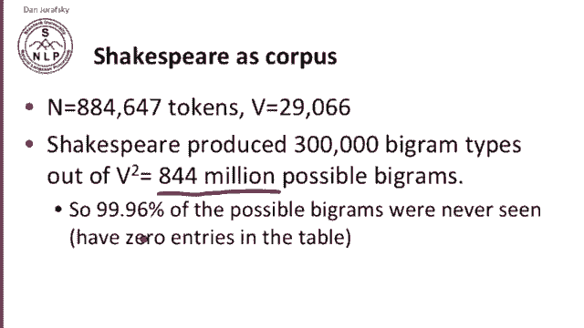
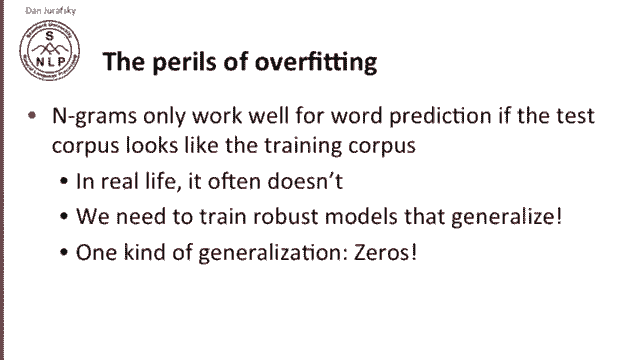
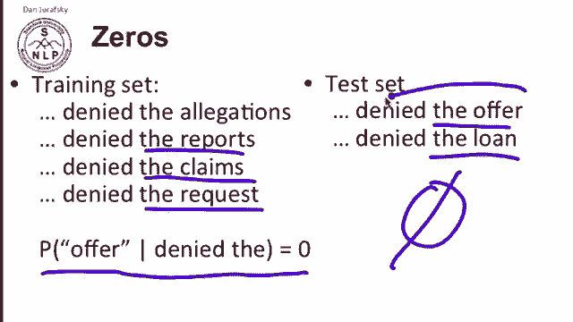
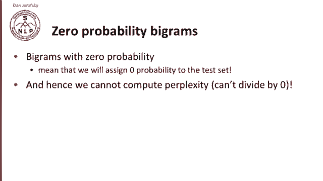
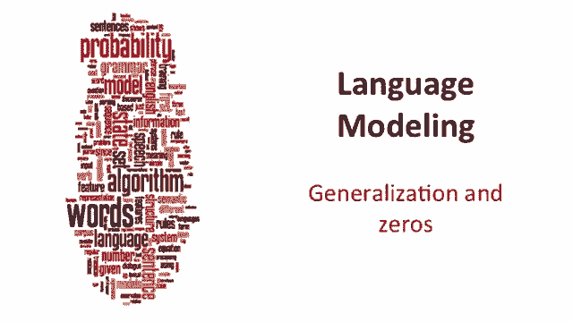

# 【双语字幕+资料下载】斯坦福CS124 ｜ 从语言到信息(2021最新·全14讲) - P15：L3.4- 泛化与0处理 - ShowMeAI - BV1YA411w7ym

We saw earlier that lots of times probabilities or counts of bigrams or trigrams would be zero。

 what do we do in these cases？

Let's think about this by starting with what's called the Shannon visualization method。

 and this is what Shannon proposed to visualize the actual n gram grammar that you've built by maximum likelihood estimation。

 so here's the method we choose a random bigram according to its probability so this is a bigram。

With start as the first word and then any other word， according to its probability。

 roll a die and pick whichever bigram comes up。So let's say we picked I is very likely first word。

 so we picked start I as our first bi。 Now we choose another random diagram that starts with that word W we just generated and whose next word is chosen according to its probability。

 So now we picked want So then we've picked I want and now we go on until we happen to choose the end of sentence So I want to to eat eat Chinese Chinese food。

 food end of sentence out there we go So now we string these words together and we've generated a sentence。

So the Shannon visualization method can show us a lot of things about the Ngrams that we've built。

 So， for example。

Here's a grammar language model trained on Shakespeare。And generating random sentences。

So here's some unigram sentences， every enter now severally so let Hill he late speaks or。

Not very good sentences。 How about our bi gras。 Why dost stand forth thy canopy forsooth。

 He is this palpable hit。 the King Henry。 Live King。 Fo。 Oh， is it better。

 This is a beginning to sound like Shakespeare。 How about this one。Indeed。

 the Duke and had a very good friend。 Well， that sounds pretty good。

 Set print falsealstaff shall die。 And now's look at the quadroograms。 It cannot be， but so。

Will you not tell me who I am， that sounds very good。Now， Shakespeare produced 800。

000 words with a vocabulary of 30，000。And it turns out that in those 800，000 words。

 he produced about those 30，000 words， he produced about 300，000 different bigram types。

 so different word unique pairs of words， but that's 300，000 out of 30。

000 squared or out of 844 million possible bigram so if we multiply that out 99。

96% of the possible bigrams were never seen， they also going to have zero entries in the bigram table。

 vast number of zeros。

So that's just bigrams， quadriograms are even worse。

 so the reason why those quadriograms look like Shakespeare is because those were actual Shakespeare sentences because following any particular quadriogram really only one possible word could occur in such a small corpus as Shakespeare。

And we can see that if we look at a different corpus like the Wall Street Journal。

 it's not Shakespeare。So for example， here's some trigram sentences from the Wall Street Journal。

They also point to $99。6 billion from $2004063% of the rates of interest stores as Mexico and Brazil on market conditions。

 No sounds like the Wall Street Journal。 But here's two corpora of English。 you know。

 both reasonable size corpora millions of words， or at least a million words。

 No overlap at all in the Shakespeare sentences and the Wall Street Journal sentences。

So what's the lesson from this One lesson is the perils of overfitting N gras only work well for word prediction if the test corpus looks like the training corpus。

 if you test on Shakespeare and but you trained on the Wall Street Journal。

 you're not going to predict words very well So in real life this just doesn't happen。

So we'd like to train robust models that do a better job of generalizing。

And I want to talk about one kind of generalization， which is dealing with zeros。

 so by zeros I mean things that never occurred in the training set but do occur in the test set。

So let's look at some zeros， imagine that in the training set。We had。

Phrases like denied the allegations， denied the reports， denied the claims， denied the request。

 and we never saw denied the offer， so the probability based on maximum likelihood estimation of offer given denied the is zero。

Now we go to a test set and we see there's a sentence denied the offer and denied the loan。

 what's the probability of those？Sequences denied the offer denied alone going to be。

 well the probability is going to be zero because our we've trained our probabilities on our training set。

 we're going to do a very bad job if we're a speech recognizer we'll never recognize this phrase if we're a machine translator we'll refuse to translate into this phrase we're going to claim this phrase is just not good English so this is a big problem we need to solve。

So bigrams with zero probability。Mean that we're going to assign zero probability to the test set。

 and so we can never compute perplexity， we can't divide by zero。

 so we're going to need to find a way of dealing with biograms with zero probability。

