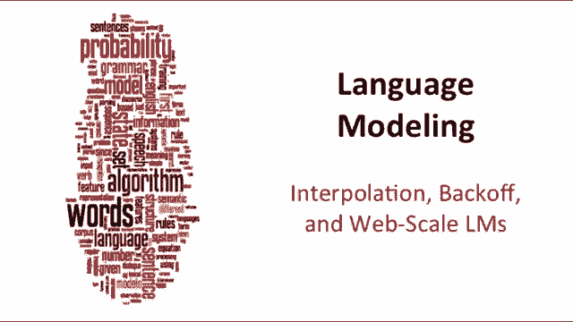
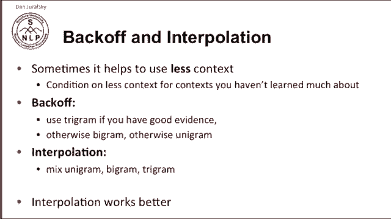
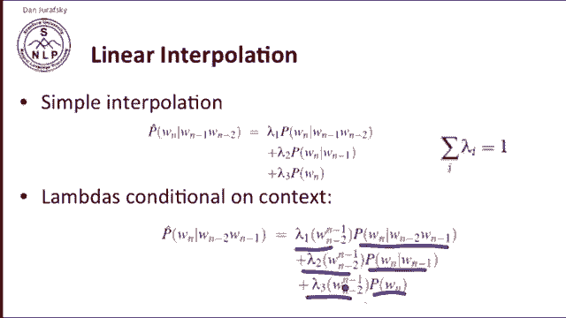
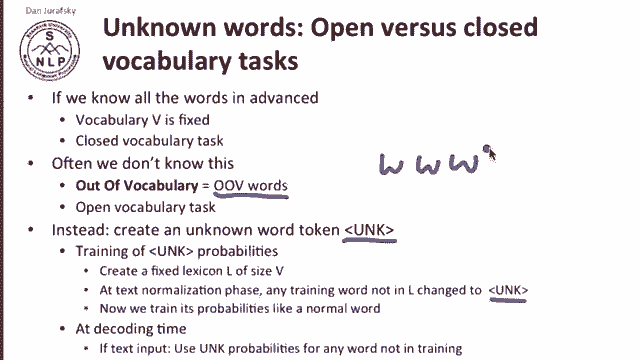
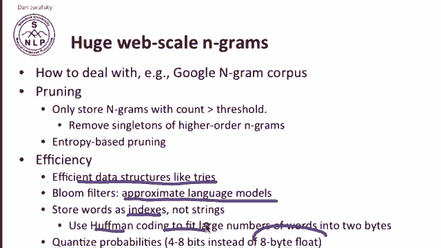
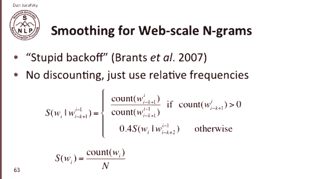
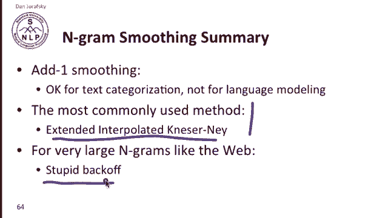
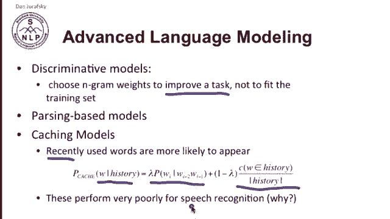
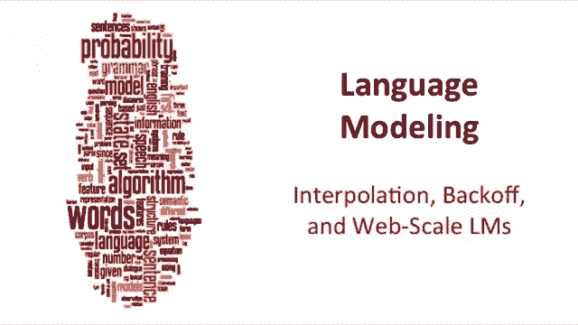

# 【双语字幕+资料下载】斯坦福CS124 ｜ 从语言到信息(2021最新·全14讲) - P17：L3.6- 插值、后撤及大型语言模型 - ShowMeAI - BV1YA411w7ym

Let's talk about cases where we need to interpolate between or back off from one language model to another one。

 and we'll also touch on the web today。These are cases where it helps to use less context rather than more。

And the intuition is suppose that you have a very confident trigram。

 you've seen a trigram a very large number of times。

 you're very confident this trigram is a good estimator， or we should use the trigram。

 but suppose you only saw it once。Well， maybe you don't really trust that trigram so you might want to back off and use the bigram instead。

 and maybe you haven't seen the bigram either， so you might back off to the unigram so the idea of back off is sometimes if you don't have a large count or trustworthy evidence for a larger order engram。

 we might back off to a smaller one。Our related idea is interpolation interpolation says well。

 sometimes the trigram may not be useful and in that case if we mix trigrams in bigrams and unigrams。

 well then we may get more information from the unigrams and bigrams。

 but other times trigrams will be more useful and so interpolations suggest that we just mix all three all the time and get the benefits of all of them and it turns out in practice that interpolation works better than backup so most of the time in language modeling well be dealing with interpolation。

There are two kinds of interpolation。Simple linear interpolation， we have our unigram。Our bigram。

And our trigram， and we simply add them together with three weights， Lambda 1， Lada 2 and lambda 3。

 The lambda is just summed to1 to make this a probability。And， and。

And we can compute our new probability， we'll call it P hat of a word given the previous two words by interpolating these three language models。

We can do something slightly more complicated， we can condition our lambdas on the context so we can say still mix our trigram our bigram in our unigram。

 but now the lambdas are dependent on what the previous two words were so we can train even richer and more complex context conditioning for deciding how to mix our trigrams in our bigrams in our unigrams。

 so where do the lambdas come from。

The normal way to set Lambdas is to use a held out corpus。

 so we've talked before about having a training corpus。

 so here's our training corpus and our test corpus。

A heldout corpus is yet another piece that we set out set aside from our data and we use a heldout corpus sometimes we use a heldout corpus calls a dev set。

 a development set or other kinds of heldout data we use them to set meta parametersas and check for things So in this we can use the heldout corpus to set our lambdas and the idea is we're going to choose lambdas which maximize the likelihood of this heldout data So here's what we do We take our training data。

And we train some engrams。Now we say which La does？

Would I use to interpolate those ngrams such that it gives me the highest probability of this held out data。

So we。Wei。Ask， find the set of probabilities。Such that the log probability of the actual words that occur in the heldout data are highest。

Now we've talked about cases where there are zeros。

 so we haven't seen some bigram before and we have to replace that zero count with some other count。

 that's smoothing， but what do we do if the actual word itself has never been seen before？

Now sometimes that doesn't happen in tasks where let's say a menubased task where where we have a fixed set of commands。

 then no other words can ever be said， our vocabulary is fixed and we have what's called a clothes vocabulary task。

 but lots of times language modeling is applied in cases where we don't know any words could be used and there could be words we'd never seen in our training set。

 so we call these words OOV or out of vocabulary words。

And one way of dealing with out vocabulary words is as follows， we create a special token called Unc。

And the way we train the unc probabilities is we create a fixed lexicon。

 so we take our training data and we first decide which we hold out a few words。

 the very rare words or the unimportant words， and we take all those words and we change those words to Unnc。

Now we train the probabilities of Unc like a normal， any normal word， so we have our training corpus。

 it has word， word， word， and has a really low probability word， word， word， word。

 and we'll take that word and we'll change it to Unk。

And now we train our bigram word word word uncoror word word。

 as just as if Unk had been a word in there， and now at decoding time。

 if you see a new word you haven't seen， you replace that word with Unnc and treat it like get its bigram probabilities and its trigram probabilities from the unCord in the training set。

Another important issue in Ngrams has to do with web scale or very large Ngrams。

 so we introduced the Google NGms corpus earlier， how do we deal with computing probabilities in such large spaces？

So one answer is pruning we only store n gras that have a very large count， so for example。

 the very high order ngrams， we might want to remove all of those singletons。

 all things with count one because by Zif's law there's going to be a lot of those singleton counts and we can also use other kinds of more sophisticated versions of this where we don't just remove things with counts we actually use compute the entropy or the perplexity on a test set and remove counts that are contributing less to the probability on a particular held outset。

So that's pruning， and we can do a number of other efficiency thing。

 we can use efficient data structures like triess， we can use approximate language models which are very efficient。

 but are not guaranteed to give you the exact same probability。

 we have to do efficient things like don't store the actual strings but just store indices。

 can use Huffman coding and often instead of storing our probabilities as these big8 byte floats。

 we might just do some kind of quantization and just store a small number of bits for our probabilities。

What about smoothing for web scale Ngrams？The most popular smoothing method for these very large ngrams is an algorithm calledSt backoff。

Stupid backoff is called stupid because it's very simple， but it works well at the very large scale。

 and in fact it's been shown to work as well as any more complicated algorithm when you have very large amounts of data。

And the intuition of stupid back off is if I want to compute the stupid back off probability。

Of a word given some previous set of words。I use the maximum likelihood estimator。

 this the count of the words divided by the count of the prefix。 If that count is greater than zero。

 and if not， I just back off to the to the probability of the previous。

The lower order Ngram prefix with some constant weight。So if the trigram let's say occurs。

 I just use the count of the trigram， if it doesn't， I take the bigram probability multiply by 0。

4 and just use that and then when I get down to the unigrams， if I don't have anything at all。

 I just use the unigram， I just use the unigram probability。嗯。

We call this S instead of P because stupid backoff doesn't produce probabilities。

 because to produce probabilities， we would have to actually use various clever kinds of weighting a backoff algorithm has to discount this probability to leave some mass left over to use the bigram probabilities otherwise we're going to end up with numbers that are greater than one and we won't have probabilities。

 but so stupid backoff produces something like scores or rather than probabilities。

 but it turns out that this works quite well。

So in summary for smoothing so far， add1 smoothing is okay for text categorization。

 but it's not recommended for language modeling， the most commonly used method we'll discuss in the advanced section of this week is the kaseerni algorithm or the extended interpolated kaseerni algorithm。

 but for very large ngrams like situations where you're using the web。

 simplistic algorithms like stupid backoff actually work quite well。

How about advanced language modeling issues？Recent research has focused on things like discriminative models。

 so here the idea is pick the Ngram weights instead of picking them to fit some training data。

 whether it's maximum likelihood estimate or smooth。

 instead choose your Ngram weights that improve some task so we'll pick a whatever task we're doing machine translation or speech recognition and choose whatever Ngram weights make that task more likely。

Another thing we can do is instead of just using Ngrams。

 we can use parsers and we'll see the use of parsers and statistical parsers later in the course。

Or we can use caching models in a caching model we assume that a word that's been used recently is more likely to appear again。

 so the probability， the cache probability of a word given some history。

 we mix the probability of the word with some function of the history how much how often the word occurred in the history and we wait those two probabilities together it turns out that cache models don't work in certain situations and in particularly they perform poorly for speech recognition。

 so you should think about why that might be that a cache model performs poorly for speech recognition。

