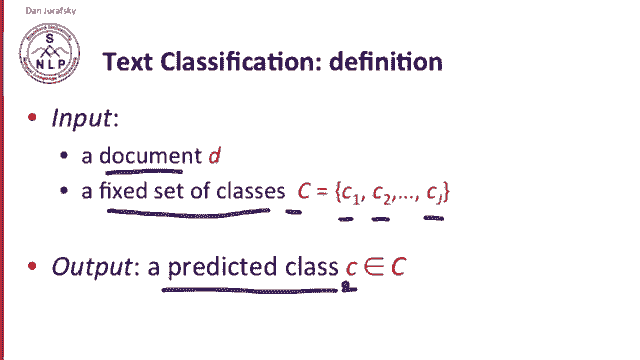
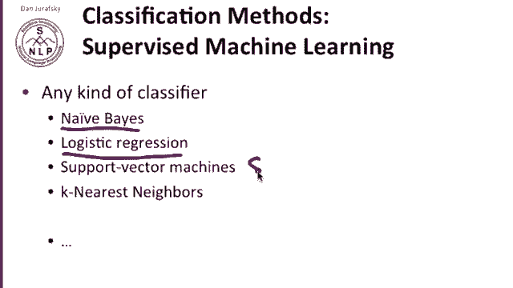
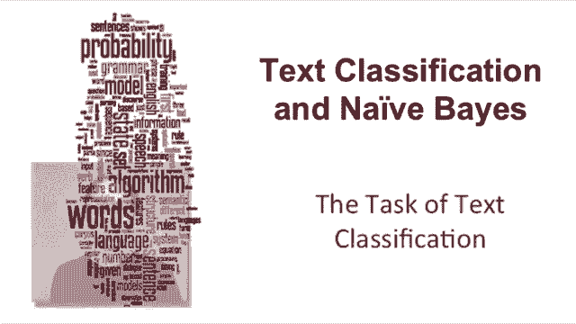

# 【双语字幕+资料下载】斯坦福CS124 ｜ 从语言到信息(2021最新·全14讲) - P19：L4.1- 文本分类任务 - ShowMeAI - BV1YA411w7ym

In this lecture， we'll introduce the topic of text classification and the naive Bays algorithm。

 which is one of the most important ways of doing text classification。

Let's begin by looking at some examples of text classification applications。

Here I've shown an email that I actually received the other day。

How do I know that this email is spam？Take a look at the mail and think of some features you might automatically extract from this email that tells you that it's spam。

You might notice the wordates， a misspelling of great， so we have a typo here。

Maybe you might notice important notice and maybe an exclamation point。

 it's pretty rare that universities put exclamation points in their subject headers。

You might notice that there's no。Dan here。 No， it's not addressed to me in particular。

 we have undisclosed recipients and there's no particular address。

 And the URL is a little funny here。 Thiss not a Stanford URL。Maybe the word exciting。

Each of these features can be combined in a classifier to give us some evidence that we've got a piece of spam。

Another important text classification task is authorship attribution。

How do I know which author wrote which piece of text？

One of the most famous examples of authorship attribution is the famous anonymous essays called the Federalist Papers that were written at the beginning of the history of our country in part to convince the state of New York to ratify the early Constitution。

And three authors wrote various numbers of the letters， but 12 of the letters。

 it wasn't clear which author wrote。 And in 1963， the。And in 1963。

 Moslar and Wallace showed that Bayesian methods were able to distinguish which letters were written by Madison and which letters were written by Hamilton。

And the Bayesian methods that they used in 1963 gave rise to the naive Bayes method that we're going to be talking about today。

Another text classification task is gender identification determining if an author is male or female。

Recent research in gender identification has shown that we can look at the number of pronouns and other features。

 the number of determiners， the number of noun phrases are subtly indicative of the difference between male and female writers。

Female writers tend to use more pronouns and male writers tend to use more facts and determiners in their noun phrases。

 and you can see from that that。Here we have a lot of pronouns。

And here we have a lot of determiners and factual sentences with cop of verbs。

 and so you might determine that this is in fact a male， and this is a female。

 and that would be correct， this is the author Margaret Drabble and this is the author Anthony Gray。

Another text classification task is sentiment analysis and one of the classic sentiment analysis tasks is movie review identification。

 given a review， whether it's a movie or a product。

 can I tell whether this review is positive or negative。

 and although I'm going to show you an example here from movies。

 this could apply to any product review for any any product or service that you might find on the Web so this is actually a very important commercial application。

So suppose we saw a review that said unbelievably disappointing。

Well that's clearly a negative review How about full of zany characters and richly applied satire。

 positive？How about this is the greatest schoolball comedy ever filmed。

 where I've got words like greatest or greatest ever， that's very positive。😊。

How about it was pathetic， The worst part about it was the boxing scenes here。

 we've got evidence like pathetic and worst and so on to tell us that this is， in fact。

 a negative review。

Text classification often。We also apply text classification to scientific articles， for example。

 deciding what the topic of a particular article in a database like MedDline might be。For example。

 we might have to decide in automatically indexing an article which of various subjects。

 antagonists or blood supply or drug therapy or epidemiology apply to any particular article that's written that's in our database。

So in summary， text classification is the task of assigning any kind of topic category to any piece of text and that could be subject categories in some kind of an online database。

 it can be detecting spam， it can be choosing an author from a set of authors。

 choosing their gender or maybe it's their age， you want to find young writers or old writers telling if a language if a text was written in one language versus another language。

 and the important commercial application of sentiment analysis。

 all of these are examples of text classification。

Let's define the task of text classification。We have as input， a document D。

And then a fixed set of classes， a set C with J classes C 1，2 up till C J。 And our goal。

 given this document and the set of classes， is to predict。A class C from that set of classes。

 So our job is to take a document and assign a class to that document。

How do we do this？The simplest possible text classification method is to use handwritten rules。

So for example， if we're doing spam detection， we might just have a list of bad email addresses。

 a blacklist that these people are probably spammers。

Or we might look for phrases like millions of dollars。 Or you have been selected。

 These are good indications that we have span。 And if these rules are carefully refined by an expert。

 you can get high accuracy from handwritten rules。 But in general。

 building and maintaining these rules is expensive。

So although hand coded rules are often used as part of a system of text classification。

 we generally combine that with an important method for machine learning。

This method is supervised machine learning。 So in supervised machine learning。

We have a document D just as we did before and a fixed set of classes as we did before。

 but we need one more thing now， we need a training set of some documents that have been handlabeled for their class so we have for document1。

 we know that it's in class1 for document 2 it's in some other class and maybe for document M we have a label for the class of document M。

 So given the document， the set of classes and the fixed and the training set of hand labelbeled documents。

 the goal of machine learning is to produce a classifier and we'll use gamma to refer to the classifier and gammas a function that given a new document will give us the class。

 So given a set of training labels of documents in classes we'll learn a classifier that maps a document to a class。

There's lots of kinds of machine learning classifiers we're going to talk today about naive Bays。

 but we see we'll look later in the course we'll talk about logistic regression and we'll touch on other kinds of classifiers like support vector machines also called SVMs。

Ken nearest neighbors， lots of other classifiers。No matter which classifier we use。

The task of text classification is to take a document， its text， other kinds of features。

 and extract features that represent the document and build a classifier that can tell us which class the document belongs to。

