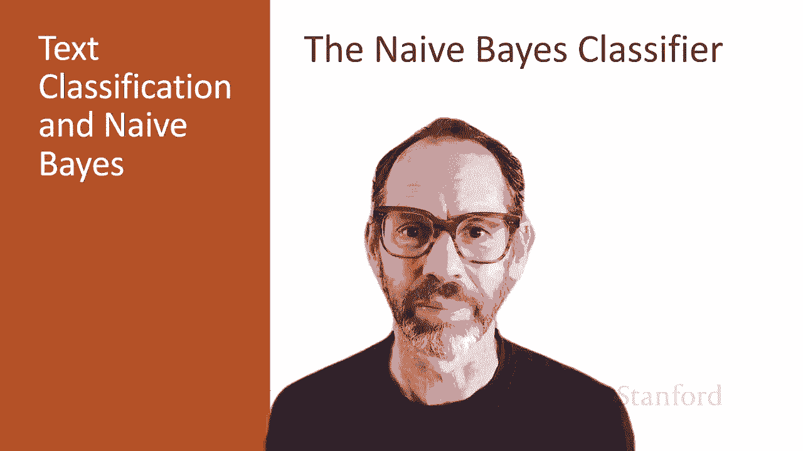
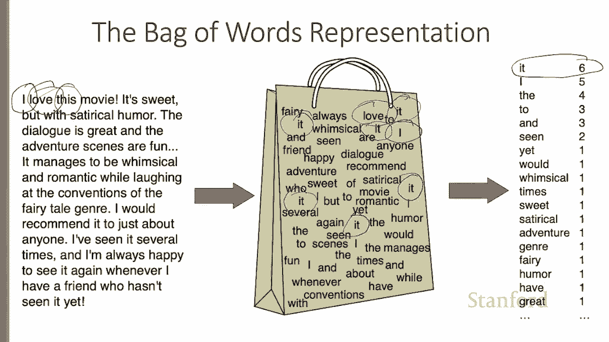
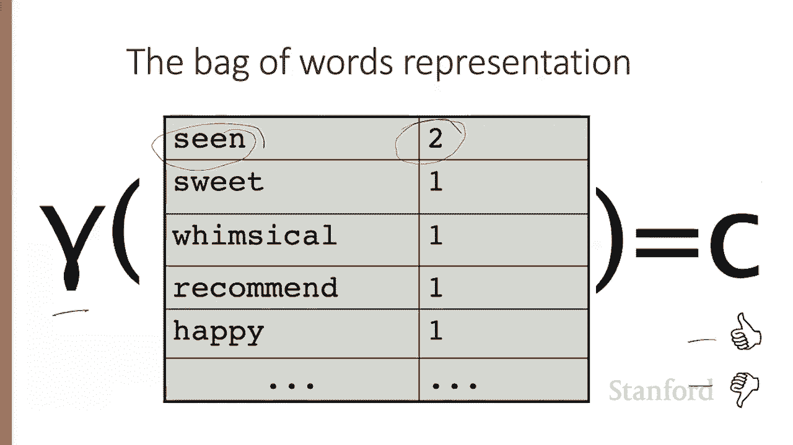
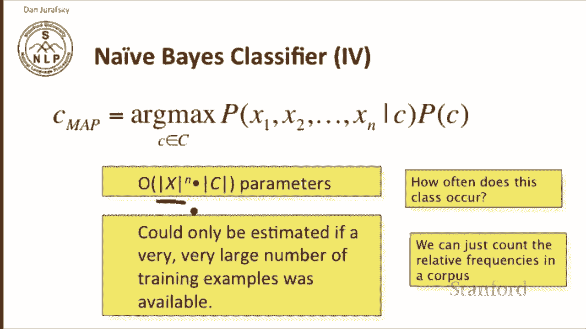
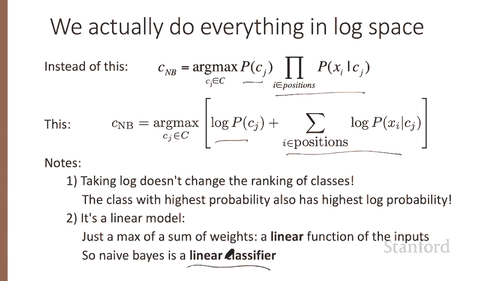
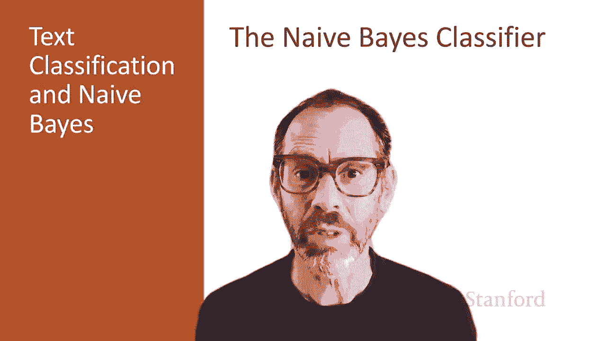

# 【双语字幕+资料下载】斯坦福CS124 ｜ 从语言到信息(2021最新·全14讲) - P20：L 4.2- 朴素贝叶斯分类器 - ShowMeAI - BV1YA411w7ym

In this lecture， we describe the naive Bayes classifier。

 a basic text classifier that will allow us to introduce many of the issues that arise in text classification。

Nive Bayes is a simple classification method based on Bay's rule， which we'll introduce in a bit。

 and it relies on a very simple representation of the document called the bag of words。

Let's look at the bag of words。Here's a sample movie review。 I love this movie。 It's sweet。

 but with satirical humor。 In the bag of words representation。

 we imagine all the words from this review thrown into a big paper bag and mixed up together。

 So we don't know what order the words occurred in。 So the word I。

 There's the word I and there it is in the bag。 and the word love is here。

 and there's love in the bag。 And there's this。 But you see the bag doesn't represent the ordering of the words。

 And we can think of this bag of words as really just being a list of words。

 And the counts how many times the word occurs。 The word it occurs  six times in this bag。

 Here's one，2，3，4 and so on，5，6。 The word I occurs five times the word the four times and so on down to words like humor or have or great。

 which all occur one time。😊。

The job of the classification function， we can think of a function gamma that takes this list of words and counts and makes a classification decision a thumbs up or thumbs down。

 If we're doing binary classification。 Or if we have more classes。

 we can map it to one of more classes。 So our job is to map from this list of words and counts to some class。

😊。

In classification， we have a document D and a class C。

 and our goal is to compute the probability of for each class of its conditional probability given a document。

And we're going to see that we're going to use this probability to pick the best class。

Now how do we compute the probability of a class given a document by Bay's rule。

 this is equal to the probability of the document given the class times the probability of the class over the probability of the document。

Let's see how to use that in the classifier。The best class， the maximum a postii class。

 the class that we're looking for to assign this document to。Is。Out of all classes。

The one that maximizes the probability of that class given the document。

So we're looking for the class whose probability given the document is greatest。By Bay's rule。

That's the same， whichever class maximizes probability of C given D， also maximizes this equation。

 the probability of D given C， probability of the class over the probability of the document。

And as is traditional in Bayesian classification。Whichever document， excuse me。

 whichever class maximizes this equation also maximizes this equation。

And what we've done here is we've dropped the denominator， crossed out the denominator。

 Why is it okay？to cross out the denominator d。Probability of D is how likely the document is。 Now。

 if I give you a document。 and I say which of these 10 classes does this document belong to。

 And for each of these classes， I'm computing the probability of the document given the class。

 the probability of the class and the probability of the document。

 the probability of the document is identical for all 10 classes for each class， one more time。

 I have to compute the probability of the document， And that means that if I'm comparing 10 things。

 each of which is divided by probability of the document。

 the probability of the document is a constant。 And I can eliminate that。

So the most likely class C map is that class which maximizes the product of two probabilities。

 the probability of the document given the class， we'll call it the likelihood。

And the probability of the class we'll call that the prior。The prior probability of the class。

So the most likely class is the one that maximizes the product of these two probabilities。

The probability of the class will turn out to be relatively simple to compute what do I mean by the probability of a document given the class。

 what do I mean to say this particular movie review was how likely is it it given the class positive。

 It seems like a very complicated and confusing thing to compute。

And one way to operationalize that is to say， let's represent the document by a whole set of features。

 x1 through Xn。 So when I say the probability of a document given a class。

 I'm going to say that all that means is the probability of a vector of features given the class P of D given C。

 we're going to represent that probability by the joint probability of x1 x2 up through XN given the class。

In other words。Were this document D as a set of features X1 through Xn that still doesn't tell me how to compute this probability。

 but it's a start。So let's talk about these two pieces now。How do I compute probability of a class。

Well， really that's just asking， how often does this class occur。

 are positive reviews much more common than negative reviews？Is Madison a much more frequent author？

So to decide to this。Computing the probability of a class can be done just by counting relative frequencies in some corpus or data set。

So the probability of a class is relatively easy to compute。

What about the likelihood of the document of these features in a document given the class？Well。

 there's a lot of parameters for this probability。There's if there's n different features。

And each of them has a certain length， that's a lot of parameters that have to be computed and we have to compute them one for each class。

 so that's far too many parameters that we could possibly compute we can only estimate this number if we had a huge number of training examples and we usually don't have such an enormous amount of training examples。

So we're going to make some simplifying assumptions in the IEBase classifier to make this computation more possible。

The first simplifying assumption we're going to make is called the bag of words assumption。

And we're going to assume that the position in the document doesn't matter。

 so this is what I gave you the intuition of a few slides ago。

The position of the word in the document， whether it's the first word or the seventh word or the 150th word isn't going to matter。

 all we care about is which word or which feature occurs。

And the thing we going the second assumption we're going to make。

Is we're going to assume that the different features， x1， x2， x3。

 that their probabilities are independent given the class。

So that the the whether one feature occurs given a class and whether another feature occurs given a class are independently going to be true。

 and of course this is a。Both of these assumptions are incorrect simplifying assumptions。

 they're absolutely wrong， they're terribly completely not true。

 nonetheless by making these simplifying these incorrect simplifying assumptions。

 we can make our problem so much simpler that in practice we're able to solve the problem with a high degree of accuracy despite the simplifications。

So the result of these two simplifying assumptions is we're going to represent the probability。

 the joint probability of a whole set of features x1 through x1 conditioned on a class。

As the product of a whole bunch of independent probabilities， probability of x1 given the class。

 probability of x2 given the class， probability of x3 given the class， and so on。

 up to probability of xn given the class， we're just going to multiply them altogether together。

 We're not going to care about x1 which position it occurred in all we care about is that it was this particular word or feature and we're not going to care about the dependencies between x1 and x2。

In other words。In order to compute， our simplifying Naive Bay's assumption to compute the most likely class。

By multiplying a likelihood， the probability of a whole joint string of features times a prior probability of a class。

We're going to simplify that and say that the best class by the NB assumption is that class that maximizes these the prior probability of the class。

 so that's the same， but now more simply we're going to just going to multiply for every feature in the set of features the probability of that feature given the class。

Much simpler equation。So now looking specifically at text。First。

 we're going to assume we're going to look at all positions， all word positions in a text document。

So we have a text document and it has 100 words in it， so for all for position of word number one。

 position number two， position number three。We're going to take。

Look at all the classes and for each class， we're going to say what's the probability of the class。

 and then for each class， we're going to walk through every position in the text。

 And for each position， we're going to look at the word in that position and ask what's its probability given the class I'm looking at。

 So we'll do this for class1。We'll compute P of class1。Times the product over all the eyes。

A P of word I given class1。So we'll compute that and then we'll do the same thing for class2 for class two。

 we'll compute P of class 2。And then the product over positions I of the P of I given class2。

And then we're going to pick whichever of these two is the highest， if this is higher。

 we're going to pick class2 and assign it to the document， if this is higher。

 we'll assign class1 to the document， and of course I've shown you this with just two classes。

 but in general this is true f for any number of classes。

There's a problem with this algorithm for choosing the most likely class。

 And that is that this arg max requires that we multiply a lot of probabilities。

 We're going to multiply a probability for every position in the document。 That's lots of words。

 and multiplying lots of small probabilities。 Probabilities are all numbers between 0 and 1 can result in floating point underflow。

 We're multiplying together a lot of probabilities。

 and the result going to be an extremely small number。Our solution to this is to use logs。

 because it turns out conveniently that the log of a times B is equal to the log of a plus the log of B。

 So in general， we're going to sum logs of probabilities instead of multiplying probabilities。

So instead of the equation we've seen where we choose the class by taking the Om over the prior times a product of a whole lot of likelihoods where instead。

Going to take the Ag max over the log of a probability plus the sum over the probabilities of each of the words in each of the positions。

Now， taking the log importantly， doesn't change the ranking of the classes。

 The class with the highest probability also will have the highest log probability and doing everything as sums of logs means that we're creating a linear model。

 We're taking a max of a sum of weights。 So it's a linear function of the input。

 and that makes it clear that naive Bayes is a linear classifier。

 Linear classifiers are an important family of simple classifiers。

We've now seen the basic principles of Naive Be's text classification。

