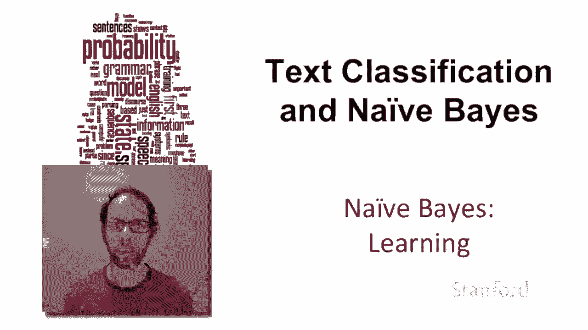
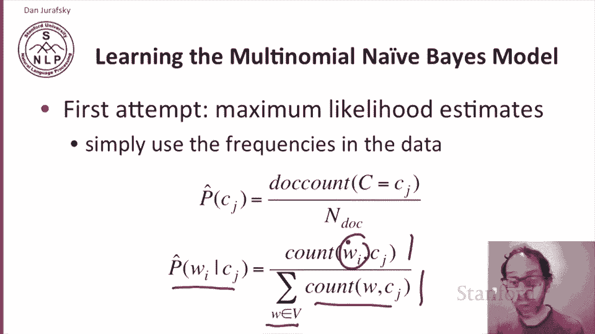
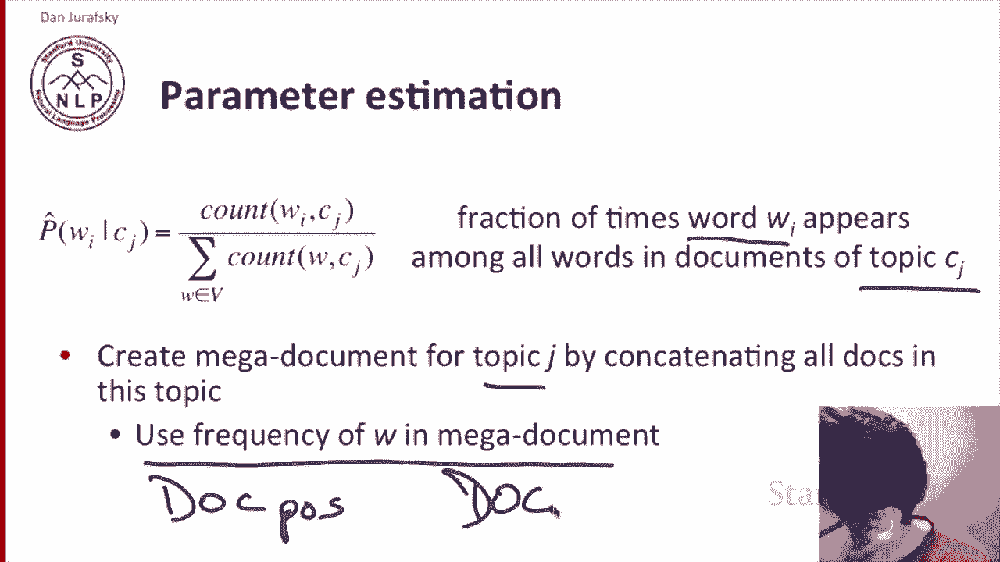
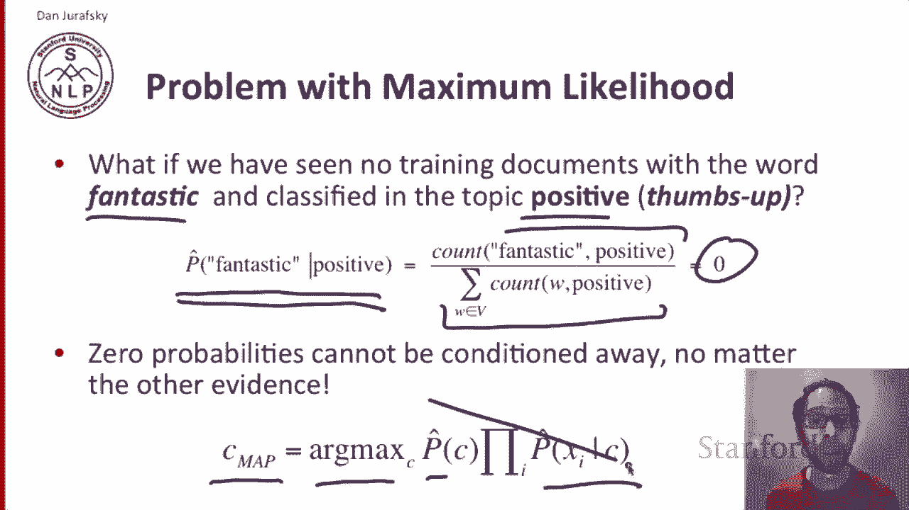
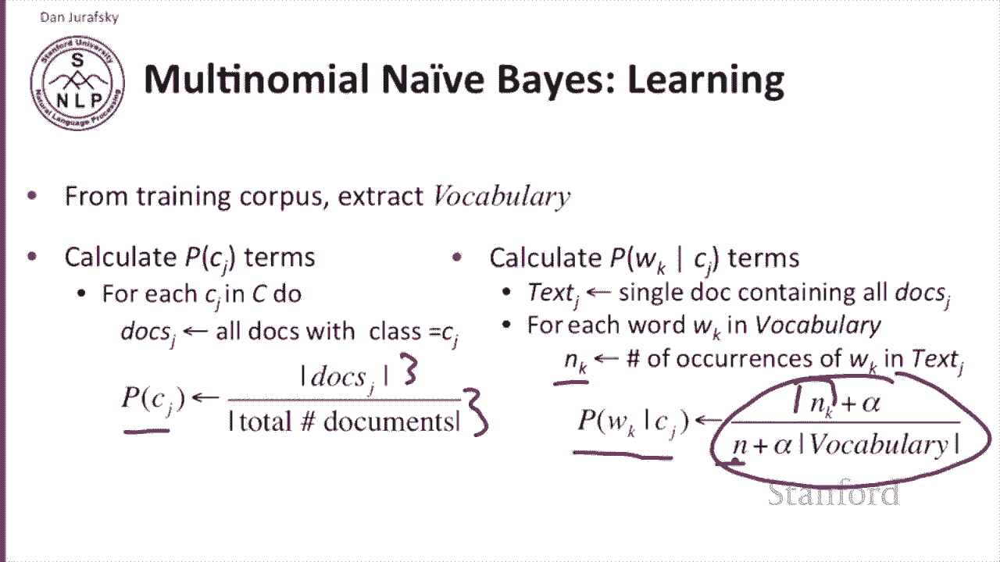
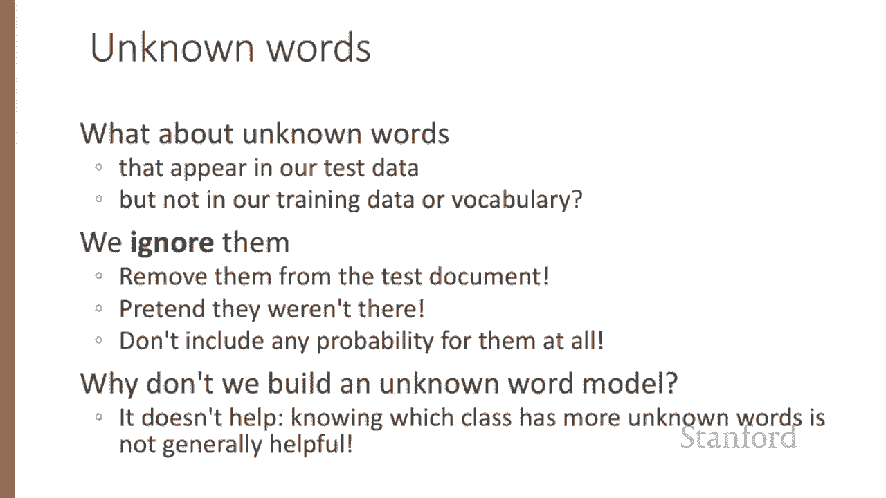
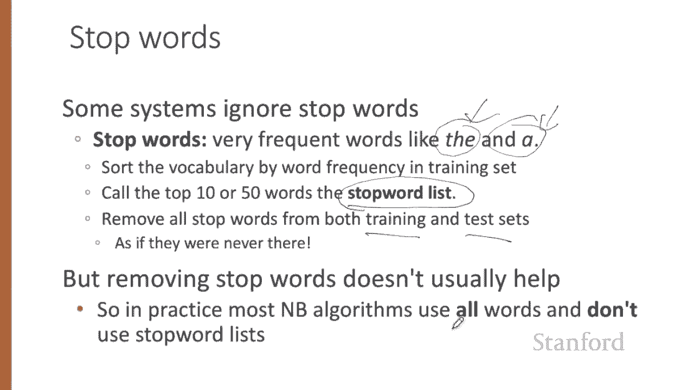

# 【双语字幕+资料下载】斯坦福CS124 ｜ 从语言到信息(2021最新·全14讲) - P21：L4.3- 朴素贝叶斯训练学习 - ShowMeAI - BV1YA411w7ym

How do we learn the parameters for naive Bs， The simplest way to learn the multinomial naive Bay model is to use maximum likelihood estimates。

 Simply use the frequencies in the data。 So if we're trying to compute the prior probability of a particular document being in a class class J。

 we have the count of all the documents and out of those， how many of the documents are in class J。

 That's our prior that a random document will be in class J for the likelihood。

 the probability of word sub I， given class sub J。 we count the number of times word subi occurs in documents of class J。

And we normalize by the total number of words in class J。

 so the sum over all the words in the vocabulary of the count of those words in documents of class J。

 so out of all the words in documents of class J， how many of them are our particular word words a buy we're looking at？

So we're going to compute the fraction of times a word WY appears among all the words in the document of this particular topic C sub J。

 we're going to do this by creating a kind of mega document for topic J by concatenating all the documents that have that topic together。

 and then we're going to use the frequency of W in this mega document。

So for sentiment analysis we might have a document sub positive。

 a mega document for all the positive documents， so we're just going to concatenate them all together into some big mega document and we might have a document subNG and so on。

Now， I've been lying to you。 We don't in fact， use maximum likelihood for naive B。

 And the reason is the following。 Imagine we're looking at the word fantastic。

 we're interested in the word fantastic might occur in the test set。

 but it happens not to have appeared in the training set in the topic positive， let's say。

 So the probability of fantastic， given the class positive in our training set。

 by maximum likelihood is the count of fantastic occurring in positive。

 normalized by the sum overall words of the count of those words in positive。

 but fantastic never occurs。 So that count is0。 So the maximum likelihood estimate for the likelihood of fantastic given positive will be0。

 Why is that bad， Because these zero probabilities can never be conditioned away。

 we're looking for the most likely class。 that's the arg max over all classes of the prior times the likelihood。

 And if one of those likelihood terms is0， Then this whole thing is0 and we're never going to pick that class。

😊。

The solution is very simple。 Add one smoothing。 So here's the computation without smoothing。

 and add one smoothing。 we simply add one to each of those counts。

 So we'll add one to the count when it's the numerator。

 and every time that count occurs in the denominator， we' added one to that2。

And we can rewrite that in a form we've seen before where we're taking the total number of tokens that were in class C。

 and we've added the vocabulary size because we added one for every vocabulary item into the denominator。

 so classic Laplace or add one smoothing。So let's walk through the calculation of these parameters first from the training corpus。

 we're going to extract the vocabulary the list of words。

Next we're going to calculate the priors for each class C sub J。

 so for each class we're going to get list the set of all documents that have that class。

 we'll call that set doc sub J。And the number of documents in that set。

Divided by the total number of documents that will give us our prior probability of that particular class。

Now for the likelihood we're going to want to compute the likelihood for every word W subK given every topic C subJ。

 So first we're going to create our mega document by concatenating all the documents subj into a mega document called text subj and now for each word W subK in our vocabulary we're going to count the number of times W subK occurs in this mega document text subj so that will be n subK。

And now the probability the likelihood of word subK given class subj is just the add1 smooth。

 or I've shown you the add alpha smooth version of the9b algorithm。

 so we've added alpha to n subK and then in denominator we have n the total number of tokens in the class J。

What about unknown words that appear in our test data， but not in our training data or vocabulary。

We ignore them。 That is， we just remove them from the test document， pretendt they weren't there。

 We don't include any probability for them at all。Why don't we build an unknown word model？Well。

 it turns out it doesn't help。 If you think about it， if I had a probability for the unknown word。

 that was some kind of unknown word probability。And I class A had five unknown words and class B hadn't seen seven of the words。

 Well， we're just really adding in this probability five times for class A and seven times for class B and knowing which class has more unknown words is not generally helpful in choosing the right class。

Some systems ignore stop words。 Stop words are very frequent words like the or The way we find stop words is we sort the vocabulary by the word frequency in the training set。

 and we take the top K words， the top 50 or the top 100 or the top 10。

 we call those words the stop word list。 And， you know， because words like the are very frequent。

 they're going to appear in that stop word list。 and then we just remove all the words on the stop word list from both the training and test sets。

 as if they never occurred。Although removing stop wordss helps in some N LP algorithms。

 it turns out is not usually helpful in naive Bays text classification。 So in practice。

 most naive Bay's algorithms use all the words and don't use stop wordss lists。

 So learning the parameters for naive bays a simple computation for the prior and a slightly more complex computation for the likelihood in which we can use add one smoothing and we could deal with unknown words。

