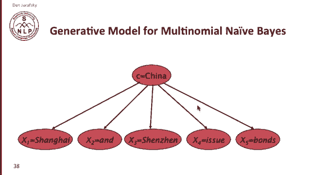
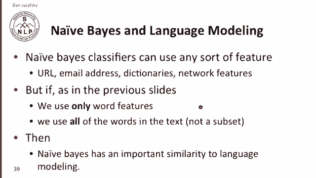
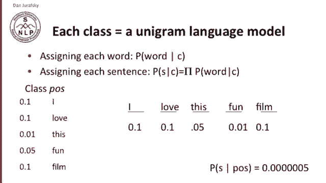
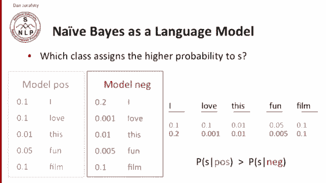

# 【双语字幕+资料下载】斯坦福CS124 ｜ 从语言到信息(2021最新·全14讲) - P24：L4.6- 朴素贝叶斯与语言模型的关系 - ShowMeAI - BV1YA411w7ym

It turns out that Naive Bayes has a very close relationship to language modeling。

Let's see how that is。 We'll start by looking at the generative model for multinomial naive bay。

 So imagine I have a class。 let's say it's China。And where imagine that we were randomly generating a document about China。

So we might start by saying， well， the first word x of1 is Shanghai。

 and the second word is and and the third word is Shenzhen and the fourth word is issue and the fifth word is bonds and so on we've generated a little document。

 random little document about China。So what this generative model shows you is that each word is a independently generated word from a class generated with a certain probability。

 we have a little set of probabilities we're keeping for each word。Let's think about that。

Now in general， naive Bayase classifiers can use all sorts of features， URLs， email addresses。

 we'll talk about that for spam detection， but if in the previous slide we just use the word features and if we use all the words in the text。

 then it turns out that this generative model for naive Bayase gives it an important similarity to language modeling naiveBase turns out to be a kind of language model。

And in particular，ive， each class， in a naive Bay classifier， each class is a unigram language model。

And the way we can think about that is each word in an IE based classifier。

 the likelihood term assigns a word， the probability of the word given the class。

And a sentence in an na based classifier， since we're multiplying together a sentence or even a whole document。

 since we're multiplying together the probabilities of all the words。

 we compute the probability of a sentence given the class。

 we're just multiplying together all the words， the likelihood of all the words in the class。

 so let's see how that works。Imagine that we have the class positive。And we have our likelihoods。

 the likelihood of I given positive， that's P of I given positive。

And we have P of love given positive。And we have P of this given positive and so on。

And P of I given positive is 0。1 and P of love， given positive is 0。1 and so on。 Okay。

 so here's our naive Bayase classifier。 Well， we can think of that exactly as a language model。

 We have a sequence of words。 I generate some words。

 I love this fun film and and naive Base is assigning that sequence of words。

 a set of probabilities 1 for each word from the class， 0。1。1。05 and so on。

So that if we multipied it all these together， we can get a probability of the sentence。

So naive Bays， each class is just a unigram language model conditioned on the class。

So when we ask the question which class assigns a higher probability to a document。

 it's like we're running two separate language models。

 so here I've shown you two separate language models。

 the positive class and the negative class and each one has separate probabilities。

 so here's probability of I given negative。And here's probability of I given positive。

 I guess people are more likely to use the word I when they don't like something。

And now if we take a particular sentence。I love this fun film。

 and we say what probabilities does this sequence？What's the probability of the sequence according to our first model？

And what's the probability according to our second model。

 each one assigns a probability for each word， that's the naive bays likelihoods。

 we can multiply them all together， and we can show that if we multiply them all together。

 you can sort of see from inspection that the positive probabilities multipied together are going to be because mainly because of this one and this one are going to be much higher than the negative probabilities so you can think of naive bays。

As。Each class is a separate class conditioned language model。

We're going to run each language model to compute the likelihood of a test sentence。

 and we'll just pick whichever language model has the higher probability as the class。

 which is the more likely class。

So that's the close relationship between naive Bayes and language modeling。

