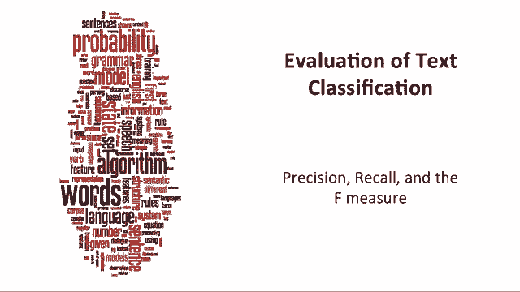
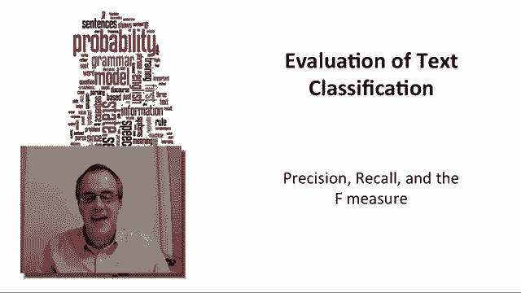
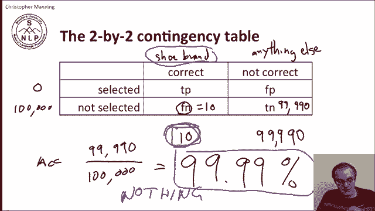
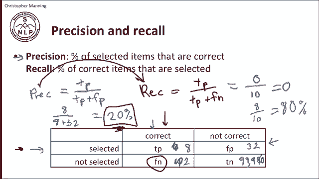
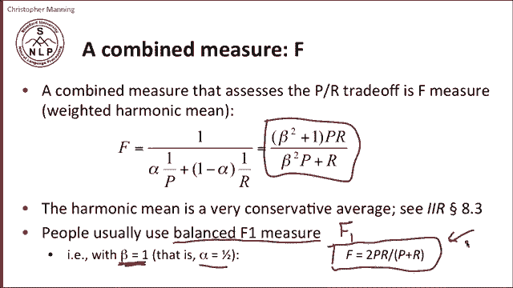
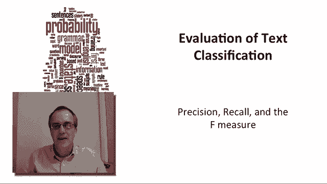

# 【双语字幕+资料下载】斯坦福CS124 ｜ 从语言到信息(2021最新·全14讲) - P25：Le4.7- 精确率、召回率与F值 - ShowMeAI - BV1YA411w7ym

Okay， let me now talk about how we evaluate text categorization and in doing this I'm going to come back to the concepts of precision and recall that we introduced informally before。

 but define them formalally and show how they get put together into combine measure the F measure that gets applied to text classification。

 but it isn't only applied to text classification， you'll see these concepts coming back again and again as ways of evaluation for tasks and natural language processing。

😊。

The starting point for understanding these measures is the following two by two contingency table。

 And so for any particular piece of data that we're evaluating。

 there are essentially four states on one axis were choosing whether this piece of data correctly belongs to a class。

Or whether it doesn't correctly belong to a class。 So， for example。

 if we're wanting to decide whether a piece of email is spam， we're。It either is spam。

 which is the correct class， or it's not， which is the not correct class。 And so on this axis。

 we're describing the truth。Now， what we've done is built a system that tries to detect the truth。

 And so secondly， we're going to look at the status of our system。

 so our system could be saying that this piece of data is spam or it could be saying that it's not spam。

And so we're then going to take these four things and look at the four possibilities that occur。

 And here they are。 So if we're looking for spam， one possibility is the truth that that it is that it is spam。

 and that we said it was spam。 And so that's then referred to as a true positive。

Another possibility is that。Our system thought it wasn't spam， even though actually， it was。

 And so that's then a false negative。 It was treated as negative， falsely。

On the other side of the dial it's possible that the piece of email actually wasn't spam in that case there are again two possibilities our system mistakenly thought it was spam so that's then a false positive we're classifying something positively wrongly。

 but the other possibility is it wasn't a piece of spam and our system said it wasn't piece of spam and then we're dealing with a true negative。

Okay， so if we're doing this kind of classification with two classes that are perhaps about equally common in your email。

 spam and non spam， it seems a reasonable thing to do is just to look at accuracy。😊，So for accuracy。

 the ones that count as you getting the answer， correct are these ones。

 So if you want to work out the accuracy， the accuracy equals the true positives plus the true negatives over。

All four classes， the true positives， plus the false positives。Plus， the false negatives。

 plus the true negatives。In many applications， accuracy is a useful measure for systems。

 but there is a particular scenario in which is not a useful measure。

 And that scenario is when you're dealing with things that are uncommon。 So， for example。

 suppose that we're wanting to detect mentions of shoe brands in web pages。

 So the correct class is that something is a shoe brand。😊，And the。The not class is anything else。

Well， if you're just looking through random web pages or tweets or something。

 looking for mentions of shoe brands， probably。I don't know，99。

99% of the words you encounter are not going to be the name of shoe brands。

 And so what does that mean， What that is likely to mean is that perhaps in total。

 let's say there are。10 mentions of a shoe brand in a00000 word sample， and 99。

Thousand990 words that are not shoe brands。Well， if we build a classifier， presumably。

 even if it's a mediocre classifier， we're going to say most words are not a shoe brand。

 And if we go straight to the limit case， one possibility of our classifier is it could say that no word as a shoe brands。

 So it doesn't select any words as shoe brands。 And it says that all 10000 words are not shoe brands。

 And so that means the number of true negatives is 99990。 but there are few。False negatives。

 words that were shoe brands， But the number of them is 10。

 So if we then actually work out the accuracy of this system。

 you'll see that the accuracy of the system。Is 99。99%。So we have a 99。99% accurate system。

 but the system has done precisely nothing。This is a very easy system to write。

 You just write one line of code that says return false for any token and you're done。

 And yet its accuracy is amazing。 So what's clearly missing here is that we're just not dealing with what we wanted to do。

 So what we wanted to do was detect shoe brands。 So what's all important to us is the 10 tokens。

 which are instances of shoe brands。 And so what we want to do is come up with an evaluation metric that is much more focused on。

 are we detecting these very few words that are the names of shoe brands。😊。

And so that's what the measures of precision and recall do。 So precision。

Tells you of the things that you're selecting， Are they the correct things。

 So precision is saying of the things that you are selecting， which is that row。

What percentage of them are correct things， This column。

 So precision is the number of true positives out of all the things that you selected。

 the true positives plus the false positives。And then recall is the opposite measure。For recall。

You're saying of the things。That are correct。 What percentage of them did you find。 So for recall。

 the numerator is， again the true positives。 But this time， the denominator is the true positives。

Plus， the not selected false negatives。And so note how looking at these measures solves the problem that we had last time with the shoe brands。

 because the fact that there is 99990 tokens that are true negatives is now having no effect on these measures at all。

And so what would happen in our previous case where there are 10 tokens here is and0 tokens here since our classifier said every word wasn't a shoe brand。

 that what we'd find is that we'd say that the recall of that system。Is 0。

 It's finding none of what we wanted to find。 And basically。

 we can say a system with0 recall isn't interesting。

And so this suggests we'd actually want to do better by returning some stuff。

 So what we'd like to do is label some things as shoe brands。 So we could revise the system。

 And when we revise the system。 maybe what we'll do is we'll have it return。

 40 things as the name of shoes。 And so it'll perhaps find 8 of the shoe brands。

 But it'll make some mistakes and claim some things as shoe brands that aren't。

 So there'll be 32 tokens over here。 And then there'll be two tokens down here。

 And then we the remainder of the tokens。😊，960 will be down here。 So then at that point， we can say。

 well， the recall of our system is pretty good。 So it now finding 8 out of the 10 instances of shoe brands。

 So its recall is 80 per cent。But the problem is that that recall came as a cost because it's now also claiming lots of other things as shoe brands that aren't。

 So the precision of the system is now8 over 8 plus 32 equals8 out of 40， which equals 20%。

1 in five things， it returns as correct。 And so for a lot of practical applications。

 this kind of precision is going to be too low。 It depends on whether you're really interest in finding references to shoe brands and have prepared to have a human being go through and check them all individually。

 But if you want to do something more automatic 20% is too low of a precision。 But in this。

 we see the secret of the trade off that balances between recall and precision because almost inevitably。

 if you're going to increase your recall and find instances of something。

 you're going to make some mistakes。

And so your precision is going to go down。 And the more you try and boost recall。

 the more your precision is going to be starting to drop。

 And so people are trading off precision and recall。

 So that's a good thing about having these two measures。

 because you can discuss the trade off and say how important to someone is the precision of what's returned versus how important is it to find all of the stuff to have high recall。

And that's a trade off that is played out differently in different applications。

 so in various applications such as for things like legal applications where you want to find all of the appropriate evidence such as in discovery procedures where what you really really want to be doing is having a system thats is high recall that finds as much of the relevant stuff as possible。

 where in other contexts where what you're going to do is just show a sampling of stuff to the user。

😊，You might be more interested in the stuff that's shown to the user being stuff that is correct that looks good。

 that your precision is high， and it doesn't really matter that you're only showing to the user 1/10th or 1/20th of the things that do satisfy their query。

So sometimes that explicit tradeoff is really useful and it's a really good concept to remember when you're building NLP systems because in practice whenever you're building one of these systems you're choosing some tradeoff point as to how much you're emphasing precision or recall and different tradeoff points are appropriate in different applications。

 but sometimes that's a slightly annoying thing having these two measures because if people are wanting to compare systems and say which one is better then you need some way to combine these measures and so that's been thought about as well。

😊，And so the standard way that's been proposed to combine these measures is something that's called the F measure in disciplines like information retrieval and named entity recognition。

 So what is the F measure。 What the F measure is， is there's neither more nor less than a weighted harmonic mean。

 So at this point， we have to kind of revise a little bit of math on means。

 So you doubtless remember the arithmetic mean， which is just the average of two things。

 and you perhaps also remember a geometric mean。 But in addition to both of those。

 there's a harmonic mean。 And in a harmonic mean， what you do is you take the reciprocal of two quantities。

 and then add them and then take the reciprocal of that。😊。

And if you work through in more detail what that does。

 the harmonic mean ends up as a very conservative average。

 So if you put in two numbers into a harmonic mean。

 it's fairly close to the minimum of the two numbers， not completely at the minimum。

 but it's nearer to the minimum than either the arithmetic or geometric means。😊。

Then in particular for this F measure we're allowed to put weights on these two terms and so this is this alpha factor so the weighting is how much to pay more attention to the precision or how much to pay more attention to the recall so if you are in an application and you know the precision is much more important to you。

 you can actually express that utility trade off by putting a particular value of alpha in that expresses it。

So this formulation here very clearly shows that the F measure is the weighted harmonic mean。

 but actually that's not the formulation that you normally see in books。

 The formulation that you normally see in books is actually this one， which is， I guess。

 just a little bit tidier to write。 these two formulations are related than maybe we'll work through that in one of the exercises。

 you can work out the relationship between alpha and beta。

 but effectively this formula also expresses a weighted harmonic mean。

 and it also has a control parameter beta as to how much emphasis is being put on precision versus recall。

😊，So while that control parameter is useful in the absence of other evidence。

 the most commonly used thing is a balanced f measure and so the balanced F measure gets referred to as the F1 measure and what that's meaning is that you're setting beta equal to1 that then gives you equal balance between precision recall which corresponds in turn to alpha being a half and if you do the balanced F measure。

 this formula here simplifies to just this formula and so this is really the thing that you'll see most common。

 so if you don't remember any of the rest of this stuff what you should do is remember this little formula for the F measure two times the precision times the recall divided by the sum of the precision and the recall。

So that should give you a good sense of what these measures of precision recall are。

 how they are combined into the F measure， why they're useful。

 and how we use them to evaluate text classification。😊。

