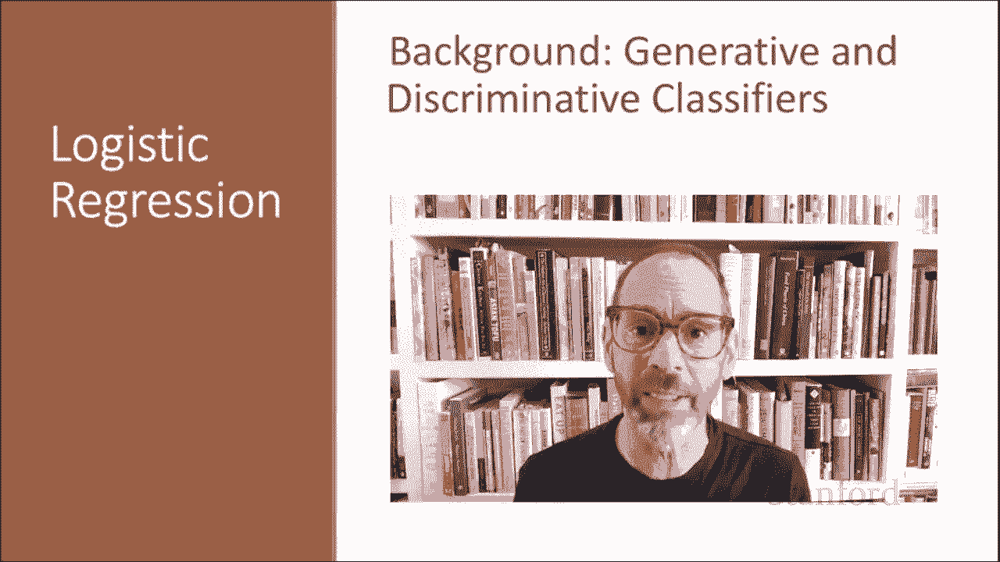

# P27：L5.1- 生成模型与判别模型 - ShowMeAI - BV1YA411w7ym

In this lecture， we talk about the difference between generative and discriminative classifiers and the naive bays and logistic regression classifiers and their relationship。

Logistic regression is an important analytic tool in the natural sciences and the social sciences。

 It's also the baseline supervised machine learning tool for classification。

 and it's the foundation for neural networks， As we'll see later。

 a feed forward neural network can be thought of just as a sequence of stacked logistic regression classifiers。

 There's an important difference between naive Bays。

 the classifier we've seen so far and logistic regression。

 naive Bays is a generative classifier While logistic regression is a discriminative classifier。

 Let's think about what that means。😊，Suppose we're distinguishing cat from dog images。

 we're building a classifier to tell us if something is a cat or a dog。

A generative classifier thinks of the problem this way。

 We're going to build a model of what's in a cat image。

 It might know about whiskers and ears and eyes。 And it's going to assign a probability to an image。

 How cat like is this image。 And we're going to do the same thing for dogs。

 We're going to build a model of what makes up a dog， the floppy ears， the nose and so on。

And now we're given a new image， we're going to run our cat classifier and our dog classifier。

 and we're just going to see which one fits better。

 which one models the details of this image better。By contrast。

 a discriminative classifier's job is just to distinguish the dogs from the cats。 So it might notice。

 for example， oh， look。It just happens that in the training set， all the dog images have collars。

 So a discrimminative classifier is going to pick up on features that discriminate the two images。

 It's trained to discriminate， and it's going to find features that discriminate the two images。

 and it might ignore everything else。More formally。

 we have the task of finding the correct class C from a document D in a generative or discriminative classifier。

 Now， in naive bays， as we've seen before， we're computing the most likely class over all classes。

 And we do this by multiplying together the likelihood。

 That's the likelihood of of this image given the class， How likely for my cat detector。

 am I to see these particular features I'm seeing on this particular image。Times the prior。

 how likely are cat photos， in general， Lo regression， On the other hand， is doing a similar a max。

 We're trying to pick the class over out of all classes， which maximizes a score。

 But here the score is the probability， the direct posterior probability。

 We're just going to directly say which class C is most likely given the image。

 So generative classifiers。 We have a likelihood in the prior that we saw in naive Bay。

 Log regression。 we're going to learn how to directly compute the probability of this class。

A probabilistic machine learning classifier has a set of components where given M input output pairs。

 I'm going to use the superscript I here to mean a particular observation。

 so we have one observation X super I comma Y super I where x is the input and y is the output。

And we're going to have a feature representation of that input。

 So for each input observation x super I， we're going to have a vector of features x1 x2 up to X N。

 And we're going to refer to that particular feature J for input x super I as x sub J。

 So here x sub2 is feature 2。And if we want to be more complete。

 we'll make it clear that I mean x subj for input I。

 and occasionally you'll see the notation F subj feature subj of x。

So we have our feature representation。 Then we're going to need a classification function that computes Y hat。

 Why hat is the estimated class。 So Y hat can be dog or Y clt can be cat or Y clt can be0。

 Y hat can be one。And we're it's going to do that by computing a probability P of y given X and the classification function we're going to introduce in this lecture is the sigmoid or the related softm functions very important functions。

 We're going to need to learn the parameters for this function。

 and for learning we need an objective and we're going to use cross-enttropy loss as the objective and we'll talk about what that means。

 and finally， we need an algorithm for optimizing whatever this objective is。

 whatever our goal is that we're trying to get our classifier to be good at and we're going to introduce the stochastic gradient descent algorithm for optimizing in objective。

Logistic regression has two phases， like many machine learning classifiers。

We have the training phase in the test phase in the training phase。

 we're going to learn weights and we're going to see that these are going to be a set of weights W and B。

 we're going to use stochastic gradient descent to find optimal weights and we're going to use cross entrytropy lost to measure how good the weights are。

And then in the test phase， we're going to be given a test example X。

 and we're going to compute the probability of Y of x for each possible class Y using these learned weights。

 And we're going to return whichever label。 let's say it' we're doing binary class。 So y is 0。

1 or y is 0。 We're going to return whichever one has the higher probability。

 We've now seen the high level of intuition of the logistic aggression classifier and its relationship to the naive base classifier in further lectures we'll see more details。

