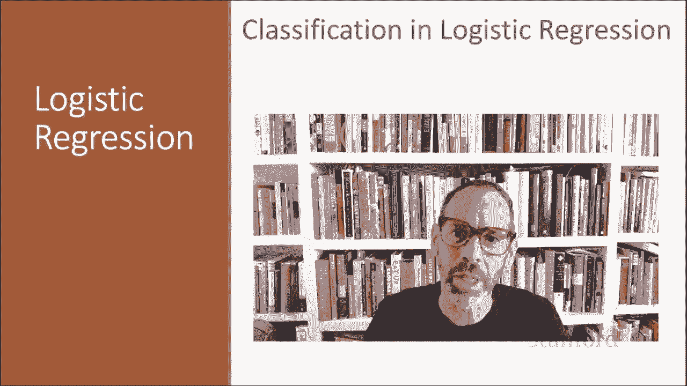
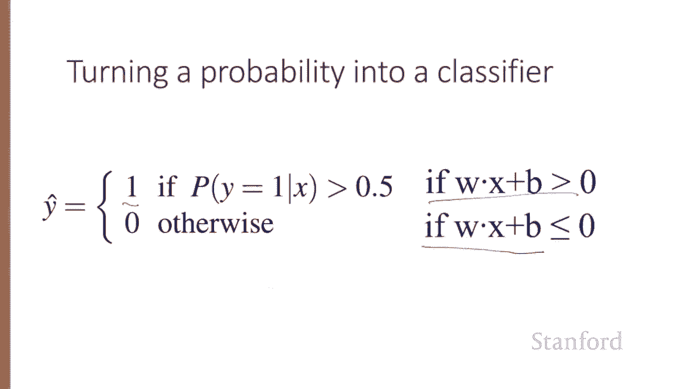

# 【双语字幕+资料下载】斯坦福CS124 ｜ 从语言到信息(2021最新·全14讲) - P28：L5.2- 逻辑回归分类 - ShowMeAI - BV1YA411w7ym

In this lecture， we'll see how to do classification with logistic regression and we'll introduce the important sigmoid function。

Classification can be used for many kinds of text tasks。

 like determining positive or negative sentiment or determining if a message is spam or not spam or determining authorship。

 recall the famous case of the Federalist papers written by Hamilton or by Madison。 And again。

 remember that for text classification， we have a document X， we have a fixed set of classes。

 capital C。And then we're going to output a predicted class Y hat。

 which is one of these classes in C， given X。And given a sequence of input output pairs。

 so remember that we're using the superscript for each observation X and its label Y for each such observation。

 we're going to represent a device set of feature vectors， x1 through xN。

 and then we're going to give it a predicted class Y hat from the set 0 or 1。

 so binary classification。In logistic regression， we're going to make use of features。

 each feature X sub I is a feature expressing some fact about the text。

 and it's going to have a weight W sub I that tells us how important X sub I is to that classification decision。

 So imagine that one feature X sub I might be。 The review contains the word awesome。😊。

And let's say the weight W sub I is plus 10， suggesting that for a sentiment classifier。

 having the word awesome is a highly weighted positive cu toward the review being positive sentiment。

 By contrast， abysmal might have a weight W sub J。 The feature review contains abysmal might have a feature W sub J of negative 10。

 which it means that abysmal is highly weighted， but a negative weight。

 So that's highly weighted toward the negative class。😊，And a different feature， x sub K。

 the review contains the word mediocre might be slightly negative。

 so our weight is slightly negative， leaning us very slightly toward。The negative class。

So in summary for logistic regression we're going to take an input observation。

 we're going to represent it as a set of features， X will be represented as a set of n features。

 we'll have a set of n weights， W1 through Wn， and sometimes you'll see these weights called thetas。

 theta 1 through theta n and sometimes we call the entire set of parameters theta。

 and we're going to output a predicted class Y hat from the said01。

That's binary logistic regression we'll see later a generalization to multinomial logistic regressiong where the output could be from some larger set of possible classes。

 but we'll stick to binary for now。How do we do this classification， Again。

 the weight W tells us the importance of the feature will also have a bias term。

 sometimes called the intercept。 And that's another real number that's added to the weighted inputs。

And we'll sum up all these weighted features and the bias。 So we'll just take each feature W。

 each feature X and its's weight W， and we'll multiply them together。 sum them all up， add the bias。

 and we'll compute a score for the sum of all of these features in these lectures will represent such sums using the dot product notation from linear algebra。

 So the dot product of two vectors A and B written as a dot B is the sum of the products of the corresponding elements。

 So here the sum of all these W sub I X subs will represent as W dot x。😊。

So we're going to compute this sum Z。W dot x plus B， and if it's high， we'll say， yep。

 this is a positive class， this is positive sentiment， let's say。

 and if W x plus b is low if z is low， then we'll say that it's the negative class y equals zero。

Our goal， however， is a probabilistic classifier。 We'd like to formalize this idea of if the sum is high that I mentioned on the previous slide。

 We like a principal classifier giving us a probability just like naive bath did。

 So we want a model that can give us actually a probability， the probability that y is1。

 given x parameter is by all the weights theta or the probability that y 0 given input example x and again。

 parameterized by theta。 And the problem is that Z to W x plus B。 It's not a probability。

 It's just some number。 In fact， nothing forces Wx plus B to lie between 0 and1 weights are real valued。

 It might even be negative。 Z， in fact， ranges from negative infinity to positive infinity。

 So instead， we're going to use a function of z that goes from0 to1。

 and the function we're going to use is the very useful sigmoid or logistic function。

 So Y equals sigma of Z and the sigmoid is1 over1 plus E to the minus Z or as we're going。

Refer to it from now on，1 over1 plus x of minus z。Here's a picture of the sigmoid function so called because it looks like an S。

 The function takes a real value and maps it neatly into the range， 0，1。

You notice that it's nearly linear around zero。But outlier values get squashed towards 001。

 so it's a very useful function。So here's how logistic regression is going to work。 We'll compute。

 we have our features and our weights and our bias term， we'll compute W dot x plus B。

 we'll pass it through the sigmoid function， and then we'll just treat it like a probability。

 So now we just have to figure out how do we turn sigmoid outputs into probabilities。Well。

 we're almost there。So if we apply the sigmoid to the sum of the weighted features。

 we get a number between 0 and1。 So this will be between 0 and 1。 And to make it a probability。

 we just need to make sure that the two cases P of y equals1 and p of y equals 0， sum to1。

 And we can do that as follows。 we'll just make p of y equals 0， be1 minus sigma of w X plus B。

 which is p of y equals1 So we're guaranteed these two will sum to1。

 We can do a little arithmetic here， plugging in one over1 plus x of minus z。By the way。

 the sigmoid function has a useful property that one minus sigma of x is the same as sigma of minus of x。

 So one， the probability of p of y equals 0， which we refer to as1 minus sigma of Wx plus B。

 we could also refer to as sigma of minus Wx plus B。 We'll sometimes see it in that form。

So now to turn the probability into classifier， our estimate。

 Y hat our estimate of the class of our example X is one。

 if p of y equals1 is greater than 05 and 0 otherwise。 So 05 here is the decision boundary。

 So here I have graphed W X plus B along the X axis。 and the probability produced by our sigmoid。

 Y equals 1 on the y axis。 So heres our sigma of w x plus B graph。 and here's our decision boundary。

 So anything greater than 05。 If w x plus B is greater than 05。

 then P of y equals 1 is greater than 0。5。 and we're going to label this example positive。😊。

So in other words， given an example x， we're going to give it Y hat its class1。

 if W x plus b is greater than 0， and we're going to call it class 0。

 if W x plus B is less than or equal to 0。

We've now seen how logistic regression uses the sigmoid function to take weighted features from an input example X and assign it to a class y1 or0。

