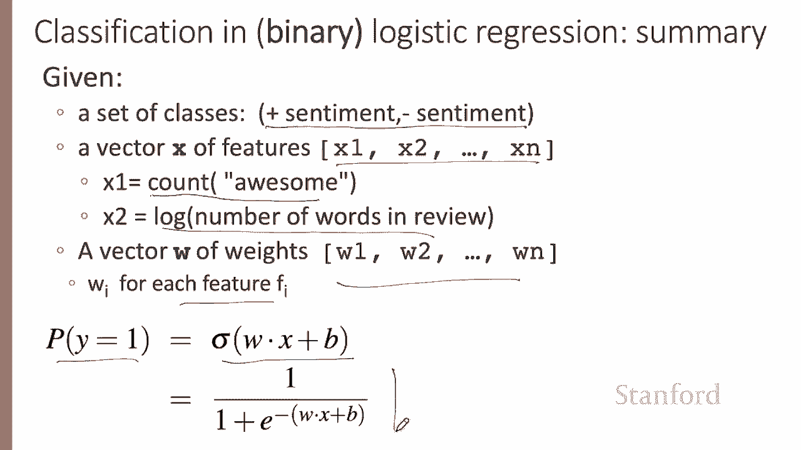

# P29：L5.3- 应用逻辑回归解决文本情感分析问题 - ShowMeAI - BV1YA411w7ym

Let's walk through an example using logistic regression to do sentiment classification。

Suppose we're doing binary sentiment classification on a movie review text。

 And we'd like to know whether to assign the sentiment class 1， meaning positive or 0。

 meaning negative to this following review。 It's Hokey。 There are virtually no surprises。

 The writing is second rate。So why was it so enjoyable， you get the idea。

Let's assume each review is an observation。 And we're going to represent each of these observations by six features。

 the following six features。 So one feature X1 is the count of words in some positive lexicon in the document。

 What is the value of that feature in our example。 Well， let's suppose that the words enjoyable。

 great and nice are all in our positive lexicon。 So the value of X 1 is 3。

 There are three positive words in this review。 How about x 2。

 the count of negative words in the in the document。😊，Well。

 here we have the word hokey and we have the word second rate。

 so our value for the second feature is2。And we can have other features like。

 does the word no occur in the document， And it does。 There's the word no。

We can count the number of pronouns， we could have a real valued feature like the log of the number of words in the document。

 there are 66 words in this document and if we put in the natural log。

 we get a value for feature x6 of 4。19。So those are the feature values。

 And let's assume for the moment that we've already learned a real valued weight for each of these features and that the six weights corresponding to the six features are as follows。

 weight 1 is 2。5， weight 2 is negative 5， weight 3 is negative 1。2 and so on for the6 weights。

 And let's assume that we have learned a bias 。1。 We'll talk later about how we learn these things。

 So the weight W1， for example， indicates how important a feature。

 the number of positive lexicon words， feature x1， how important a feature this is to making a positive sentiment decision。

 And W2 tells us the importance of negative lexicon words。😊，Now， notice that feature W1 is positive。

 and W2 is negative， meaning that negative words are negatively associated with a positive sentiment decision。

 And further， they're about twice as important as positive words。 So the weights tell us something。

So let's plug the x's and ws， the feature values and their weights into our equation for computing the probability of our classes。

To compute the probability that this is a positive document。

 that's to say the probability that y equals1。 we compute sigma of W X plus B。 What's W dot X。 Well。

 here's our weight vector that we just talked about。

 Here's our feature values that we saw on the slide before。 And， and this is our learned bias。

 So it's sigma of 0。833， which turns out to be 0。7。

And the probability of that this is a negative review is just going to be one minus the probability。

 that's a positive review， so 0。3。 So this classifier would guess that this is a positive review。Now。

 it turns out we can build features for logistic regression for any classification task。

 So let's pick one at random period disambiguation。 So that's the task， for example。

 of deciding what these different periods mean。 This period here is an end of sentence period。

 where this period here is not an end of sentence。So we might use features like x1 here。

 expressing that the current word is lowercase， perhaps with a positive weight。

 because lowercase words with a period at the end are maybe more likely to be end of sentence。

Or perhaps that the current word is on our acronyms and abbreviations dictionary。

 So like maybe S T is in our acronyms or D R for doctor or drive or in our acronym abbreviations dictionary。

 and now the weight might be negative because periods after acronyms are not likely to be end of sentence periods and features can express quite complicated combination of properties。

 For example， a period following an uppercase word is likely to be an end of sentence。

 But if the word is S T dot and the previous word is capitalized。

 then it's probably part of a shortening of the word street。So in summary。

 for classification and binary logistic regression， we have a set of classes。

 let's say positive and negative sentiment， which we can just refer to as0 and 1。

 we'll have a vector of features and those features values have things like counts or logs of things。

 we'll have a vector of weights， one for every feature， plus a bias。

 and to compute the probability of the positive class will just run the W x plus B through a sigmoid。

We've now seen how logistic aggress can take feature values and their weights and compute a class for an input example。

