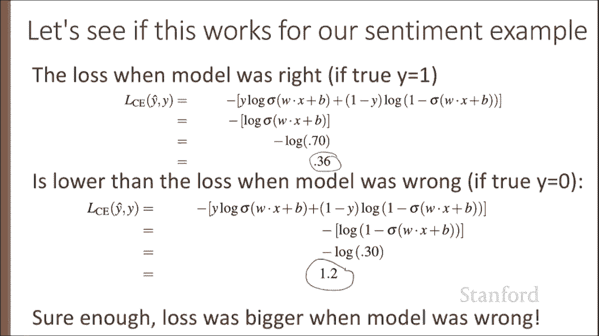
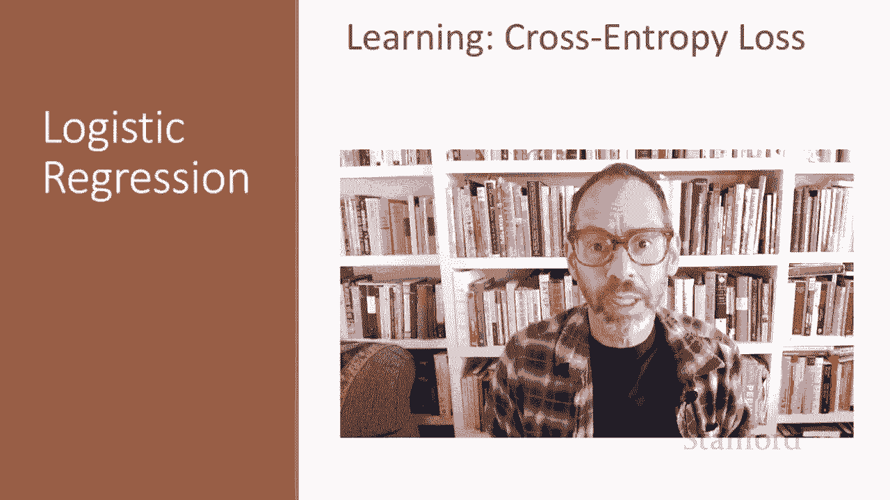

# P30：L5.4- 交叉熵损失 - ShowMeAI - BV1YA411w7ym

Let's now turn to learning the parameters for logistic regressionggression。

 we'll start with the cross entropy loss function。Logistic regression is an instance of supervised classification in which we know the correct label Y。

 either 0 or 1 for each observation X。 But what the system produces is an estimate。

 We'll call it Y hat。 What we want to do is learn parameters meaning W And B that make Y hat for each training observation as close as possible to the true y。

So we'll need two things for this， we'll need a distance estimator。

 a loss function or a cost function， and we'll need an optimization algorithm to update W andB to minimize this loss function。

So that's two components。 A metric for how close the current label Y hat is to the true gold label Y。

 And rather than measure similarity， we usually talk about the opposite of this。

 the distance between the system output and the gold output。

 And we call this distance the loss function， or sometimes the cost function。

We'll introduce the loss function that is commonly used for logistic regression and also for neural networks。

 that's the cross entropy loss。And the second thing we need is an optimization algorithm for iteratively updating the weight so as to minimize this loss function。

 And the standard algorithm for that is gradient descent。

 and we'll introduce the stochastic gradient descent algorithm in the following lecture。

So we need a loss function that expresses for an observation X。 How close the classifier output。

 That's Y hat， which we get by running W X plus B through a sigmoid。

 How close that classifier output is to the true output， which is either 0 or 1。

 So how close is Y hat to y。And we'll call the difference between these the loss L。

 how much Y hat differs from the true Y。And we do this via loss function that prefers the correct class labels of the training examples to be more likely。

 This is called conditional maximum likelihood estimation。 We chooseuse the parameters W and B。

 that maximize the log probability of the true Y labels in the training data Given the observation X。

 And this resulting loss function is the negative log likelihood loss。

 generally called the cross entropy loss。 Let's derive this loss function applied to a single observation X。

We'd like to learn weights that maximize the probability of the correct label Y。

 So that's P of y given x。 Now， since there are only two discrete outcomes 0 or1。

 we can express the probability， P of y given x from our classifier as the product of these two terms。

 Y hat to the Y and one minus Y hat to the1 minus y。 Now， what happens if we plug in the true values。

 y equals 1 or y equals 0 to this equation。 If y equals1。We get。Why hat to the one？

One minus y hat to the zero， and this cancels out and we get just y hat， that's if y equals1。

If the true y equals 0， we get y hat to the 0 times 1 minus y hat to the one。

 And now this one cancels out， in other words。If y equals1， this equation simplifies to y hat。

 If y equals 0， this simplifies to one minus y hat。So our goal is to maximize this probability。

 Our job is to learn parameters that will make the correct label Y the most likely have the highest probability。

 And for mathematical convenience， we'll take the log of both sides。

 So now we want to maximize the log probability of y given x。

 And so now we're maximizing y log Y hat plus1 minus y log1 minus y hat。

 We can do this because whatever values max the log of the probability will' also maximize the probability。

So here I've just put the same equation up here， our goal is to maximize log p of y given x。

And instead of maximizing a probability， it's more common to talk about minimizing a loss。

 So we're going to turn this thing we're trying to maximize into something we're trying to minimize。

 And that will turn it into the cross entropy loss。 So all we do is take this log P of y given x。

 and， and we negate it。 So the cross entropy loss， we're trying to minimize the negative log probability of y given x。

 And as we've seen this can be estimated with this sum of terms。

 We can also plug in our definition of y hat to remind ourselves how we're going to compute this。

And the cross entropy loss， again， between y hat and y。

 is the negative of y log sigma of Wx plus B plus 1 minus y log of 1 minus sigma of Wx plus B。

Al right， let's see if this crossendpy loss works in our sentiment example。Intuitively。

 we'd like the loss to be smaller if the model estimate is close to correct and bigger if the model' is confused。

 So let's look at both those cases and see if the estimate is doing the right thing。

So let's first take our sentiment example。 It's Hokey。 There are virtually no surprises。

 so why was it so enjoyable， Let's suppose the true label of this example is one Y equals1。

 This is a positive review。 let's say， And let's see if that works with our features。

 What probability does our model assign to the value Y equals 1。 Well。

 we can compute that just from the sigmoid sigma of w X plus B， which is， again。

 we dot product our weights with our feature values， our ws and our x's。

 and we add our our bias term B， And we end up with a probability of 0。7。 So pretty good。😊。

What's the loss？Well we can just plug in that 0。7。Into our equation for cross entropy loss。

 and we see a loss of 0。36， a relatively small loss。By contrast。

 let's pretend instead that the example was actually negative。That is。

 the true Y was 0 instead of one。 So perhaps the reviewer said， bottom line， this movie's terrible。

 I beg you not to see it。So in this case， our model。

 which assigned a pretty high probability to this being a positive example， is confused。

 The models wrong。 So we'd hope that the loss will be higher。So let's plug in y equals zero。

So what's the probability of y equals 0。 And that probability is one minus the probability of y equals 1。

 which we got from sigma of W X plus B。 And that's 03。 So the model doesn't think that the。

That the answer is zero， doesn't think this is a negative review。

 signs it a small probability of only 0。3。And if we look at the loss。Plugging in that 。3 now into。

Now that now y is 0。The true why， we are estimating 0。So， we can。This all cancels out。

And now we get a negative log of 0。3。 We get a higher loss，1。

2 than the much smaller loss we saw in the previous slide。When the model was right。

 we had a small loss when the model was wrong。We had a big loss。So sure enough。

 cross entropy loss is doing the right thing， the loss is bigger when the model is wrong。

We've derived the cross entropy loss and seen how it applies to our sentiment example。

Cros entropy loss is equally important for neural networks， as we'll see in future lectures。

