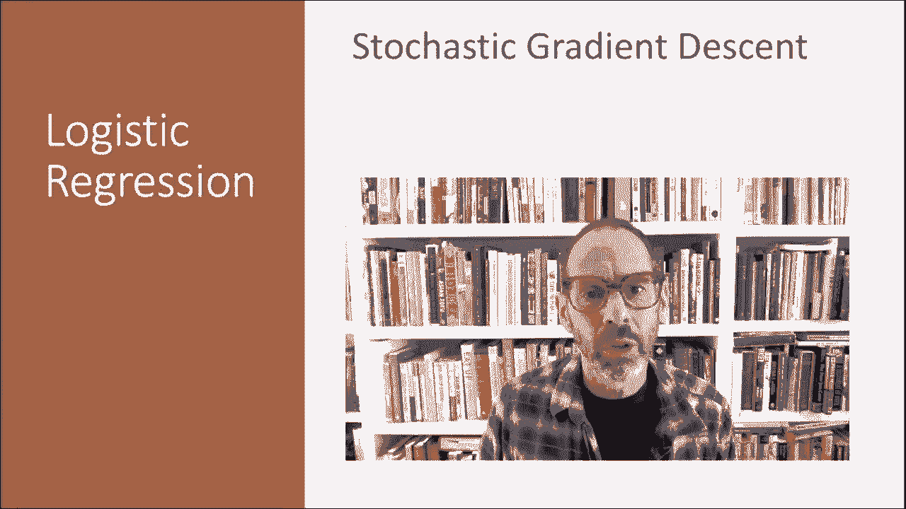
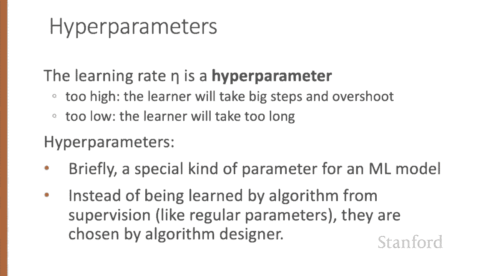
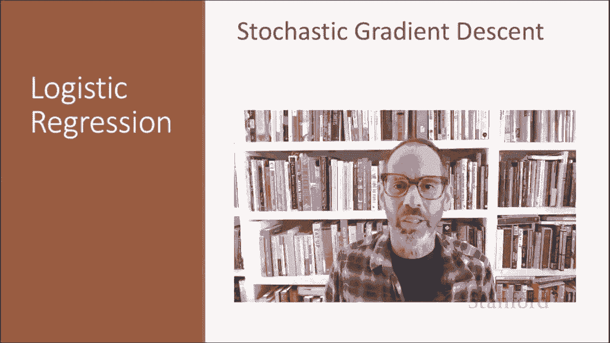

# 【双语字幕+资料下载】斯坦福CS124 ｜ 从语言到信息(2021最新·全14讲) - P31：L5.5- 随机梯度下降 - ShowMeAI - BV1YA411w7ym

In this lecture， we introduced the stochastic gradient descent algorithm that's used for optimizing the weights for logistic regression and for neural networks。

Our goal with gradient descent is to find the optimal weights。

 minimize the loss function we've defined for the model。

We'll explicitly represent here the fact that the loss function L is parameterized by the weights。

 which we can refer to in machine learning terms in general as theta。

 so in the case of logistic regression， theta is W and B。

And will also represent Y hat the function that we're computing as F of x parameterized by theta to make the dependence on theta more obvious。

 So the goal is to find the set of weights that minimizes overall all possible weights。

The loss function。Of this is why hat， comma Y。 So the Ithe example。

 our estimate of Y hat for that example。How different is that from the true why。

 that loss averaged over all of the M exemplars。How do you find the minimum of a loss function？

Graadient descent is a method that finds a minimum of a function by figuring out in which direction in the space of parameters theta。

 the function slope is rising the most steep and moving in the opposite direction。

 The intuition is that suppose you're hiking in a canyon and you're here at position X。

And you want to descend as quickly as possible to the river you're very thirsty。

 so you might look around yourself 360 degrees， find whichever direction the ground is sloping maybe the most uphill。

And go the opposite way down toward the river。For logistic regression。

 this loss function is conveniently convex。 A convex function has just one minimum。

 There are no local minima to get stuck in。 So gradient descent starting from any point is guaranteed to find the minimum。

 By contrast， the loss for multilayer neural networks is non convex and gradient descent may get stuck in local minima for neural network training and never find the global optimum。

Although the algorithm and the concept of gradient are designed for direction vectors。

 let's first consider a visualization of the case where the parameter of our system is just a single scale or W。

So assuming the loss function L has this shape， so in blue I've shown you the loss function。

 here's the loss function。Along the X axis， I have some parameter W。

Maybe it starts off at some value W super1 we'll just say it starts at zero to make your life easy and you can see by inspection that the goal。

 the minimum for this loss function is going to be at this point here， W supermin。

So if we're starting here at the place where W is0 on the loss function。

 we want the algorithm to tell us should we be moving to the right or should we be moving to the left if we move left。

 we mean that W super2 should be smaller than W1。 We move to the right We're saying that W super2 should be bigger than W1 and we can see that the correct answer should be to move to the right。

Now， the gradient ascent algorithm answers this question by finding the gradient of the loss function at the current point and moving in the opposite direction。

 So the gradient of a function of many variables is a vector pointing in the direction of the greatest increase in a function。

 and the gradient is a multivariable generalization of the slope。

 So for a function of one variable like the one in this figure。

 we can informally think of the gradient as the slope。

 So this dotted line shows the slope of this hypothetical loss function at this point where W equals 0。

 W equals w sub1。 So you can see the slope of this dotted line is negative。😊。

And if the slope is negative。That's telling us that we should be moving positive。Thus。

 to find the minimum， gradient descent tells us to go in the opposite direction。

 Mo W in a positive direction。And we're showing here that we're now moving from the original W1 to this gray point。

 which is going to be W super2。To summarize， the gradient of a function of many variables is a vector pointing in the direction of the greatest increase in the function。

 and gradient descent is an algorithm for finding the gradient of a loss function at the current point and then moving in the opposite direction。

But I haven't said how much we move in that direction。

The magnitude of the amount to move in gradient descent is the value of the slope of the loss function。

 with respect to W weighted by a learning rate， Eda。

A higher or faster learning rate means that we should move W more on each step。

The change we make in our parameters is the learning rate times the gradient or the slope in our single variable case。

Now， let's extend the intuition from a function of one scalar variable W to many variables。

 because we don't just want to move left to right。 We want to know where in the n dimensional space of the n parameters that make up theta we should move。

 And the gradient is just such a vector。 It expresses the directional components of the sharpest slope along each of those n dimensions。

If we're just imagining two weight dimensions， say for one weight W and one bias B。

 the gradient might be a vector with two orthogonal components。

 each of which tells us how much the ground slopes in the W direction and the B direction。

 And here we see a visualization of the value of a two dimensional gradient vector taken at the red point。

 So if we're here at this point， we want to move。Along。This much in W， excusecus me。

 This much in B and this much in W。Giving us the combined vector red vector。

 So we'll move from this point here to。This point here。In an actual logistic regression。

 the parameter vector W is much longer than one or two。

 since the input feature vector x can be quite long， and we need a weight W sub I for each x sub I。

For each dimension or variable W sub I in W plus the bias B。

 the gradient will have a component that tells us the slope with respect to that variable。

Essentially， we're asking how much would a small change in that variable W sub I influence the total loss function L in each dimension W sub I。

 We express the slope as a partial derivative of the loss function with respect to W I。

 The gradient is then defined as a vector of these partials。Here's a vector of gradients。 Again。

 we're representing Y hat is F of x comma theta to make the dependence on theta more obvious。

 So the gradient with respect to theta of the loss function of Y had comm a Y。

Is this vector each one a partial derivative with respect to a different set of weights or the bias would be in here too？

So the final equation for updating theta based on the gradient is that the next。

Time step value for theta is the old one minus the learning rate times the gradient。

In order to update theta， we need a definition for that gradient。

And recall that for logistic regression， the cross entropy loss function is this negative y log sigma plus 1 minus y log 1 minus sigma of the W X plus B's。

 Now， it happens that the very elegant derivative of this function is simply sigma of W X plus B minus the true y。

All times the input value X。 But notice that the gradient with respect to the single weight W sub J represents a very intuitive value。

 It's the difference between the true Y and our estimated Y hat for that observation。

Multiplied by the corresponding input value， x sub J。So in summary。

 stochastic gradient descent is an online algorithm that minimizes the loss function by computing its gradient after each training example and nudging theta in the right direction。

 the opposite direction of the gradient。 So for each training tuupple， we compute Y hat。

 we compute the loss telling us how far off is Y hat from the true output Y。

We compute the gradient to tell us in what direction we should move theta to maximize the loss。

 and we go the other way。The algorithm can terminate when it converges or when the gradient norm is less than some preset epsilon。

 or when progress halts， For example， when the lawft starts going up again on a held outset。

The learning rate， Eda is a hyperparameter that must be adjusted。 If it's too high。

 the learner will take steps that are too large， overhooting the minimum of the loss function。

 If it's too low， the learner will take steps that are too small and take too long to get to the minimum。

 It's common to start with a higher learning rate and then slowly decrease it。In general。

 hyperparameters are a special kind of parametermeter for any machine learning model。

 Unlike regular parameters， weights like W and B， which are learned by the algorithm from the training set。

 Hyparameters are special parameters chosen by the algorithm designer that affect how the algorithm works。

We've now introduced the important stochastic gradient descent algorithm。

 we'll give more details in the next lecture。

