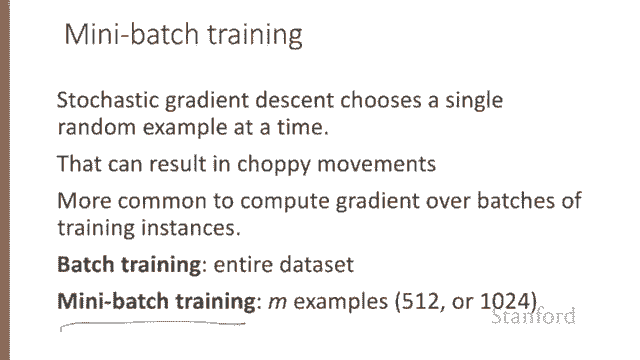

# 【双语字幕+资料下载】斯坦福CS124 ｜ 从语言到信息(2021最新·全14讲) - P32：L5.6- 随机梯度下降拓展 - ShowMeAI - BV1YA411w7ym

In this lecture， we'll walk through an example of stochastic gradient descent and give a few more details。

Let's walk through a single step of the gradient descent algorithm。

 We'll use a simplified version of our sentiment classification example as it sees a single observation X。

 whose correct value is y equals1。 So this is a positive review。 and with only two features。

 X 1 will have a value 3。 That will be the count of positive lexicon words in our review。

 And feature X 2 will have the value 2。 Thatll be the count of negative lexicon words。

And let's assume three parameters， two weights， W1 and W2 and1 bias B。

 and let's assume the values are all set to zero in our initial stage theta super0。

 and let's make the initial learning rate be 0。1。All right here's our update equation for SGD in order to do this update for theta。

 we need to know the gradient of the loss function。

 which we're going to then multiply by the learning weight and subtract。In logistic regression。

 we've seen that our gradient with respect to a weight W subj is sigma of Wx plus b minus y all times x subj。

And in our mini example， there are three parameters。

 so our gradient vector has three dimensions for W1， W2 and B。

So we can compute the first gradient as follows。Here I've just taken the values from the pre computeutd derivative。

And now what is W X plus B in our initial values， it's going to be zero。 what is our true Y， it's1。

So we're going to have sigma of0 minus1， what is sigma of 0， it's 0。5。

So we end up with a negative 05 x1， a negative 。5 x2 and a negative 。5 for the bias。

 So our final gradient vector。With respect to W comma B is this specter。Okay。

 I just wrote this all up at the top here so you have it for memory。Now that we have a gradient。

 we can compute the new parameter vector theta1 by moving the initial values of theta theta 0 in the opposite direction of the gradient。

 So the new theta is the old theta。Minus the learning rate times the gradient。So the new theta。

 we'll just write this out。Is W 1， W2 and B at。Time theta 0。

 whatever those values will be minus the learning rate Eta。Times our gradient。

 which we computed on the previous slide， and there it is up here。All right。

 and let's just draw that out。And if we just knowing that Ada。Is0。1。

And that the initial values of these were all 0。We end up。With our new theta。Step one。

 we've moved our Ws and Bs to these new values。So note that this observation X happened to be a positive example。

We might expect that after seeing more negative examples with， let's say。

 high counts of negative words that the value W2 here。

Would eventually shift to have a negative value。Stochastic gradient descent is called stochastic because it chooses a single random example at a time。

 moving the weight so as to improve performance on that single example。

 that can result in very choppy movements。 So it's common to compute the gradient over batches of training examples rather than a single instance。

In batch training， we compute the gradient over the entire data set by seeing so many examples。

 batch training gives you a superb estimate of the direction to move the weights at the cost of spending a lot of time processing every single example in the training set to compute this perfect direction。

 So a compromises mini batch training。We train on a group of M examples。

 perhaps 512 or 1024 that is less than the whole data set。

 Min batch training also has the advantage of computational efficiency。

 The mini batches can easily be vectorized， choosing the size of the mini batch based on the computational resources。

This allows us to process all the examples in one mini batch in parallel and then accumulate the loss。

 something that's not possible with individual or batch training。

We've now seen the stochastic gradient descent algorithm and discussed important variations like mini batch training。

